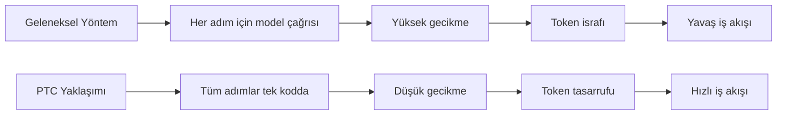
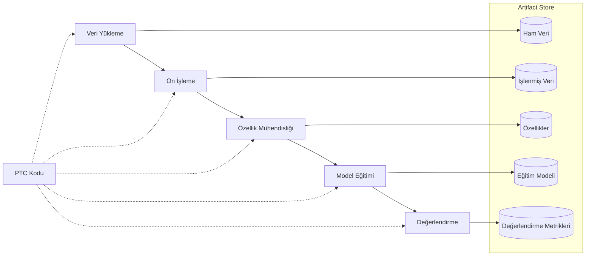
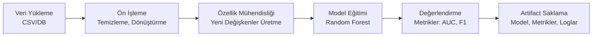
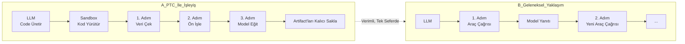
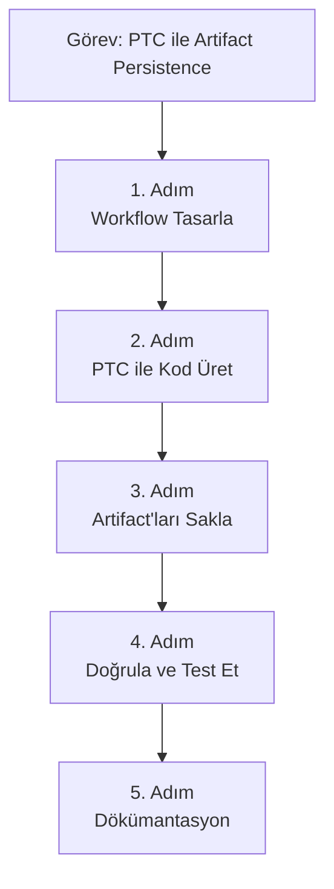

bana şu task verildi

PTC: artifact persistence (files, dataframes) for multi-step workflows
Çok adımlı workflow’larda üretilen dosya, dataframe ve ara çıktıların kalıcı olarak saklanmasıdır. Sonraki adımların aynı artifact’leri yeniden üretmeden kullanabilmesini sağlar.


ptc bu arada programatic tool calling

bu konuyu bana anlat ama ilk olarak interntetten kayank tara ve bilgilen

# PTC: Artifact Persistence for Multi-Step Workflows

## 🎯 Kısa Özet
**Programmatic Tool Calling (PTC)**, büyük dil modellerinin (LLM'ler) çok adımlı iş akışlarında **artifact'leri (dosyalar, dataframe'ler, ara çıktılar) verimli bir şekilde kalıcı hale getirmesini** ve sonraki adımların bu içerikleri yeniden üretmeden kullanabilmesini sağlayan bir yaklaşımıdır. Bu, özellikle karmaşık veri işleme, makine öğrenmesi ve yapay zeka ajanı workflow'larında kritik öneme sahiptir.

## 🔍 PTC ve Artifact Persistence Nedir?

### Programmatic Tool Calling (PTC) Temelleri
PTC, LLM'lerin dış araçları (API'ler, veritabanları, kod yürütme motorları vb.) **programatik olarak çağırmasını** sağlayan bir paradigmadır 【turn0search5】【turn0search6】. Geleneksel yöntemde model, her araç çağrısı için ayrı bir yanıt döngüsü gerçekleştirir. PTC ise, modelin kod yazarak bu araçları **tek bir kod bloğunda** koordine etmesini sağlar.



**Avantajları**:
- **Gecikme Azaltma**: Çok sayıda model-yerel döngü yerine tek kod yürütmesi
- **Token Tasarrufu**: Araç çıktılarının kod içinde işlenmesi, modele büyük verilerin dönmesini engeller
- **Verimlilik**: Araçların paralel çağrılması ve koordinasyonu

### Artifact Persistence (Kalıcı Artifact Saklama)
Artifact persistence, çok adımlı iş akışlarında üretilen **dosyalar, dataframe'ler, modeller ve diğer ara çıktıların** kalıcı olarak saklanması işlemidir. Bu, sonraki adımların aynı artifact'leri **yeniden üretmeden kullanabilmesini** sağlar 【turn0search10】【turn0search15】.

**Neden Önemlidir?**:
- **Tekrarlanabilirlik**: Aynı sonuçların tekrar üretilmesi
- **Verimlilik**: Pahalı hesaplamaların tekrar yapılmaması
- **İzlenebilirlik**: Veri ve modellerin geçmişinin takip edilebilmesi

## 🏗️ PTC ile Artifact Persistence Nasıl Birlikte Çalışır?

PTC, artifact persistence'ı şu şekillerde geliştirir:

### 1. Verimli Araç Yönetimi
PTC, araç çağrılarını kod içinde koordine ederek:
- **Paralel Yürütme**: Bağımsız araçların aynı anda çağrılması
- **Veri Filtreleme**: Yalnızca gerekli verilerin modele geri dönmesi
- **Koşullu Mantık**: Araç çağrılarının önceki sonuçlara göre dinamik olarak yönlendirilmesi

### 2. Kalıcı Depolama ile Entegrasyon
PTC ile yazılan kod, artifact'ları doğrudan kalıcı depolamaya (örneğin, S3, GCS, yerel dosya sistemi) yazabilir. Sonraki adımlar, bu artifact'ları **yeniden hesaplamadan** doğrudan yükleyebilir.

<details>
<summary>🔧 PTC ile Artifact Persistence Teknik Uygulama</summary>

```python
# PTC ile veri işleme ve artifact saklama örneği
def process_and_store_data():
    # 1. Adım: Veriyi yükle (artifact'ı yeniden kullan)
    data = pd.read_parquet('s3://bucket/processed_data.parquet')
    
    # 2. Adım: İşle ve yeni artifact oluştur
    processed = expensive_transformation(data)
    processed.to_parquet('s3://bucket/transformed_data.parquet')
    
    # 3. Adım: Sonraki adımlar için metadata kaydet
    metadata = {
        'source': 'raw_data.csv',
        'version': '1.0',
        'created_by': 'process_and_store_data'
    }
    save_metadata(metadata, 's3://bucket/metadata/transformed_data.json')
    
    return processed
```

Bu yaklaşım, PTC'nin kod yürütme yetenekleriyle birleştiğinde:
- Artifact'ları **otomatik olarak versiyonlar**
- **Lineage takibi** sağlar (hangi artifact'tan türediği) 【turn0search15】【turn0search16】
- **Caching mekanizmaları** ile verimli hale getirilebilir
</details>

## 🛠️ Kullanılabilir Araçlar ve Framework'ler

Aşağıdaki araçlar, PTC ile artifact persistence'ı destekleyen güçlü özellikler sunar:

| Araç | PTC Desteği | Artifact Persistence Özellikleri | Kullanım Alanları |
|------|------------|----------------------------------|-------------------|
| **ZenML** | ✅ Tam destek | Otomatik versiyonlama, lineage takibi 【turn0search1】【turn0search10】【turn0search15】 | ML pipeline'ları, ajan workflow'ları |
| **MLflow** | ✅ Destekli | Model ve data versiyonlama, experiment tracking 【turn0search26】【turn0search29】 | ML deneyleri, model kayıt defteri |
| **DVC** | ⚠️ Sınırlı | Data versiyonlama, Git entegrasyonu 【turn0search35】【turn0search36】【turn0search39】 | Data pipeline'ları, ML deneyleri |
| **Feast** | ❌ Doğrudan değil | Feature store, online/offline serving 【turn0search40】【turn0search41】 | Feature yönetimi, gerçek zamanlı ML |
| **Apache Airflow** | ⚠️ XCom ile | XCom backend'i ile artifact paylaşımı 【turn0search30】【turn0search31】 | Veri pipeline'ları, batch işleme |

## 💡 PTC ile Artifact Persistence'ın Avantajları

### 1. Performans İyileştirmeleri
- **Token Tasarrufu**: PTC ile **24% daha az token** kullanımı sağlanabilir 【turn0search5】
- **Gecikme Azaltma**: Çok araçlı workflow'larda **11% performans artışı** 【turn0search5】
- **Bellek Verimliliği**: Büyük dataframe'ler için bellek kullanımı optimize edilir 【turn0search47】

### 2. Geliştirilmiş İzlenebilirlik ve Yönetim
- **Otomatik Lineage**: Artifact'ların kökeni otomatik takip edilir 【turn0search15】【turn0search16】
- **Versiyon Kontrolü**: Her artifact versiyonlanır ve geçmişi tutulur 【turn0search11】
- **Kolay Geri Alma**: Hatalı adımlar kolayca geri alınabilir

### 3. Ölçeklenebilirlik
- **Dağıtık Depolama**: S3, GCS gibi bulut depolamalarıyla entegre çalışır 【turn0search12】
- **Paralel İşleme**: Birden fazla adım aynı anda yürütülebilir
- **Büyük Veri Desteği**: Petabyte ölçeğinde veri yönetimi 【turn0search36】

## 🚀 Pratik Uygulama Senaryoları

### Senaryo 1: ML Model Eğitim Pipeline'ı


### Senaryo 2: Yapay Zeka Ajanı Workflow'u
Aşağıda, PTC ile artifact kullanan bir ajan workflow'u örneği verilmiştir:

<details>
<summary>📊 Ajan Workflow'u PTC Örneği</summary>

```python
# PTC ile çok adımlı ajan workflow'u
def agent_workflow(user_query):
    # 1. Adım: Kullanıcı sorgusunu anla (artifact: parsed_query)
    parsed_query = parse_query(user_query)
    save_artifact(parsed_query, 'parsed_query.json')
    
    # 2. Adım: Gerekli araçları çağır (artifact: tool_results)
    tool_results = call_tools(parsed_query)
    save_artifact(tool_results, 'tool_results.pkl')
    
    # 3. Adım: Araç sonuçlarını işle (artifact: processed_data)
    processed_data = process_results(tool_results)
    save_artifact(processed_data, 'processed_data.csv')
    
    # 4. Adım: Yanıt oluştur (artifact: final_answer)
    final_answer = generate_answer(processed_data)
    save_artifact(final_answer, 'final_answer.txt')
    
    return final_answer
```

Bu yaklaşım, her adımın çıktısını otomatik olarak kaydeder ve sonraki adımların bu verileri doğrudan kullanmasını sağlar.
</details>

## 📈 En İyi Uygulamalar ve Dikkat Edilmesi Gerekenler

### En İyi Uygulamalar
1. **Artifact'ları Erken Tanımla**: Workflow tasarım aşamasında hangi artifact'ların saklanacağını belirleyin
2. **Metadata Ekleyin**: Her artifact için kaynak, versiyon, oluşturulma zamanı gibi metadata kaydedin
3. **Otomatik Versiyonlama Kullanın**: ZenML veya MLflow gibi araçların otomatik versiyonlama özelliklerinden faydalanın 【turn0search10】【turn0search15】
4. **Kalıcılığı Ayarla**: Artifact'ların saklanma süresini ihtiyaca göre ayarlayın (geçici vs. kalıcı)
5. **Lineage Takibi Aktive Edin**: Artifact'ların geçmişini takip edin 【turn0search16】【turn0search17】

### Dikkat Edilmesi Gerekenler
- **Güvenlik**: Hassas verileri saklarken şifreleme kullanın
- **Maliyet**: Bulut depolama maliyetlerini kontrol edin
- **Performans**: Büyük artifact'ları sıkıştırarak saklayın 【turn0search47】
- **Erişim Kontrolü**: Artifact'lara erişim izinlerini yönetin

## 🔮 Gelecekteki Gelişmeler ve Trendler

PTC ve artifact persistence alanında şu gelişmeler beklenmektedir:

1. **Daha Derin Entegrasyon**: PTC'nin artifact store'larla daha derin entegrasyonu
2. **Otomatik Lineage**: Artifact'ların otomatik olarak lineage grafiklerine bağlanması
3. **Akıllı Caching**: Artifact'ların kullanım sıklığına göre otomatik önceliklendirilmesi
4. **Çapraz Tool Lineage**: Farklı araçlar arasında artifact paylaşımının izlenmesi

## 🎯 Sonuç

PTC ile artifact persistence, çok adımlı workflow'ları **daha verimli, izlenebilir ve tekrarlanabilir** hale getirir. Bu yaklaşım, özellikle makine öğrenmesi, veri bilimi ve yapay zeka ajanı geliştirme alanlarında kritik öneme sahiptir. ZenML, MLflow gibi araçların sunduğu özelliklerle PTC, karmaşık iş akışlarının yönetimini kolaylaştırır ve performansı artırır.

> 💡 **Öneri**: Yeni başlayanlar için ZenML veya MLflow ile başlamak, PTC ve artifact persistence konseptlerini öğrenmek için idealdir. Bu araçlar, hem PTC yetenekleri sunar hem de kapsamlı artifact yönetim özellikleri içerir 【turn0search1】【turn0search10】.

## 📚 Kaynaklar ve Daha Fazla Bilgi
- [ZenML Artifact Yönetimi](https://docs.zenml.io/user-guides/starter-guide/manage-artifacts) 【turn0search10】
- [MLflow ile Çok Adımlı Workflow](https://mlflow.org/docs/latest/ml/tutorials-and-examples) 【turn0search25】【turn0search29】
- [DVC ile Data Versiyonlama](https://dvc.org) 【turn0search36】
- [Programmatic Tool Calling Dokümantasyonu](https://platform.claude.com/docs/en/agents-and-tools/tool-use/programmatic-tool-calling) 【turn0search5】

-----------------------------------------------------------
workflow ne ptc ne bu ikisinin ilişkii ne bu case için

# Workflow, PTC ve İlişkileri: Kapsamlı Bir Rehber

## 📌 **Özet**
**Workflow (İş Akışı)**, bir hedefe ulaşmak için tasarlanmış **sıralı ve yapılandırılmış adımlar dizisidir**. **PTC (Programmatic Tool Calling)** ise, büyük dil modellerinin (LLM) dış araçları **programatik olarak (kod yazarak) çağırmasını** sağlayan bir tekniktir. Bu ikisi birlikte kullanıldığında, özellikle **çok adımlı iş akışlarında** (multi-step workflows) üretilen **dosyalar, dataframe'ler ve ara çıktıların (artifact'ler) kalıcı olarak saklanması** ve verimli kullanılması sağlanır. Bu, senin görevinin özünü oluşturuyor.

Aşağıda, bu kavramları detaylı bir şekilde açıklayıp, ilişkilerini ve senin case'ine nasıl uygulandığını göreceksin.

---

## 1. **Workflow (İş Akışı) Nedir?**

**Workflow**, bir işi başarmak için tasarlanmış **adımların (tasks) ve bunların arasındaki bağımlılıkların** bir bütünüdür. Bu adımlar genellikle bir **DAG (Directed Acyclic Graph - Yönlendirilmiş Asiklik Graf)** yapısında modellenir 【turn0search16】.

### **Temel Özellikler:**
* **Adımlar (Tasks):** Her adım belirli bir işlemi gerçekleştirir (örn: veri temizleme, model eğitimi, raporlama).
* **Bağımlılıklar (Dependencies):** Bir adımın çıktısı, başka bir adımın girdisi olabilir.
* **Orkestrasyon (Orchestration):** Adımların doğru sırada, doğru zamanda ve doğru kaynaklarla çalıştırılmasını sağlayan sistem (örn: Apache Airflow, Prefect, ZenML) 【turn0search15】【turn0search29】.

### **Örnek Bir Workflow (Senin Case'in İçin):**

Bu workflow'da her adım, bir önceki adımın çıktısını (artifact'ı) kullanarak kendi işlemini gerçekleştirir.

---

## 2. **PTC (Programmatic Tool Calling) Nedir?**

**PTC**, LLM'lerin (Claude, GPT vb.) dış araçları (API'ler, veritabanları, kod yürütme motorları vb.) **tek bir kod bloğu içinde** çağırmasını sağlayan bir yaklaşımdır 【turn0search0】【turn0search1】. Bu, geleneksel "tek tek araç çağırma" yöntemine göre önemli avantajlar sağlar.

### **Geleneksel Yöntem vs. PTC:**

| Özellik | **Geleneksel Tool Calling** | **PTC (Programmatic Tool Calling)** |
| :--- | :--- | :--- |
| **Çağrı Şekli** | Model, her araç için ayrı bir istek gönderir. | Model, tüm çağrıları içeren **tek bir kod (Python/JS)** yazar. |
| **Token Kullanımı** | Yüksek (araç çıktılarının tamamı modele döner). | **Düşük** (sadece işlenmiş/özet veri modele döner) 【turn0search0】. |
| **Gecikme (Latency)** | Yüksek (her çağrı için modelinferansı gerekir). | **Düşük** (araçlar paralel çağrılabilir, kod tek seferde yürütülür) 【turn0search1】. |
| **Karmaşık İşlemler** | Doğal dilde filtreleme/toplama zayıf. | **Güçlü** (Python/JS ile döngüler, koşullar, fonksiyonlar kullanılabilir) 【turn0search2】. |
| **Kullanım Alanı** | Basit, tek adımlı sorgular. | **Çok adımlı, veri yoğun iş akışları** (senin case'in gibi!) 【turn0search1】. |

### **PTC ile Çözülen Sorunlar:**
* **Token İsrafı:** Binlerce satırlık veriyi modelin context penceresine göndermek yerine, Python koduyla filtreleyip sadece **özet veriyi** modele döndürür 【turn0search1】.
* **Gecikme:** 20 kişinin harcama kaydını tek tek sorgulamak yerine, `asyncio.gather()` ile **paralel** olarak çeker 【turn0search1】.
* **Doğrululuk:** Sayısal hesaplamaları doğal dilde değil, **kodla** yaparak hatayı azaltır 【turn0search1】.

---

## 3. **PTC ve Workflow'ın İlişkisi: Nasıl Birlikte Çalışırlar?**

PTC, workflow'un **"beyni"** (adımları koordine eden) ve **"kasları"** (araçları çağıran) gibi düşünülebilir. İşte nasıl birlikte çalıştıkları:



**PTC, workflow'u güçlendirir çünkü:**

1.  **Paralel Yürütme Sağlar:** Kod içinde `asyncio.gather()` gibi yapılarla bağımsız adımları **aynı anda** çalıştırabilir 【turn0search1】.
2.  **Ara Verileri İşler:** Workflow'un ara adımlarında üretilen büyük veri setlerini (dataframe'ler, listeler) kod içinde işler, modele sadece **sonuç** gönderilir.
3.  **Koşullu Mantık Ekler:** `if-else` blokları ile workflow'un akışını **dinamik** olarak değiştirebilir.
4.  **Hata Yönetimi İyileştirir:** `try-except` blokları ile bir adımda hata oluşursa, tüm workflow'u durdurmadan **alternatif yol** izleyebilir.

### **Senin Case'inde (Artifact Persistence) PTC'nin Rolü:**
Senin görevin, **çok adımlı workflow'larda üretilen dosyaları ve dataframe'leri kalıcı olarak saklamak**. PTC tam bu noktada devreye giriyor:

* **PTC olmadan:** Her adımda üretilen dataframe'i modele gönderip, oradan tekrar alıp diske yazmak **verimsiz ve yavaş** olur.
* **PTC ile:** Model, workflow'un her adımını içeren **tek bir Python script** yazar. Bu script:
    * Veriyi çeker (1. adım).
    * İşler (2. adım).
    * Sonucu **doğrudan diske** (veya artifact store'a) yazar (3. adım) 【turn0search1】【turn0search2】.
    * Sadece **tamamlandı mesajı** veya **özet metrikleri** modele döner.

Böylece, **artifact'ler (dosyalar, dataframe'ler) kalıcı olarak saklanır** ve sonraki adımlar (aynı workflow'un ilerleyen adımları veya yeni bir workflow) bu artifact'leri **yeniden üretmeden** doğrudan okuyabilir.

---

## 4. **Artifact Persistence (Kalıcı Saklama) Nedir ve Neden Önemli?**

**Artifact**, workflow sırasında üretilen herhangi bir **kalıcı çıktı**dır. Örnekler:
* **Dataframe'ler** (Pandas DataFrame, Parquet dosyası)
* **Modeller** (Pickle, ONNX formatında)
* **Raporlar** (Markdown, HTML, PDF)
* **Loglar** (metin dosyaları)
* **Ölçümler** (JSON, CSV formatında)

**Kalıcı Saklama (Persistence)**, bu artifact'ların workflow çalışması bittikten sonra bile **erişilebilir** tutulmasıdır.

### **Neden Kritik?**
1.  **Yeniden Kullanılabilirlik:** Aynı veriyi/modeli yeniden hesaplamadan, farklı workflow'larda veya adımlarda kullanabilirsin.
2.  **Tekrarlanabilirlik (Reproducibility):** Bir deneyi/modeli tam olarak aynı sonuçlarla tekrar üretebilirsin.
3.  **Verimlilik:** Pahalı hesaplamaları (örn: model eğitimi) bir kez yapıp, sonucu saklarsın.
4.  **İzlenebilirlik (Lineage):** Her artifact'ın **hangi adımdan, hangi kodla, hangi veriyle** üretildiğini takip edebilirsin 【turn0search25】.

### **PTC ile Artifact Persistence Nasıl Sağlanır?**
PTC kodu, artifact'ları doğrudan **Artifact Store**'lara (S3, GCS, Azure Blob, Minio, yerel disk) yazar 【turn0search26】. Örneğin, senin case'inde PTC tarafından üretilen kod şöyle olabilir:

```python
# PTC tarafından üretilen örnek kod (Python)
import pandas as pd
from sklearn.ensemble import RandomForestClassifier
import joblib
from datetime import datetime
import os

# 1. Adım: Veriyi Yükle (Artifact'ı kullan)
# Not: 'preprocessed_data.parquet' önceki bir workflow tarafından oluşturulmuş olabilir
df = pd.read_parquet('preprocessed_data.parquet')  # Artifact'ı oku

# 2. Adım: Modeli Eğit
X = df.drop('target', axis=1)
y = df['target']
model = RandomForestClassifier()
model.fit(X, y)

# 3. Adım: Modeli ve Metrikleri Sakla (Artifact'ları yaz)
# artifact_uri: ZenML, MLflow gibi araçlar tarafından yönetilen bir URI olabilir
timestamp = datetime.now().strftime("%Y%m%d_%H%M%S")
model_uri = f"models/model_{timestamp}.joblib"
metrics_uri = f"metrics/metrics_{timestamp}.json"

# Modeli diske (veya S3'ye) yaz
joblib.dump(model, model_uri)

# Metrikleri hesapla ve JSON olarak yaz
metrics = {'accuracy': model.score(X, y)}
with open(metrics_uri, 'w') as f:
    json.dump(metrics, f)

# 4. Adım: (İsteğe bağlı) Artifact'ı metadata ile ilişkilendir
# Örn: ZenML'in ArtifactConfig'ini kullanarak modeli 'production' olarak etiketle
# Bu, sonraki adımların (örn: inference pipeline) bu artifact'ı bulmasını sağlar.
```
Bu kod, PTC tarafından tek seferde yürütülür ve tüm artifact'ları **kalıcı olarak** saklar. Sonraki adımlar (örn: model değerlendirme, servis) `model_uri` ve `metrics_uri` referanslarını kullanarak bu artifact'ları doğrudan yükleyebilir.

---

## 5. **Uygulama Araçları ve Framework'ler**

Senin case'in için ideal araçlar, hem PTC'yi destekleyen hem de artifact persistence'ı yönetebilenlerdir:

| Araç/Framework | **PTC Desteği** | **Artifact Persistence Özellikleri** | **Uygunluk** (Senin Case'in İçin) |
| :--- | :--- | :--- | :--- |
| **Claude 3.5+ / Bedrock** | ✅ **Yerel olarak destekler** 【turn0search0】【turn0search1】 | Kod yürütme sandbox'ı üzerinden dosya sistemi erişimi sağlar. | **Mükemmel** - PTC'nin doğrudan uygulaması. |
| **OpenAI Responses API** | ✅ (JavaScript tabanlı) 【turn0search2】 | Hosted runtime'da `text()` veya `image()` ile çıktı üretir, kalıcı depolama için **istemci tarafında** işlemek gerekir. | **İyi** - Farklı bir yaklaşım gerektirir. |
| **ZenML** | ✅ (PTC entegrasyonu geliştirilebilir) 【turn0search27】 | **Artifact Store** (S3, GCS, vb.) ile entegre, **otomatik versiyonlama ve lineage** takibi 【turn0search25】【turn0search26】. | **Çok İyi** - Özellikle ML pipeline'ları için tasarlanmış. |
| **MLflow** | ⚠️ (PTC doğrudan desteklenmez, ancak entegrasyon mümkün) | **MLflow Tracking** ile artifact'ları (model, parametreler, metrikler) otomatik olarak loglar ve saklar 【turn0search25】. | **İyi** - Klasik ML takibi için güçlü. |
| **Prefect** | ⚠️ (PTC doğrudan desteklenmez, ancak entegrasyon mümkün) | **Artifacts API** ile markdown, link veya özet veri saklar 【turn0search22】【turn0search23】. | **Orta** - Daha çok orkestrasyon odaklı. |
| **Apache Airflow** | ⚠️ (XCom backend'i ile sınırlı) 【turn0search30】 | **XComs** ile adımlar arası veri paylaşımı, **Object Storage** (S3, GCS) backend'i ile büyük artifact'lar saklanabilir 【turn0search31】. | **Orta** - Karmaşık kurulum gerektirebilir. |

### **Önerilen Yaklaşım:**
1.  **Claude API + Bedrock AgentCore** (veya benzeri bir sandbox) **PTC'yi doğrudan kullanmak** için 【turn0search1】.
2.  **ZenML** veya **MLflow**'u **artifact store** ve **lineage takibi** için kullanmak 【turn0search25】【turn0search26】. Bu, PTC kodunuzun ürettiği artifact'ları otomatik olarak versiyonlar ve metadata ile ilişkilendirir.

---

## 6. **Senin Görevin (PTC: Artifact Persistence for Multi-Step Workflows) İçin Adım Adım Yaklaşım**

Görevini başarıyla tamamlamak için izleyebileceğin adımlar:



### **1. Workflow Tasarla**
* Görevin için gerekli adımları belirle (örn: veri yükleme → ön işleme → model eğitimi → değerlendirme).
* Adımlar arası veri bağımlılıklarını netleştir.
* Hangi adımların **paralel** çalışabileceğini düşün.

### **2. PTC ile Kod Üret**
* Claude 3.5 Sonnet/Opus gibi bir modele, görevini ve workflow adımlarını **doğal dilde** anlat.
* Modelden, tüm adımları içeren ve artifact'ları **kalıcı olarak saklayacak** bir Python scripti yazmasını iste 【turn0search1】.
* **Örnek Prompt:** "Bir pandas dataframe'i yükle, ön işle, bir Random Forest modeli eğit, modeli ve metrikleri S3 bucket'ına kaydet. Kodunu yaz."

### **3. Artifact'ları Sakla**
* Üretilen kod, artifact'ları **yerel dosya sistemi** veya **S3/GCS** gibi bir object store'a yazmalıdır 【turn0search26】.
* **ZenML** veya **MLflow** kullanıyorsan, kodun içinde `ArtifactConfig` (ZenML) veya `mlflow.log_artifact()` gibi API'ları kullanarak artifact'ları otomatik olarak takip edebilirsin 【turn0search25】.
* **Önemli:** Artifact'lara **versiyon** (timestamp, hash) ve **metadata** (hangi kod, hangi parametrelerle üretildi) ekle.

### **4. Doğrula ve Test Et**
* Kodu bir sandbox'ta (örn: Bedrock AgentCore Code Interpreter 【turn0search1】, Docker container) çalıştır.
* Artifact'ların **doğru formatta** (Parquet, Joblib) ve **doğru konumda** (belirlediğin artifact store'da) oluştuğunu doğrula.
* Artifact'ları **yeniden yükleyip** kullanarak, sonraki adımların (örn: inference) bu artifact'ları **sorunsuzca** kullanabildiğini test et.

### **5. Dökümantasyon**
* Workflow'un nasıl çalıştığını, artifact'ların nasıl saklandığını ve nasıl erişileceğini açıklayan bir **README** dosyası oluştur.
* Örnek kodu, kullanılan araçları (Claude, ZenML vb.) ve konfigürasyonları belgele.

---

## 7. **Örnek Bir PTC + Artifact Persistence Senaryosu**

**Senaryo:** Bir e-ticaret şirketi için müşteri churn (kayıp) tahmini modeli geliştiren bir workflow.

**Adımlar:**
1.  **Veri Yükleme:** Veritabanından müşteri verilerini (dataframe) çek.
2.  **Ön İşleme:** Eksik verileri doldur, kategorik değişkenleri kodla.
3.  **Model Eğitimi:** Eğitim verisi üzerinde bir model eğit.
4.  **Artifact Saklama:** Eğitilmiş modeli, ön işleme transformer'ını ve metrikleri (accuracy, ROC-AUC) **S3 bucket'ına** kaydet.
5.  **Doğrulama:** Kaydedilen modeli yükle, test verisi üzerinde değerlendir ve metrikleri karşılaştır.

**PTC Kodu (Claude tarafından üretilen örnek):**
```python
# Claude tarafından üretilen PTC kodu (basitleştirilmiş)
import pandas as pd
from sklearn.model_selection import train_test_split
from sklearn.pipeline import Pipeline
from sklearn.preprocessing import StandardScaler, OneHotEncoder
from sklearn.ensemble import RandomForestClassifier
from sklearn.metrics import accuracy_score, roc_auc_score
import joblib
import boto3  # AWS S3 için
from datetime import datetime

# 1. Veriyi Yükle (DB'den veya S3'ten)
# df = ...  # Veritabanından çekilen dataframe

# 2. Ön İşleme ve Model Pipeline'ı Oluştur
preprocessor = ColumnTransformer(
    transformers=[
        ('num', StandardScaler(), numerical_cols),
        ('cat', OneHotEncoder(), categorical_cols)
    ])

model = Pipeline(steps=[
    ('preprocessor', preprocessor),
    ('classifier', RandomForestClassifier(n_estimators=100))
])

# 3. Veriyi Eğit/Test Olarak Ayır ve Modeli Eğit
X_train, X_test, y_train, y_test = train_test_split(X, y, test_size=0.2, random_state=42)
model.fit(X_train, y_train)

# 4. Metrikleri Hesapla ve Artifact'ları Sakla
y_pred = model.predict(X_test)
accuracy = accuracy_score(y_test, y_pred)
roc_auc = roc_auc_score(y_test, model.predict_proba(X_test)[:, 1])

# S3 Client'ı oluştur
s3 = boto3.client('s3')
bucket_name = 'ml-artifacts-store'
timestamp = datetime.now().strftime("%Y%m%d_%H%M%S")

# Modeli ve Pipeline'ı kaydet
model_uri = f"models/churn_model_{timestamp}.joblib"
joblib.dump(model, f"/tmp/{model_uri}")  # Önce yerel diske kaydet
s3.upload_file(f"/tmp/{model_uri}", bucket_name, model_uri)  # S3'e yükle

# Metrikleri JSON olarak kaydet
metrics_uri = f"metrics/churn_metrics_{timestamp}.json"
metrics = {'accuracy': accuracy, 'roc_auc': roc_auc}
with open(f"/tmp/{metrics_uri}", 'w') as f:
    json.dump(metrics, f)
s3.upload_file(f"/tmp/{metrics_uri}", bucket_name, metrics_uri)

# 5. Artifact'ları Lineage ile İlişkilendir (Örn: ZenML kullanıyorsan)
# Bu, sonraki adımların (örn: inference) bu artifact'ları bulmasını sağlar.
# from zenml import ArtifactConfig
# return model, ArtifactConfig(name=f"churn-model-{timestamp}", is_model_artifact=True)
```
Bu kod, PTC tarafından tek seferde yürütülür ve tüm artifact'ları **S3 bucket'ına** kalıcı olarak saklar. Sonraki adımlar (örn: model servise alınması) `model_uri` referansını kullanarak bu modeli **yeniden eğitmeye gerek kalmadan** yükleyebilir.

---

## 8. **Sonuç ve Öneriler**

Görevin, **PTC** ve **workflow** kavramlarını birleştirerek **çok adımlı iş akışlarında verimliliği ve kalıcılığı** artırmaktır. İşte başarı için kritik noktalar:

1.  **PTC'yi Etkin Kullan:** Claude veya OpenAI gibi modellerin **programmatic tool calling** yeteneklerini kullanarak, çok adımlı işlemleri tek bir kod bloğunda topla 【turn0search0】【turn0search1】【turn0search2】.
2.  **Artifact Store Entegrasyonu:** Kodun, ürettiği artifact'ları **S3, GCS, Azure Blob** veya **yerel disk** gibi kalıcı bir depoya yazmasını sağla 【turn0search26】. **ZenML** veya **MLflow** gibi araçları kullanarak **otomatik versiyonlama ve lineage takibi** ekle 【turn0search25】.
3.  **Workflow Orkestrasyonu:** Gerekirse, **Apache Airflow**, **Prefect** veya **ZenML** gibi bir orkestratör kullanarak adımları zamanla ve izle 【turn0search15】【turn0search29】. Ancak PTC zaten adımlar arası iletişimi hallettiği için, orkestrasyon ihtiyacı azalabilir.
4.  **Test ve Doğrulama:** Artifact'ların **doğru formatta** ve **erişilebilir** olduğunu daima test et. Bir sonraki adımın bu artifact'ı **sorunsuzca** kullanabildiğini doğrula.

**Son Tavsiye:** Görevini yerine getirirken **Claude 3.5 Sonnet** veya **Opus** modellerinin **programmatic tool calling** yeteneklerini **doğrudan API üzerinden** kullan. Gerekirse, **Bedrock AgentCore Code Interpreter** gibi bir sandbox ortamında kodu çalıştır 【turn0search1】. Artifact'ları saklamak için **S3** + **ZenML** kombinasyonu, hem güçlü bir depolama hem de kapsamlı bir takip sistemi sağlar.

Bu yaklaşım, sadece senin görevini değil, **üretim kalitesinde, tekrarlanabilir ve verimli AI workflow'ları** oluşturmanın da temelini atar.

