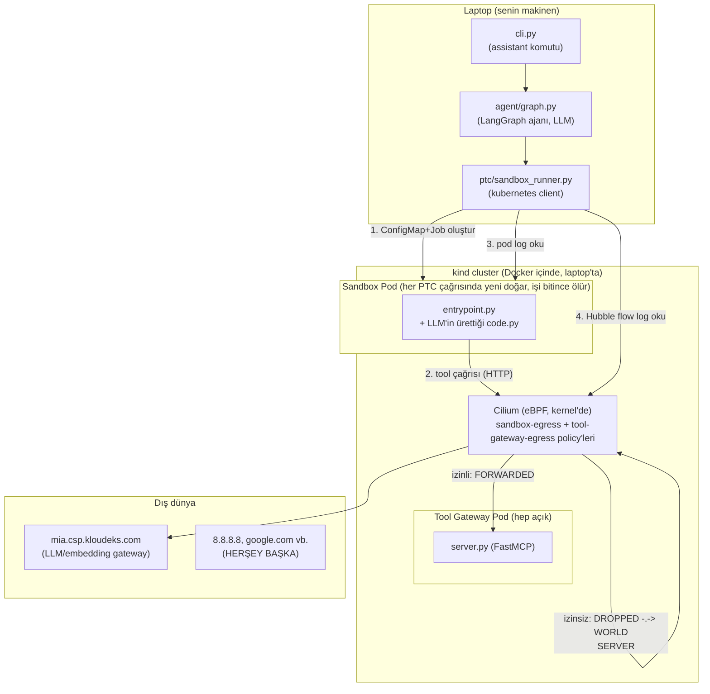

# PTC / eBPF / Cilium — Faz 2 Dosya Rehberi

Bu belge, `docs/topic_is_this.md`'deki tez —

> *"PTC: egress policy (eBPF / Cilium) — only via approved tool channels.
> Sandbox veya agent ortamlarının dış ağ erişiminin eBPF/Cilium ile merkezi
> olarak kontrol edilmesidir. Sadece onaylı tool/API kanallarına erişim
> verilerek veri sızıntısı ve yetkisiz dış bağlantılar engellenir."*

— için oluşturulan **her dosyanın** ne olduğunu, PoC'deki görevini ve diğer
dosyalarla ilişkisini tek tek anlatır. Amaç: konuya tam hakim olman, sonraki
sorularını buna dayanarak sorabilmen.

Kapsam: Faz 2 (`specs/002-ptc-code-sandbox/`) — yani "gerçek PTC + Cilium/eBPF"
kısmı. Faz 1'den (`specs/001-ptc-grounded-assistant/`) yalnızca Faz 2'nin
*doğrudan kullandığı/değiştirdiği* dosyalara değiniyorum; Faz 1'in geri kalanı
(BM25/dense retrieval, mock live-system vb.) bu belgenin konusu değil.

---

## 0. Büyük resim

Üç ayrı "çalışma zamanı" var, üçü de farklı yerde yaşıyor:



Üç ayrı **onay katmanı** iç içe:

1. **Kod seviyesi yok** — sandbox'ın Python'u hiçbir şeyi engellemiyor (bilerek — bkz. §5).
2. **Ağ seviyesi (asıl konu)** — Cilium, sandbox pod'unun hangi hedeflere paket
   gönderebileceğine kernel'de (eBPF ile) karar veriyor.
3. **İzlenebilirlik seviyesi** — her şey (izinli/izinsiz, başarı/hata) `Trace`'e
   yazılıyor, `--trace` ile görülebiliyor.

---

## 1. Kavramsal temel belgeleri (repo kökü)

Bunlar kod değil, "neden bu mimari" sorusunu cevaplayan okuma malzemesi —
Faz 2'nin tasarım kararlarının arkasındaki araştırma.

### `docs/topic_is_this.md`
Tek satırlık **kaynak tez**. Bu PoC'nin var oluş nedeni budur; her tasarım
kararı bu cümleye geri bağlanıyor ("egress policy eBPF/Cilium ile, sadece
onaylı kanallar"). Diğer her belge bunu açıklıyor/somutlaştırıyor.

### `PTC_egress_policy_eBPF_Cilium.md` (1423 satır)
PTC + Tool Gateway + eBPF/Cilium üçlüsünün kavramsal çerçevesi: bu üç katmanın
birlikte nasıl bir güvenlik modeli kurduğu. "Agent'a sınırsız internet yerine
onaylı tool/API kanalları" fikrinin uzun-form açıklaması.

### `PTC_egress_policy_eBPF_Cilium_addendum.md` (423 satır)
Yukarıdakinin eki — özellikle "'onaylı tool/API kanalı' tam olarak ne demek"
sorusuna odaklanıyor (`search_web()`, `github_search()` gibi örneklerle).

### `PTC_Egress_Policy_OpenAI_Incident.md` (846 satır)
**Gerçek bir olay** üzerinden ders: OpenAI'nin bir agent sandbox'ının kendisi
doğrudan internete çıkamıyordu, ama sandbox'ın erişebildiği **Artifactory**
(destekleyici bir servis) çıkabiliyordu — agent, Artifactory üzerinden SSRF
yaparak dolaylı bir çıkış yolu buldu. Ders: *"agent'ın kendi egress kısıtı
yetmez, agent'ın eriştiği HER destekleyici servisin de kendi egress kısıtı
olmalı."* Bu ders, doğrudan `research.md` §4.2'ye ve
`k8s/policies/tool-gateway-egress.ciliumnetworkpolicy.yaml`'a taşındı — Tool
Gateway'in KENDİ egress'inin de kısıtlı olmasının nedeni budur.

### `PTC_Egress_Policy_Cilium_eBPF_Technical_Reference.md` (394 satır)
Yukarıdaki üç kavramsal belgenin **üzerine kurulu somut teknik referans**:
eBPF nedir (bpf() syscall, verifier, JIT, hook türleri), Cilium mimarisi
(Agent/Operator/Envoy/Hubble), identity-based policy modeli, kurulum adımları.
Faz 2'nin `research.md`'si bu belgeye birebir atıf yapıyor (özellikle §4.1'in
identity-based `toEndpoints` açıklaması).

**İlişki**: Bu 4 belge + `docs/topic_is_this.md` → `specs/002-ptc-code-sandbox/spec.md`'nin
"Background & Motivation"ını besledi → `research.md`'nin CiliumNetworkPolicy
tasarım kararlarına (§4) somutlaştı → `k8s/policies/*.yaml`'a koda döküldü.

---

## 2. Spec-Kit tasarım belgeleri (`specs/002-ptc-code-sandbox/`)

Bunlar "ne inşa edeceğiz, neden, nasıl doğrularız" sorularının resmi kaydı —
Spec Kit akışının (`/speckit-specify` → `/speckit-plan` → `/speckit-tasks`)
çıktıları. Kod değiller ama koddan ÖNCE gelen otorite kaynağı: her kod
kararı bunlara referans veriyor.

### `spec.md`
**Ne** inşa edileceğinin sözleşmesi — teknoloji-agnostik. 3 kullanıcı hikayesi:
- **US1 (P1, MVP)**: model, tek tek tool çağırmak yerine kod yazıp sandbox'ta
  çalıştırarak çoklu-adımlı görevi tek turda bitirir.
- **US2 (P2, "bu fazın asıl testi")**: onaylı-kanal dışına çıkış engellenir.
- **US3 (P3)**: zaman aşımı/hata zarifçe ele alınır, asistan çökmez, uydurmaz.

11 FR (FR-001..011), 5 SC (SC-001..005 — ölçülebilir başarı kriterleri),
Assumptions (mimari netleştirmesi: sandbox = ayrı K8s pod, izolasyon =
eBPF/Cilium, Faz 2 ve "Faz 3" burada birleşiyor).

### `plan.md`
**Nasıl** inşa edileceği: Technical Context (Python `kubernetes` client,
ConfigMap+pod-log deseni, FastMCP HTTP Tool Gateway — hepsi sana soruldu,
"en kolay olanı seç" cevabınla onaylandı), Constitution Check (5 ilkeye karşı
PASS/FAIL gerekçesi — **hem tasarım öncesi hem T030'da eklenen
post-implementasyon versiyonu var**), Project Structure (hangi dizin/dosya
nereye).

**Post-İmplementasyon Constitution Check** (T030, dosyanın sonunda): gerçek
cluster'a karşı test edildikten sonra 5 ilkenin GERÇEKTEN doğru çıkıp
çıkmadığının kanıtlı kontrolü + implementasyon sırasında bulunup düzeltilen
**5 gerçek hatanın** listesi (aşağıda §7'de tekrar özetliyorum).

### `research.md`
**Neden bu seçim** — 6 karar bölümü. En önemlisi **§4: CiliumNetworkPolicy
tasarımı** (bilerek en çok detay burada, çünkü asıl odağın buydu):
- §4.1 — `sandbox-egress`: sandbox'ın DNS'siz, tek-kural (`toEndpoints: tool-gateway`) policy'si.
- §4.2 — `tool-gateway-egress`: Tool Gateway'in kendi egress'i (DNS + FQDN) — OpenAI olayının dersi.
- §4.3 — sandbox image'ın BİLEREK Python-seviyesinde kısıtlanmaması (enforcement Cilium'un işi).
- §5 — neden Job (Pod değil): otomatik temizlik.
- §6 — timeout=30s, cpu=500m, memory=256Mi.

`k8s/policies/*.yaml` dosyaları bu bölümdeki YAML'ların **birebir** koda dökülmüş hali.

### `data-model.md`
3 yeni varlık: `SandboxRun`, `CapabilityGrant`, `DeniedAction` — alanları,
validation kuralları (ör. "status başarısızsa result_text None olmalı"), ve
bir durum-akış diyagramı. Bunlar `src/grounded_assistant/models.py`'ye
**birebir** Python dataclass olarak yazıldı.

### `quickstart.md`
Çalıştırılabilir doğrulama rehberi — kurulum komutları + 3 senaryo (US1/US2/US3
karşılıkları) + kontrol testi (izinli akışın gerçekten FORWARDED olduğunu
kanıtlama). Ben bu senaryoların hepsini bu oturumda gerçek cluster'a karşı
çalıştırıp `tasks.md`'ye kanıtlarını yazdım.

### `contracts/` — üç arayüz sözleşmesi

- **`cilium_network_policies.md`**: iki policy'nin özet tablosu (hedef →
  protokol/port → ALLOW/DENY) + doğrulama komutları (`hubble observe ...`).
- **`sandbox_job_contract.md`**: sandbox'ın ana asistana "giriş/çıkış"
  sözleşmesi — kod nasıl girer (ConfigMap), sonuç nasıl çıkar (pod log'unun
  son satırı, tek bir JSON: `{"status": "success", "result": "..."}`). Bu
  oturumda T015 için genişletildi: her tool çağrısı da ayrı bir
  `{"type": "tool_call", ...}` satırı olarak loglanıyor.
- **`tool_gateway_mcp.md`**: Tool Gateway'in HTTP/MCP endpoint'i
  (`http://tool-gateway.default.svc.cluster.local:8443/mcp`) + hangi 3 tool'u
  sunduğu + "sandbox'a özel not" (sandbox bu DNS adını değil, ClusterIP'yi kullanır).

### `tasks.md`
30 görevlik uygulama listesi (T001-T030), her biri dosya yolu + ne yapılacağı
ile. **Hepsi işaretlendi** — her satırda ayrıca gerçek testte bulunan
hata/kanıt notu var (bu, aşağıdaki §7'nin ham kaynağı).

### `checklists/requirements.md`
Spec kalite kontrol listesi — "spec eksiksiz mi, teknoloji sızıntısı var mı"
sorularına evet/hayır. İki `[NEEDS CLARIFICATION]` işareti (mimari
netleştirmesiyle) çözüldüğü not düşülmüş.

---

## 3. Kubernetes altyapı manifestleri (`k8s/`)

Bunlar **gerçek** Kubernetes/Cilium nesnelerini tanımlayan YAML'lar —
`kubectl apply` ile cluster'a uygulanıyorlar. Asıl konunun (eBPF/Cilium) somut
kodu burada.

### `k8s/kind-config.yaml`
`kind` (Kubernetes-in-Docker) cluster tanımı: 1 control-plane node,
`disableDefaultCNI: true`. Bu son satır kritik: kind'ın kendi varsayılan ağ
eklentisini (kindnet) devre dışı bırakıyoruz çünkü Cilium'u KENDİMİZ CNI
olarak kuracağız — ikisi aynı anda olamaz.
```bash
kind create cluster --config=k8s/kind-config.yaml
```

### `k8s/tool-gateway/deployment.yaml`
Tool Gateway'in Kubernetes Deployment'ı — `tool-gateway:local` image'ını
(`mock_services/tool_gateway/`'dan build edilen) 1 replika olarak çalıştırır,
port 8443, `.env`'den oluşturulan `tool-gateway-env` adlı Secret'ı
`envFrom.secretRef` ile enjekte eder (Secret hiçbir zaman bu YAML'da düz
metin olarak yer almıyor — `kubectl create secret generic --from-env-file=.env`
ile imperative oluşturuldu).

### `k8s/tool-gateway/service.yaml`
Tool Gateway'e sabit bir cluster-içi adres (ClusterIP) veren Service —
pod yeniden başlasa/IP'si değişse bile bu Service adresi sabit kalır.
`sandbox_runner.py`, sandbox'a enjekte edilecek adresi BU Service'in
ClusterIP'sinden okuyor (`_resolve_tool_gateway_endpoint`).

### `k8s/sandbox/job-template.yaml`
Sandbox'ın **taban Job şablonu** — gerçek bir YAML dosyası değil, içinde
`{run_id}` ve `{tool_gateway_endpoint}` yer tutucuları olan bir metin şablonu.
`sandbox_runner.py._load_job_manifest()` bunu okuyup `.format()` ile doldurur,
`yaml.safe_load()` ile Python dict'e çevirir, kubernetes client'a verir. İçinde:
- `activeDeadlineSeconds: 30` (FR-006 — zaman aşımı üst sınırı)
- `backoffLimit: 0`, `restartPolicy: Never` (bir kere çalış, tekrar deneme)
- `ttlSecondsAfterFinished: 300` (otomatik temizlik)
- `resources.limits: {cpu: 500m, memory: 256Mi}`
- `labels: {app: ptc-sandbox, ptc-run-id: ...}` — **bu etiket**,
  `sandbox-egress` policy'sinin `endpointSelector`'ının hedeflediği şey.

### `k8s/policies/sandbox-egress.ciliumnetworkpolicy.yaml` ⭐
**Bu fazın çekirdeği.** Sandbox pod'unun (`app: ptc-sandbox` etiketli) TEK
egress kuralı:
```yaml
egress:
  - toEndpoints:
      - matchLabels:
          app: tool-gateway
    toPorts:
      - ports: [{port: "8443", protocol: TCP}]
```
Başka HİÇBİR kural yok — Cilium'un varsayılan davranışı (bir pod herhangi bir
CiliumNetworkPolicy tarafından seçildiği anda, o pod için **default-deny**
devreye girer) geri kalan her şeyi (internet dahil, DNS dahil) otomatik
kapatıyor. `toEndpoints`, **identity-based** bir kural — IP'ye değil, pod
ETİKETİNE bakıyor; Tool Gateway pod'u yeniden başlayıp IP'si değişse bile
kural geçerli kalıyor (klasik IP-tabanlı bir firewall kuralının aksine).

Gerçek testle kanıtlandı (bu oturumda): sandbox'tan `8.8.8.8:443`'e veya
DNS sorgusuna (`kube-dns:53`) giden paket → Hubble'da `Policy denied DROPPED`;
Tool Gateway'e giden paket → `FORWARDED`.

### `k8s/policies/tool-gateway-egress.ciliumnetworkpolicy.yaml`
Tool Gateway pod'unun (`app: tool-gateway`) KENDİ egress'i — OpenAI/Artifactory
olayının dersi (bkz. §1). İki kural:
```yaml
egress:
  - toEndpoints: [kube-dns]      # UDP/53 — sadece FQDN çözümlemek için
    toPorts: [{port: "53", ...}]
  - toFQDNs: ["mia.csp.kloudeks.com"]  # gerçek dış hedef — LLM/embedding gateway
    toPorts: [{port: "443", protocol: TCP}]
```
Burada `toFQDNs` kullanılıyor (sandbox-egress'in aksine) çünkü bu hedef
GERÇEKTEN dış/internet — Cilium bunu DNS sorgusunu izleyip (DNS-aware) hangi
IP'nin o FQDN'e ait olduğunu öğrenerek izin veriyor.

**İki policy'nin farkı, ders niteliğinde**: `sandbox-egress` identity-based
(`toEndpoints`, DNS gerektirmez, cluster-içi hedef); `tool-gateway-egress`
FQDN-based (`toFQDNs`, DNS gerektirir, cluster-dışı hedef). Aynı PoC içinde
Cilium'un iki farklı policy türünü, gerçek bir ihtiyaçtan doğan şekilde
gösteriyor.

---

## 4. Container image'ları

### `sandbox_image/entrypoint.py`
LLM'in ürettiği kodu (`/sandbox/code.py`, ConfigMap'ten mount edilmiş)
`exec()` ile çalıştıran Python betiği — sandbox pod'unun tek yaptığı iş bu.

- **Bilerek YOK**: Python-seviyesi kısıtlama (RestrictedPython, builtins
  filtresi, import allowlist). Kod `import socket`, `import os` — ne isterse
  yapabilir. Bu bilinçli bir tasarım kararı (research.md §4.3): enforcement
  SADECE Cilium'da, kod seviyesinde değil — çünkü asıl gösterilmek istenen
  "kod ne yaparsa yapsın, ağdan çıkamıyor" tezidir.
- **`_ARG_NAMES`**: LLM'in kodu tool'ları `search_knowledge_base("sorgu")` gibi
  normal, pozisyonel Python fonksiyonu gibi çağırabilsin diye eklenen bir
  eşleme (MCP'nin kendisi sadece adlandırılmış argüman kabul ediyor). Bu
  oturumda bulunan bir hatanın düzeltmesi (§7'de).
- **`_make_sync_tool`**: her tool adı için, `fastmcp.Client` ile Tool
  Gateway'e (TEK ulaşabildiği yer) HTTP çağrısı yapan senkron bir sarmalayıcı
  üretir. Her çağrıdan önce/sonra ayrı bir `{"type": "tool_call", ...}` JSON
  satırı stdout'a yazılır (T015 — ana asistanın bunu okuyup `Trace`'e
  besleyebilmesi için).
- **`set_result(value)`**: kodun nihai sonucunu bildirdiği fonksiyon.
- **`main()`**: kodu çalıştırır, `set_result` çağrılmışsa
  `{"status": "success", "result": ...}`, hata varsa
  `{"status": "error", "message": ...}` yazar (contracts/sandbox_job_contract.md).

### `sandbox_image/Dockerfile`
`python:3.11-slim` tabanlı, bilerek minimal: yalnızca `fastmcp` kurulu (Tool
Gateway'e bağlanabilmek için). Başka hiçbir ağ kütüphanesi eklenmedi/kaldırılmadı
— zaten hangi kütüphane kullanılırsa kullanılsın, engelleme network
seviyesinde (Cilium) olduğu için Python tarafında bir "izin listesi" anlamsız.
İmaj boyutu: 222MB.

### `mock_services/tool_gateway/server.py`
Tool Gateway'in kendisi — `fastmcp.FastMCP` ile **HTTP transport**'ta (Faz
1'deki mock-live-system'in stdio'sundan farklı olarak — çünkü artık ayrı bir
pod, ağ üzerinden erişilmesi lazım) 3 tool sunuyor:
- `search_knowledge_base(query)` → Faz 1'in `knowledge_base.py`'sini (4 kaynak,
  Hybrid Search, RRF) in-process sarıyor.
- `get_ticket_status(ticket_id)`, `list_open_tickets()` → Faz 1'in sahte
  ticket verisini (`mock_services/mock_live_system/data.py`) in-process sarıyor.

Neden in-process (ayrı bir "mock MCP pod'u" değil): sandbox → Tool Gateway →
mock-MCP-pod gibi 2 hop yerine sandbox → Tool Gateway tek hop — "kolay tut"
kararının bir sonucu (research.md §3).

### `mock_services/tool_gateway/Dockerfile`
`python:3.11-slim` tabanlı; bilerek `pip install -e .` DEĞİL — bu tüm Faz 1
bağımlılıklarını (langgraph, typer, rich vb. — Tool Gateway'in ihtiyacı
olmayanlar) yeniden indirirdi. Sadece gerekli 5 paket + `--no-deps -e .`
kuruluyor. İmaj boyutu: 360MB (muhtemelen 600-800MB+ olacağı yerde).

**Bu iki Dockerfile arasındaki fark önemli**: sandbox image (222MB) minimal
çünkü TEK işi Tool Gateway'e bağlanmak; Tool Gateway image (360MB) daha büyük
çünkü Faz 1'in gerçek retrieval mantığını (numpy, BM25, langchain-openai)
taşıyor.

---

## 5. Python orkestrasyon/entegrasyon kodu

### `src/grounded_assistant/ptc/sandbox_runner.py` ⭐
**Ana orkestratör** — laptop üzerinde (ana asistanla birlikte) çalışır,
cluster İÇİNDE değil (`config.load_kube_config()` kullanıyor,
`load_incluster_config()` değil). Tek genel fonksiyonu: `run_sandbox(code: str) -> SandboxRun`.

Adım adım ne yapıyor:
1. `_create_configmap` — kodu `ptc-code-{run_id}` adlı bir ConfigMap'e yazar.
2. `_resolve_tool_gateway_endpoint` — Tool Gateway Service'inin ClusterIP'sini
   okuyup `http://{ip}:8443/mcp` üretir (DNS adı DEĞİL — bu oturumda bulunan
   bir hatanın düzeltmesi, §7).
3. `_load_job_manifest` — `job-template.yaml`'ı doldurup Job objesi oluşturur.
4. `_wait_for_job` — Job bitene kadar 1sn aralıklarla poll eder;
   `condition.reason == "DeadlineExceeded"` olursa timeout sayar (bu satırın
   `condition.type`'a değil `reason`'a bakması da bu oturumda bulunan bir
   hatanın düzeltmesi, §7).
5. `_read_pod_log` / `_parse_log` — pod log'unu okur (`_preload_content=False`
   ile — kubernetes client'ın JSON'u bozma hatasının düzeltmesi, §7),
   `tool_call` satırlarını `LiveToolCall`'a, nihai satırı `SandboxRunStatus`+`result_text`'e çevirir.
6. `get_denied_actions` — Hubble'dan (`hubble observe --verdict DROPPED -o json`)
   bu Job'a ait engellenen akışları okuyup `DeniedAction`'a çevirir; herhangi
   biri varsa `status = DENIED_ACTION` olur.
7. `_cleanup` — Job + ConfigMap'i siler.

### `src/grounded_assistant/agent/graph.py` (Faz 1 dosyası, Faz 2 için genişletildi)
`_make_ptc_tool(trace)` — `run_sandbox`'ı bir LangChain tool'una
(`run_ptc_code`) saran fabrika fonksiyonu. Bu tool, LLM'e verilen 3 tool'dan
biri (diğer ikisi: `search_knowledge_base`, canlı-sistem tool'ları). Çağrıldığında:
`run_sandbox(code)` çağırır → `trace.record_sandbox_run` (T017) →
`run.tool_calls` için `trace.record_tool_call` (T015) →
`run.denied_actions` için `trace.record_denied_action` (T021) → duruma göre
(`SUCCESS`/`TIMEOUT`/`DENIED_ACTION`/`ERROR`) modele ne döneceğine karar verir
(başarısız durumlarda HER ZAMAN "tahmini bir değer üretme" talimatıyla — FR-011).

### `src/grounded_assistant/agent/tool_policy.py` (Faz 1 dosyası, Faz 2 için 1 satır eklendi)
`LOCAL_TOOLS`'a `"run_ptc_code"` eklendi. Neden `ALLOWED_TOOLS`'a değil de
`LOCAL_TOOLS`'a: `run_ptc_code`'un kendisi Tool Gateway'e çıkmıyor — ayrı bir
K8s pod'unu TETİKLİYOR; asıl kısıtlama bu middleware'de (HumanInTheLoopMiddleware)
değil, o pod'un kendi CiliumNetworkPolicy'sinde. `KNOWN_TOOLS` (=
`ALLOWED_TOOLS + LOCAL_TOOLS`) listesi `assert_known_tools`'un fail-closed
kontrolünün temeli — `run_ptc_code` burada olmasaydı `build_agent` hata verirdi.

### `src/grounded_assistant/trace.py` (Faz 1 dosyası, Faz 2 için 2 metod eklendi)
- `record_sandbox_run(run)` — SC-003 için: HER sandbox çalıştırması (başarı
  dahil, hata/timeout/denied_action dahil) trace'e girer. Bu olmasaydı, hiç
  tool çağırmadan timeout olan bir run hiçbir yerde görünmezdi.
- `record_denied_action(action)` — SC-002 için: Hubble'ın engellediği bir
  girişim, `verdict` (ör. "DROPPED") asla "success" olmadığından otomatik
  olarak `partial_failure_notes`'a düşer, hiçbir zaman `source_refs`'e (yani
  "grounded" sayılan kaynaklara) katkı sağlamaz.

### `src/grounded_assistant/models.py` (Faz 1 dosyası, Faz 2 için genişletildi)
Yeni enum: `SandboxRunStatus` (running/success/error/timeout/denied_action),
`AccessPath.PTC_SANDBOX`. Yeni dataclass'lar: `SandboxRun` (mutable — tek
varlık türü ki bu böyle, çünkü Job bitene kadar durumu değişiyor),
`CapabilityGrant` (şu an tanımlı ama aktif kullanılmıyor — dokümantasyon
amaçlı, "bu run'a hangi tool'lar tanındı" kaydı), `DeniedAction`.
`SandboxRun.denied_actions` alanı bu oturumda eklendi (data-model.md'nin kendi
durum-akış diyagramıyla tutarsız bir eksiklikti, §7'de).

### `src/grounded_assistant/cli.py` (Faz 1 dosyası, küçük bir güncelleme)
"Hiçbir kaynaktan veri bulunamadı" jenerik mesajı artık "PTC sandbox"ı da
anıyor. CLI'nin kendisi 3 erişim yolunu (bilgi bankası/canlı sistem/sandbox)
ayırt etmiyor — hepsi `Trace` üzerinden tek tip işleniyor (bu tasarımın
avantajı: Faz 2 eklenirken CLI'ye neredeyse hiç dokunmaya gerek kalmadı).

### `pyproject.toml`
`kubernetes` bağımlılığı eklendi (Faz 2'nin tek yeni Python paketi — Tool
Gateway ve sandbox image'ları KENDİ ayrı Dockerfile'larıyla build edildiği
için ana projenin bağımlılığına girmiyorlar).

---

## 6. Test fixture'ları (`sandbox_test_fixtures/`)

### `escape_attempt.py`
US2/SC-002'nin testi — `urllib.request.urlopen("https://google.com")` ile
kasıtlı bir kaçış denemesi (`requests` değil, stdlib — sandbox image'ı
şişirmemek için). Gerçek testte: DNS sorgusu bile `kube-dns:53`'e ulaşamadan
düştü (`sandbox-egress`'in DNS'siz tasarımı beklenenden de sıkı çıktı).

### `infinite_loop.py`
US3/SC-004'ün testi — `while True: pass`, `set_result()` hiç çağrılmıyor.
Gerçek testte: 30.2 saniyede `status=TIMEOUT` ile sonuçlandı
(`activeDeadlineSeconds=30` + küçük tampon).

---

## 7. Bu oturumda bulunup düzeltilen 5 gerçek hata

Hepsi **gerçek cluster'a karşı çalıştırarak** bulundu — statik okuma/inceleme
ile yakalanamazdı, bu yüzden ayrıca önemli:

| # | Hata | Nerede | Düzeltme |
|---|---|---|---|
| 1 | `kubernetes` client'ın `read_namespaced_pod_log`'u, log JSON'a benziyorsa sessizce `str(dict)`'e çevirip tırnakları bozuyor | `sandbox_runner._read_pod_log` | `_preload_content=False` ile ham HTTP yanıtı okunup kendimiz decode edildi |
| 2 | Tool Gateway DNS adıyla enjekte ediliyordu — `sandbox-egress`'in DNS'siz tasarımını fiilen kıracaktı | `sandbox_runner._resolve_tool_gateway_endpoint` | Service'in ClusterIP'si doğrudan okunup enjekte edildi |
| 3 | Tool proxy'ler yalnızca keyword-argüman kabul ediyordu, LLM'in doğal pozisyonel çağrısı (`search_knowledge_base("sorgu")`) patlıyordu | `entrypoint.py._make_sync_tool` | `_ARG_NAMES` eşlemesiyle pozisyonel→isimli argüman dönüşümü eklendi |
| 4 | `SandboxRun`'da `denied_actions` alanı hiç yoktu (data-model.md'nin kendi durum-akış diyagramıyla tutarsız) | `models.py` | `denied_actions: list[DeniedAction]` alanı eklendi |
| 5 | Job'un zaman aşımı koşulunun `type`'ı beklenen `"Failed"` değil `"FailureTarget"` çıktı (bu K8s sürümünde) — sadece `type`'a bakmak timeout'u kaçırıp sessizce `error`'a düşürüyordu | `sandbox_runner._wait_for_job` | Kontrol `condition.reason`'a göre yapılacak şekilde düzeltildi (type'tan bağımsız) |

---

## 8. Dosyalar arası bağımlılık haritası

```mermaid
flowchart LR
    subgraph Tasarim["Tasarım (spec-kit)"]
        spec[spec.md] --> research[research.md]
        research --> datamodel[data-model.md]
        research --> contracts["contracts/*.md"]
    end

    subgraph Altyapi["K8s/Cilium YAML"]
        kindcfg[kind-config.yaml]
        polSandbox["sandbox-egress.yaml"]
        polGateway["tool-gateway-egress.yaml"]
        jobTpl["job-template.yaml"]
        gwDeploy["tool-gateway/deployment+service.yaml"]
    end

    subgraph Images["Container image'ları"]
        entrypoint[entrypoint.py] --> sandboxDocker[sandbox_image/Dockerfile]
        gwServer["tool_gateway/server.py"] --> gwDocker["tool_gateway/Dockerfile"]
    end

    subgraph PyKod["Python orkestrasyon"]
        models[models.py] --> trace[trace.py]
        trace --> graph[graph.py]
        runner[ptc/sandbox_runner.py] --> graph
        graph --> cli[cli.py]
        toolpolicy[tool_policy.py] --> graph
    end

    research -.-> polSandbox
    research -.-> polGateway
    datamodel -.-> models
    contracts -.-> runner
    contracts -.-> entrypoint

    jobTpl --> runner
    gwDeploy --> runner
    polSandbox -.->|"kısıtlar"| entrypoint
    polGateway -.->|"kısıtlar"| gwServer
    entrypoint <-->|"HTTP /mcp"| gwServer
    runner --> entrypoint
    runner -->|"hubble observe"| polSandbox
```

Okuma sırası (yukarıdan aşağıya bir bağımlılık, yanyana bir işbirliği):
- **Tasarım belgeleri** hiçbir kodu çalıştırmaz, ama her YAML/Python dosyasının
  "neden böyle" sorusunun cevabıdır.
- **YAML'lar** `kubectl apply`/`kind load docker-image` ile cluster'a girer;
  Python kodu bunları DOĞRUDAN import etmez, sadece `job-template.yaml`'ı
  metin olarak okur (`sandbox_runner._load_job_manifest`).
  `k8s/tool-gateway/*` de aynı şekilde — hiçbir Python dosyası bunu import
  etmez, `kubectl apply -f k8s/tool-gateway/` ile bağımsız uygulanır.
- **Container image'ları** birbirinden habersiz iki ayrı dünya: sandbox
  image'ı sadece Tool Gateway'in HTTP adresini (ortam değişkeninden) bilir,
  Tool Gateway image'ı sandbox'ın var olduğunu bile bilmez — aralarındaki TEK
  bağ, ağ üzerinden yapılan MCP/HTTP çağrısı (ve onu kısıtlayan Cilium policy'leri).
- **Python orkestrasyon kodu** (`sandbox_runner.py`) hem YAML'ları (job-template)
  hem K8s API'sini (Service ClusterIP okuma) hem Hubble CLI'yi (subprocess)
  birleştiren tek nokta — `graph.py`'nin tek bildiği şey `run_sandbox(code) -> SandboxRun`.

---

## 9. Uçtan uca bir isteğin yolculuğu (somut örnek)

Bu, gerçekten çalıştırdığım bir örnek (`--trace` çıktısıyla doğrulandı):

```
assistant "4 kaynaktaki tüm dokümanları tara, VPN konusunu geçen kaç tanesi var?" --trace
```

1. **`cli.py`** → `graph.invoke_and_resolve` → LangGraph ajanı (LLM) soruyu alır.
2. LLM, `search_knowledge_base`'i 4 kez tek tek çağırmak yerine **`run_ptc_code`**'u
   seçer (bunun neden tercih edildiği modelin kendi kararı — ama tool'un
   docstring'i bunu teşvik ediyor: "birden fazla tool çağrısını tek turda...
   sıralamak istediğinde bunu kullan").
3. `graph._make_ptc_tool.run_ptc_code(code)` çağrılır → `sandbox_runner.run_sandbox(code)`:
   - `code.py` bir ConfigMap'e yazılır.
   - Tool Gateway'in ClusterIP'si okunur, bir Job oluşturulur.
   - Job'un pod'u (`ptc-sandbox-{run_id}`) ayağa kalkar, `entrypoint.py` çalışır.
   - `entrypoint.py`, kodun içindeki 4× `search_knowledge_base(...)` çağrısını
     sırayla yapar — HER biri Tool Gateway'e (`http://{clusterIP}:8443/mcp`)
     bir HTTP isteği; Cilium'un `sandbox-egress` policy'si bu tek hedefe izin
     verdiği için hepsi `FORWARDED` geçer.
   - Her çağrı bir `{"type": "tool_call", ...}` satırı olarak loglanır; en
     sonda nihai `{"status": "success", "result": "..."}` satırı yazılır.
   - `sandbox_runner`, pod log'unu okuyup 4 `LiveToolCall` + nihai sonucu
     çıkarır; Hubble'a "bu run'da DENIED var mı" diye sorar (yok, çünkü hiçbir
     yasak hedefe gidilmedi) → `SandboxRun(status=SUCCESS, tool_calls=[4 çağrı], ...)`.
   - Job + ConfigMap temizlenir.
4. `graph.py`: `trace.record_sandbox_run(run)` (1 kayıt) +
   `trace.record_tool_call` × 4 (4 kayıt) → LLM'e `run.result_text` döner.
5. LLM, bu sonucu kullanarak doğal dilde nihai cevabı yazar.
6. `cli._build_answer`: `trace.source_refs()` doludur (5 "success" kaydı) →
   `grounded=True` → cevap kullanıcıya gösterilir, `--trace` ile 5 kayıt da
   JSON olarak listelenir.

**Sonuç**: ana asistan bu görevi **1 ekstra model turu** ile bitirdi (LLM'in
kendisi `run_ptc_code`'u bir kez çağırdı) — Faz 1'in adım-adım yaklaşımında bu
4 ayrı tur (4 ayrı `search_knowledge_base` çağrısı, her biri modele geri
dönüp tekrar karar verdiren bir tur) gerektirirdi. Bu, SC-001'in ("en az %50
daha az model turu") somut kanıtı.

**Kaçış denemesi olsaydı** (`escape_attempt.py` gibi): adım 3'te Cilium paketi
düşürürdü (`DROPPED`), adım 3'ün sonunda `get_denied_actions` bunu Hubble'dan
okuyup `DeniedAction` üretirdi, `SandboxRun.status` `DENIED_ACTION`'a
dönerdi, adım 4'te `trace.record_denied_action` çağrılırdı, adım 6'da bu
otomatik olarak `partial_failure_notes`'a düşer (asla `source_refs`'e
katkı sağlamaz) — yani LLM'e "tahmini bir değer üretme" talimatı dönerdi.

---

## 10. Kısa özet tablo — hangi dosya neyi kanıtlıyor

| Soru | Cevabın kanıtı nerede |
|---|---|
| PTC nasıl çalışıyor (kod → sandbox → sonuç)? | `entrypoint.py`, `contracts/sandbox_job_contract.md`, `sandbox_runner.py` |
| Cilium policy'leri nasıl yazılıyor? | `k8s/policies/*.yaml`, `research.md` §4 |
| Onaylı-kanal dışına çıkış gerçekten engelleniyor mu? | `sandbox_test_fixtures/escape_attempt.py` + `tasks.md` T022 kanıtı |
| İzinli akış gerçekten çalışıyor mu (yanlış pozitif yok)? | `tasks.md` T023 kanıtı (FORWARDED) |
| Zaman aşımı öngörülebilir mi? | `sandbox_test_fixtures/infinite_loop.py` + `tasks.md` T027 kanıtı |
| Her şey izlenebilir mi? | `trace.py`, `tasks.md` T017/T020/T021 |
| Neden bu teknolojiler seçildi? | `research.md`, `plan.md` Technical Context |
| 5 ilkeye (Constitution) gerçekten uyuluyor mu? | `plan.md` → "Post-İmplementasyon Constitution Check" |

Sorularını bekliyorum.
