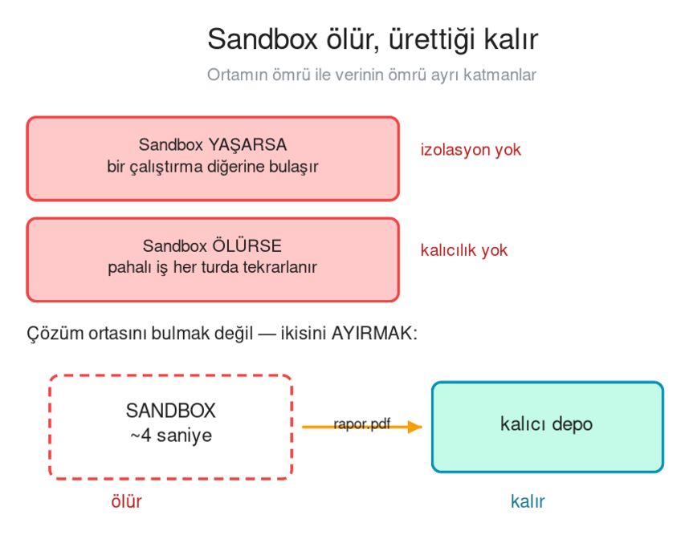
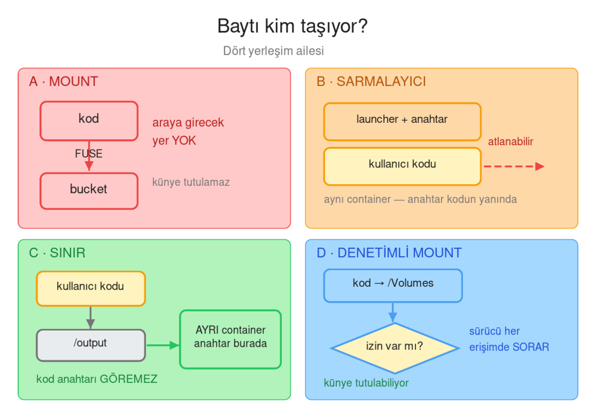
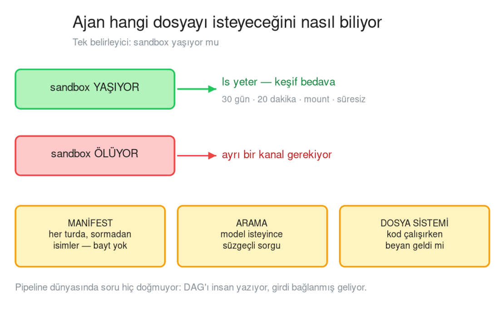
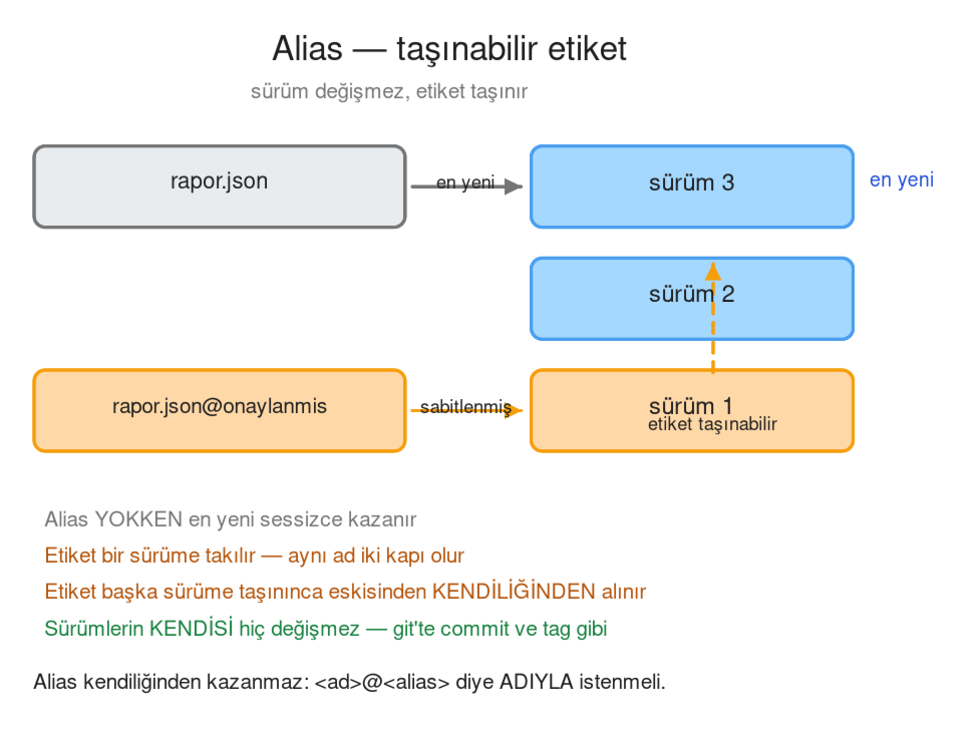
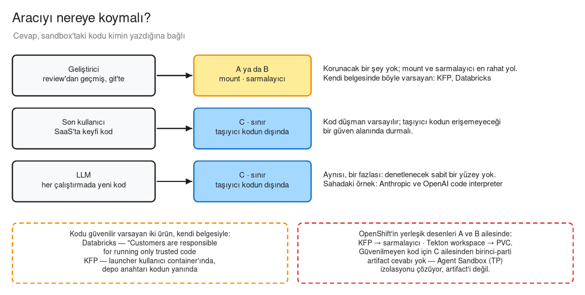
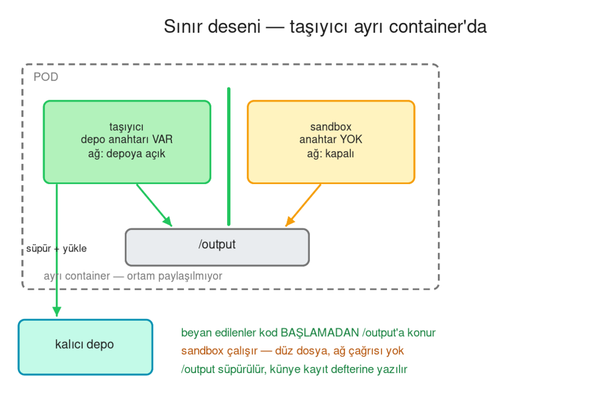
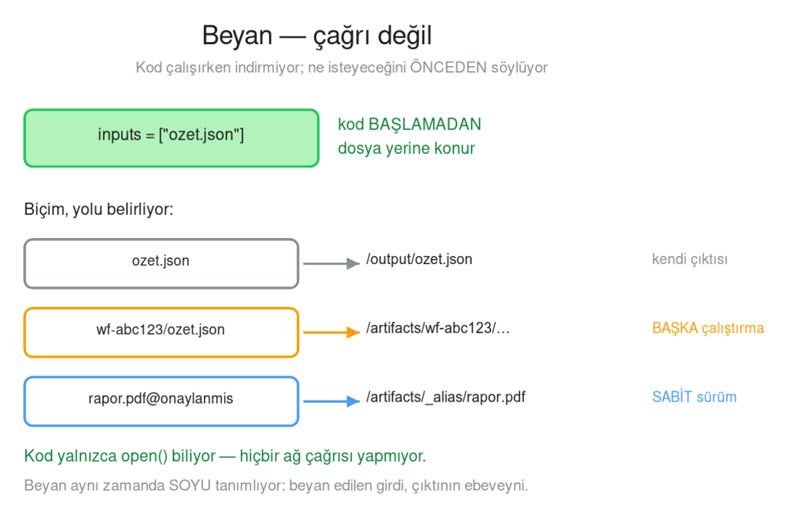
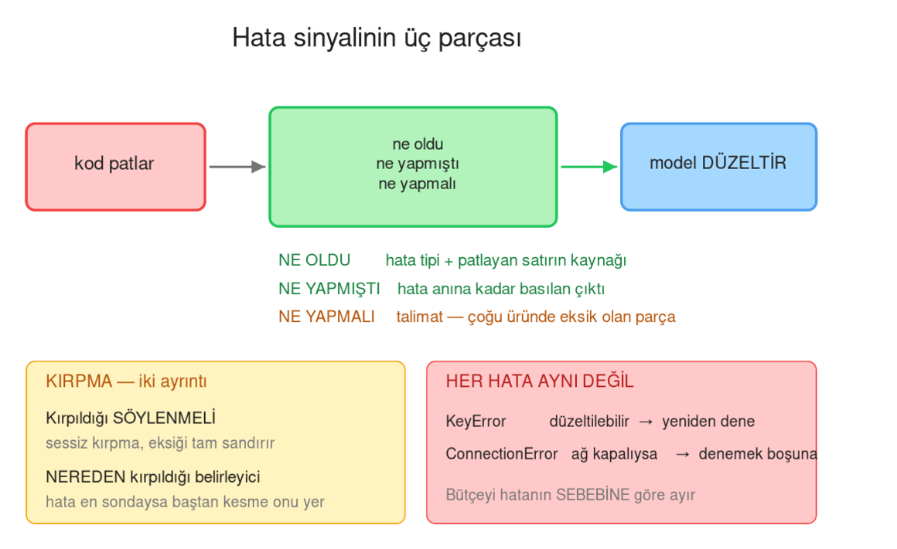
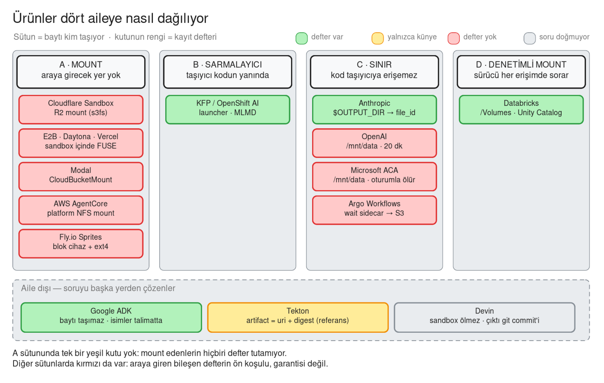
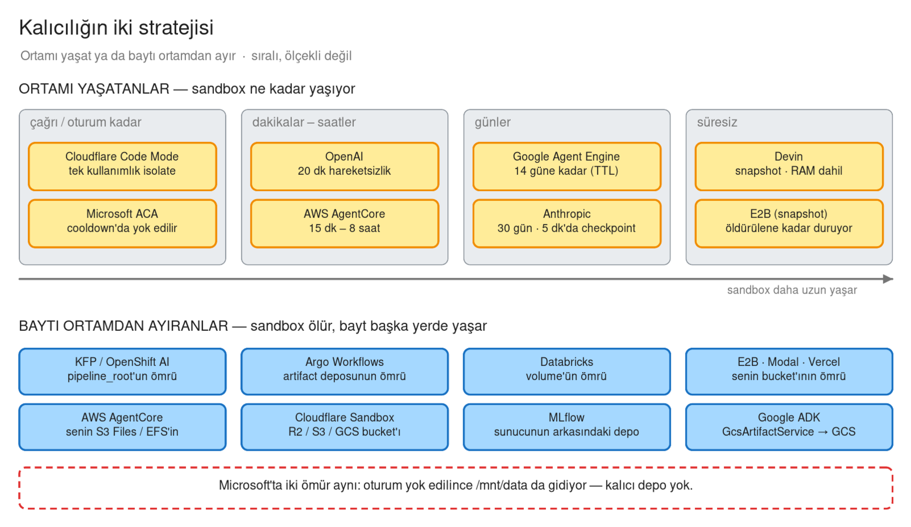

# Ajan Sandbox'larında Artifact Kalıcılığı

> Kod çalıştıran bir ajan sisteminde, üretilen dosyalar sandbox öldükten sonra
> nasıl yaşar? Piyasada dört farklı cevap var ve aralarındaki fark bir
> tercih değil, **mimari bir sonuç**.

### Bu sayfadaki diyagramlar

| Diyagram | Bölüm | Ne gösteriyor |
|---|---|---|
| Sandbox ölür, ürettiği kalır | §1 | Çelişki ve çözümü |
| Baytı kim taşıyor | §3 | Dört yerleşim ailesi |
| Ajan istediğini nasıl buluyor | §6 | Sandbox ömrü ve keşif kanalları |
| Alias — taşınabilir etiket | §7 | Sürüm sabitleme |
| Aracıyı nereye koymalı | §8 | Kodu kim yazdı → hangi aile |
| Sınır deseni | §9 | Taşıyıcının ayrı container'da olduğu yerleşim |
| Beyan — çağrı değil | §9 | Üç beyan biçimi, üç yol |
| Hata sinyalinin üç parçası | §10 | Kod patladığında ne dönüyor |
| Ürünler dört aileye nasıl dağılıyor | §12 | Piyasa: aile ve kayıt defteri, ürün ürün |
| Kalıcılığın iki stratejisi | §12 | Piyasa: ortamı yaşatanlar, baytı ayıranlar |

Her diyagram üç biçimde duruyor: sayfada görünen **`.png`**, baskı/ölçek için
**`.svg`**, ve Confluence'ta düzenlemek için **`.excalidraw`** kaynağı.

---

## 1 · Problem

Bir ajana kod çalıştırma yeteneği verdiğinizde iki şeyi aynı anda istersiniz:

| İstek | Neden |
|---|---|
| **İzolasyon** | Bir çalıştırmanın ürettiği durum diğerine sızmasın |
| **Kalıcılık** | Pahalı iş her turda baştan yapılmasın |

Bu ikisi doğrudan çelişiyor:

```
Sandbox YAŞARSA    bir çalıştırma diğerine bulaşır — izolasyon yok
Sandbox ÖLÜRSE     40 saniyelik iş her turda tekrarlanır
```

Çelişkiyi çözmenin yolu ortasını bulmak değil, **ortamın ömrü ile verinin
ömrünü birbirinden ayırmak**: sandbox ölsün, ürettiği kalsın.



> Düzenlemek için: `celiski.excalidraw` — Confluence'ta
> **Insert → Excalidraw → Import**.


Kod çalıştıran her sistem bu ayrımı bir şekilde kurmak zorunda kalmış. Aşağıda
kimin nasıl kurduğu var.

---

## 2 · Herkesin cevaplamak zorunda olduğu beş soru

Piyasadaki ürünlerin hepsine aynı beş soru sorulduğunda tablo netleşiyor:

```
S1  NEREDE     kod nerede koşuyor?          yönetilen container · pod · microVM
S2  ÖMÜR       ne kadar yaşıyor?            20 dakika · 30 gün · pod ömrü · süresiz
S3  VERİ       nasıl girip çıkıyor?         mount · SDK · dizin yakalama · beyan
S4  ANAHTAR    depo anahtarı nerede?        sandbox'ın içinde mi, dışında mı
S5  DEFTER     künye tutuluyor mu?          var · yok · tutulamaz
```

Ürünler farklı problemler çözdüklerini düşünüyor — biri sandbox satıyor, biri
pipeline motoru, biri ajan framework'ü. Ama hepsi bu beş sorunun altına
imza atmış durumda.

---

## 3 · Dört yerleşim ailesi



> Düzenlemek için: `dort-aile.excalidraw` — Confluence'ta
> **Insert → Excalidraw → Import**.

Belirleyici soru şu: **baytı kim taşıyor, ve o taşıyıcı kullanıcı koduna göre
nerede duruyor?**

### A · Mount

```
kod  →  write("/bucket/rapor.pdf")
             ↓  FUSE / NFS sürücüsü
        bucket
```

Bucket bir dosya sistemi gibi mount ediliyor. Kod sıradan bir `write()`
yazıyor, sürücü bunu HTTP'ye çeviriyor.

**Sonucu:** araya girecek bir yer yok. Kimse durup "bu dosya nedir, neyden
türedi" diye kaydetmiyor — dolayısıyla künye de tutulamıyor.

### B · Sarmalayıcı

```
main container
├── launcher     ← depo anahtarı burada, PID 1
└── kullanıcı kodu   ← launcher'ın alt süreci
```

Bir taşıyıcı program var ve işini düzgün yapıyor: girdileri kod başlamadan
indiriyor, çıktıları kod bittikten sonra yüklüyor, künyeyi kayıt defterine
yazıyor.

Ama taşıyıcı **kullanıcı koduyla aynı container'da**. Alt süreç ebeveyninin
ortamını devralır — aynı ortam değişkenleri, aynı dosya sistemi, aynı ağ.
Yani kod, isterse taşıyıcıyı atlayıp doğrudan depoya konuşabilir.

Bu, kodun **insan tarafından yazıldığı** sistemlerde makul bir karar:
sarmalayıcının işi güvenlik değil kolaylık — bileşen yazarını depo kodu
yazmaktan kurtarmak.

### C · Sınır

```
kullanıcı kodu  →  /output (paylaşılan dizin)
                        ↓
                   AYRI container   ← anahtar burada
                        ↓
                     depo
```

Taşıyıcı ayrı bir güven alanında: ayrı container, ayrı imaj, ayrı ortam.
Kullanıcı kodu dizine yazıyor, taşıyan taraf oradan alıyor.

Kod anahtarı **göremiyor** — çünkü anahtar kodun ortamında hiç yok.

### D · Denetimli mount

```
kod  →  /Volumes/<katalog>/<şema>/<volume>
              ↓
        sürücü katalog'a SORAR:  "bu kimlik bu yola yazabilir mi?"
              ↓
           volume
```

Mount ailesindeki tek istisna. Yol bir dosya yolu gibi görünüyor ama sürücü
her erişimde bir yetkilendirme katmanına soruyor. Aracı kaldırılmamış,
**sürücünün içine** taşınmış — bu yüzden künye de tutulabiliyor.

---

## 4 · Ortaya çıkan örüntü

Kayıt defteri olan ve olmayan ürünler ayrıldığında tek bir ortak özellik
kalıyor:

| Kayıt defteri | Yerleşim |
|---|---|
| **VAR** | B · sarmalayıcı, C · sınır, D · denetimli mount |
| **YOK** | A · mount — istisnasız |

> **Kayıt defteri, yalnızca yazma yolu bir bileşenden geçtiğinde ayakta
> kalıyor.**

Bu bir **gerek şart** ifadesi, yeter şart değil:

```
Mount ederseniz          defter TUTAMAZSINIZ    — araya girecek yer yok
Bileşen koyarsanız       defter TUTABİLİRSİNİZ  — ama zorunda değilsiniz
```

Örneğin bazı iş akışı motorlarında taşıyıcı bileşen var ama katalog
tutulmuyor: orada her çalıştırma kendi klasörüne yazdığı için aynı adın iki
sürümü hiç çakışmıyor, katalog ihtiyacı doğmuyor.

---

## 5 · Ürünlerin yaklaşımları

### Container'ı sakla

Sorunu kalıcılık değil, **ortamı yaşatmak** olarak tanımlıyor. Container
günler boyunca duruyor, hareketsizlikte dondurulup sonra geri yükleniyor.

Kod bir çıktı dizinine yazıyor; iş bitince **platform o dizine bakıyor**,
dosyaları kendi dosya servisine kaydediyor ve konuşmaya bir **kimlik**
dönüyor. Container ölse bile bayt o serviste kalıyor.

```
kod → $OUTPUT_DIR/rapor.pdf
          ↓
   PLATFORM DİZİNE BAKAR        ← kilit adım
          ↓
   dosya servisine kaydeder
          ↓
   konuşmaya kimlik döner:  file_abc123
```

Kilit adım ortadaki: kod bir "yükle" API'si çağırmıyor, sadece dosya yazıyor.
Araya giren platform olduğu için künye mümkün oluyor.

### Çalışma alanı ≠ kalıcı durum

Container'ın diski bir **tezgâh**, depo değil. Belirli bir süre hareketsizlik
sonrası container gidiyor. Üretilen dosyayı almak çağıranın işi.

### Kod yaz, tool çağırma

Bu ürünün tezi artifact'le ilgili bile değil: *modeller kod yazmayı tool
çağırmaktan daha iyi biliyor.* Nesne deposunu sandbox'a mount ediyor —
A ailesi.

### İsim ucuz, içerik pahalı

Baytı hiç taşımıyor. Üretilen dosyaların **isimlerini** her turda sistem
talimatlarına yazıyor; içeriği model isteyince ve **yalnızca o isteğe**
ekliyor. Sonraki turda içerik context'te yok.

Üç kural:

```
isimler    her zaman talimatlarda      ucuz
içerik     talep üzerine               pahalı
geçmiş     içerik kalıcı yazılmaz      pencere şişmesin
```

### DAG yazılıdır

Pipeline motorları farklı bir dünyada: hangi adımın hangi girdiyi alacağı
**önceden yazılı**. Girdi bağlanmış geliyor, seçim yapan bir ajan yok.

Buna karşılık kayıt defteri en zengin olan taraf burası: tip, soy, beyan
edilen girdiler, sürüm — hepsi ayrı bir metadata servisinde.

### Artifact = referans

Bazı CI/CD motorları artifact'i bir **kap** değil **referans** sayıyor:
`uri` + `digest` duyuruluyor, imzalı bir attestation üretiliyor, ama
baytın kendisi saklanmıyor.

### Sandbox'ı hiç öldürme

microVM snapshot ile RAM, süreçler ve disk saklanıyor. Kalıcılık sorusu
ortadan kalkıyor — bedeli süresiz yaşayan bir makine.

---

## 6 · İkinci sorun: bulmak

Bayt taşındıktan sonra ikinci bir soru doğuyor: **ajan hangi dosyayı
istediğini nasıl biliyor?**

Bunu tek bir şey belirliyor — **sandbox yaşıyor mu**.

```
Sandbox YAŞIYOR     →  ls yeter, keşif bedava
Sandbox ÖLÜYOR      →  ayrı bir kanal gerekiyor
```



> Düzenlemek için: `kesif.excalidraw` — Confluence'ta
> **Insert → Excalidraw → Import**.


Sahadaki desenler:

| Desen | Nasıl |
|---|---|
| Referans context'e düşer | Üretilen dosyanın kimliği tool sonucunda döner |
| Dosya sistemi + `ls` | Sandbox yaşıyorsa model diske bakar |
| İsimler prompt'a enjekte | İsimler talimatlarda, içerik talep üzerine |
| Kayıt defterine sorgu | Ada/tipe göre süzülmüş liste |
| **Keşif YOK** | DAG statik, girdi bağlanmış — soru hiç doğmuyor |

Son satır önemli: pipeline dünyasında keşif diye bir problem yok, çünkü
seçimi insan yapmış.

---

## 7 · Üçüncü sorun: aynı adın on iki sürümü

Depoda `rapor.pdf` adında on iki kayıt varken "rapor.pdf ver" ne demek?

Varsayılan davranış genelde **en yeni kazanır** — ve bu **sessiz** bir
kuraldır. Yarın bir çalıştırma daha olunca cevap kendiliğinden değişir.

Sahadaki dört cevap:

| Yaklaşım | Nasıl |
|---|---|
| **Alias** | Bir sürüme taşınabilir etiket: `<ad>@<alias>` |
| **Yol izolasyonu** | Çakışma imkânsız — yol çalıştırma kimliği içeriyor |
| **Sürüm numarası** | Ad + sürüm; varsayılan en yeniyi verir |
| **İçerik hash'i** | İsim kimlik değil, içerik kimliktir |



> Düzenlemek için: `alias.excalidraw` — Confluence'ta
> **Insert → Excalidraw → Import**.

### Alias nasıl çalışıyor

```
① rapor.json                     →  en yeni sürüm (sessiz)
② @onaylanmis etiketi bir sürüme takılır
③ rapor.json                     →  hâlâ en yeni
   rapor.json@onaylanmis         →  SABİTLENMİŞ sürüm
④ etiket başka sürüme taşınır    →  eski sahipten kendiliğinden alınır
⑤ sürümlerin KENDİSİ hiç değişmez
```

Git'teki ayrımın aynısı: **commit değişmez, tag taşınır.** Ve alias
kendiliğinden kazanmaz — `<ad>@<alias>` diye **adıyla istenmesi** gerekir.

---

## 8 · Güvenilmeyen kod varsayımı

Yukarıdaki dört ailenin hepsi, kodun **güvenilir** olduğunu varsayarak
tasarlanmış. Bu makul bir varsayım: pipeline bileşenini bir insan yazdı,
gözden geçirdi, versiyon kontrolünde duruyor.

Kodu **bir LLM yazdığında** varsayım düşüyor. O zaman soru şu hâle geliyor:

> Taşıyıcı, kodun **erişebileceği** bir yerde mi duruyor?

```
B · sarmalayıcı    aynı container   →  kod anahtara ulaşabilir
C · sınır          ayrı container   →  ulaşamaz
```

Bu, bir güvenlik açığı değil bir **yerleşim tercihi** — ve tercihi belirleyen
şey, kodu kimin yazdığı.



> Düzenlemek için: `kodu-kim-yazdi.excalidraw` — Confluence'ta
> **Insert → Excalidraw → Import**.

### Neden aynı container'da sır saklanamıyor

Alt süreç, ebeveyninin ortamını devralır. Ortam değişkeni container başına
tanımlanır, süreç başına değil:

```
main container
  PID 1   taşıyıcı        ← ortam BURAYA basıldı
    └─ PID 7  kullanıcı kodu   ← ortamı DEVRALDI
```

Ortam temizlense bile aynı kullanıcı `/proc/1/environ` üzerinden okuyabilir.
Mesele dikkatsizlik değil, işletim sisteminin süreç modeli.

---

## 9 · Sınır kurma deseni

Güvenilmeyen kod için sahada işleyen desen **C ailesi**: taşıyıcıyı ayrı bir
container'a almak.



> Düzenlemek için: `sinir-deseni.excalidraw` — Confluence'ta
> **Insert → Excalidraw → Import**.


```
POD
┌──────────────────────┬──────────────────────┐
│  taşıyıcı            │  sandbox             │
│  depo anahtarı VAR   │  anahtar YOK         │
│  ağ: depoya açık     │  ağ: kapalı          │
└──────────┬───────────┴───────────┬──────────┘
           └──── /output (paylaşılan) ────┘
```

İş bölümü:

```
① model kod yazar ve ne okuyacağını BEYAN eder
② taşıyıcı beyan edilenleri /output'a koyar        (kod BAŞLAMADAN)
③ sandbox çalışır — düz dosya okuma, ağ çağrısı yok
④ taşıyıcı /output'u süpürür → bayt depoya, künye kayıt defterine
⑤ pod silinir, dosyalar kalır
```

**Beyan, çağrı değildir.** Kod çalışırken bir şey indirmiyor; ne isteyeceğini
önceden söylüyor, dosya kod başlamadan yerine konuyor. Kod yalnızca
`open()` biliyor.



> Düzenlemek için: `beyan.excalidraw` — Confluence'ta
> **Insert → Excalidraw → Import**.


Beyanın üç biçimi:

```
ad                    →  bu çalıştırmanın çıktısı
<çalıştırma>/ad       →  BAŞKA bir çalıştırmanın çıktısı
ad@alias              →  sabitlenmiş sürüm
```

### Beyanın ikinci faydası: soy

Beyan yalnızca dosyayı getirmiyor, **soyu da tanımlıyor**. Beyan edilen girdi
o çıktının ebeveyni sayılıyor.

```
beyan YOK   →  ne indiğini bilmediğin için hepsi ebeveyn sayılır
beyan VAR   →  yalnızca istenen ebeveyn
```

Yüz dosyalık bir depoda kodun bir tanesini okuduğu bir çalıştırmada fark
şudur: yüz ebeveynli bir soy hiçbir şey anlatmaz, iki ebeveynli soy anlatır.

---

## 10 · Kod patladığında ne dönüyor

Ajan kod yazıyorsa hata alması normaldir; asıl soru **modele ne döndüğü**.



> Düzenlemek için: `hata-sinyali.excalidraw` — Confluence'ta
> **Insert → Excalidraw → Import**.

İyi bir hata sinyalinin üç parçası var:

```
① NE OLDU        hata tipi + patlayan satır
② NE YAPMIŞTI    hata anına kadar basılan çıktı
③ NE YAPMALI     talimat
```

Sahadaki örüntü: olgun ürünlerin çoğunda ilk ikisi var (çıkış kodu, tam
traceback, korunan stdout), üçüncüsü nadiren var.

### Kırpma

Büyük çıktılarda mesaj kırpılmak zorunda. İki ayrıntı önemli:

**Kırpıldığı söylenmeli.** Sessiz kırpma modelin eksik veriyi tam sanmasına
yol açıyor. Olgun uygulamalar kaç karakterin atıldığını yazıyor, bazıları
ne yapılacağını da öğretiyor ("çıktıyı azalt ya da dosyaya yönlendir").

**Nereden kırpıldığı belirleyici.** Bir traceback'te değerli olan iki uçtur:
baş "nereden başladı", son "asıl hata". Baştan kesen bir kırpma, tam da
modelin ihtiyacı olan satırı atabiliyor.

```
BAŞTAN kırpma    →  hata en sondaysa KAYBOLUR
ORTADAN kırpma   →  iki uç da korunur
```

### Düzeltilebilir ve düzeltilemez hatalar

Her hata aynı değil:

```
KeyError          →  düzeltilebilir, model yeniden denemeli
ConnectionError   →  ağ kapalıysa DÜZELTİLEMEZ, denemek boşuna
```

Deneme bütçesini hatanın **sebebine** göre ayırmak, sabit bir sayıdan daha
isabetli oluyor.

---

## 11 · Özet

```
① Sandbox'ın ömrü ile verinin ömrü AYRI katmanlar olmalı

② Kayıt defteri, yazma yolu bir bileşenden geçtiğinde mümkün —
   mount edilen yerde araya girecek yer yok

③ Taşıyıcının kodla AYNI container'da olup olmaması, kodun kim
   tarafından yazıldığına göre değişen bir yerleşim tercihi

④ Beyan (çağrı değil) hem ağ yüzeyini kapatıyor hem soyu tanımlıyor

⑤ Aynı adın çok sürümü olduğunda "en yeni kazanır" SESSİZ bir kural;
   alias onu görünür ve kasıtlı hâle getiriyor

⑥ Hata sinyali üç parçalı olmalı: ne oldu · ne yapmıştı · ne yapmalı
```

---

## 12 · Piyasa analizi

Yukarıdaki çerçevenin ürün adlarıyla hâli. Her satır ürünün kendi dokümanına
dayanıyor — yaygınlık ölçümü değil.



> Düzenlemek için: `piyasa-haritasi.excalidraw` — Confluence'ta
> **Insert → Excalidraw → Import**.

| Ürün | Nasıl | Aile | Anahtar sandbox'ta | Kayıt defteri | Ömür |
|---|---|---|---|---|---|
| **Anthropic** code execution | `$OUTPUT_DIR` yakalanır → Files API | C | Hayır | `file_id`, soy yok | id ile 30 gün |
| **OpenAI** Code Interpreter | `/mnt/data`, container file uçları | C | Hayır | Yok | 20 dk hareketsizlik |
| **Microsoft** ACA sessions | `/mnt/data`, havuzdan session | C | Platform | Yok | cooldown'a kadar |
| **Cloudflare** Sandbox | R2 / S3 / GCS mount | A | Moda bağlı | Yok | bucket |
| **AWS** AgentCore | S3 Files / EFS NFS mount, IAM rolü | A | IAM rolüyle dar | Yok (CloudTrail) | 15 dk – 8 saat |
| **E2B · Daytona · Vercel · Modal** | Sandbox içinde FUSE | A | Çoğunda evet | Yok | bucket |
| **Google ADK** | İsimler talimatta, içerik istenince | — | Hayır | Ad + sürüm | oturum |
| **Red Hat** OpenShift AI (KFP) | driver + launcher, S3 SDK | B | **Evet** | **MLMD** | pod |
| **Argo Workflows** | init + wait sidecar | C | Hayır | Yok | pod |
| **MLflow** (proxied) | İstemci → HTTP → sunucu → depo | — | Hayır | Tracking DB + Registry | — |
| **Databricks** | `/Volumes` + Unity Catalog | D | Hayır | **UC + MLflow** | volume |
| **Devin** | microVM snapshot, çıktı git'te | — | — | git commit | süresiz |

### Ürün başına tek not

* **Anthropic** — yakalayan platform, kod değil: *"Files written anywhere else
  stay in the container and aren't returned."* Container ~5 dk'da checkpoint,
  30 gün geri çağrılabilir; internet kapalı.
* **OpenAI** — kalıcılığı açıkça reddediyor: *"treat containers as ephemeral
  and store all data related to the use of this tool on your own systems."*
* **Google ADK** — `LoadArtifactsTool` isimleri her turda talimata yazıyor,
  içeriği yalnızca o isteğe ekliyor; içerik geçmişe kalıcı yazılmıyor.
* **AWS** — yönetilen depo yok: *"does not offer a managed session-storage
  option"*. Inline 100 MB, terminalden S3'e 5 GB.
* **Red Hat** — KFP'de launcher kullanıcı kodunu alt süreç olarak çalıştırıyor;
  S3 kurulumun ön koşulu. Agent Sandbox (Technology Preview) izolasyonu
  çözüyor, kalıcılığı PVC — artifact kaydı yok.
* **Argo** — dört executor'ı v3.4'te kaldırıp tek yerleşimde kaldı; `docker`
  için gerekçe *"breaks security completely"*. Katalog tutmuyor.
* **MLflow** — *"When not proxying, clients need their own credentials and
  direct access to the artifact store."* Sürüm için alias:
  `models:/MyModel@champion`.
* **Databricks** — mount ailesinde defteri olan tek ürün; ama *"Customers are
  responsible for running only trusted code."*
* **Cloudflare · Vercel** — kimliksiz mount + imzalayan proxy: anahtar
  sandbox'tan çıkıyor, ama proxy içeriğe bakmıyor, defter doğmuyor.
* **Devin** — sandbox hiç ölmüyor; çıktı bir PR. Parquet ya da PDF için değil.



> Düzenlemek için: `sandbox-omru.excalidraw` — Confluence'ta
> **Insert → Excalidraw → Import**.

### Piyasadan çıkan

```
① "Artifact storage" diye ayrı bir ürün yok — herkes nesne deposu ya da container diski
② Defter tutanların hepsi yazma yolunda bir bileşen taşıyor; mount edenlerin hiçbiri tutmuyor
③ Defteri en olgun iki ürün (KFP, Databricks) kodu güvenilir varsayıyor
④ OpenShift'te güvenilmeyen kod için hazır bir artifact cevabı yok
```

> Doğrulanamayanlar: Anthropic ve OpenAI'ın depo arka ucu belgelenmemiş;
> Databricks, Devin ve Argo executor alıntılarının birincil linkleri bu depoda
> kayıtlı değil.

**Kaynaklar:**
[Anthropic](https://platform.claude.com/docs/en/agents-and-tools/tool-use/code-execution-tool) ·
[OpenAI](https://developers.openai.com/api/docs/guides/tools-code-interpreter) ·
[Microsoft](https://learn.microsoft.com/en-us/azure/container-apps/sessions-code-interpreter) ·
[Cloudflare](https://developers.cloudflare.com/sandbox/api/storage/) ·
[AWS](https://docs.aws.amazon.com/bedrock-agentcore/latest/devguide/code-interpreter-filesystem-configurations.html) ·
[Google ADK](https://adk.dev/artifacts/) ·
[OpenShift AI](https://docs.redhat.com/en/documentation/red_hat_openshift_ai_self-managed/2.25/html/working_with_data_science_pipelines/managing-data-science-pipelines_ds-pipelines) ·
[Agent Sandbox](https://github.com/kubernetes-sigs/agent-sandbox) ·
[Argo](https://argo-workflows.readthedocs.io/en/latest/walk-through/artifacts/) ·
[MLflow](https://mlflow.org/docs/latest/self-hosting/architecture/tracking-server/) ·
[Vercel](https://vercel.com/docs/sandbox/mount-remote-storage) ·
[E2B](https://e2b.dev/docs/sandbox/connect-bucket) ·
[Modal](https://modal.com/docs/guide/cloud-bucket-mounts)

---

## Terimler

| Terim | Anlamı |
|---|---|
| **Sandbox** | Ajanın yazdığı kodun çalıştığı izole ortam |
| **Artifact** | Bir çalıştırmanın ürettiği, sonradan kullanılabilen çıktı |
| **Bucket** | Nesne deposundaki isim alanı — kavram, ürün değil |
| **S3 API** | Nesne depolarının fiilî standart HTTP arayüzü; ürün değil, protokol |
| **Künye / kayıt defteri** | Artifact'in kimliği, tipi, boyutu, kökeni |
| **Soy (lineage)** | Bir artifact'in hangi girdilerden türediği |
| **Beyan** | Kodun çalışmadan önce hangi girdileri istediğini bildirmesi |
| **Alias** | Bir sürüme takılan, taşınabilir isim |
| **Sidecar** | Aynı pod'da, ana container'a eşlik eden yardımcı container |
