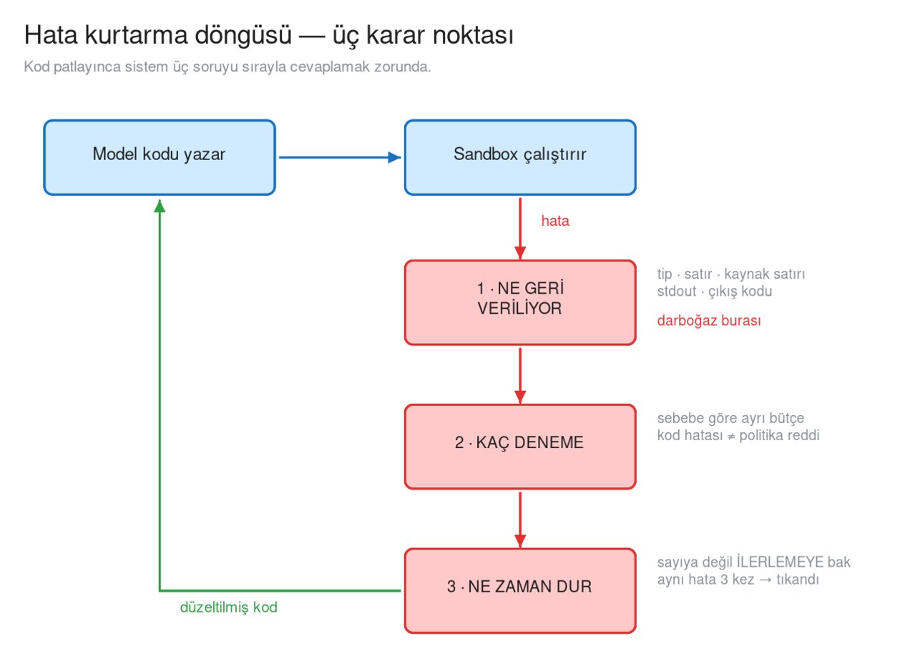
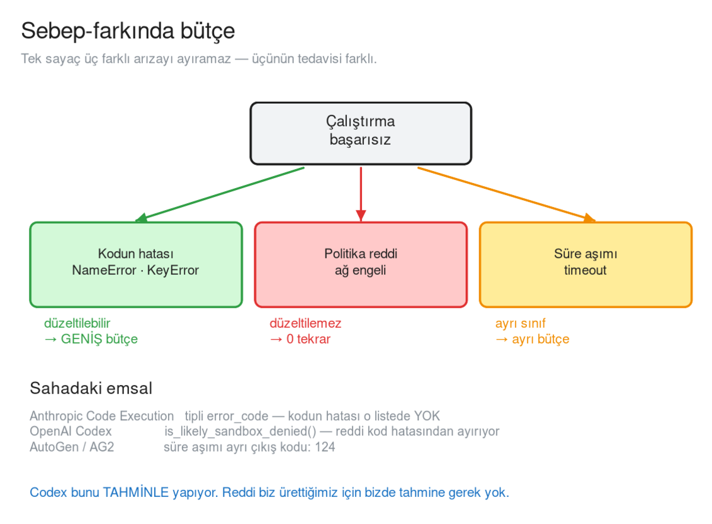
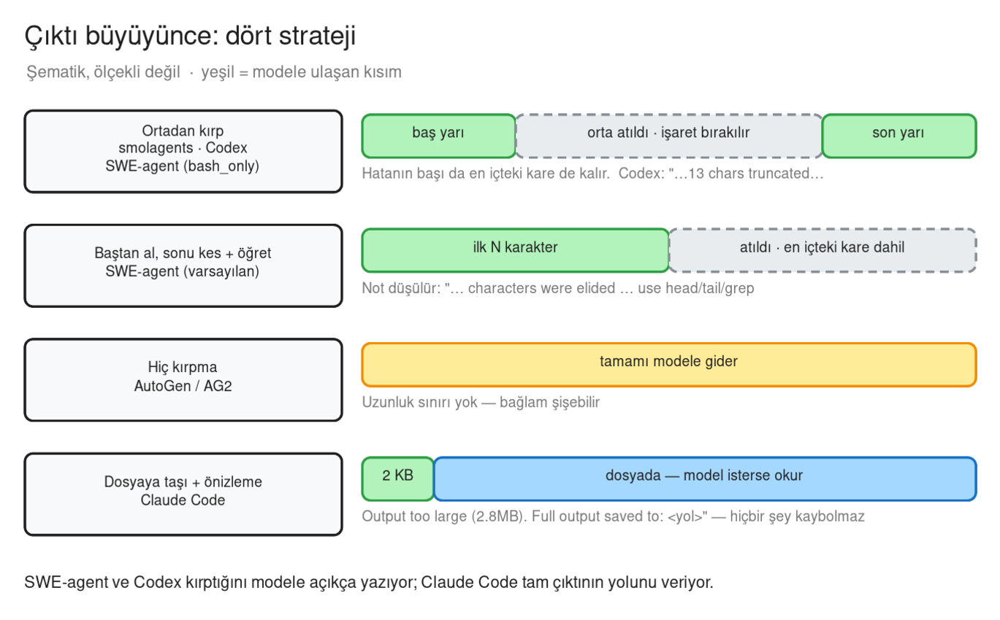
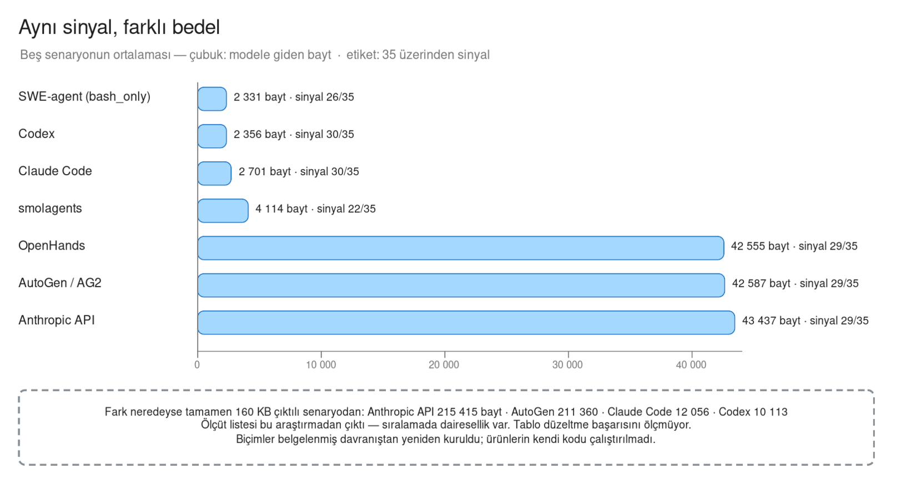
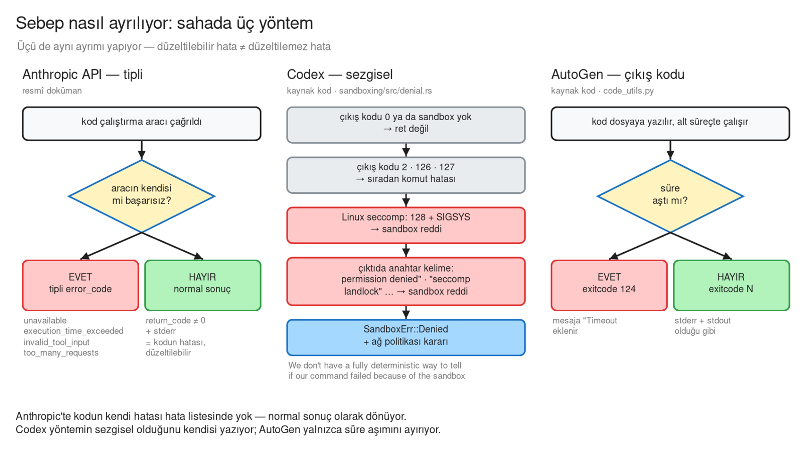

# Kod Çalıştıran Ajanlarda Hata Kurtarma

> Ajanın yazdığı kod patladığında ne olur? Modele geri **ne** gönderilir, **kaç
> kez** denenir, **ne zaman** durulur? Piyasa bu üç soruya birbirinden bağımsız
> ama şaşırtıcı derecede benzer cevaplar vermiş — ve cevapların bir kısmı
> ölçülmüş.

### Bu sayfadaki diyagramlar

Hepsi Excalidraw sahnesi olarak yanında duruyor; Confluence'ta
**Insert → Excalidraw → Import** ile açılıyor ve sayfada düzenlenebiliyor.

| Dosya | Bölüm | Ne gösteriyor |
|---|---|---|
| Hata kurtarma döngüsü | §2 | Döngü ve üç karar noktası |
| Sebep-farkında bütçe | §6 | Üç arıza sınıfı, üç ayrı bütçe |
| Çıktı büyüyünce: dört strateji | §8 | Kırpma yöntemleri |
| Aynı sinyal, farklı bedel | §11 | Ölçülmüş sinyal ve bayt |
| Sebep nasıl ayrılıyor | §13 | Piyasa: Anthropic, Codex, AutoGen |

Her diyagram üç biçimde duruyor: sayfada görünen **`.png`**, baskı/ölçek için
**`.svg`**, ve Confluence'ta düzenlemek için **`.excalidraw`** kaynağı.

---

## 1 · Problem

Kod çalıştıran bir ajan, kaçınılmaz olarak patlayan kod yazar. `KeyError`,
yanlış sütun adı, eksik import. İnsan olsa hata mesajını okur, düzeltir, tekrar
çalıştırır.

**Self-repair**, bu döngüyü insan olmadan kurmaktır: çalıştırma hatası →
modele geri bildirim → düzeltilmiş kod → tekrar çalıştırma.

Kulağa basit geliyor, ama içinde üç ayrı tasarım kararı saklı ve **üçü de
yanlış yapılabiliyor**:

```
Sinyal fakirse       model neyi düzelteceğini bilemez, körlemesine dener
Bütçe kör ise        düzeltilemez bir hatayı defalarca dener, para yakar
Duruş ölçüsü yoksa   aynı duvara sonsuza kadar toslar
```

---

## 2 · Üç karar noktası



> Düzenlemek için: `hata-dongusu.excalidraw` — Confluence'ta
> **Insert → Excalidraw → Import**.


Kod patladığı anda sistem sırayla üç soruya cevap vermek zorunda:

| # | Soru | Karar |
|---|---|---|
| **1** | **Ne geri veriliyor?** | Modele giden mesajın içinde ne var |
| **2** | **Kaç deneme?** | Bütçe — ve bütçe sebebe göre değişiyor mu |
| **3** | **Ne zaman dur?** | Sayı mı, yoksa ilerleme mi ölçülüyor |

Bu sayfanın geri kalanı bu üç sorunun sahadaki cevaplarını anlatıyor.

---

## 3 · Birinci soru: ne geri veriliyor

Bir çalıştırma hatasının **ham malzemesi** dört parçadır: istisna nesnesi, hata
anına kadar biriken stdout, çıkış kodu, süre. Sistemler bu dörtlüden farklı
alt kümeler seçiyor.

### Sahadaki cevaplar

| Sistem | Traceback | stdout | Çıkış kodu | Kırpma sınırı |
|---|---|---|---|---|
| **AutoGen / AG2** | Tam | ✓ | ✓ (`exitcode: N`) | **Yok** |
| **SWE-agent** | Tam (bash gözlemi) | ✓ | Dolaylı | 100 000 / 10 000 karakter |
| **smolagents** | **Hayır** — hatalı satır + istisna tipi | ✓ | ✗ | 20 000 / 50 000 karakter |
| **Claude Code** | Tam | ✓ | ✓ | dosyaya taşır |
| **Codex** | Tam | ✓ | ✓ (+ süre) | ortadan, işaretli |
| **Anthropic API** | ✓ `stderr` | ✓ `stdout` | ✓ `return_code` | belgelenmemiş |

### smolagents — traceback vermiyor ama tip veriyor

smolagents tam traceback göndermiyor; onun yerine **hatalı satırın kaynak
metnini + istisna tipini** veriyor:

```
ERROR: Code execution failed at line 'import os' due to: InterpreterError:
Import of os is not allowed. Authorized imports are: [...]
```

Ayrıca **hata anına kadarki `print` çıktısını da kaybetmiyor**. Bunun için
ayrı bir test yazmışlar (`test_error_saves_previous_print_outputs`) — yani
"hata olsa da stdout'u koru" bilinçli bir karar, kaza değil.

### Neden istisna tipi kritik

SWE-agent makalesi hata mesajının parçalarını tek tek çıkarıp denemiş ve
sonucu şöyle yazmış:

> "**Without the error type, the agent might misdiagnose what the mistake was.
> Without a snippet of the changed file content, the agent will re-issue the
> same command more frequently.**"

Yani sadece `str(exc)` göndermek — `'yok'` gibi — modele `KeyError` mi
`ValueError` mi olduğunu bile söylemiyor. Model yanlış teşhis koyuyor.

---

## 4 · Biçimin fiyatı ölçülmüş

Bu konudaki **tek nicel ölçüm** SWE-agent'ın ACI makalesinde (NeurIPS 2024).
SWE-bench Lite üzerinde, GPT-4 Turbo ile:

| Ablasyon | % Çözülen | Fark |
|---|---|---|
| `edit` + **linting** (varsayılan) | **18,0** | — |
| `edit`, linting **yok** | 15,0 | **−3,0** |
| Bağlam: son 5 gözlem (varsayılan) | **18,0** | — |
| Bağlam: **tüm geçmiş** | 15,0 | **−3,0** |

İki okuma birden:

* Hata anında **doğru biçimde** geri bildirim vermek **3,0 puan** — göreli
  olarak **%17** — değerinde.
* **Daha çok bağlam daha iyi değil.** "Tüm geçmişi modele ver" aynı miktarda
  kaybettiriyor.

Makalenin dört tasarım ilkesinden biri doğrudan bu:

> "**Guardrails mitigate error propagation and hasten recovery.** ... Building
> in guardrails, such as a code syntax checker that automatically detects
> mistakes, can help agents recognize and quickly correct errors."

---

## 5 · Mesajın yanına ne yazıldığı

Hata metninin kendisi kadar, **yanına konan cümle** de bir tasarım kararı. İki
bağımsız çerçeve aynı iki şeyi birlikte söylüyor:

| Sistem | Metin |
|---|---|
| **smolagents** | "Now let's retry: take care not to repeat previous errors! If you have retried several times, try a completely different approach." |
| **OpenHands** | "Repeating the exact same call again will not work — review the error message and either correct the arguments or try a different approach." |

İkisi de aynı çifti kuruyor: **tekrar dene** *ve* **aynısını tekrarlama**.

SWE-agent'ın lint mesajı da aynı şeyi yapıyor:

> "Your changes have NOT been applied. Please fix your edit command and try
> again. ... **DO NOT re-run the same failed edit command. Running it again
> will lead to the same error.**"

Bu bir üslup tercihi değil: hata metni modeli **durmaya** da yönlendirebilir,
**denemeye** de. Ne yazdığınız davranışı belirliyor.

---

## 6 · İkinci soru: kaç deneme — ve sebep önemli



> Düzenlemek için: `sebep-farkindalik.excalidraw` — Confluence'ta
> **Insert → Excalidraw → Import**.


### Bütçeler geniş, ve genelde çift

| Sistem | Sabit | Değer |
|---|---|---|
| **smolagents** | `max_steps` | **20** |
| **OpenHands** | `DEFAULT_MAX_ITERATIONS` | **500** |
| **OpenHands** | `DEFAULT_MAX_BUDGET` | **10,0 USD** |

OpenHands'in **iki bütçe birden** tutması dikkat çekici: adım sayısı *ve*
para. Pahalı bir adımla ucuz bir adım aynı sayılmamalı.

### Asıl mesele: her arıza tekrar denenebilir değil

Bir çalıştırma üç farklı sebeple başarısız olur ve **üçünün tedavisi farklı**:

| Sınıf | Örnek | Tekrar denemek |
|---|---|---|
| **Kodun hatası** | `NameError`, `KeyError` | **Mantıklı** — düzeltilebilir |
| **Politika reddi** | ağ engeli, izin yok | **Anlamsız** — aynı duvar |
| **Süre aşımı** | timeout | Ayrı sınıf, ayrı karar |

Tek bir sayaç bu üçünü ayıramaz. Sahadaki üç ayrı emsal ayırıyor:

**Anthropic Code Execution** — başarısızlıkları **tipli hata kodlarıyla**
döndürüyor (`unavailable`, `execution_time_exceeded`, `invalid_tool_input`,
`too_many_requests`…). Kritik ayrıntı: **kodun kendi hatası bu listede yok.**
Kod `NameError` atarsa bu bir "araç hatası" değil; sıfırdan farklı
`return_code` + dolu `stderr` ile **normal bir sonuç** olarak dönüyor. Yani
"aracın başarısızlığı" ile "kodun başarısızlığı" yapısal olarak ayrılmış.

**OpenAI Codex** — `is_likely_sandbox_denied()` fonksiyonu sandbox reddini kod
hatasından ayırıyor. Yöntem dürüstçe sezgisel:

> "We don't have a **fully deterministic** way to tell if our command failed
> because of the sandbox... For now, we **conservatively** check for well known
> command failure exit codes and also look for common sandbox denial keywords."

| Adım | Kural |
|---|---|
| Hızlı eleme | Çıkış kodu **2, 126, 127** → sıradan komut hatası, ret değil |
| Linux'a özel | `128 + SIGSYS` → sinyal temelli ret |
| Anahtar kelime | `operation not permitted`, `permission denied`, `read-only file system`, `seccomp`, `sandbox`, `landlock` |

Ret ayrıca **tipli bir hata** olarak taşınıyor ve yanında **hangi ağ
politikasının** engellediğini de getiriyor.

**AutoGen / AG2** — süre aşımını çıkış koduyla ayırıyor: timeout'ta çıkış kodu
**124** ve mesaja `Timeout` ekleniyor. Kod hatası ile süre aşımı **farklı
sinyaller**.

---

## 7 · Üçüncü soru: ne zaman dur

Sabit bir sayı vermek kolay ama yanlış ölçü. OpenHands bunun için ayrı bir
sınıf yazmış: **`StuckDetector`**.

| Tanıdığı desen | Varsayılan eşik |
|---|---|
| Eylem–gözlem döngüsü | 4 |
| **Eylem–HATA döngüsü** | **3** |
| Ajan monoloğu | 3 |
| Dönüşümlü desen | 6 |
| Taranan olay penceresi | 20 |

Bizi ilgilendiren `action_error = 3`: **aynı aracı aynı argümanlarla üç kez
çağırıp aynı hatayı almak.**

İki ayrıntı önemli:

* Ölçülen şey **sayı değil, ilerleme**. Farklı bir hata alıyorsan devam
  edebilirsin; aynı duvara üçüncü kez tosluyorsan tıkanmışsındır.
* Tespit edilince çalıştırma **öldürülmüyor** — modele bir dürtme metni
  gidiyor: *"You've called `{tool}` with the same arguments {N} times in a row
  and gotten the same error"*.

**Sınıra varınca ne olacağı da bir karar.** smolagents `max_steps` aşılınca
sessizce kesmiyor: `_handle_max_steps_reached()` ile model **son bir kez**
cevap üretmeye zorlanıyor. Yani "sustum" değil, "elimdekiyle şunu diyebilirim"
ile bitiyor.

---

## 8 · Kırpma — dört farklı strateji



> Düzenlemek için: `kirpma-stratejileri.excalidraw` — Confluence'ta
> **Insert → Excalidraw → Import**.

Traceback + stdout birleşince mesaj büyüyor. Herkes bir sınır koymuş ama
**dört farklı yol** seçilmiş:

| Strateji | Kim | Ne oluyor |
|---|---|---|
| **Ortadan kırp** | smolagents, SWE-agent, Codex | Baş yarı + son yarı kalır, orta gider — **veri kaybolur** |
| **Uçtan kes + öğret** | SWE-agent | Modele "head/tail/grep kullan" diye akıl verilir |
| **Hiç kırpma** | AutoGen | Bağlam patlayabilir |
| **Dosyaya taşı + önizleme** | Claude Code | `Output too large (2.8MB). Full output saved to: <yol>` — **hiçbir şey kaybolmaz**, model gerekirse gidip okur |

**Ortadan kırpmak neden doğru:** traceback'te hem hatanın başı hem de en
içteki kare değerlidir. Uçtan kesmek ikisinden birini yok eder.

**Kırpma sessiz olmamalı.** SWE-agent modele ne olduğunu söylüyor *ve* ne
yapması gerektiğini öğretiyor:

```
<response clipped><NOTE>Observations should not exceeded 10000 characters.
42000 characters were elided. Please try a different command that produces
less output or use head/tail/grep/redirect the output to a file.</NOTE>
```

Codex de aynısını yapıyor (`…13 chars truncated…`) ve politikayı **bayt ya da
token** cinsinden tanımlayabiliyor.

---

## 9 · Literatür ne diyor

### Self-repair sihirli değnek değil

Olausson ve arkadaşlarının çalışması (ICLR 2024) doğrudan "bütçeyi
genişletelim" refleksine karşı çıkıyor:

> "when the cost of carrying out repair is taken into account, performance
> gains are often modest, vary a lot between subsets of the data, and are
> **sometimes not present at all**."

| Model | Benchmark | Kazanç |
|---|---|---|
| Code Llama | HumanEval | **yok** |
| GPT-3.5 | HumanEval | %3'e kadar |
| GPT-4 | APPS | %8'e kadar (zor sorularda %34) |

### Darboğaz nerede

> "self-repair is bottlenecked by **the model's ability to provide feedback on
> its own code**."

Bunu iki deneyle gösteriyorlar. **Daha güçlü modelin geri bildirimi** verilince
performans bariyeri kırılıyor. **İnsan geri bildirimi** verilince (16
katılımcı, 40 başarısız GPT-4 programı) onarılan program sayısı **%57 artıyor**
— başarı oranı **%52,60 (insan) vs %33,30 (modelin kendi geri bildirimi)**.

Yani darboğaz deneme sayısı değil, **geri bildirimin kalitesi**.

### Geniş ilk deneme > derin onarım

> "Self-repair is more likely to be beneficial when **more of the sampling
> budget is spent on generating a diverse set of initial programs** than on
> carrying out extensive repair."

Aynı bütçeyi "bir kez yaz, beş kez onar" yerine "beş farklı yaklaşım dene"
diye harcamak genelde daha iyi.

### Çalıştırma sinyali iç muhakemeden güçlü

Chen ve arkadaşları üç geri bildirim biçimini karşılaştırmış: kodu kendine
açıklatma ("rubber duck"), birim test hata mesajları, kod açıklaması.

| Benchmark | Kazanç |
|---|---|
| Spider (text-to-SQL) | %2–3, en zor seviyede %9 |
| TransCoder, MBPP | **%12'ye kadar** |

Yalnızca açıklamayla %2–3, çalıştırma geri bildirimiyle %12 — yani **gerçek
hata mesajı, modelin kendi muhakemesinden belirgin biçimde daha güçlü**.
Ayrıca yöntem, **10 kattan fazla aday üreten** temel modellerle eşleşiyor.

### Reflexion

> "Reflexion achieves a **91% pass@1** accuracy on the HumanEval coding
> benchmark, surpassing the previous state-of-the-art GPT-4 that achieves 80%."

Mekanizma: ajan hatayı ham haliyle değil, **kendi cümleleriyle özetleyerek**
hafızaya yazıyor.

### Özet

| Bulgu | Kaynak |
|---|---|
| Kazanç mütevazı, bazen yok | Olausson |
| Darboğaz **geri bildirim kalitesi** | Olausson |
| İnsan geri bildirimi %57 daha iyi | Olausson |
| Geniş ilk deneme > derin onarım | Olausson |
| Çalıştırma sinyali > iç muhakeme | Chen |
| Biçim 3,0 puan ediyor | SWE-agent |
| Fazla bağlam **zarar veriyor** | SWE-agent |

---

## 10 · Güvenlik: hata mesajı bir saldırı yüzeyidir

### Traceback ne taşır

Bir Python traceback'i dosya yollarını, fonksiyon ve değişken adlarını, yüklü
modül yollarını ve — istisna mesajının içinde — **değişken değerlerini**
taşır. `KeyError: 'ptc-scope-signing'` gibi bir satır ortamda ne olduğunu
söyler.

Kodu zaten model yazdığı için bu birincil bir sızıntı kanalı değil, ama iki
gerçek risk kalıyor:

1. **Tool'ların iç hata mesajları** — modelin kendi kodundan öğrenemeyeceği
   bilgiyi (adresler, iç yapı) taşıyabilir.
2. **Çalıştırma altyapısının kendi kareleri** — modele gitmemeli; hem
   faydasız hem iç yapıyı anlatıyor.

### OWASP: araç çıktısı güvenilmeyen veridir

> "Tool output must be treated as untrusted external data and handled with the
> same caution applied to any other user-supplied input."

Bunun hata kurtarmaya özgü hâli şu: **hata mesajının içeriğini saldırgan
kontrol edebilir.** Sandbox'ta okunan bir dosyanın içeriği istisna mesajına
girerse (`ValueError: invalid literal for int(): <dosyadan gelen metin>`), o
metin traceback yoluyla modele **talimat gibi** ulaşır.

OWASP'ın önerdiği üç karşı önlem:

| Önlem | Ne demek |
|---|---|
| **Input classification** | Getirilen bağlamı ana modele vermeden sınıflandırıcıdan geçir |
| **Action screening** | Önerilen her çağrıyı *özgün kullanıcı niyetine* karşı değerlendir |
| **Context isolation** | Talimat bağlamı ile araç çıktısı bağlamı arasında **katı ayrım** |

Codex bunun uygulanmış hâlini gösteriyor — araç çıktısı sınırlandırılmış bir
blokta, talimat metniyle karışmıyor:

```
<user_shell_command>
<command>…</command>
<result>
Exit code: {}
Output:
{}
</result>
</user_shell_command>
```

---

## 11 · Biçimler yan yana — ölçülmüş



> Düzenlemek için: `sinyal-bayt.excalidraw` — Confluence'ta
> **Insert → Excalidraw → Import**.

Aynı beş arıza, on biçimlendiriciye **aynı ham malzemeyle** verildi (istisna
nesnesi, o ana kadarki stdout, çıkış kodu, süre); üretilen metin yedi ölçütte
tarandı.

| Biçim | tip | satır | kaynak | stdout | çıkış | kırpma | talimat | **sinyal** | ort. bayt |
|---|---|---|---|---|---|---|---|---|---|
| Claude Code | ✓ | ✓ | ✓ | ✓ | ✓ | ✓ | ✗ | **30/35** | 2 701 |
| Codex | ✓ | ✓ | ✓ | ✓ | ✓ | ✓ | ✗ | **30/35** | 2 356 |
| Anthropic API | ✓ | ✓ | ✓ | ✓ | ✓ | 4/5 | ✗ | 29/35 | 43 437 |
| AutoGen / AG2 | ✓ | ✓ | ✓ | ✓ | ✓ | 4/5 | ✗ | 29/35 | 42 587 |
| OpenHands | ✓ | ✓ | ✓ | ✓ | ✓ | 4/5 | ✗ | 29/35 | 42 555 |
| SWE-agent (bash_only) | ✓ | ✓ | ✓ | ✓ | ✗ | ✓ | 1/5 | 26/35 | 2 331 |
| smolagents | ✓ | 2/5 | ✓ | ✓ | ✗ | ✓ | ✗ | 22/35 | 4 114 |

`sinyal` = 7 ölçüt × 5 senaryo.

**Bu tablo düzeltme başarı oranını ölçmüyor** — onun için LLM değerlendirmesi
gerekir. Ölçtüğü şey *"aynı onarım sinyalini kaç baytla taşıyorsun"*. Ayrıca
ölçüt listesi bu araştırmadan çıktığı için **sıralamada dairesellik var**;
dürüst okuma budur.

Yine de bir şey net görünüyor: **sinyal zenginliği ile bayt maliyeti aynı şey
değil.** Codex ve Claude Code 30/35 sinyali ~2,5 KB ile taşıyor; ham stderr
döken üç sistem benzer sinyali **~42 KB** ile taşıyor. Aradaki fark kırpma
stratejisi.

---

## 12 · Toparlarsak

| Soru | Sahanın cevabı |
|---|---|
| **Ne geri verilmeli?** | İstisna **tipi** + hatalı satır + o ana kadarki stdout. Tam traceback şart değil, **doğru** traceback şart |
| **Mesajın yanına ne yazılmalı?** | *Tekrar dene* **ve** *aynısını tekrarlama* — ikisi birlikte |
| **Kaç deneme?** | Bütçeler geniş (20–500), genelde para bütçesiyle çift. Ama asıl mesele sayı değil |
| **Sebep önemli mi?** | **Evet.** Kod hatası ≠ politika reddi ≠ süre aşımı. Üç emsal de ayırıyor |
| **Ne zaman dur?** | Sayıya değil **ilerlemeye** bak: hata değişiyorsa devam, aynıysa tıkandın |
| **Kırpma?** | Ortadan kırp (baş yarı + son yarı), ve **sessiz kırpma** |
| **Önce ne?** | Literatür net: darboğaz **geri bildirim kalitesi**, deneme sayısı değil |

---

## 13 · Piyasa analizi

Ürünler sayfa boyunca geçti; burada her biri tek satırda, **kanıtın türüyle**
birlikte. Yan yana iki "✓" aynı ağırlıkta değil.

| Sistem | Kanıt | Modele ne dönüyor | Kırpma | Sebep ayrımı | Duruş |
|---|---|---|---|---|---|
| **Claude Code** | doğrudan gözlem | çıkış kodu + tam traceback + stdout | dosyaya taşı, ~2 KB önizleme | gözlenmedi | sabit sınır gözlenmedi |
| **OpenAI Codex** | kaynak kod | çıkış kodu + süre + çıktı | ortadan, işaretli | sezgisel (`is_likely_sandbox_denied`) | kod hatası için sabit yok |
| **Anthropic API** | resmî doküman | `return_code` + `stderr` + `stdout` | belgelenmemiş | tipli `error_code` | 90 sn / REPL hücresi |
| **GitHub Copilot agent** | ürün anlatımı | belgelenmemiş | belgelenmemiş | belgelenmemiş | döngü var, sınırı belgelenmemiş |
| **smolagents** | kaynak kod | hatalı satır + istisna tipi + stdout | ortadan, 20 000 | yok | `max_steps` 20, son cevap zorlanır |
| **AutoGen / AG2** | kaynak kod | çıkış kodu + tam stderr + stdout | yok | yalnızca süre aşımı (124) | — |
| **SWE-agent** | kaynak kod + makale | tam gözlem | 100 000 / 10 000, öğretici not | — | — |
| **OpenHands** | kaynak kod | — | — | — | 500 iterasyon + 10 USD · aynı hata 3× → dürtme |



> Düzenlemek için: `sebep-ayrimi.excalidraw` — Confluence'ta
> **Insert → Excalidraw → Import**.

### Ürün başına tek not

* **Claude Code** — kaynak kapalı; 2026-09-08'de araca bilerek hata verdirilip
  ölçüldü. Eşik **12,0 KB (tam geldi) ile 39,5 KB (dosyaya taşındı)** arasında;
  birimi belirlenemedi. Harness parametresi, sürümle değişebilir.
* **Codex** — kullanıcının komut çıktısı `<user_shell_command>` etiketli bir
  blokta dönüyor: araç çıktısı talimattan ayrılmış. GitHub'daki "retry"
  tartışmalarının çoğu **altyapı** yeniden denemesi (429, akış kopması) — kod
  hatası kurtarmayla karıştırılmamalı.
* **Anthropic API** — zaman aşımı iki katmanlı: REPL hücresi 90 sn'yi aşarsa
  normal sonuç, bütün araç çağrısı aşarsa `execution_time_exceeded` hatası.
* **Copilot** — *"self-correct when they hit errors or failing tests"*;
  mekanizma (yük, kırpma, bütçe) resmî dokümanda yok.
* **OpenAI Code Interpreter** — kod hatasında modele ne döndüğü resmî dokümanda
  bulunamadı.

> Doğrulanamayanlar: OpenHands varsayılan iterasyonu (kaynakta 500, şablonda
> 250); Claude Code ve Codex'in deneme bütçesi; traceback'ten sır maskeleme
> incelenen dört kaynak kodda bulunamadı. Cursor, Devin, Jules, LangGraph,
> Aider, CrewAI incelenmedi.

---

## 14 · Kaynaklar

### Kaynak kod

* smolagents — [`local_python_executor.py`](https://github.com/huggingface/smolagents/blob/main/src/smolagents/local_python_executor.py) · [`agents.py`](https://github.com/huggingface/smolagents/blob/main/src/smolagents/agents.py) · [`memory.py`](https://github.com/huggingface/smolagents/blob/main/src/smolagents/memory.py) · [`utils.py`](https://github.com/huggingface/smolagents/blob/main/src/smolagents/utils.py)
* AutoGen / AG2 — [`local_commandline_code_executor.py`](https://github.com/microsoft/autogen/blob/0.2/autogen/coding/local_commandline_code_executor.py) · [`conversable_agent.py`](https://github.com/microsoft/autogen/blob/0.2/autogen/agentchat/conversable_agent.py) · [`code_utils.py`](https://github.com/microsoft/autogen/blob/0.2/autogen/code_utils.py)
* SWE-agent — [`sweagent/agent/agents.py`](https://github.com/SWE-agent/SWE-agent/blob/main/sweagent/agent/agents.py) · [`config/bash_only.yaml`](https://github.com/SWE-agent/SWE-agent/blob/main/config/bash_only.yaml)
* OpenAI Codex — [`sandboxing/src/denial.rs`](https://github.com/openai/codex/blob/main/codex-rs/sandboxing/src/denial.rs) · [`core/src/tools/mod.rs`](https://github.com/openai/codex/blob/main/codex-rs/core/src/tools/mod.rs) · [`utils/output-truncation/src/lib.rs`](https://github.com/openai/codex/blob/main/codex-rs/utils/output-truncation/src/lib.rs) · [`context/user_shell_command.rs`](https://github.com/openai/codex/blob/main/codex-rs/core/src/context/user_shell_command.rs)
* OpenHands — [`stuck_detector.py`](https://github.com/OpenHands/software-agent-sdk/blob/main/openhands-sdk/openhands/sdk/conversation/stuck_detector.py) · [`types.py`](https://github.com/OpenHands/software-agent-sdk/blob/main/openhands-sdk/openhands/sdk/conversation/types.py)

### Resmî dokümantasyon

* Anthropic — [Code execution tool](https://platform.claude.com/docs/en/agents-and-tools/tool-use/code-execution-tool)
* smolagents — [Secure code execution](https://github.com/huggingface/smolagents/blob/main/docs/source/en/tutorials/secure_code_execution.md)
* GitHub Copilot — [Agent mode 101](https://github.blog/ai-and-ml/github-copilot/agent-mode-101-all-about-github-copilots-powerful-mode/) · [Test with Copilot](https://code.visualstudio.com/docs/agents/guides/test-with-copilot)

### Makaleler

* Olausson ve ark. — *Is Self-Repair a Silver Bullet for Code Generation?* ICLR 2024 · [arXiv:2306.09896](https://arxiv.org/abs/2306.09896)
* Chen ve ark. — *Teaching Large Language Models to Self-Debug* · [arXiv:2304.05128](https://arxiv.org/abs/2304.05128)
* Shinn ve ark. — *Reflexion: Language Agents with Verbal Reinforcement Learning* · [arXiv:2303.11366](https://arxiv.org/abs/2303.11366)
* Yang ve ark. — *SWE-agent: Agent-Computer Interfaces Enable Automated Software Engineering* NeurIPS 2024 · [arXiv:2405.15793](https://arxiv.org/abs/2405.15793)

### Güvenlik

* OWASP — [AI Agent Security Cheat Sheet](https://cheatsheetseries.owasp.org/cheatsheets/AI_Agent_Security_Cheat_Sheet.html) · [LLM Prompt Injection Prevention](https://cheatsheetseries.owasp.org/cheatsheets/LLM_Prompt_Injection_Prevention_Cheat_Sheet.html)

### Bu depodaki ayrıntılı araştırmalar

* `PTC_Error_Recovery_Piyasa_Arastirmasi.md` — tam piyasa/literatür taraması, doğrulanamayanlar listesiyle
* `PTC_Hata_Bicimleri_Kiyas.md` — §11'deki ölçümün ham tabloları ve senaryo başına üretilen metinler
