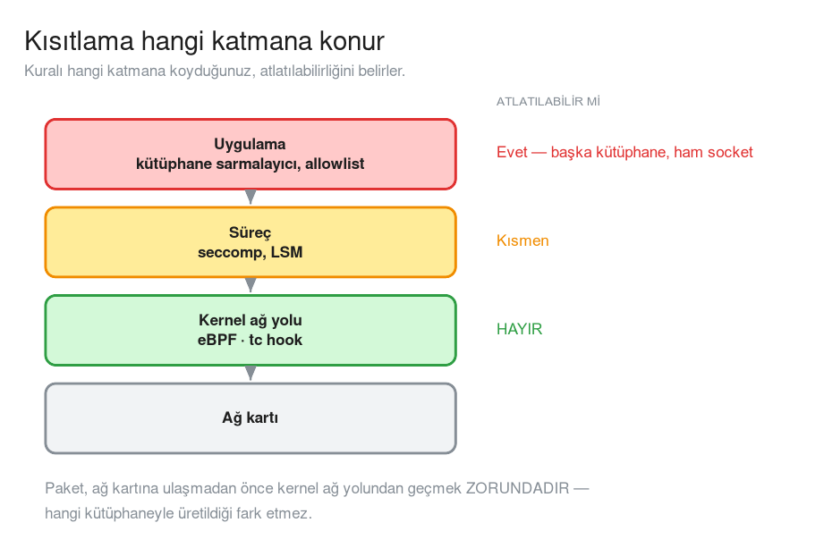
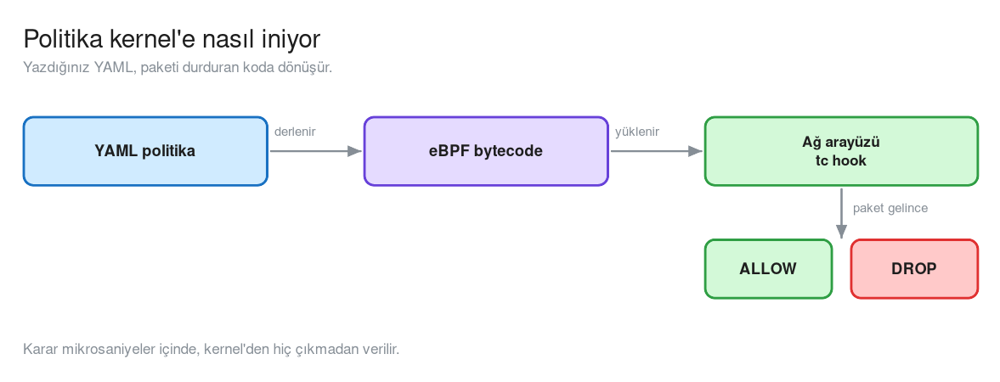
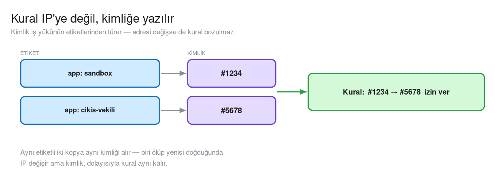
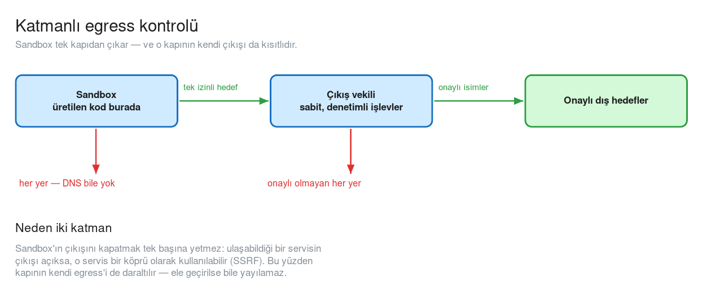
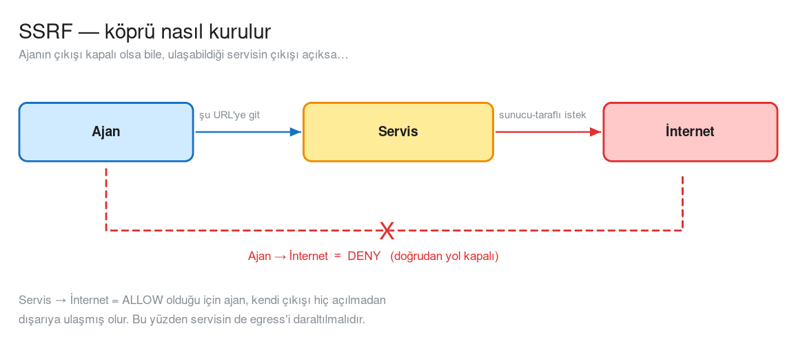
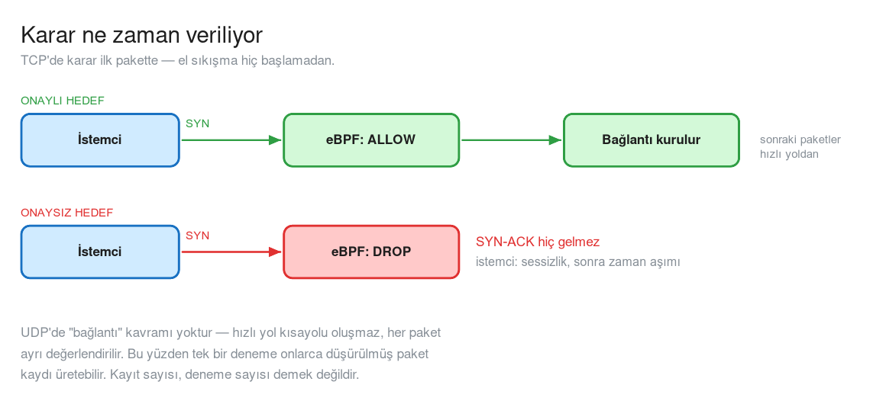
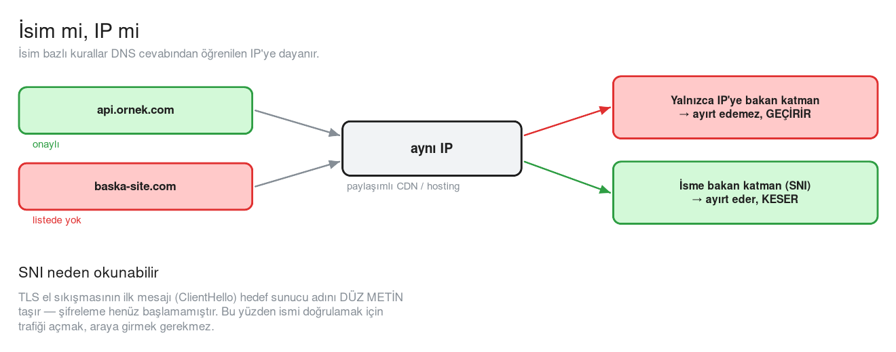
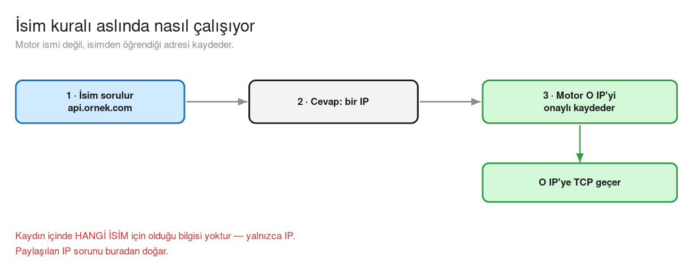

# Ajan Sandbox'larında Egress Kontrolü

> Kod çalıştırabilen bir ajana sınırsız ağ erişimi verirseniz, ürettiği **her
> kod satırı** potansiyel bir çıkış noktasıdır. Bu sayfa, çıkışın neden
> uygulamada değil **kernel'de** durdurulduğunu ve bunun nasıl kurulduğunu
> anlatıyor.

### Bu sayfadaki diyagramlar

İkisi de Excalidraw sahnesi olarak yanında duruyor; Confluence'ta
**Insert → Excalidraw → Import** ile açılıyor ve sayfada düzenlenebiliyor.

| Diyagram | Bölüm | Ne gösteriyor |
|---|---|---|
| Kısıtlama hangi katmana konur | §2 | Katman yığını ve atlatılabilirlik |
| Politika kernel'e nasıl iniyor | §3 | YAML → eBPF → ağ arayüzü |
| Kural IP'ye değil kimliğe yazılır | §4 | Etiket → kimlik → kural |
| Katmanlı egress kontrolü | §5 | Tek kapı ve kapının kendi çıkışı |
| SSRF — köprü nasıl kurulur | §5 | Açık çıkışlı servisin köprüye dönüşmesi |
| Karar ne zaman veriliyor | §6 | TCP'de ilk paket, UDP farkı |
| İsim kuralı nasıl çalışıyor | §7 | Motorun IP öğrenmesi |
| İsim mi, IP mi | §7 | Paylaşılan IP ve SNI ile isim doğrulama |

Her diyagram üç biçimde duruyor: sayfada görünen **`.png`**, baskı/ölçek için
**`.svg`**, ve Confluence'ta düzenlemek için **`.excalidraw`** kaynağı.

---

## 1 · Egress nedir, neden ajanlarda kritik

**Egress**, bir iş yükünün *dışarıya* açtığı bağlantıdır. Klasik güvenlik
çoğunlukla **ingress**e (dışarıdan içeriye) odaklanır: kim bağlanabilir,
hangi porta. Egress ise uzun süre "zaten içerideki bizim, nereye giderse
gitsin" varsayımıyla açık bırakıldı.

Kod çalıştıran ajanlar bu varsayımı geçersiz kılıyor. Çünkü sandbox'ta koşan
şey artık **sizin yazdığınız kod değil**, modelin ürettiği koddur ve o kod:

```
socket · requests · urllib · subprocess …
```

gibi her şeye uzanabilir. Prompt'la *"dışarı çıkma"* demek yetmez:

| Neden yetmez | Açıklama |
|---|---|
| **Model kandırılabilir** | Talimat, ajanın okuduğu bir **verinin** içine gömülebilir (prompt injection) |
| **Model hata yapabilir** | Niyet doğru olsa da kod yanlış hedefe bağlanabilir |
| **Kod niyetten bağımsızdır** | Çalışan şey metin değil, makine kodudur |

Buradan tek bir sonuç çıkar: **kısıtlama, modelin ulaşamayacağı bir katmanda
olmalıdır.**

---

## 2 · Kısıtlama hangi katmana konur

Bir bağlantı uygulamadan ağ kartına inerken birkaç katmandan geçer. Kuralı
hangi katmana koyduğunuz, atlatılabilirliğini belirler.



| Katman | Kod çalıştıran ajan atlatabilir mi |
|---|---|
| Uygulama | **Evet** — başka bir kütüphane, ham socket, alt süreç |
| Süreç | Kısmen |
| **Kernel ağ yolu** | **Hayır** |

Uygulama seviyesindeki bir allowlist, ancak *o kütüphaneyi kullanan* kodu
durdurur. Ajan farklı bir yol seçtiğinde kural devre dışı kalır. Kernel'deki
kural ise paketin kendisine bakar — hangi kütüphaneyle üretildiği fark etmez.

---

## 3 · eBPF ve üstündeki ürünler

**eBPF**, Linux kernel'inin içine güvenli (sandboxed) küçük programlar takmayı
sağlayan genel amaçlı bir motordur — kernel modülü yazıp kernel'i yeniden
derlemeden. Ağa ya da konteynerlere özgü değildir; sistem çağrısı izleme,
gözlemlenebilirlik, performans analizi gibi çok farklı yerlerde kullanılır.

Ağ politikası için ilgilendiğimiz nokta **`tc` hook**'udur: paket, ağ arayüzüne
ulaşmadan hemen önce buradaki eBPF programından geçer ve **ALLOW/DROP** kararı
mikrosaniyeler içinde, kernel'den hiç çıkmadan verilir.

eBPF bir **motor**dur; onun üstüne kurulan **ürünler** vardır. Ağ politikası
tarafında yaygın olanı **Cilium**'dur: politikaları YAML olarak alır, eBPF
bytecode'una derler ve iş yükünün ağ arayüzüne yükler.



Ayrım önemli: *"kimlik modeli", "isim bazlı kural", "akış gözlemi"* gibi
kavramlar **ürüne** aittir, eBPF'in kendisine değil.

---

## 4 · Kural neye yazılır: IP değil, kimlik

Konteyner ortamlarında IP adresleri kalıcı değildir — iş yükü yeniden doğar,
adresi değişir. Bu yüzden modern egress politikaları kuralı IP'ye değil
**kimliğe** yazar.

Kimlik, iş yükünün **etiketlerinden** türetilir:



İki pratik sonucu var:

* **Aynı etiketli iki kopya aynı kimliği alır** — biri ölüp yenisi doğduğunda
  kural bozulmaz.
* **Kural okunabilir kalır** — "sandbox yalnızca çıkış vekiline gidebilir"
  cümlesi, IP listesi tutmadan ifade edilir.

### YAML'da nasıl görünür

```yaml
apiVersion: cilium.io/v2
kind: CiliumNetworkPolicy
metadata:
  name: sandbox-egress
spec:
  # KİME uygulanır — etiketle seçilir
  endpointSelector:
    matchLabels:
      app: sandbox

  egress:
    # NEREYE gidebilir — yine etiketle, IP ile değil
    - toEndpoints:
        - matchLabels:
            app: cikis-vekili
      toPorts:
        - ports:
            - port: "8443"
              protocol: TCP
```

Üç parça var ve hepsi zorunlu düşünülmeli:

| Alan | Sorusu |
|---|---|
| `endpointSelector` | Bu kural **kime** uygulanıyor |
| `egress` / `ingress` | Yön |
| `toEndpoints` + `toPorts` | **Nereye** ve **hangi porttan** |

> **En kritik davranış:** bir iş yükü için `egress` bloğu yazdığınız anda o iş
> yükü **varsayılan-reddet** moduna geçer. Yani listelemediğiniz her hedef
> otomatik olarak kapanır. "İzin verilenler" listesi yazarsınız, "yasaklananlar"
> değil.

---

## 5 · Katmanlı savunma: tek kapı yetmez



> Düzenlemek için: `katmanli-egress.excalidraw` — Confluence'ta
> **Insert → Excalidraw → Import** → dosyayı seç.

İlk refleks şudur: *"sandbox'ın internetini kapatalım, tek bir onaylı kapıdan
çıksın."* Doğru ama **yarım** bir çözüm.

Neden yarım: sandbox'ın çıkışı kapalı olsa bile, **ulaşabildiği servisin
çıkışı açıksa** o servis bir köprü olarak kullanılabilir.

### SSRF — köprü nasıl kurulur

**SSRF** (Server-Side Request Forgery), bir servise *"şu adrese istek at"*
dedirtip onu kendi adınıza konuşturmaktır:



Ajanın kendi çıkışı hiç açılmadan dışarıya ulaşılmış olur.

### Sonuç: her hop kendi kuralına sahip olmalı

| Katman | Kural |
|---|---|
| **Sandbox çıkışı** | Yalnızca çıkış vekili, yalnızca tek port |
| **Vekilin çıkışı** | Yalnızca onaylı dış hedefler |
| **Vekilin girişi** | Yalnızca sandbox bağlanabilir |

Üçüncüsü sık atlanır: kuralı yalnızca çıkış tarafına yazarsanız, başka bir iş
yükü kapıya doğrudan bağlanabilir. Kapıyı **iki taraftan** tanımlamak gerekir.

### Vekilin girişi — ikinci taraf

```yaml
apiVersion: cilium.io/v2
kind: CiliumNetworkPolicy
metadata:
  name: cikis-vekili-ingress
spec:
  endpointSelector:
    matchLabels:
      app: cikis-vekili

  ingress:
    - fromEndpoints:
        - matchLabels:
            app: sandbox        # yalnızca sandbox bağlanabilir
      toPorts:
        - ports:
            - port: "8443"
              protocol: TCP
```

Bu düzenin kazandırdığı şey **patlama yarıçapının küçülmesi**dir: tek bir
bileşenin ele geçirilmesi tek başına internet erişimine dönüşmez.

---

## 6 · Karar tam olarak ne zaman veriliyor

### TCP — ilk pakette



Yani "bağlantı kuruldu, sonra kesildi" değil — bağlantı **hiç kurulmadı**.
İstemci tarafında bu, hata değil **sessizlik** olarak görünür: bekleme ve
zaman aşımı.

İlk paket geçtikten sonra kernel bir **bağlantı takip kaydı** (conntrack)
tutar; aynı akışın sonraki paketleri politikayı baştan değerlendirmeden hızlı
yoldan ilerler.

### UDP — her paket ayrı

UDP'de "bağlantı" kavramı yoktur, dolayısıyla o hızlı yol kısayolu oluşmaz.
Her paket ayrı ayrı değerlendirilir.

Pratik sonucu gözlem tarafında ortaya çıkar: **tek bir mantıksal deneme**
(örneğin bir isim çözümleme isteği), istemcinin kendi yeniden deneme mantığı
ve birden fazla sunucu kopyası yüzünden **onlarca ayrı düşürülmüş paket**
olarak görünebilir. Kayıt sayısı, deneme sayısı demek değildir.

---

## 7 · İsim bazlı kurallar ve paylaşılan IP sorunu



> Düzenlemek için: `isim-mi-ip-mi.excalidraw` — Confluence'ta
> **Insert → Excalidraw → Import** → dosyayı seç.

Politikayı IP ile yazmak dış hedefler için pratik değildir: adresler değişir,
CDN'ler onlarca adres döndürür. Bu yüzden kurallar **isimle** yazılır.

### İsim kuralı aslında nasıl çalışıyor

Motor, isim çözümlemesini izler ve dönen cevaptan öğrendiği adresi *"artık
onaylı"* diye kaydeder:



Buradaki incelik: kayıt **hangi isim için** olduğunu değil, yalnızca **hangi
IP** olduğunu tutar.

### Sorun

Şifreli bir bağlantıda, yalnızca IP'ye bakan bir katman **gerçek hedef ismi
göremez**. Dolayısıyla:

Bu teorik bir kenar durum değil: **Cloudflare, CloudFront, Azure Front Door**
gibi paylaşımlı altyapılarda yüzlerce farklı alan adı aynı kenar IP'lerini
paylaşır. Onaylı hedefinizle aynı altyapıyı kullanan herhangi bir alan adı,
ismi hiç kontrol edilmeden geçebilir.

---

## 8 · Çözüm: isme bakan bir katman (SNI)

TLS el sıkışmasının **ilk mesajı** olan `ClientHello`, bağlanılmak istenen
sunucu adını **düz metin** taşır — buna **SNI** (Server Name Indication)
denir. Şifreleme henüz başlamamıştır.

Bunun iki önemli sonucu var:

* İsmi doğrulamak için trafiği **açmak, araya girmek (MITM) gerekmez**.
  Bakılan alan zaten şifresizdir.
* Kontrol, saf paket işlemenin bir üst katmanında yapılır — paketin içeriğine
  bakılması gerektiği için karar L3/L4 yerine **L7 proxy** tarafından verilir.

### İki katman, iki farklı sonuç

Aynı istek iki farklı yerde değerlendirilebilir ve sonuçları farklı olur:

| Katman | Ne görür | Paylaşılan IP durumunda |
|---|---|---|
| **L3/L4** (saf paket) | Yalnızca hedef IP | **Geçirir** — ayırt edemez |
| **L7** (SNI okuyan) | İstenen ismi | **Keser** |

Yani isim bazlı kural tek başına yeterli değildir; **isim doğrulaması**
eklendiğinde eksiksiz hâle gelir.

### YAML'da nasıl görünür

```yaml
apiVersion: cilium.io/v2
kind: CiliumNetworkPolicy
metadata:
  name: cikis-vekili-egress
spec:
  endpointSelector:
    matchLabels:
      app: cikis-vekili

  egress:
    # 1) İsim çözümlemesine izin — FQDN kuralı BUNSUZ çalışmaz
    - toEndpoints:
        - matchLabels:
            k8s:io.kubernetes.pod.namespace: kube-system
            k8s-app: kube-dns
      toPorts:
        - ports:
            - port: "53"
              protocol: UDP
          rules:
            dns:
              - matchPattern: "*"

    # 2) Onaylı dış hedefler
    - toFQDNs:
        - matchName: "api.ornek.com"          # tam eşleşme
        - matchPattern: "*.cdn.ornek.com"     # joker
      toPorts:
        - ports:
            - port: "443"
              protocol: TCP
          serverNames:                        # ← isim doğrulaması (SNI)
            - "api.ornek.com"
            - "static.cdn.ornek.com"
```

İki kuralın **birlikte** yazılması gerekiyor: birinci blok olmadan isim
çözümlenemez, isim çözümlenmezse ikinci bloktaki FQDN kuralı hiçbir zaman
tetiklenmez.

### Yazarken dikkat edilecekler

| Konu | Ne bilmek gerekiyor |
|---|---|
| **Varsayılan reddet** | `egress` bloğu yazıldığı anda devreye girer — listelenmeyen her hedef kapanır |
| **DNS bağımlılığı** | İsim bazlı kural, DNS'e izin veren ayrı bir kural olmadan çalışmaz |
| **`matchName` / `matchPattern`** | Biri tam eşleşme, diğeri joker. Joker'i gereğinden geniş yazmak kuralı anlamsızlaştırır |
| **`serverNames` yalnızca TLS için** | Dolu olduğunda trafik L7 proxy'ye yönlenir; şifresiz portlarda anlamı yoktur |
| **Tek `egress:` anahtarı** | Aynı belgede `egress:` iki kez yazılırsa YAML kuralı gereği **ikincisi birincisini sessizce ezer**. Tüm kurallar tek anahtarın altında liste olmalı |
| **Port dizge olarak** | `port: "443"` — tırnak içinde, sayı olarak değil |
| **İki taraf** | Çıkış kuralı yazmak yetmez; hedefin giriş kuralı da tanımlanmalı |

---

## 9 · Gözlemlenebilirlik: görünürlük ≠ uygulama

eBPF tabanlı ağ katmanları genellikle bir **akış gözlem** arayüzü sunar: her
paket kararı bir kayıt olarak akar, "hangi iş yükü nereye gitmeye çalıştı,
izin verildi mi" görülebilir.

Burada operasyonda sık karşılaşılan bir yanılgı var:

> **Akış kayıtları "best-effort"tur.** Genellikle sabit boyutlu bir halka
> tamponda tutulurlar. Sistem uzun süre çalışınca tampon dolar ve seyrek ama
> gerçek kayıtlar, yoğun gürültü altında eskilerin üzerine yazılarak kaybolur.

Yani **"gözlem ekranında bir şey görünmüyor"**, *"engelleme çalışmıyor"*
demek değildir. İkisi ayrı şeydir:

| | Ne söyler | Güvenilirliği |
|---|---|---|
| **Akış kaydı** | Hangi bağlantı denendi, ne oldu | Best-effort — kaybolabilir |
| **Kümülatif sayaç** | Kaç paket politika gereği düşürüldü | Kalıcı, kaybolmaz |

Uzun süre çalışan sistemlerde uygulamanın gerçekten çalıştığını doğrulamak
için **sayaç** ölçülür; akış kaydı ise teşhis ve inceleme içindir.

---

## 10 · Bu yaklaşımın sınırları

Egress politikası güçlüdür ama her şeyi çözmez. Dürüst sınırlar:

| Sınır | Açıklama |
|---|---|
| **İçerik kontrol edilmez** | Politika *nereye* gidildiğini kontrol eder, **ne taşındığını** değil. Onaylı bir hedefe onaylı bir kanaldan hassas veri gönderilmesini ağ katmanı engelleyemez |
| **İsim çözümleme kanalı** | İsim çözümleme açık bırakıldığında, sorguların kendisi üzerinden veri taşımak (tünelleme) teorik olarak mümkündür |
| **Aynı iş yükü içi trafik** | Aynı ağ ad alanını paylaşan bileşenler birbirine loopback üzerinden ulaşır; bu trafik ağ arayüzünden geçmediği için eBPF hook'una hiç uğramaz — ne görülür ne engellenir |
| **Uygulama seviyesi yetki** | "Hangi işlevin çağrılabileceği" ağ katmanının sorusu değildir; o, kapının kendi içinde çözülür |

Bu sınırlar zayıflık değil **kapsam tanımı**dır: egress politikası bir katmandır,
tek başına bir güvenlik mimarisi değil.

---

## 11 · Özet

| Soru | Cevap |
|---|---|
| **Neden gerekli?** | Kod çalıştıran ajanda üretilen her satır bir çıkış noktasıdır |
| **Neden kernel'de?** | Uygulama seviyesindeki kural, kod yazabilen bir ajan tarafından atlatılabilir |
| **Kural neye yazılır?** | IP'ye değil, etiketten türeyen **kimliğe** |
| **Tek kapı yeter mi?** | Hayır — kapının kendi çıkışı da kısıtlanmalı (SSRF köprüsü) |
| **Karar ne zaman?** | TCP'de ilk pakette; bağlantı hiç kurulmaz |
| **İsim kuralı yeter mi?** | Hayır — paylaşılan IP'lerde **isim doğrulaması** (SNI) gerekir |
| **Nasıl doğrulanır?** | Akış kaydı best-effort; kesin doğrulama **sayaçtan** |
| **Neyi çözmez?** | Taşınan içeriği, uygulama seviyesi yetkiyi, iş yükü içi trafiği |
