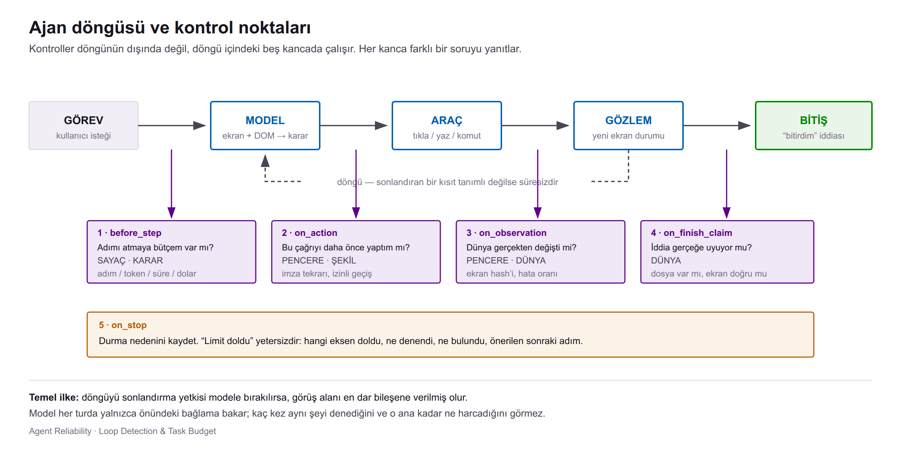
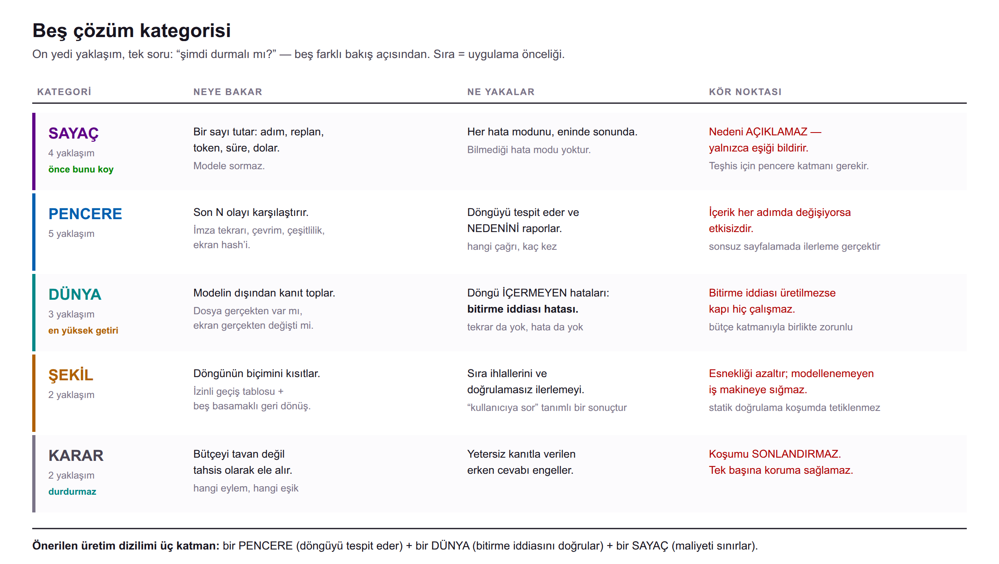

# Agent Reliability — Loop Detection ve Task Budget Kontrolleri

> **Konu:** Otonom ajanların sonlanmama problemi; nedenleri, tespit yöntemleri, yöntemlerin
> sınırları ve uygulama önerileri.
> **Hedef okuyucu:** Ajan veya ajan benzeri otomasyon geliştiren ekipler.

---

## 1. Özet

Bir dil modeli tek başına sonlanır: girdi alır, cevap üretir, biter. **Ajan = model + döngü.**
Ajanın yeteneği bu döngüden gelir; modelde bulunmayan bir soru da buradan doğar:
**döngüyü kim sonlandıracak?**

Yetkinin modele bırakılması yaygın ancak hatalı bir tercihtir. Sebep modelin yetersizliği
değil **görüş alanıdır**: model her turda yalnızca önündeki bağlama bakarak bir sonraki adımı
seçer; kaç kez aynı şeyi denediğini ve o ana kadar ne harcadığını görmez.

İki tamamlayıcı kontrol ailesi tanımlanır:

| | Sorduğu soru | Müdahale ölçütü |
|---|---|---|
| **Loop detection** | Sistem ilerliyor mu, yoksa aynı işi mi tekrarlıyor? | Tekrar deseni, durum değişmezliği |
| **Task budget** | Bu koşuma ne kadar kaynak ayrıldı, ne kadarı harcandı? | Adım, replan, token, süre, maliyet |

İkisi birbirinin yerine geçmez. Bütçe her hata modunu eninde sonunda keser ancak nedenini
açıklamaz; döngü tespiti nedeni raporlar ancak ilerlemenin gerçek olduğu senaryolarda
etkisizdir.

**Sonuç:** tek katmanlı koruma yeterli değildir. Katmanlar birbirinin kör noktasını kapatacak
biçimde seçilmelidir.

---

## 2. Problem tanımı

Otonom bir sistemin `karar ver → araç çağır → gözlemle → gözden geçir → tekrarla`
döngüsünü sürdürmesi, ancak bir sonuca ulaşmaması.

Belirleyici özellik: ajan **çökmez**. İstisna fırlatmaz, hata log'u üretmez, alarm
tetiklemez. Sağlıklı görünür; yalnızca ilerlemez. Bu nedenle durum tabanlı klasik izleme
problemi göremez.

### Gözlemlenen desenler

| Desen | Görünüm |
|---|---|
| Sonsuz tekrar | Aynı araç, aynı argüman; sonuç değişmiyor |
| Bitmeyen arama | Her turda "bir kaynak daha" |
| Özeleştiri sarmalı | Üretilen cevabın sürekli yeniden değerlendirilmesi |
| Araç ping-pong'u | A → B → A → B; hiçbiri sonuç üretmiyor |
| Plan çalkantısı | Her adımda planın baştan yazılması |

Ortak nokta: sistem sürekli hareket hâlindedir ancak durum ilerlemez.
**Hareket, ilerleme anlamına gelmez.**

---

## 3. Kök nedenler

Döngülerin çoğu model kalitesinden değil, **eksik kısıtlardan ve hatalı teşviklerden**
kaynaklanır.

| # | Neden | Açıklama |
|---|---|---|
| 1 | **Tanımlı bir "bitti" kriterinin olmaması** | İnsanlarda içsel bir yeterlilik algısı vardır; ajanda yoktur. *"Kapsamlı ol, doğrula, hiçbir şeyi kaçırma"* biçiminde bir yönerge, sınırsız arama talimatıdır. Ajan yönergeye uymaktadır. |
| 2 | **Güvenilmez araç + naif retry** | Araç tutarsız davrandığında (zaman aşımı, hız sınırı, kısmi yanıt) ajan bunu "tekrar dene, biraz farklı" olarak yorumlar. Üst sınır tanımlı değilse deneme sayısı sınırsızdır. |
| 3 | **Belirsiz hedef** | Başarı kriteri tanımsızsa ajan yorumlar arasında salınır. Hedef belirsizliği döngü baskısı üretir. |
| 4 | **Bağlamın kademeli bozulması** | Her adım bağlama yeni token ekler: loglar, kısmi planlar, araç çıktıları. Sonraki kararlar giderek daha gürültülü bir geçmiş üzerinden verilir. |
| 5 | **Hata yapmama yönünde optimizasyon** | Aşırı tedbiri teşvik eden bir yönergede en düşük riskli eylem "bir kontrol daha yapmak" olur. |

**Not:** 5. nedenin kaynağı kod değil yönergedir. Bu dokümanda anlatılan mekanizmaların
hiçbiri onu çözmez; 1–4 kod tarafında ele alınabilir, 5 yalnızca yönerge tasarımıyla.

### Kavramsal model

Ajan bir arama algoritması olarak düşünülebilir. Şu üç bileşenden yoksun bir arama
sonlanmaz: **durma koşulu · bütçe · ilerleme ölçütü**.

Bu çerçevede döngü bir davranış bozukluğu değil, **eksik kısıt**tır. Buradan çözümün biçimi
de çıkar: amaç ajana durmasını *söylemek* değil, sisteme durması için **mekanik nedenler**
tanımlamaktır. Yönergeye eklenen bir uyarı cümlesi kontrol sayılmaz.

---

## 4. Problemin ölçeği

| Kaynak | Bulgu | Değer |
|---|---|---|
| MAST — 1642 yürütme izi, 7 framework | Adım tekrarı (en sık hata modu) + durma koşulunu tanımama | **%28,1** |
| Token Budgets — 21 framework, 2023–2026 | Doğrulanmış üretim olayı | **63** |
| Yaygın referans computer-use döngüsü | `while True`; tur sayacı, döngü tespiti veya bütçe içermiyor | **0 kontrol** |
| 31 üretim harness'ı, kaynak kodu incelemesi | Mekanizma mevcut ancak varsayılanda kapalı | **12/24** |
| Aynı inceleme | Ardışık olmayan çevrimi (A-B-A-B) tespit edebilen | **2/22** |

Vaka kataloğunun sonucu: incelenen bütçe aşımlarının hiçbiri kullanıcı maliyeti oluşmadan
önce engellenmemiştir. Düzeltmeler hızlı gelmekte, ancak **olay gerçekleştikten sonra**.

### Değerlendirme kriteri

Bir framework için doğru soru *"loop detection var mı"* değildir; olgun sistemlerin
neredeyse tamamında bir mekanizma bulunur. Belirleyici olan iki soru:

1. **Varsayılanda etkin mi?**
2. **Doğru katmanda mı tetikleniyor?**

Gözlemlenen tipik uyumsuzluklar:

- Dokümantasyonda belirtilen varsayılan ile koddaki gerçek varsayılanın farklı olması
  (belgede sonlu bir değer, kodda pratikte sınırsız bir sabit).
- İterasyon sınırının varsayılan olarak tanımsız bırakılması.
- Token sınırlayıcının mevcut olması ancak döngü iterasyonu başına değil yalnızca istek
  başına tetiklenmesi — **sınır mevcut, yanlış katmanda**.

---

## 5. Kontrollerin döngüdeki yeri



Kontroller döngünün dışında değil, döngü içindeki beş kancada çalışır. Her kanca farklı bir
soruyu yanıtlar:

| Kanca | Soru | İlgili kategoriler |
|---|---|---|
| `before_step` | Adımı atmaya bütçe var mı? | SAYAÇ · KARAR |
| `on_action` | Bu çağrı daha önce yapıldı mı? | PENCERE · ŞEKİL |
| `on_observation` | Ortam gerçekten değişti mi? | PENCERE · DÜNYA |
| `on_finish_claim` | İddia gerçekle uyumlu mu? | DÜNYA |
| `on_stop` | Koşum neden sonlandı? | tümü |

`on_stop` sıklıkla atlanır ancak teşhis değeri en yüksek olan kancadır. *"Limit doldu"*
bilgisi yetersizdir; kaydedilmesi gereken dört alan: **hangi eksen doldu, ne denendi,
ne bulundu, önerilen sonraki adım.**

---

## 6. Kontrol kategorileri



İncelenen yaklaşımlar aynı soruyu yanıtlar — *"şimdi durmalı mı?"* — ancak beş farklı bakış
açısından. Sıralama uygulama önceliğini yansıtır.

### SAYAÇ — sayaç tut, eşiği aşınca sonlandır

Adım, replan, token, süre ve maliyet eksenlerinde sayaç tutar; modele danışmaz.
En düşük maliyetli ve en düşük yanlış pozitif riskli katmandır.

Kategori içinde dört ayrı davranış bulunur:

| Yaklaşım | Limit dolduğunda |
|---|---|
| Sert durdurma | Koşum kesilir, ek tur verilmez |
| Zarif bozulma | Sınırlı sayıda ek tur verilir, **araç seçimi kilitlenir**; ajan yalnızca cevap üretebilir |
| Tavsiye | Yönergeye geri sayım eklenir, zorlama uygulanmaz |
| Maliyet tavanı | Toplam bütçenin bir kısmı nihai cevap üretimi için ayrılır |

Bu ayrım pratikte anlamlıdır: sert durdurma uygulayan bir yapılandırma bütçe tükendiğinde
cevapsız sonlanırken, zarif bozulma uygulayan yapılandırma aynı bütçeyle bir cevap
üretebilir. **Aynı kategori içinde bile "durmak" tek bir davranış değildir.**

**Sınır:** durma nedenini açıklamaz, yalnızca eşiğin aşıldığını bildirir. Teşhis için
pencere tabanlı bir katman gerekir.

### PENCERE — son N olayı karşılaştır

İmza tekrarı, ardışık olmayan çevrim taraması, eylem çeşitliliği ve ortam durumu
karşılaştırması kullanır. Döngüyü tespit eder **ve nedenini raporlar**: hangi çağrı, kaç kez.

**Sınır:** içerik her adımda değişiyorsa etkisizdir. Sonsuz sayfalama gibi senaryolarda ajan
gerçekten ilerleme kaydeder; bu katman bir anomali göremez. Böyle durumlarda tek etkili
kontrol bütçedir.

### DÜNYA — modelin dışından kanıt topla

Dosya gerçekten oluşmuş mu, ortam durumu gerçekten değişmiş mi, araç hangi oranda hata
veriyor. **Döngü içermeyen hata sınıfını** yakalayan tek kategoridir ve getirisi en yüksek
katmandır.

**Sınır:** ajan bitirme iddiası üretmezse doğrulama kapısı hiç çalışmaz. Bütçe katmanıyla
birlikte kullanılması zorunludur.

### ŞEKİL — döngünün biçimini kısıtla

İzinli geçiş tablosu ve kademeli geri dönüş merdiveni tanımlar. Merdivenin son basamağı
**kullanıcıya soru yöneltmektir**; bu bir hata değil, tanımlı bir sonuç türüdür.

**Sınır:** esnekliği azaltır. Önceden modellenemeyen işler durum makinesine sığmaz.
Yalnızca statik doğrulama yapan varyantlar çalışma zamanında hiç tetiklenmez.

### KARAR — bütçeyi tavan değil tahsis olarak ele al

Eylemleri birim bütçe başına beklenen faydaya göre sıralar; yetersiz kanıtla verilen erken
cevabı engeller. Alternatif varyant hiç müdahale etmez, koşum sonunda başarılı koşum
dağılımından eşik önerir.

**Sınır:** her iki varyant da koşumu sonlandırmaz. Tek başlarına koruma sağlamazlar.

---

## 7. Harness kaynaklı döngüler

Döngülerin bir kısmı model davranışından değil, **çalıştırma katmanındaki bir hatadan**
kaynaklanır. En yaygın örnek koordinat uzayı uyumsuzluğudur.

Görsel ajanlarda ekran görüntüsü token maliyeti nedeniyle küçültülerek modele iletilir.
Model, küçültülmüş görüntünün piksel uzayında koordinat üretir. Bu koordinat gerçek ekrana
uygulanmadan önce ölçek çarpanıyla dönüştürülmelidir:

```
modele iletilen görüntü : 1280 x 720
gerçek ekran            : 1920 x 1080
ölçek çarpanı           : 1.5
```

Dönüşüm uygulanmazsa her etkileşim hedefin `1/1.5` katına, yani boş alana düşer. Ortam
değişmez, hata dönmez, ajan tekrar dener. **Model doğru davranmasına rağmen döngü oluşur.**

Aynı hata sınıfının diğer örnekleri:

- Bir sistem çağrısının bulunmadığı ortamda istisnanın yutulup boş değer döndürülmesi;
  ilgili kontrol çalışmadığı hâlde hata üretmez.
- Sayaçların yanlış noktada artırılması; engellenen eylemlerin gerçekleşmiş sayılması.
- Boş araç çıktısının gösterim amaçlı bir yer tutucuya dönüştürülmesi ve bu yer tutucunun
  aşağı akıştaki doğrulama tarafından gerçek kanıt olarak yorumlanması.

### Bu sınıfın teşhis açısından önemi

Böyle bir koşumda döngü tespit katmanlarının tamamı tetiklenir ve hepsi **doğru** rapor
verir: *"aynı çağrı tekrarlanıyor"*. Ancak hiçbiri kök nedene ulaşamaz.

> **Döngü tespiti bir teşhis aracı değil, bir frendir.**
> Kök neden yalnızca araç katmanının kendi telemetrisinden okunabilir.

Ortak risk: kontrol çalışmıyordur ancak **rapor çalıştığını bildirir**. Bu durum, kontrolün
hiç bulunmamasından daha risklidir.

---

## 8. Yanlış pozitif riski

Yalnızca yakalanan vakaları gösteren bir değerlendirme, tespit mekanizmasının yanlış pozitif
oranı hakkında bilgi vermez. Her yakalama senaryosunun karşısında bir **kontrol senaryosu**
bulunmalı ve beklenen sonuç, kontrolsüz koşumla birebir aynı olmalıdır.

Sık karşılaşılan yanlış pozitif kaynakları:

| Kaynak | Mekanizma |
|---|---|
| Şema ayıklanmadan uygulanan desen | URL içindeki yol parçasının dosya adı olarak yorumlanması |
| Bağlamsız fiil taraması | Görev metnindeki bir fiilin yanlış araç gereksinimi çıkarması |
| Kaynaktan kopyalanan eşikler | Farklı bir iş yükü için kalibre edilmiş eşiklerin meşru koşumları kesmesi |
| Ardışık sayaç sıfırlanması | A-B-A-B deseninde tekrarın hiç sayılmaması (yanlış negatif ikizi) |

**Uygulama önerisi:** doğal dilden çıkarım yapan her kural için en az bir yanlış pozitif
testi yazın. Eşikleri başka bir sistemin dokümantasyonundan almayın; kendi izlerinizden ölçün.

---

## 9. Karşılaştırma sonuçlarının yorumlanması

Bir karşılaştırmada tetiklenmemiş bir kontrolün "etkisiz" sayılması hatalıdır.
Tetiklenmeme dört farklı duruma karşılık gelir:

| Görünen | Gerçek durum |
|---|---|
| Tetiklenmedi | **Eşiğe ulaşılmadı** — koşum daha önce sonlandı |
| Tetiklenmedi | **Yeterli veri yok** — karar için gereken minimum gözlem toplanmadı |
| Tetiklenmedi | **Kör nokta** — bu hata modunu yapısal olarak göremez |
| Tetiklenmedi | **Tasarım gereği durdurmaz** — yalnızca ölçüm yapan katman |

Bu dört durum ayırt edilmeden hazırlanan bir karşılaştırma tablosu yanıltıcıdır.

Ayrıca kontroller üst üste bindirildiğinde **ilk tetiklenen sonucu belirler** ve koşum orada
sonlanır. Tüm katmanların aynı anda etkinleştirilmesi bir karşılaştırma yöntemi değildir;
en düşük eşikli kontrol diğerlerinin tetiklenmesine izin vermez.

---

## 10. Uygulama kontrol listesi

**Temel seviye**

- [ ] Adım, token ve süre tavanı tanımlayın. Varsayılanı tanımsız bırakmayın.
- [ ] Bütçe tükenmesini ayrı bir terminal durum olarak raporlayın; `OK` içine gizlemeyin.
- [ ] Her koşuma durma nedeni alanı (`terminated_by`) ekleyin.
- [ ] İterasyon başına span yazın. Tek span'lık iz, hangi adımların tekrarlandığını göstermez.

**İleri seviye**

- [ ] Tekrarı ardışık değil, pencere içinde sayın; ardışık sayaç A-B-A-B deseninde sıfırlanır.
- [ ] İmzaya sonucu da dâhil edin; aynı çağrı + aynı sonuç daha güçlü bir sinyaldir.
- [ ] Bitirme iddiasını ortam durumuna karşı doğrulayın. Doğrulayıcı göreve özel olmalıdır.
- [ ] Kademeli müdahale uygulayın: önce yönlendirme, ısrar hâlinde sonlandırma.
- [ ] Araç katmanına kendi telemetrisini ekleyin; kök neden yalnızca orada görünür.

**Kaçınılması gerekenler**

- Yönergeye eklenen uyarı cümlesini kontrol olarak saymak.
- Eşikleri başka bir sistemin dokümantasyonundan kopyalamak.
- Tüm katmanları aynı anda etkinleştirip karşılaştırma yaptığını varsaymak.
- Yalnızca yakalanan vakaları raporlayıp yanlış pozitif oranını ölçmemek.

---

## 11. Entegrasyon gereksinimleri

1. **İterasyon başına span.** Alanlar: iterasyon indeksi, araç adı, argüman özeti, sonuç
   özeti, ortam durumu özeti, süre, token, kontrol kararı.
2. **Durma nedeni alanı** her koşumda zorunlu.
3. **Eşikler yapılandırmadan okunmalı**, kodda sabit olmamalı ve sürümlenmelidir.
4. **Bütçe tükenmesi ayrı terminal durum** olarak modellenmelidir.
5. **Eşik kalibrasyonu ölçüme dayanmalıdır**; başarılı koşum dağılımından türetilir.

**Önerilen sıra:** tüm katmanların aynı anda devreye alınması gerekmez. İlk adım SAYAÇ
katmanıdır — en düşük maliyet, en düşük yanlış pozitif riski, doğrudan maliyet koruması.
İz verisi biriktikçe eşikler kalibre edilir; PENCERE ve DÜNYA katmanları sonraki aşamada
eklenir.

---

## 12. Sözlük

| Terim | Tanım |
|---|---|
| **Guardrail** | Ajanın kendisini koruyan kontrol: döngü, bütçe, tekrar |
| **Kanca (hook)** | Döngü içinde kontrolün karar verdiği nokta |
| **İmza** | Bir araç çağrısının kimliği: araç adı + argümanlar (+ opsiyonel sonuç) |
| **Çevrim (cycle)** | Ardışık olmayan tekrar deseni: A → B → A → B |
| **Terminal durum** | Koşumun sonlanma biçimi: `OK`, `STUCK`, bütçe tükenmesi vb. |
| **Karşı olgusal** | Gerçekten koşturulmamış, "müdahale etseydi" varsayımına dayanan sonuç |
| **Yanlış pozitif** | Meşru bir koşumun hatalı olarak sonlandırılması |
| **Taban çizgisi** | Hiçbir kontrol etkin değilken yapılan koşum; karşılaştırma referansı |
| **set-of-marks** | Ekran öğelerinin numaralandırılarak modele koordinat yerine numara ürettirme yöntemi |

---

## 13. Kaynaklar

| Doküman | İçerik |
|---|---|
| `sources_list/01_METODOLOJI.md` | Birincil kaynakların metodoloji sınıflandırması ve kanıt gücü sıralaması |
| `sources_list/harness_kontrolleri.md`<br>`sources_list/harness_kontrolleri_2.md` | 31 üretim harness'ının kaynak kodu düzeyinde kontrol mekanizması incelemesi |
| `sources_list/tespit_sinirlari.md` | Tespit yöntemlerinin kör noktaları |
| `cua_lab/docs/zihniyetler.md` | Yaklaşımların ayrıntılı karşılaştırması |
| `cua_lab/docs/computer_use_zihniyet.md` | Computer-use mimarileri: eylem uzayı, ekran temsili, döngü topolojisi |
| `Agent_Reliability_2_Sayfa.pdf` | Özet referans |

**Diyagramlar:** `gorseller/*.svg` (düzenlenebilir kaynak), `gorseller/*.png` (sayfa eki).
