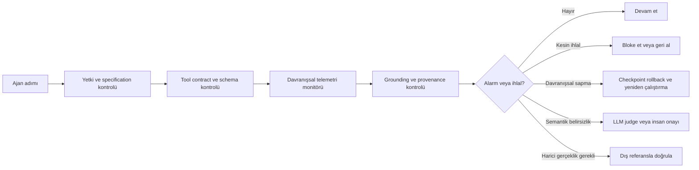

Bu sorunu tek bir eksende değil, **üç ayrı boyutta** sınıflandırmak en doğru yaklaşım olur:

1. **Ne zaman müdahale ediyor?**  
   Eylemden önce mi, eylem sırasında mı, hata oluştuktan sonra mı?

2. **Neye bakıyor?**  
   Ajanın davranışına mı, ürettiği içeriğe mi, araç sonuçlarına mı, modelin iç durumuna mı?

3. **Nasıl karar veriyor?**  
   Sabit kurallarla mı, istatistiksel anomaliyle mi, denetimli öğrenmeyle mi, ikinci bir LLM’le mi?

Bu eksenler üzerinden bugünkü çözümleri şöyle sınıflandırırım.

---

# Genel sınıflandırma

| Aile | Temel soru | Tipik müdahale zamanı | Güçlü olduğu alan |
|---|---|---|---|
| 1. Önleyici kısıtlar ve politika/specification | “Ajan bunu yapabilir mi?” | Eylemden önce | Yetkisiz veya tehlikeli eylemleri engelleme |
| 2. Deterministik çalışma zamanı doğrulaması | “Bu sonuç biçimsel olarak ve hesap açısından doğru mu?” | Her adımda veya çıktı anında | Eksik çağrı, yanlış toplam, geçersiz araç sonucu |
| 3. Davranışsal anomali izleme | “Ajan normal davranışından sapıyor mu?” | Bölüm sırasında | Döngü, tool cascade, ani hedef sapması |
| 4. İçerik ve grounding doğrulaması | “Ajanın söylediği şey gerçekten aldığı kanıta dayanıyor mu?” | Sonuç üretildiğinde veya her adımda | Halüsinasyon, yanlış sayı, bozuk retrieval içeriği |
| 5. Denetimli trajectory-risk modelleri | “Bu prefix sonunda başarısız olma ihtimali ne?” | Bölüm sırasında | Etiketli hata türlerinde erken uyarı |
| 6. LLM-as-a-judge / eleştirmen | “Bu adım veya plan mantıklı ve güvenli mi?” | Her adımda veya şüpheli adımda | Karmaşık, semantik ve bağlama duyarlı hatalar |
| 7. İç durum/activation tabanlı izleme | “Modelin iç temsilleri yaklaşan hatayı gösteriyor mu?” | Çok erken, bazen ilk adımlarda | Gözlemlenebilir davranışa yansımadan önce risk tahmini |
| 8. Hata lokalizasyonu ve nedensel teşhis | “Sistemde hatayı hangi ajan, araç veya adım üretti?” | Hata sonrası veya alarmdan sonra | Müdahaleyi doğru bileşene yönlendirme |
| 9. Yeniden çalıştırma, rollback ve otonom onarım | “Hata oluştuysa nasıl kurtarılır?” | Hata veya alarm sonrası | Goal drift ve geçici karar hatalarını düzeltme |
| 10. Sistemsel izolasyon ve dayanıklılık | “Bir hata diğer ajanlara veya verilere yayılmasın” | Mimari seviyede | Hata yayılımı, yetki kötüye kullanımı ve zincirleme çöküş |

Bu aileler birbirinin alternatifi olmaktan çok, genellikle aynı sistemde üst üste kullanılır.

---

# 1. Önleyici kısıtlar ve specification tabanlı çözümler

Bu yaklaşım başarısızlığı olduktan sonra bulmaya çalışmaz. Daha baştan ajanın eylem alanını sınırlar.

## Nasıl çalışır?

Sisteme açık kurallar veya güvenlik politikaları verilir:

- Hangi araçlar çağrılabilir?
- Hangi parametre aralıkları geçerlidir?
- Hangi sırada hangi araçlar kullanılmalıdır?
- İnsan onayı olmadan hangi eylemler yapılamaz?
- Ajan hangi kaynaklara erişebilir?
- Hangi çıktılar dışarı gönderilemez?

Örneğin bir ajan:

- para transferi yapmadan önce onay istemek,
- üretim veritabanına yazmadan önce salt-okunur kontrol yapmak,
- kullanıcıdan gelen içeriği sistem talimatı olarak kabul etmemek,
- belirli dosya dizinlerinin dışına çıkamamak

üzere sınırlandırılabilir.

[AgentSpec](https://www.alphaxiv.org/abs/2503.18666), bu tür özelleştirilebilir çalışma zamanı kısıtlamalarına örnek olarak düşünülebilir.

## Güçlü tarafı

Bu yaklaşım, bazı hataları yalnızca tespit etmekle kalmaz, **oluşmasını doğrudan engeller**. Özellikle:

- yetki ihlalleri,
- tehlikeli araç çağrıları,
- yanlış parametre kullanımı,
- güvenlik politikası ihlalleri

için etkilidir.

## Sınırı

Specification yaklaşımı şu soruya bağımlıdır:

> “Güvensiz veya yanlış davranışı önceden açıkça tarif edebiliyor muyuz?”

Ancak her başarısızlık önceden kuralla yazılamaz. Örneğin:

- ajan yavaşça hedefinden sapabilir,
- doğru görünümlü fakat yanlış bir belge seçebilir,
- araçtan gelen bozuk içeriği normal biçimde işleyebilir,
- matematiksel olarak tutarlı fakat dış dünyada yanlış bir iddia üretebilir.

Dolayısıyla specification, **tanımlanabilir ihlaller** için güçlü; açıkça formüle edilemeyen kalite sorunları için zayıftır.

---

# 2. Deterministik doğrulama ve runtime guard’lar

Bunlar istatistiksel bir “normal davranış” modeli öğrenmek yerine, çıktının belirli bir koşulu sağlayıp sağlamadığını kontrol eder.

## Örnek doğrulamalar

- Gerekli tüm araç çağrıları yapıldı mı?
- Ajanın verdiği toplam, araç sonuçlarından yeniden hesaplanabiliyor mu?
- Üretilen JSON beklenen şemaya uyuyor mu?
- Araç sonucu, o aracın döndürebileceği biçimlerden biri mi?
- İddia edilen sayı gerçekten ajan tarafından alınan bir sonuçtan türetilmiş mi?
- Son adım boş mu veya yalnızca çıplak bir araç çağrısından mı oluşuyor?

Bu sınıfın avantajı, “ajan normalde nasıl davranır?” sorusuna ihtiyaç duymamasıdır. Bunun yerine:

> “Bu çıktı, sistemin bildiği kesin bir kuralı sağlıyor mu?”

diye sorar.

Makaledeki `total_consistency`, `required_coverage` ve `tool_contract` kontrolleri bu sınıfa giriyor. Aynı bölümler üzerinde bu kontroller %60 hata yakalarken yanlış pozitif üretmiyor; coverage kontrolü eklenince yakalama oranı %96’ya çıkıyor. [Deterministic Checks](https://www.alphaxiv.org/abs/2608.02464?page=11)

## En güçlü oldukları hatalar

- Aritmetik hata,
- eksik araç çağrısı,
- geçersiz veri biçimi,
- araç sözleşmesi ihlali,
- cevapta temellendirilmemiş sayısal iddia,
- sessiz tamamlanmama.

## Temel sınır

Deterministik doğrulama, yalnızca yazılabilir bir doğruluk koşulu varsa çalışır.

Örneğin:

- “Toplam, alınan kalemlerin toplamına eşit mi?” kontrol edilebilir.
- “Bu haber metni dünyadaki gerçek durumu yansıtıyor mu?” ancak dış referans varsa kontrol edilebilir.
- “Bu stratejik karar iyi mi?” genellikle basit bir kural değildir.

Bu yüzden deterministik kontroller, genel amaçlı bir zeka değil; **kesin olarak doğrulanabilen alt problemler için güvenilir bir tabaka**dır.

---

# 3. Davranışsal ve istatistiksel anomali izleme

Bu yaklaşım, ajanın içeriğinin doğru olup olmadığını doğrudan anlamaya çalışmaz. Ajanın zaman içindeki davranışının normal akıştan sapıp sapmadığına bakar.

## Kullanılan sinyaller

- Aksiyon dizisi,
- araç çağrısı örüntüsü,
- tekrarlar,
- gecikme,
- çıktı uzunluğu,
- hata oranı,
- yeniden deneme sayısı,
- görev hedefine benzerlik,
- adımlar arası semantik değişim,
- token belirsizliği,
- araç sonuçlarıyla ajan çıktısı arasındaki fark.

Bu ailede genellikle sağlıklı bölümlerden bir null dağılımı öğrenilir. Daha sonra yeni bir bölümün telemetrisi bu dağılım altında ne kadar şaşırtıcı diye ölçülür.

Makaledeki ESN + CUSUM monitörü bunun örneğidir. ESN geçmiş adımları kullanarak bir sonraki telemetriyi tahmin eder; tahmin hatası kalıcı biçimde büyüdüğünde CUSUM alarm üretir. [Monitor Design](https://www.alphaxiv.org/abs/2608.02464?page=3)

## Yakalanabildiği hatalar

- Looping,
- tool cascade,
- ani goal drift,
- olağandışı retry örüntüleri,
- beklenmedik araç kullanım biçimleri,
- davranışsal olarak görülebilen bağlam bozulmaları.

Gerçek corpus’larda looping için tespit oranı 0,48–1,00, tool cascade için 0,17–1,00 ve goal drift için 0,66–0,86 arasında değişiyor. [Real-World Coverage](https://www.alphaxiv.org/abs/2608.02464?page=5)

## Güçlü tarafı

- İkinci bir LLM çağrısı gerektirmez.
- Çok düşük gecikmeyle çalışabilir.
- Hata türlerini önceden tek tek kurallarla tanımlamadan anomali yakalayabilir.
- Özellikle uzun süren davranış bozulmalarında etkilidir.

## Sınırları

Bu sistemler “normal” davranışı bilmeden çalışamaz. Sağlıklı dağılım:

- modele,
- sıcaklığa,
- görev tipine,
- araç setine,
- framework’e,
- gecikme rejimine

bağlıdır.

Qwen 2.5 7B’de kalibre edilen monitör Llama 3.1 8B’ye doğrudan aktarıldığında AUROC 0,527’ye düşerken, hedef model üzerinde yeniden kalibrasyonla 0,885’e ulaşıyor. [Calibration Transfer](https://www.alphaxiv.org/abs/2608.02464?page=12)

En kritik kör nokta ise şudur:

> Ajanın davranışı normal kalırken aldığı içerik bozuluyorsa, davranış monitörü bunu göremeyebilir.

---

# 4. İçerik, provenance ve grounding tabanlı doğrulama

Bu aile, ajanın ne yaptığı kadar **iddiasının nereden geldiğini** inceler.

Temel soru:

> Ajanın söylediği şey, gerçekten gördüğü araç sonuçlarından türetilmiş mi?

## Örnekler

- Üretilen sayı bir araç çıktısında mevcut mu?
- Ajan, aldığı belgeden desteklenmeyen bir sonuç mu çıkardı?
- Retrieval sonucu sorguyla ilişkili mi?
- JSON gerçekten geçerli mi?
- Araçtan gelen içerik beklenmedik biçimde bozulmuş mu?
- Ajanın belirttiği toplam, aldığı verilerden hesaplanabiliyor mu?

Bu yaklaşım klasik “halüsinasyon tespiti”nden biraz farklıdır. Genel olarak modelin dünyaya ilişkin her iddiasını doğrulamaya çalışmak yerine, daha dar ve denetlenebilir bir garanti verir:

> “Bu ajan çıktısının kaynağı, ajan çalışırken gerçekten erişilen kanıt mı?”

## Güçlü tarafı

- Uydurma sayıların tespitinde etkili olabilir.
- Kaynak gösterme veya izlenebilirlik garantisi sağlar.
- Davranışsal olarak normal görünen içerik hatalarını yakalar.
- İstatistiksel null veya deployment kalibrasyonu gerektirmeyebilir.

Makaledeki grounding kanalı içerik hatalarındaki pooled tespit oranını yaklaşık 0,28’den 0,59’a yükseltiyor. Ancak yalnızca bozulma telemetriye yansıyorsa çalışıyor; sonuç metni değişmiyorsa kontrol de kör kalıyor. [Grounding Channel](https://www.alphaxiv.org/abs/2608.02464?page=10)

## Sınırı

Grounding, “kaynakta var mı?” sorusunu cevaplar; “kaynağın kendisi doğru mu?” sorusunu değil.

Örneğin araç yanlış hava durumu sonucu döndürürse:

- Ajan bu sonucu doğru biçimde alıntılamış olabilir.
- Grounding kontrolü bunu geçerli kabul edebilir.
- Gerçek dünyaya göre doğrulamak için harici bir referans gerekir.

Bu nedenle makale, **makul görünen yanlış değerlerin** telemetriyle yapısal olarak tespit edilemeyeceğini vurguluyor. [Plausible Corruption](https://www.alphaxiv.org/abs/2608.02464?page=12)

---

# 5. Denetimli trajectory-risk modelleri

Bu yaklaşım, geçmişteki etiketli ajan bölümlerinden öğrenir.

Girdi genellikle bölümün şu ana kadarki prefix’idir:

$$
(x_1, x_2, \ldots, x_t)
$$

Modelin çıktısı ise örneğin:

$$
P(\text{episode fails eventually} \mid x_1,\ldots,x_t)
$$

olur.

## Kullanılan eğitim sinyalleri

- Bölüm sonunda görev başarılı mıydı?
- Hata hangi adımda başladı?
- Hangi hata türü gerçekleşti?
- Hangi ajan veya araç sorumluydu?
- Hata sonradan insan tarafından etiketlendi mi?

[PrefixGuard](https://www.alphaxiv.org/abs/2605.06455), prefix’leri çevrim içi skorlayan ancak terminal sonuçlardan gelen denetimli sinyalle eğitilen bu aileye örnektir. [AgentForesight](https://www.alphaxiv.org/abs/2605.08715) de her prefix’i çevrim içi denetleme ve erken hata tahmini çerçevesinde konumlanır. [When Evidence Is Sparse](https://www.alphaxiv.org/abs/2606.05414) ise zayıf denetimli erken uyarı yaklaşımını temsil eder.

## Avantajları

- Eğer yeterli ve kaliteli etiket varsa güçlü performans sağlayabilir.
- Belirli bir görev veya framework’te başarısızlık örüntülerini doğrudan öğrenir.
- Yalnızca “anormal” demek yerine belirli bir risk olasılığı üretebilir.
- Terminal hata bilgisini erken adımlara dağıtabilir.

## Dezavantajları

- Etiketli başarısızlık verisine ihtiyaç duyar.
- Yeni model, görev veya framework’e transfer zor olabilir.
- Başarısızlık etiketini sonuca göre vermek, hatanın gerçek başlangıç zamanını doğru yansıtmayabilir.
- Nadir hata sınıflarında veri yetersizliği oluşur.
- Sistem davranışı değişince yeniden eğitim gerekir.

Bu nedenle denetimli risk modeli, veri zenginliği yüksek ve deployment’ı sabit ortamlarda güçlüdür; sıfır etiketli yeni deployment’larda ise daha kırılgandır.

---

# 6. LLM-as-a-judge ve eleştirmen tabanlı çözümler

Bu aile, her adımı veya şüpheli adımları başka bir LLM’e değerlendirtir.

Judge şu sorulara bakabilir:

- Bu araç çağrısı amaca uygun mu?
- Araç sonucu doğru yorumlandı mı?
- Ajan hedeften saptı mı?
- Bir sonraki adım mantıklı mı?
- Sonuç yeterince destekleniyor mu?
- Ajanın cevabı güvenilir mi?

## İki kullanım biçimi

### Her adımı denetleyen judge

En kapsamlı ama en pahalı biçimdir. Her adım için ikinci model çağrılır.

### Eskalasyon judge’ı

Ucuz monitör önce tarama yapar; yalnızca şüpheli bölümler judge’a gönderilir.

Bu, maliyeti azaltır fakat ilk monitörün kör noktaları judge’a hiç ulaşmayabilir.

## Güçlü tarafı

LLM judge, sabit bir kuralla tanımlanması zor olan semantik problemleri değerlendirebilir:

- ince hedef sapması,
- gerekçenin bağlama uygunluğu,
- belirsiz veya çok adımlı planlar,
- kaynak ile iddia arasındaki anlamsal tutarsızlık,
- doğal dilde güvenilirlik.

## Sınırları

- Her kontrol için model çağrısı gerektirebilir.
- Judge kendisi de hata yapar.
- Pozisyon, biçim, ikna edicilik ve model yanlılıklarından etkilenebilir.
- Maliyeti ajanın maliyetine yaklaşabilir.
- Judge ile denetlenen ajan aynı tür hatalara sahip olabilir.

Makaledeki gerçek Gemini judge ölçümünde tespit oranı 0,548, yanlış alarm oranı 0,052 bulunuyor. Ayrıca judge goal drift’te güçlü iken context corruption’da zayıf kalıyor; bu yüzden judge’ın monitörün basit ve ucuz bir alternatifi olmadığı, farklı kör noktaları tamamladığı sonucuna varılıyor. [Judge Measurement](https://www.alphaxiv.org/abs/2608.02464?page=9)

---

# 7. Modelin iç durumuna dayalı izleme

Bir başka yaklaşım, ajanın yalnızca dışarıdan görülen davranışına değil, modelin aktivasyonlarına veya gizli temsillerine bakar.

## Kullanılan sinyaller

- Residual stream aktivasyonları,
- hidden states,
- attention örüntüleri,
- modelin temsil ettiği belirsizlik,
- gelecekteki başarısızlığı öngören probe’lar,
- stratejik aldatma veya gizli hedeflerle ilişkili lineer probe’lar.

Bu alana Detecting Strategic Deception with Linear Probes ve [Doomed from the Start](https://www.alphaxiv.org/abs/2607.06503) gibi çalışmalar örnek verilebilir; makalenin referans listesinde bunlar iç durum veya erken aktivasyon tabanlı yaklaşımlar olarak tartışılıyor.

## Avantajı

İç durum sinyalleri, hata dış davranışa yansımadan önce risk gösterebilir. Örneğin ajan henüz yanlış aracı çağırmamış olsa bile modelin aktivasyonları ileride başarısız olacak bir trajectory’ye işaret edebilir.

## Dezavantajı

- Model ağırlıklarına ve inference altyapısına erişim gerekir.
- Kapalı API modellerinde genellikle mümkün değildir.
- Model sürümü veya mimarisi değiştiğinde probe’lar kırılabilir.
- Aktivasyon ile gerçek hata arasındaki nedensellik her zaman açık değildir.
- Üretim sistemine entegrasyonu dış telemetriye göre daha karmaşık olabilir.

Bu yaklaşım teorik olarak daha erken uyarı sağlayabilir. Fakat pratikte birçok kurum modelin iç durumuna erişemediği için, dışarıdan gözlenebilir telemetri hâlâ önemli bir mühendislik seçeneğidir. Makale de aktivasyonların telemetriden daha erken sinyal verebileceğini kabul ediyor; fakat ağırlıklara erişilemeyen deployment’larda karşılaştırmanın “aktivasyon mu, telemetri mi?” değil, “telemetri mi, hiçbir şey mi?” olduğunu savunuyor. [Internal Monitoring](https://www.alphaxiv.org/abs/2608.02464?page=3)

---

# 8. Hata lokalizasyonu ve nedensel teşhis

Bazı çalışmalar yalnızca “bu episode başarısız olacak” demez; hatanın hangi bileşenden kaynaklandığını bulmaya çalışır.

## Olası hata kaynakları

- Ana planlayıcı ajan,
- yardımcı ajan,
- araç,
- retrieval sistemi,
- memory katmanı,
- güvenlik filtresi,
- yanlış bağlam,
- hatalı kullanıcı talimatı,
- ajanlar arası iletişim.

Bu problem özellikle çok ajanlı sistemlerde önemlidir. [Which Agent Causes Task Failures and When?](https://www.alphaxiv.org/abs/2505.00212) ve [Who Broke the System?](https://www.alphaxiv.org/abs/2607.07989) türü çalışmalar hata kaynağını ajan veya adım düzeyinde lokalize etmeye odaklanır. [Model or Harness?](https://www.alphaxiv.org/abs/2607.28802) ise hatanın modelden mi yoksa ajanı çalıştıran harness/orchestrator katmanından mı kaynaklandığını ayırmayı hedefler.

## Neden ayrı bir sınıf?

Çünkü tespit ile onarım aynı şey değildir.

- “Episode başarısız olacak” bilgisi tespit için yeterli olabilir.
- Ama onarım için “hangi araç bozuk?” veya “hangi ajan yanlış karar verdi?” bilgisi gerekir.

Yanlış bileşene müdahale edilirse:

- sağlam ajan yeniden başlatılabilir,
- aynı bozuk araç tekrar çağrılabilir,
- gereksiz bir judge çağrısı yapılabilir,
- gerçek hata kaynağı gizlenebilir.

Dolayısıyla hata lokalizasyonu, alarm sisteminden onarım sistemine geçiş katmanıdır.

---

# 9. Rollback, yeniden örnekleme ve otonom onarım

Bu aile, “hatayı bulduk; şimdi ajanı nasıl kurtaracağız?” sorusuna cevap verir.

## Basit yöntemler

### Yeniden örnekleme

Aynı adımdan veya aynı görevden yeni bir model çıktısı alınır.

Sorun: Ajan aynı hatayı tekrar üretebilir.

### Checkpoint rollback

Ajan, son güvenilir adıma geri döndürülür; sonraki adımlar yeniden üretilir.

Bu, hatalı bir prefix’in etkisini temizlemeyi amaçlar.

### Hata türüne özgü yeniden çalıştırma

Ajanın yeniden denenmesi sırasında:

- farklı araç,
- farklı plan,
- daha fazla doğrulama,
- daha düşük sıcaklık,
- insan onayı,
- farklı bir ajan

kullanılabilir.

[AgentTether](https://www.alphaxiv.org/abs/2607.06273), başarısız trajectory’lerde kritik alt dizileri lokalize edip müdahale etmeye odaklanan örneklerden biridir. [Autonomous Repair for Multi-Agent Systems via Monte-Carlo Tree Search](https://www.alphaxiv.org/abs/2607.29055) ise onarım için alternatif trajectory’leri aramayı hedefleyen daha arama-ağırlıklı bir çizgidir.

Makaledeki rollback deneyinde, yalnızca yeniden örnekleme %16 kurtarma sağlarken, başarısız olan kontrolün adını belirtmek kurtarmayı %45’e çıkarıyor. Net görev başarısı da %52’den %73’e yükseliyor. [Repair Results](https://www.alphaxiv.org/abs/2608.02464?page=12)

## Sınırı

Onarımın başarılı olması hata türüne bağlıdır:

- Ajan yanlış plan yaptıysa yeniden çalıştırma işe yarayabilir.
- Araç gerçekten bozuksa yeniden denemek aynı bozuk sonucu getirir.
- Dış veri yanlışsa ajan kendi başına bunu düzeltemez.
- Grounding hatası için davranışsal alarm hiç oluşmayabilir.

Bu nedenle onarım, tespit katmanının tamamlayıcısıdır; tek başına bir güvenlik çözümü değildir.

---

# 10. Sistemsel izolasyon ve hata dayanıklılığı

Bu sınıf belirli bir hatayı tespit etmekten çok, hatanın sistem içinde yayılmasını sınırlar.

## Mimari mekanizmalar

- Her ajana minimum yetki verme,
- araçları sandbox içinde çalıştırma,
- ajanlar arası izolasyon,
- bellek bölgelerini ayırma,
- untrusted content ile system instruction’ı ayırma,
- her araç sonucu için provenance taşıma,
- başarısız alt görevi ana görevden izole etme,
- circuit breaker,
- bütçe ve zaman sınırı,
- işlem geri alma,
- dışarıya çıkmadan önce insan onayı.

[Isolation as a First-Class Principle for LLM-Agent System Safety](https://www.alphaxiv.org/abs/2607.12406) ve [Agent-Native Immune System](https://www.alphaxiv.org/abs/2606.28270) bu daha sistemsel bakış açısını temsil eder.

## Farkı

Bu yaklaşımın hedefi her hatayı yakalamak değil, bir hatanın:

- başka araçlara,
- başka ajanlara,
- uzun dönemli belleğe,
- kullanıcıya,
- üretim sistemine

yayılmasını engellemektir.

Örneğin bir ajan yanlış retrieval içeriği aldıysa, izolasyon bu içeriğin sistem talimatlarını değiştirmesini engelleyebilir. Hatanın kendisini çözmeyebilir ama etki alanını küçültür.

---

# En önemli ayrım: “Davranışsal hata” ve “içeriksel hata”

Bütün bu sınıflandırmanın merkezinde şu ayrım var:

## A. Davranışsal hatalar

Ajanın eylem örüntüsü bozulur:

- döngüye girer,
- aracı tekrar tekrar hatalı çağırır,
- hedefinden sapar,
- gereksiz araçlar kullanır,
- zaman ve bütçeyi tüketir.

Bunlar genellikle:

- telemetri,
- trajectory anomaly detection,
- ESN/CUSUM,
- supervised prefix-risk modelleri,
- LLM judge

ile ele alınabilir.

## B. İçeriksel hatalar

Ajanın davranışı normal görünür fakat içerik yanlıştır:

- araç sonucu bozulmuştur,
- yanlış belge alınmıştır,
- ajan kaynakta olmayan sayı üretmiştir,
- araçtan gelen yanlış değer doğru biçimde kullanılmıştır,
- cevap dünyaya göre yanlıştır.

Bunlar için daha uygun araçlar:

- grounding,
- provenance,
- deterministik hesap kontrolü,
- schema/contract validation,
- dış referans,
- retrieval doğrulaması,
- gerektiğinde LLM judge.

Makalenin ana bulgusu da bu: **davranışı izleyen tek bir istatistiksel monitör, içeriksel güvenilirliği garanti edemez.**

---

# Çözümleri ayrıca “etiket ihtiyacına” göre sınıflandırabiliriz

## Etiketsiz yöntemler

Sağlıklı çalışmalardan öğrenir:

- ESN,
- CUSUM,
- Mahalanobis,
- isolation forest,
- trajectory autoencoder,
- self-drift analizi.

Avantajı: Başarısızlık etiketleri gerektirmez.  
Sınırı: Sağlıklı dağılıma ve kalibrasyona çok bağımlıdır.

## Zayıf denetimli yöntemler

Yalnızca bölüm sonu başarı/başarısızlık etiketlerini kullanır:

- prefix-risk modelleri,
- weakly supervised alerting.

Avantajı: Adım düzeyinde etiket üretmekten daha ucuzdur.  
Sınırı: Gerçek hata başlangıcını hassas biçimde öğrenemeyebilir.

## Tam denetimli yöntemler

Adım veya hata türü etiketleriyle eğitilir:

- failure classifier,
- failure attribution modeli,
- hata türü sınıflandırıcısı.

Avantajı: Sabit deployment’ta yüksek performans potansiyeli.  
Sınırı: Etiket maliyeti ve dağılım değişimi.

## Etiketsiz ve deterministik yöntemler

- schema checks,
- coverage checks,
- arithmetic recomputation,
- provenance checks,
- permission checks.

Avantajı: Null kalibrasyonu ve eğitim gerektirmez.  
Sınırı: Yalnızca açıkça tanımlanabilir doğruluk koşullarında çalışır.

---

# Pratikte en mantıklı birleşik mimari

Bugün için en gerçekçi çözümün tek bir yöntem değil, katmanlı bir sistem olduğunu düşünüyorum:

Bunu görev dağılımıyla şöyle özetleyebiliriz:

| Problem | En uygun ilk savunma |
|---|---|
| Yetkisiz araç çağrısı | Specification ve permission guard |
| Geçersiz araç parametresi | Tool contract |
| Döngü | Davranışsal anomali monitörü + circuit breaker |
| Tool cascade | Araç sağlık kontrolü + hata izolasyonu |
| Ani goal drift | Trajectory monitörü veya LLM judge |
| Sessiz abort | Completion/coverage check |
| Uydurma sayı | Numeric grounding ve arithmetic recomputation |
| Bozuk JSON | Schema validation ve content-grounding |
| Yanlış ama biçimsel olarak makul araç sonucu | Harici referans |
| Yanlış plan | Rollback + yeniden planlama |
| Hangi ajan/araç suçlu? | Failure localization |
| Hatanın diğer bileşenlere yayılması | Isolation ve provenance |

---

# Sonuç

Ben bu literatürü iki ana eksen üzerinde özetlerdim:

## 1. “Ajanın davranışını” izleyen çözümler

- Anomali tespiti,
- ESN/CUSUM,
- Mahalanobis,
- trajectory-risk modelleri,
- LLM judge,
- activation probe’ları.

Bunlar özellikle **ajanın nasıl davrandığı** ile ilgilenir.

## 2. “Ajanın çıktısını ve etkisini” doğrulayan çözümler

- Specification,
- permission guard,
- tool contract,
- schema validation,
- completion check,
- grounding,
- provenance,
- arithmetic verification,
- external reference,
- rollback ve isolation.

Bunlar ise **ajanın ne ürettiğinin ve ne yaptığı etkinin geçerli olup olmadığı** ile ilgilenir.

Makalenin önerdiği yaklaşım bu iki hattı birleştiriyor:

> Ucuz davranışsal monitörler, yavaş gelişen ve telemetride iz bırakan hataları yakalar; deterministik kontroller kesin olarak doğrulanabilen hataları yakalar; grounding katmanı içerik kör noktasını kapatır; LLM judge ve harici referans ise geri kalan semantik ve dünya bilgisi gerektiren durumlara ayrılır; rollback ve repair de alarmı gerçek bir kurtarma eylemine dönüştürür.

Dolayısıyla gelecekteki temel soru muhtemelen “en iyi hata dedektörü hangisi?” değil, şu olacak:

> **Her hata sınıfını, maliyeti ve güvenilirliği açısından hangi doğrulama mekanizmasına yönlendirmeliyiz?**