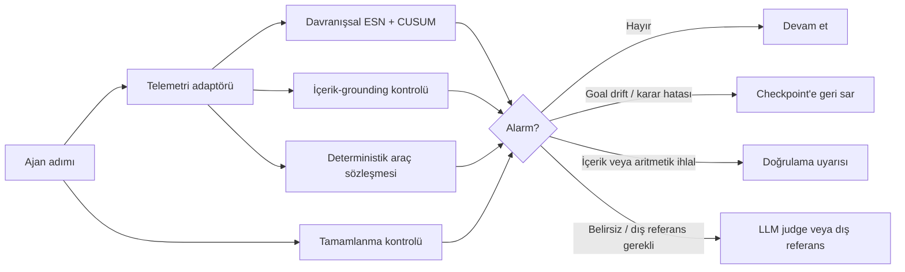

# *Real-Time Detection and Repair of LLM Agent Failures* — Baştan sona özet

## 1. Makalenin temel sorusu

Bu çalışma, araç kullanan LLM ajanlarının görev sırasında başarısız olmaya başladığı anı, mümkün olduğunca erken ve düşük maliyetle tespit etmeyi araştırıyor.

LLM ajanları bir bölüm (*episode*) boyunca art arda adımlar gerçekleştirir: düşünür, araç çağırır, sonuçları okur ve yeni eylemler seçer. Bu süreçte ajan:

- aynı eylemde döngüye girebilir,
- araç hatalarını zincirleme biçimde yayabilir,
- hedefinden sapabilir,
- yanlış veya uydurma sonuçlar üretebilir,
- bozulmuş araç içeriğini fark etmeden kullanabilir,
- gerekli son adımı sessizce atlayabilir.

Yaygın yaklaşım, her adımı ikinci bir LLM’e denetlettirmektir. Ancak bu, denetlenen ajan kadar veya ondan daha fazla hesaplama maliyetine yol açabilir. Makalenin ana sorusu şudur:

> Yalnızca ajanın dışarıdan gözlenebilen çalışma telemetrisi kullanılarak, ikinci bir LLM çağırmadan başarısızlıklar ne ölçüde gerçek zamanlı tespit edilebilir?

Yazarlar özellikle şu varsayımla çalışıyor:

- Ajanın iç aktivasyonlarına veya ağırlıklarına erişim yok.
- Başarısızlık etiketleriyle eğitim yapılmıyor.
- Yalnızca sağlıklı ajan çalıştırmalarından bir “normal davranış” modeli öğreniliyor.
- İzleyici, adım başına mikrosaniye ölçeğinde çalışmalı.

Çalışmanın sonucu, tek bir istatistiksel monitörün her tür hatayı yakalayamayacağı; bunun yerine istatistiksel monitörlerin deterministik doğrulayıcılar ve gerektiğinde LLM yargıçlarıyla birlikte kullanılması gerektiği yönünde. [Introduction](https://www.alphaxiv.org/abs/2608.02464?page=1)

---

## 2. Deneysel kapsam

Makale oldukça geniş bir gerçek-dünya değerlendirmesi yapıyor:

- Toplam **2.823 ajan bölümü** inceleniyor.
- Bunlar **25 veri kümesine** yayılıyor.
- **Üç ajan framework’ü** kullanılıyor: özel döngüler, LangGraph ve AutoGen.
- Modeller:
  - Qwen2.5 7B,
  - Qwen2.5 3B,
  - Llama 3.1 8B,
  - ticari bir API olarak Gemini 2.5 Flash.
- Gerçek araçlarla çalışan ajanlardan oluşan **770 bölüm** bulunuyor.
- Buna ek olarak, mekanizma analizi için telemetrinin doğrudan simüle edildiği kontrollü deneyler yürütülüyor.

Makale, kontrollü simülasyon ile gerçek ajan deneylerini özellikle birbirinden ayırıyor. Simülasyonda başarısızlıkların ne zaman başladığı kesin olarak biliniyor; ancak telemetri yapay olarak üretildiği için simülasyon sonuçlarının doğrudan gerçek dağıtımlara genellenemeyeceği vurgulanıyor. Gerçek deployment iddiaları esas olarak gerçek ajan çalıştırmalarına dayandırılıyor. [Contributions](https://www.alphaxiv.org/abs/2608.02464?page=2)

---

# 3. Ajan telemetrisi nasıl oluşturuluyor?

Her ajan adımı için gözlenebilir bir telemetri vektörü oluşturuluyor:

$$
x_t = [e_t; u_t; m_t]
$$

Burada üç ana kanal var:

### 3.1. Semantik çıktı kanalı

Ajanın ürettiği metin, model tabanlı bir embedding yerine deterministik bir **karakter 3-gram özellik hash’i** ile temsil ediliyor.

Bu tercih şu avantajları sağlıyor:

- Harici bir embedding modeli gerektirmiyor.
- Ağ bağlantısı veya model indirme gerektirmiyor.
- Embedding modelinin sürümüne bağımlı değil.
- Çok düşük gecikmeyle hesaplanabiliyor.

### 3.2. Belirsizlik kanalı

Modelin token düzeyindeki belirsizliğinden türetilen dört özet kullanılıyor. Ancak makaledeki ablasyonlar, bu kanalın pratikte kritik olmadığını gösteriyor: token-surprisal kanalı çıkarıldığında ESN performansı neredeyse hiç değişmiyor.

Bu nedenle sistem için asıl önemli gereksinim token log-prob’larının erişilebilir olması değil, yapılandırılmış araç sonuçlarının telemetriye aktarılmasıdır. [Telemetry Ablation](https://www.alphaxiv.org/abs/2608.02464?page=5)

### 3.3. Eylem ve davranış metadatası

Bu kanalda örneğin şunlar bulunuyor:

- hangi aracın çağrıldığı,
- çağrının başarılı olup olmadığı,
- yeniden deneme bilgisi,
- gecikme,
- çıktı uzunluğu,
- hata işaretleri,
- konuşma veya araç çağrısı derinliği,
- görev çapasıyla benzerlik,
- önceki adıma göre davranışsal sapma.

İlk telemetri sürümü 43 boyutlu. Davranış özellikleri eklendiğinde 51 boyuta, içerik-temelli özellikler eklendiğinde 60 boyuta çıkıyor. Dört sürüm şöyle:

| Sürüm | Boyut | İçerik |
|---|---:|---|
| v1 | 43 | Semantik çıktı, belirsizlik ve eylem metadatası |
| v2 | 43 | Araç sonuçlarının adım metnine eklenmesi |
| v3 | 51 | Sekiz davranışsal özellik |
| v4 | 60 | Dokuz içerik-grounding özelliği |

v4 telemetri adaptörünün ortanca maliyeti adım başına **674 mikrosaniye**, yüzde 95’lik gecikmesi ise **1.045 mikrosaniye** olarak ölçülüyor. [Telemetry](https://www.alphaxiv.org/abs/2608.02464?page=4)

---

# 4. Ana izleyici: ESN + CUSUM

Makalenin ilk ve temel istatistiksel monitörü, sağlıklı çalışma örneklerinden eğitilen tek-sınıflı bir **Echo State Network (ESN)** topluluğu ile **CUSUM** değişim tespit yönteminin birleşimidir.

## 4.1. ESN’nin çalışma mantığı

ESN’de tekrarlayan rezervuar ağırlıkları rastgele başlatılıyor ve sabit tutuluyor. Eğitilen tek bölüm, bir sonraki telemetri adımını tahmin eden doğrusal “readout” katmanı.

Her kanal için rezervuar durumu şu biçimde güncelleniyor:

$$
h_t^{(c)}
=
(1-\alpha)h_{t-1}^{(c)}
+
\alpha \tanh
\left(
W^{(c)}h_{t-1}^{(c)}
+
W_{\mathrm{in}}^{(c)}x_t^{(c)}
\right)
$$

Ardından bir sonraki adım tahmin ediliyor. Sağlıklı çalıştırmalarda ajan davranışı genellikle öngörülebilir olduğundan, başarısızlık başladığında bir sonraki adımın tahmin hatası büyüyor.

ESN’nin önemli pratik avantajı, yalnızca readout katmanının ridge regression ile eğitilmesi. Bu nedenle eğitim yaklaşık **1,7 saniye** sürüyor; benzer bir GRU eğitimi ise yaklaşık **68 saniye** sürüyor. [Reservoir](https://www.alphaxiv.org/abs/2608.02464?page=3)

## 4.2. CUSUM neden gerekli?

Tek bir adımın tahmin hatası yeterince büyük olmayabilir. Özellikle yavaş gelişen hatalarda her adım yalnızca biraz anormal görünebilir.

CUSUM, küçük ama sürekli sapmaları biriktiriyor:

$$
S_t^{(c)}
=
\max
\left(
0,
S_{t-1}^{(c)}
+
z(q_t^{(c)})-\kappa
\right)
$$

Her telemetri kanalı ayrı ayrı biriktiriliyor ve alarm skoru en yüksek kanal seçilerek hesaplanıyor:

$$
s_t = \max_{c \in \{e,u,m\}} S_t^{(c)}
$$

Bu “kanalların maksimumunu alma” tasarımı önemli. Örneğin yalnızca belirsizlik kanalında gerçekleşen bir sapma, tüm boyutlar ortalaması alınırsa etkisini kaybedebilir. [Surprise and Fusion](https://www.alphaxiv.org/abs/2608.02464?page=4)

## 4.3. Eşik nasıl belirleniyor?

Eşik, sağlıklı doğrulama bölümlerindeki maksimum skorların üst yüzdeliklerinden seçiliyor. Böylece hedeflenen yanlış alarm bütçesi sağlıklı veriye göre belirleniyor.

Ancak bunun önemli bir sonucu var:

> Her deployment için yeni bir sağlıklı null dağılımı ve yeniden kalibrasyon gerekiyor.

Bir modelde veya framework’te öğrenilen eşik başka bir modele doğrudan taşınamıyor.

---

# 5. Hangi hatalar tespit ediliyor?

Makale dört temel enjekte edilmiş başarısızlık sınıfına odaklanıyor:

1. **Looping:** Ajanın aynı veya anlamsız eylemleri tekrarlaması.
2. **Tool cascade:** Bir araç hatasının sonraki çağrıları bozarak zincirleme hata oluşturması.
3. **Goal drift:** Ajanın başlangıç hedefinden uzaklaşması.
4. **Content corruption:** Araca dönen içeriğin bozulması veya yanlış belge/JSON içeriğiyle değiştirilmesi.

## 5.1. Gerçek corpus sonuçları

Birincil monitörün gerçek deployment’larda sınıf bazındaki performansı değişken:

- Döngüler: **0,48–1,00**
- Araç zinciri hataları: **0,17–1,00**
- Hedef sapması: **0,66–0,86**
- Yanlış belge içeriği: **0,00–0,20**
- Bozuk JSON: **0,05–0,50**

Bu sonuçlar, monitörün davranışsal hatalarda genel olarak daha başarılı; yalnızca içeriğin değiştiği fakat ajanın yüzeysel davranışının değişmediği durumlarda ise zayıf olduğunu gösteriyor. [Real Coverage](https://www.alphaxiv.org/abs/2608.02464?page=5)

---

# 6. Zaman ufku: ESN ne zaman avantajlı?

ESN’nin temel gücü, hata başladıktan sonra birkaç adım boyunca kanıt biriktirebilmesi. Bu nedenle hata çok geç fark ediliyor veya episode hemen bitiyorsa ESN’nin avantajı azalıyor.

1.002 enjekte edilmiş bölümde, ESN ile memoryless Mahalanobis yöntemi arasındaki tespit farkı şöyle:

- Hata sonrası ufuk **en fazla 3 adım**: **+0,09**
- **4–8 adım**: **+0,14**
- **9 veya daha fazla adım**: **+0,40**

Yani uzun süre devam eden hatalarda ESN açık biçimde avantajlı. Kısa bölümlerde veya hata başladıktan hemen sonra bölüm sona erdiğinde, geçmişi kullanmayan Mahalanobis yaklaşımı daha rekabetçi olabiliyor.

Bu durum gerçek veride de görülüyor: kısa episode’lardan oluşan bazı veri kümelerinde delta-Mahalanobis ESN’yi geçiyor. Dolayısıyla “ESN her zaman en iyi yöntemdir” sonucu çıkarılmıyor; performans hata sonrası kalan gözlem süresine bağlı. [Horizon Diagnosis](https://www.alphaxiv.org/abs/2608.02464?page=5)

---

# 7. Farklı modeller ve deployment’lar arasında aktarım

Makalenin en önemli negatif bulgularından biri, monitörün **kalibrasyon yapılmadan deployment’lar arasında taşınamaması**.

Qwen2.5 7B üzerinde eğitilen monitör, aynı görev ve araç planında Llama 3.1 8B’ye aktarılıyor:

- Aktarılan monitör: **AUROC 0,527**, sağlıklı yanlış alarm oranı **0,75**
- Llama üzerinde yeniden kalibre edilen monitör: **AUROC 0,885**

Bu fark, başarısızlığın hedef corpus’un zorluğundan değil, sağlıklı davranış dağılımının modele ve deployment’a özgü olmasından kaynaklandığını gösteriyor.

Aynı yaklaşım ticari Gemini 2.5 Flash API’sinde de deneniyor:

- AUROC: **0,794**
- Ancak matched false-alarm koşulundaki tespit oranı Qwen’e göre daha düşük.
- Bunun nedeni telemetrinin yetersizliği değil, Gemini başarısızlıklarının hata başlangıcından sonra daha kısa sürmesi.

Dolayısıyla sistem “bir kez eğit, her yerde kullan” tipi bir güvenlik katmanı değil. Serviste kullanılan model, sıcaklık, araç seti, gecikme rejimi ve görev yapısı değiştiğinde sağlıklı verilerle yeniden kalibre edilmesi gerekiyor. [Cross-Deployment Transfer](https://www.alphaxiv.org/abs/2608.02464?page=12)

---

# 8. Harici benchmark’lara aktarım

Yazarlar monitörü kendilerinin oluşturmadığı iki harici benchmark’ta da test ediyor.

## AFTraj-2K

1.882 filtrelenmiş trajectory üzerinde:

- ESN episode AUROC: **0,745**
- En iyi hibrit: **0,760**
- Ancak %5 yanlış alarm bütçesinde tespit oranı yalnızca **0,048**

Burada sıralama bilgisi başka projeye aktarılıyor; fakat deployment eşiği aktarılmıyor. Hataların çoğu, monitörün kanıt biriktirebilmesi için çok kısa sürede sona eriyor.

## ATBench

604 filtrelenmiş trajectory üzerinde:

- ESN AUROC: **0,779**
- Güvensiz bölümlerin tespit oranı: **0,311**
- Delta-Mahalanobis: AUROC **0,457**, yani yaklaşık şans düzeyi

Hata türleri arasında da fark var:

- Aşırı yetkilendirilmiş eylemler: **0,508**
- Doğrulanmamış araç çıktıları: **0,473**
- Hatalı bilgi üretimi: **0,038**

Bu sonuç, monitörün “ajan ne yaptı?” türü davranışsal sorunları, “ajan ne söyledi?” türü içerik hatalarından daha kolay yakaladığını destekliyor. [External Benchmarks](https://www.alphaxiv.org/abs/2608.02464?page=6)

---

# 9. Kalibre edilmiş hibrit

ESN uzun ufuklu hatalarda, Mahalanobis ise kısa ufuklu hatalarda avantajlı olduğu için yazarlar iki yöntemi birleştiriyor.

1.002 enjekte edilmiş bölümde:

- Yalnızca ESN’nin gördüğü: **273**
- Yalnızca Mahalanobis’in gördüğü: **57**
- İkisinin de gördüğü: **372**
- İkisinin de görmediği: **300**

Dolayısıyla bölümlerin yaklaşık üçte birinde iki dedektörden yalnızca biri alarm üretiyor.

Çapraz doğrulamalı lojistik füzyon:

- Genel ortalama AUROC: **0,826**
- ESN: **0,802**
- Delta-Mahalanobis: **0,807**

Ancak bu sonuç dikkatli yorumlanmalı. Hibrit, toplamda daha iyi olsa da her deployment’ta en iyi tekil yöntemi geçmiyor. Sekiz veri kümesinin yedisinde AUROC bakımından daha iyi yerel yönteme eşit veya daha kötü; tespit oranında ise sekizinin tamamında daha düşük.

Bu nedenle hibritin anlamı şudur:

> Deployment rejimi bilinmiyorsa güvenli bir varsayılan olabilir; fakat her durumda baskın olan yöntem değildir.

Öğrenilen Mahalanobis ağırlığı kısa ufuklu veri kümelerinde yaklaşık **0,99**, uzun ufuklu rejimlerde ise yaklaşık **0,38** düzeyine çıkıyor. Bu ağırlık, hibritin gerçekten hangi koşulda hangi dedektöre güvendiğini yansıtıyor. [Calibrated Hybrid](https://www.alphaxiv.org/abs/2608.02464?page=9)

---

# 10. İçerik bozulması için grounding kanalı

İstatistiksel ve davranışsal monitörlerin ortak kör noktası şu:

> Araç sonucunun içeriği değişiyor, fakat ajanın davranış biçimi değişmiyor.

Örneğin ajan bozuk bir JSON veya yanlış belge alıyor; yine de normal biçimde bir sonraki aracı çağırabiliyor. Bu durumda semantik ve davranışsal telemetri anomali göstermeyebilir.

Bu sorunu çözmek için v4 telemetrisine dokuz içerik-grounding özelliği ekleniyor:

- sorgu ile sonuç arasındaki farklılık,
- sonuç içi tutarlılık,
- JSON öneki geçerliliği,
- karakter anomalileri,
- sözlüksel alaka işareti,
- benzeri içerik sinyalleri.

İçerik-grounding kanalı özellikle içerik açısından görünür bozulmaları tespit edebiliyor. Ancak bu özellikler bozulmanın yalnızca sonuç metnine yansıdığı durumlarda çalışıyor. Framework, bozuk içeriği sonuç metnine taşımıyorsa bu kanal da etkisiz kalıyor.

Pooled sonuçlarda içerik tespiti yaklaşık **0,28’den 0,59’a** yükseliyor. Davranışsal tespit de düşmek yerine **+0,045** artıyor. Grounding diagnosis verisinde content gate:

- içerik hatalarında: **0,27 → 0,58**
- davranışsal hatalarda: **0,74 → 0,79**

Bu, içerik kanalının davranışsal monitörün yerine geçmediğini; onu tamamladığını gösteriyor. [Content Grounding](https://www.alphaxiv.org/abs/2608.02464?page=10)

---

# 11. Organik, yani doğal hatalar

Enjekte edilmiş hatalar kontrollü ve mekanik olarak doğrulanabilir. Ancak gerçek ajan hataları daha karmaşık olabilir. Bu nedenle yüksek sıcaklıkta çalıştırılan, enjekte edilmemiş organik bölümler inceleniyor.

30 organik bölümde:

- 7 sessiz tamamlanmama,
- 3 uydurma sayı,
- 1 temellendirilmemiş retrieval birleştirmesi

olmak üzere toplam 11 organik hata görülüyor.

Sonuçlar:

- Davranışsal monitörler 3 uydurma sayı hatasının yalnızca **1’ini** yakalıyor.
- Tüm organik hata kümesindeki sıralama performansı şans düzeyinde veya altında:
  - AUROC **0,31–0,42**
- Sıcaklıkla eşleştirilmiş null dağılımı sağlıklı bölümlerde **%36 yanlış alarm** üretiyor.

Bu, doğal başarısızlıkların dağılımının enjekte edilmiş başarısızlıklardan farklı olduğunu gösteriyor. Ayrıca yazarların ön-kayıtlı uydurma çalışması da yeterince güçlü değil:

- 55 bölümde yalnızca **2 aday halüsinasyon** görülüyor.
- Önceden belirlenen minimum sayı 10.
- Bu nedenle çalışma fabrikasyon tespiti hakkında bir iddia ileri sürmüyor.

Önemli sonuç şu:

> Ajanlar bu deney koşullarında nadiren sayı uyduruyor; ancak uydurma oluştuğunda tek-sınıflı davranış monitörü doğru araç değil.

Sessiz abortları ise çok basit bir completion check yakalıyor:

- **7/7** sessiz abort,
- **0 yanlış pozitif**.

Plausible-value corruption, yani biçimsel olarak doğru görünen fakat gerçekte yanlış olan bir sayı ise dış referans olmadan telemetriden tespit edilemiyor. [Organic Failures](https://www.alphaxiv.org/abs/2608.02464?page=10)

---

# 12. Deterministik doğrulama katmanı

Makalenin en güçlü pratik önerisi, istatistiksel monitörlerin yanına deterministik doğrulayıcılar koymak.

Üç temel kontrol tanımlanıyor:

## 12.1. `total_consistency`

Ajanın belirttiği toplam değer, ajanın gerçekten gördüğü araç sonuçlarından yeniden hesaplanıyor.

Bu kontrol özellikle:

- aritmetik hataları,
- araç çıktısından türemeyen sayıları,
- yanlış toplamları

yakalıyor.

## 12.2. `required_coverage`

Görev için gerekli tüm araç çağrılarının gerçekten yapılıp yapılmadığını kontrol ediyor.

Bu kontrol sessizce atlanan adımları ve eksik görev tamamlamalarını yakalamaya yarıyor.

## 12.3. `tool_contract`

Araçtan dönen sonucun, o aracın üretebileceği biçimlerden biriyle uyumlu olup olmadığını denetliyor.

Örneğin:

- beklenmeyen JSON şekli,
- araç çıktısının bozuk formatı,
- geçersiz veya mümkün olmayan sonuç yapısı

tespit edilebiliyor.

Bu kontrollerin istatistiksel monitörlerden farkı:

- sağlıklı null dağılımı gerektirmiyor,
- eşik kalibrasyonu gerektirmiyor,
- deployment’a özgü bir normal davranış modeli gerektirmiyor,
- denetim sırasında ikinci bir LLM çağrısı kullanmıyor.

## Karşılaştırmalı sonuçlar

Aynı episode’larda ve aynı hata etiketleriyle:

| Sistem | Yakalanan hata | Yanlış pozitif |
|---|---:|---:|
| Kontroller | %60 | 0/63 = %0 |
| Kontroller + coverage | %96 | 0/63 = %0 |
| Davranışsal monitör | %54 | 11/63 = %17 |

Daha sonra, kontrollerin yazılmasından sonra toplanan ve farklı task seed’leri kullanan 120 yeni bölümde:

- yalnızca toplam kontrolleri: **%54**
- coverage ile birlikte: **%93**
- yanlış pozitif: **0/64**
- Llama 3.1 8B kolunda: **110/110 hata**, **0/10 yanlış pozitif**

Ayrıca provoked fabrication corpus’unda deterministik kontroller **26/26 fabrikasyonu** yakalıyor. Bu, bir one-class istatistiksel monitörün yeterli sayıda sağlıklı örnek oluşturamayacağı bir hata sınıfı için önemli bir sonuç. [Deterministic Checks](https://www.alphaxiv.org/abs/2608.02464?page=11)

---

# 13. Tespit edilen hatalar nasıl onarılıyor?

Tespit tek başına yeterli değil; sistem alarmdan sonra ajanı kurtarmaya çalışıyor.

Makaledeki onarım süreci:

1. Ajanın başarısız olduğu bölümde alarm üretiliyor.
2. Ajan, son “fact-gathering” adımına geri sarılıyor.
3. Konuşma ve araç geçmişi bu checkpoint’ten yeniden oluşturuluyor.
4. Ajan yeni bir model çağrısıyla çalıştırılıyor.
5. Onarım, aynı görev ve aynı prefix üzerinde değerlendiriliyor.

Bir kontrol grubunda yalnızca yeniden örnekleme yapılıyor. Farklı onarım yönergeleri karşılaştırılıyor:

| Onarım kademesi | Hata kurtarma |
|---|---:|
| Hiçbir şey yapmama | %0 |
| Basit yeniden örnekleme | %16 |
| Hangi kontrolün başarısız olduğunu söyleme | **%45** |
| Genel “yeniden kontrol et” talimatı | %36 |
| Spesifik bulguyu ve değerleri verme | %36 |
| Hesap makinesi kullanmasını söyleme | %28 |
| Adaptif strateji | %21 |

Bonferroni düzeltmesinden sonra yalnızca “hangi kontrolün başarısız olduğunu söyleme” yaklaşımı istatistiksel olarak anlamlı kalıyor:

- $p = 0{,}0005$

İlginç biçimde, ajana doğru cevabı veya düzeltilmiş toplamı doğrudan vermek gerekli değil. Hatta doğru değeri içeren daha ayrıntılı yönergeler daha iyi performans göstermiyor. Bu durum, problemin çözümünün ajana cevabı vermekten çok, hangi doğrulama koşulunun ihlal edildiğini belirtmek olduğunu gösteriyor. [Repair Rungs](https://www.alphaxiv.org/abs/2608.02464?page=11)

120 bölümün tümünde net görev başarısı:

- onarım öncesi: **%52**
- “located” onarımı sonrası: **%73**
- 25 başarısız bölüm kurtarılıyor.
- Doğru çalışan hiçbir bölüm bozulmuyor.

Ancak onarım her hata türünde çalışmıyor:

- Goal drift: 5 vakanın **4’ü** kurtarılıyor.
- Looping: yeniden çalıştırma bazen aynı döngüyü üretiyor.
- Tool cascade: araç katmanı bozuksa yeni deneme aynı hatalı sonucu alabiliyor.
- Grounding loss: davranışsal olarak alarm vermediği için grounding doğrulayıcıya bırakılıyor.
- Contract violation: onarılmak yerine eskalasyon yapılıyor.

Bu nedenle onarım özellikle ajanın yanlış karar verdiği fakat araç altyapısının çalıştığı durumlarda etkili; araç veya veri kaynağı bozuksa amacı bazen başarıyı geri getirmek değil, bölümü erken ve güvenli biçimde sonlandırmak oluyor. [Repair Coverage](https://www.alphaxiv.org/abs/2608.02464?page=12)

---

# 14. LLM-as-a-judge ile karşılaştırma

Makale, ikinci bir LLM’i tamamen reddetmiyor; onu daha pahalı bir **escalation layer** olarak konumlandırıyor.

Kontrollü simülasyonda kullanılan varsayımsal judge:

- hata tespit olasılığı: **0,90**
- yanlış alarm olasılığı: **0,02**

Bu varsayımla, her adımı judge’a göndermek yerine yalnızca monitör şüphelendiğinde judge çağırmak çağrı sayısını ciddi biçimde azaltıyor.

Fakat gerçek Gemini 2.5 Flash judge ölçüldüğünde:

- tespit: **0,548**
- yanlış alarm: **0,052**
- örnek: 161 farklı prompt

Yani kontrollü deneyde kullanılan judge varsayımı gerçek ölçümle uyuşmuyor. Gerçek oranlar simülasyona yerleştirildiğinde:

- judge çağrısı tasarrufu korunuyor,
- fakat tespit kurtarma oranı **%82’den %43’e** düşüyor,
- beş seed’in hiçbirinde başlangıçtaki H3b iddiası desteklenmiyor.

Judge ve monitör farklı hata sınıflarında güçlü:

- Judge, goal drift konusunda mükemmel.
- Judge, context corruption konusunda zayıf: **0,18**.
- Monitör context corruption konusunda güçlü: **1,00**.

Bu nedenle judge, monitörün ucuz bir ikamesi değil; farklı kör noktaları tamamlayan pahalı bir katman olarak düşünülmeli. [Measured Judge](https://www.alphaxiv.org/abs/2608.02464?page=9)

---

# 15. Makalenin açıkça kabul ettiği sınırlamalar

Yazarlar sınırlamaları sonuçların dışında saklamıyor; ölçülmüş sınırlar olarak raporluyor.

## 15.1. Deployment’lar arası aktarım yok

Her model, sıcaklık, araç seti ve latency rejimi için yeniden sağlıklı kalibrasyon gerekiyor.

## 15.2. Yavaş hedef sapması zor

Per-step surprise monitörleri, hedefin yavaşça değiştiği durumlarda zayıf kalıyor. Ani hedef değişiklikleri ise dört gerçek corpus’ta **0,66–0,86** oranında yakalanıyor.

## 15.3. Telemetri kapsamı kritik

Araç sonuçları telemetri kanalına aktarılmazsa içerik bozulması görünmez. Ancak token log-prob’larının yokluğu büyük sorun değil; ablasyonlarda performans neredeyse değişmiyor.

## 15.4. Makul görünen yanlış değerler tespit edilemiyor

Araç sonucu biçimsel olarak doğru fakat içeriği yanlışsa, dış dünyaya ait bir referans olmadan telemetri yalnızca bunun yanlış olduğunu bilemez.

## 15.5. Fabrikasyon taban oranı çok düşük

Organik bölümlerde yeterince fabrika edilmiş örnek oluşmadığı için istatistiksel monitörle fabrikasyon tespiti hakkında güçlü bir sonuç çıkarılamıyor.

## 15.6. Deney kapsamı sınırlı

Çalışma:

- iki yerel model ailesi,
- bir ticari API,
- araştırma ve mock-tool görevleri

üzerinde yürütülüyor. Ayrıca makineye özgü duvar saati gecikmesi özellikleri nihai konfigürasyondan çıkarılıyor. [Limitations](https://www.alphaxiv.org/abs/2608.02464?page=12)

---

# 16. Kod ve yeniden üretilebilirlik

Makale, kodu, trace’leri ve sonuç tablolarını yayımlıyor:

- GitHub deposu: [agent-trajectory-sentinel](https://github.com/sunnydubey1111/agent-trajectory-sentinel)
- Veri kümesi: [Hugging Face dataset](https://huggingface.co/datasets/sunnydubey1111/agent-trajectory-sentinel)
- İnteraktif demo: [Hugging Face Space](https://huggingface.co/spaces/sunnydubey1111/agent-trajectory-sentinel-demo)
- Yöntem ve canlı demo videosu: [YouTube](https://youtu.be/a05n_000klE)

Depoda:

- sonuç CSV ve JSON dosyaları,
- gerçek ajan trace’leri,
- veri kartı,
- figür üretim kodu,
- SHA-256 tabanlı `BASELINE_MANIFEST.json`,
- davranış snapshot kontrolü,
- pytest testleri,
- ağ bağlantısı gerektirmeyen CPU yeniden üretim konteyneri

bulunuyor. Bu düzen, makaledeki sayıların doğrudan committed artifact’lerden yeniden hesaplanabilmesini amaçlıyor. [Artifact Availability](https://www.alphaxiv.org/abs/2608.02464?page=13)

---

# 17. Makalenin genel mimari önerisi

Çalışmanın vardığı sistem tasarımı kabaca şöyledir:

Bu mimaride her bileşenin farklı bir görevi var:

- **ESN + CUSUM:** Davranışın zaman içindeki anomalisini yakalar.
- **Mahalanobis veya hibrit:** Kısa ufuklu ve memoryless sapmalarda yardımcı olur.
- **Grounding kanalı:** İçeriğin davranış değişmeden bozulduğu durumları yakalar.
- **Completion check:** Sessizce eksik bırakılan görevleri bulur.
- **Numeric grounding / total consistency:** Sayıların gerçekten araç sonuçlarından türeyip türemediğini doğrular.
- **Tool contract:** Araç çıktısının mümkün bir biçimde olup olmadığını kontrol eder.
- **LLM judge veya dış referans:** Telemetrinin kendi başına karar veremediği durumlara bakar.
- **Rollback ve repair:** Alarm sonrası doğru checkpoint’ten yeniden çalıştırır.

---

# 18. Sonuç: Makalenin ana mesajı

Makale üç güçlü pozitif sonuç ve birkaç kritik negatif sonuç ortaya koyuyor.

### Pozitif sonuçlar

1. **Çok ucuz gerçek-zamanlı izleme mümkün.**  
   ESN monitörü yaklaşık **200 mikrosaniye/adım**, telemetri adaptörü ise yaklaşık **674 mikrosaniye/adım** maliyetle çalışıyor.

2. **Davranışsal ajan hataları makul ölçüde yakalanabiliyor.**  
   Özellikle looping, tool cascade ve ani goal drift gibi hatalar telemetride iz bırakıyor.

3. **Tespit, onarımla birleştirildiğinde görev başarısı artıyor.**  
   Doğru checkpoint’e geri dönüp hangi kontrolün başarısız olduğunu belirtmek, net görev başarısını **%52’den %73’e** yükseltiyor.

### Negatif sonuçlar

1. **Monitör deployment’lar arasında otomatik aktarılamıyor.**  
   Sağlıklı null ve eşik her deployment için yeniden öğrenilmeli.

2. **İçeriğin değişip davranışın değişmediği hatalar istatistiksel monitörleri kandırabiliyor.**  
   Bu nedenle grounding ve deterministik doğrulama şart.

3. **Fabrikasyon ve makul görünen yanlış bilgiler one-class telemetri monitörünün doğal hedefi değil.**  
   Bu sınıflar için sayıların araç çıktılarından türetilmesini kontrol eden doğrulayıcılar veya harici referanslar gerekiyor.

4. **LLM judge güçlü ama pahalı ve kusursuz değil.**  
   Gerçek judge’ın performansı, idealize edilmiş simülasyondaki varsayımlardan belirgin biçimde daha düşük.

En kısa ifadeyle makalenin önerisi şu:

> Güvenilir bir LLM ajan koruması tek bir “akıllı monitör”den oluşmamalı. Ucuz bir davranışsal anomali izleyicisi; içerik-grounding, görev tamamlama, araç sözleşmesi ve deterministik matematiksel doğrulama kontrolleriyle birlikte çalışmalı. Belirsiz veya dış dünyaya ilişkin doğrulama gerektiren durumlar ise daha pahalı bir judge’a ya da harici referansa yükseltilmeli.

Makalenin en önemli katkısı, yalnızca “ESN ajan hatalarını bulur” demesi değil; **hangi hata sınıflarının telemetriyle görülebileceğini, hangilerinin yapısal olarak görünemeyeceğini ve her sınıf için hangi doğrulama mekanizmasının uygun olduğunu ölçerek ortaya koymasıdır.**