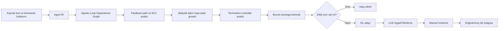
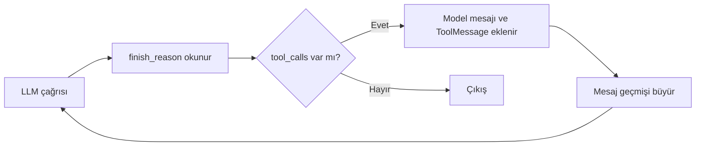

# Makalenin ana fikri

**“When Agents Do Not Stop: Uncovering Infinite Agentic Loops in LLM Agents”**, LLM tabanlı ajanlarda ortaya çıkan ve klasik programlama döngülerinden daha karmaşık olan **Infinite Agentic Loop (IAL)** problemini inceliyor.

Bir LLM ajanı genellikle şu döngüyü çalıştırır:

1. Model görevi yorumlar ve plan yapar.
2. Bir araç çağırır.
3. Araçtan sonuç alır.
4. Durumu veya mesaj geçmişini günceller.
5. Yeniden modele döner.
6. Görev tamamlanana veya bir sınır aşılana kadar devam eder.

Sorun, bu döngünün **model çıktısı, araç sonucu, hata, yeniden deneme veya başka bir ajana devretme** üzerinden tekrar tekrar kendisini tetiklemesidir. Eğer bu yolu sınırlayan etkili bir `max_turns`, `max_iterations`, timeout, retry limiti veya bütçe yoksa ajan “durmayabilir”.

Makalenin temel iddiası şudur:

> Bir ajanın içinde döngü bulunması tek başına hata değildir. Hata, ajan döngüsünün maliyetli veya durum büyüten işlemleri tekrar tekrar çalıştırması ve bu tekrar yolunun güçlü bir durdurma sınırıyla kapsanmamasıdır. [IAL Definition](https://www.alphaxiv.org/abs/2607.01641?page=2)

---

# 1. Problem neden önemli?

Normal bir yazılım döngüsü çoğu zaman açıkça görülebilir:

```python
while condition:
    do_something()
```

Fakat LLM ajanlarında döngü, doğrudan `while` ifadesi olarak görünmeyebilir. Örneğin:

- Bir LangGraph düğümü başka bir düğüme geri bağlanabilir.
- Bir araç çağrısı yeniden model çağrısını tetikleyebilir.
- Bir model, sürekli olarak yeni araç çağrısı üretebilir.
- Parser hatası, modeli tekrar çağıran retry mekanizmasını çalıştırabilir.
- Bir ajan başka bir ajana devredilebilir ve bu devir zinciri tekrar başa dönebilir.
- Bir workflow, hata durumunda aynı adımı yeniden çalıştırabilir.

Dolayısıyla döngünün gerçek yapısı, yalnızca kaynak kodundaki sözdiziminden anlaşılamaz; framework’ün çalışma semantiğinin de analiz edilmesi gerekir. Makale, ajan davranışının framework API’leri, araç dispatch mekanizmaları, handoff’lar, state güncellemeleri ve termination koşulları üzerinden kodlandığını vurguluyor. [Detection Challenges](https://www.alphaxiv.org/abs/2607.01641?page=1)

## IAL neden tehlikeli olabilir?

Sonsuz veya etkisiz biçimde sınırlanmış bir ajan döngüsü:

- API maliyetlerini tüketebilir.
- Model servisinin kapasitesini işgal edebilir.
- Context window’un dolmasına yol açabilir.
- Harici araçların rate limit’lerini tüketebilir.
- Dosya yazma, veritabanı güncelleme veya ticket oluşturma gibi yan etkileri defalarca gerçekleştirebilir.

Makalenin gerçek proje analizinde doğrulanan 68 bulgunun 65’inde API maliyeti ve model denial-of-service etkisi gözlenmiş; 19 bulguda ise context window tükenmesi potansiyeli bulunmuştur. [Observed Impacts](https://www.alphaxiv.org/abs/2607.01641?page=8)

---

# 2. Makalenin neden-sonuç zinciri

Makalenin metodolojisini en iyi şu neden-sonuç ilişkisiyle özetleyebiliriz:



Bu zincirdeki her adım, bir önceki adımın eksikliğini gidermek için tasarlanmış:

- Sadece AST analizi framework kaynaklı döngüleri göremez.
- Bu nedenle framework davranışı **Agent IR** içine aktarılır.
- Sadece IR yeterli değildir; feedback ilişkilerinin görülmesi gerekir.
- Bu nedenle **ALDG** oluşturulur.
- Her cycle hata değildir; cycle’ın maliyetli veya state büyüten işlemlere ulaşıp ulaşmadığı incelenir.
- Her termination koşulu da güçlü bir sınır değildir; sınırın gerçekten tekrar yolunu kapsayıp kapsamadığı kontrol edilir.
- Statik analiz aşaması fazla aday üretebilir; bu nedenle LLM yalnızca negatif filtre olarak kullanılır.
- Son karar manuel incelemeyle doğrulanır.

---

# 3. IAL nasıl tanımlanıyor?

Makale bir yapının IAL sayılması için üç temel koşul koyuyor:

1. **Ajanik bir feedback path bulunmalı.**  
   Örneğin model çağrısı → araç çağrısı → state güncellemesi → tekrar model çağrısı.

2. **Bu yol maliyetli veya state büyüten işlemlere ulaşmalı.**  
   Maliyetli işlem çoğunlukla yeni bir LLM çağrısı veya harici araç çağrısıdır. State growth ise mesaj geçmişi, workflow state’i veya hafıza gibi yapıların her iterasyonda büyümesidir.

3. **Tekrar yolu etkili bir bound tarafından kapsanmamalı.**  
   `max_iterations=5` gibi bir sınır ancak gerçekten ilgili feedback path’i durduruyorsa etkilidir. Kodun başka bir yerindeki veya yalnızca içteki bir ajana ait limit, dış döngüyü durdurmuyorsa yeterli değildir. [Failure Conditions](https://www.alphaxiv.org/abs/2607.01641?page=7)

Bu nedenle makale şu ayrımı yapıyor:

| Durum | IAL mı? | Neden |
|---|---:|---|
| 5 iterasyonla sınırlı ajan döngüsü | Hayır | Tekrar yolu güçlü bir bound ile sınırlı |
| Model “STOP” diyene kadar devam eden döngü | Potansiyel olarak evet | Durdurma kararı yalnızca model çıktısına bağlı |
| Parser hatasında retry yapan ama retry limiti olmayan ajan | Evet | Hata tekrar tekrar model çağrısına dönebiliyor |
| Sayfalama yapan sınırlı bir loop | Genellikle hayır | Ajanik maliyet veya kontrolsüz feedback olmayabilir |
| Araç sonucu modele dönüyor, model tekrar aynı aracı çağırıyor | Potansiyel olarak evet | Model–tool feedback path mevcut |
| İç ajanın turn limiti var ama dış supervisor döngüsü sınırsız | Evet olabilir | İç limit dış feedback path’i kapsamıyor |

---

# 4. Önerilen sistem: IAL-SCAN

Makalenin önerdiği araç **IAL-SCAN**. Bu araç üç ana katmandan oluşuyor:

1. **Agent IR Construction**
2. **Agentic Loop Dependence Graph Construction**
3. **IAL Failure Detection**

Sistem sekiz framework’ü destekliyor:

- LangChain
- LangGraph
- CrewAI
- AutoGen
- LlamaIndex
- OpenAI Agents SDK
- Google ADK
- Semantic Kernel

Bu framework’lerin farklı API’lerini ortak ajan kavramlarına dönüştürmek, sistemin framework-bağımsız çalışmasını sağlıyor. [System Scope](https://www.alphaxiv.org/abs/2607.01641?page=7)

---

# 5. Aşama 1: Agent IR oluşturma

## Agent IR nedir?

**Agent IR**, farklı framework’lerde yazılmış ajan uygulamalarını ortak bir ara gösterime dönüştürüyor.

Örneğin bir framework’te:

```python
runner.run(agent)
```

başka bir framework’te:

```python
executor.invoke(input)
```

veya:

```python
graph.invoke(state)
```

şeklinde görünebilir. Bunların hepsi anlamsal olarak bir tür **agent execution** veya **model/workflow invocation** olabilir.

IAL-SCAN bunları tek tek API isimleri olarak ele almak yerine ortak kategorilere dönüştürüyor:

- `ExecutionUnit`: Fonksiyon, ajan, workflow veya runtime scope
- `Controller`: Loop, retry, router veya termination controller
- `Invocation`: LLM, tool, agent, workflow veya subprocess çağrısı
- `StateUpdate`: Mesaj, hafıza veya workflow state güncellemesi
- `Bound`: Limit, timeout, retry cap veya bütçe
- `ExitRecord`: Döngüden çıkış koşulu

Agent IR’nin amacı, “hangi framework API’si kullanılmış?” sorusundan çok şu soruları cevaplamaktır:

- Tekrarı hangi yapı kontrol ediyor?
- Hangi model veya araç çağrıları tekrar yolunda?
- State nerede güncelleniyor?
- Durdurma koşulu neye bağlı?
- Bir bound bu yolu gerçekten kapsıyor mu?

Makale Agent IR’nin bu varlıkları ve aralarındaki sahiplik, çağrı, güncelleme, dispatch, geçiş ve bound ilişkilerini kaydettiğini açıklıyor. [Agent IR Schema](https://www.alphaxiv.org/abs/2607.01641?page=4)

## Kaynak koddan bilgi çıkarma

IAL-SCAN Python dosyalarını AST üzerinden inceliyor. Şunları tespit etmeye çalışıyor:

- Döngüler
- Recursive çağrılar
- Fonksiyon çağrıları
- Retry blokları
- Exception handler’lar
- State güncellemeleri
- Framework nesnelerinin oluşturulması
- Araç kayıtları
- Workflow düğümleri ve geçişleri
- Limit ve konfigürasyon değerleri

Bunun için tam anlamıyla bütün programı çözen ağır bir points-to analizi yerine, daha hafif bir isim ve attribute çözümleme kullanılıyor. Import alias’ları, lokal atamalar, object field’ları ve factory return’leri izlenerek olası çağrı hedefleri bulunuyor. [Fact Extraction](https://www.alphaxiv.org/abs/2607.01641?page=5)

---

# 6. Aşama 2: ALDG oluşturma

## ALDG nedir?

**Agentic Loop Dependence Graph**, Agent IR’den türetilen yönlü ve etiketli bir grafik.

Grafikte özellikle şu tür düğümler tutuluyor:

- Loop veya retry controller
- LLM çağrıları
- Tool çağrıları
- Agent/workflow invocation’ları
- State-growing güncellemeler
- Execution scope’lar

Aralarındaki kenarlar ise şunları temsil edebiliyor:

- Normal kontrol akışı
- Fonksiyon çağrısı
- Tool dispatch
- Workflow transition
- Agent reentry
- Recursion
- Exception retry
- Loop-back
- Exit

Bu grafik, görünürde birbirinden ayrı duran kod parçalarının aslında tek bir feedback path oluşturduğunu gösterebiliyor. ALDG’de düğümlerin kaynak konumu, guard koşulu, hedefi ve framework bağlantısı gibi bilgiler de korunuyor. [ALDG Construction](https://www.alphaxiv.org/abs/2607.01641?page=6)

---

# 7. Makaledeki örnek: Moonshot wrapper

Makalenin ilk örneğinde, görünür bir ajan workflow’u yerine özel bir model wrapper’ı var.

Basitleştirilmiş akış şöyle:



Kodun kritik kısmı şu mantık:

```python
while finish_reason is None or finish_reason == "tool_calls":
    result = self.llm._generate(...)
    finish_reason = ...
    messages.append(result_message)
    messages.append(ToolMessage(...))
```

Burada neden-sonuç zinciri:

1. Model çağrısı yapılır.
2. Model `tool_calls` döndürür.
3. Model mesajı ve araç sonucu mesaj geçmişine eklenir.
4. Büyümüş mesaj geçmişi tekrar modele gönderilir.
5. Model yeniden araç çağrısı döndürebilir.
6. Bu süreç tekrar eder.

Sorun, `finish_reason` üzerinden bir çıkış koşulu görünmesine rağmen bunun **deterministik bir bound olmaması**dır. Model sürekli `tool_calls` üretirse loop devam eder. İçteki `break` de yalnızca araç iterasyonundan çıkar; dıştaki `while` döngüsünü durdurmaz. Kodda `max_tool_calls`, `max_iterations` veya timeout bulunmadığı için bu yol sınırsız kalabilir. [Motivating Example](https://www.alphaxiv.org/abs/2607.01641?page=3)

Buradaki önemli ayrım:

> “Loop’un çıkış koşulu var” demek, “loop güvenli biçimde sınırlı” demek değildir.

Çünkü çıkış koşulu modelin davranışına bağlıdır; modelin ne zaman duracağına ilişkin kesin bir üst sınır yoktur.

---

# 8. Aşama 3: SCC tabanlı aday keşfi

ALDG oluşturulduktan sonra sistem, grafik içindeki cycle’ları buluyor.

Bunun için **Strongly Connected Components (SCC)** analizi kullanılıyor. Bir grafikte bir düğümden başlayıp tekrar aynı düğüme ulaşılabiliyorsa, orada güçlü bağlantılı bir bölge veya cycle olabilir.

Fakat bulunan her cycle doğrudan IAL olarak kabul edilmiyor. Sistem şu filtreleri uyguluyor:

1. Cycle bir ajan giriş noktasından erişilebilir mi?
2. Cycle, model, tool, agent veya workflow çalıştırıyor mu?
3. Cycle maliyetli bir invocation’a ulaşıyor mu?
4. Cycle boyunca state büyüyor mu?
5. Cycle gerçek üretim kodunda mı?
6. Bu yalnızca parser, pagination, stream consumer veya test döngüsü mü?

Böylece aşağıdaki türdeki masum döngüler elenmeye çalışılıyor:

- Stream tüketme
- Pagination
- Parser
- Lifecycle
- Test scaffold
- Sınırlı ve deterministik iterasyon
- Üretim dışı örnek kod

Makale, adayların ancak ajan girişinden erişilebilir olduklarında ve tekrar yolu ajanik işlem, maliyetli invocation veya state growth’a ulaştığında tutulduğunu belirtiyor. [Candidate Discovery](https://www.alphaxiv.org/abs/2607.01641?page=7)

---

# 9. Controller analizi: Döngüyü kim sürdürüyor?

Bir döngü bulunduğunda, sistem tekrarın hangi kontrol mekanizmasıyla devam ettiğini sınıflandırıyor:

- Deterministic
- Model-controlled
- Tool-controlled
- External-state-controlled
- Exception-controlled
- Mixed

Bu sınıflandırma neden önemli?

Çünkü şu iki loop aynı görünse bile güvenlik açısından farklıdır:

```python
for i in range(5):
    call_model()
```

ve:

```python
while model_says_continue():
    call_model()
```

İlkinde üst sınır bellidir: en fazla beş çağrı. İkincisinde ise model sürekli “devam et” diyebilir.

Benzer şekilde:

```python
while not success:
    try:
        call_model()
        success = True
    except:
        pass
```

yapısında hata sayısı dışarıdan kontrol edilmiyorsa, exception tekrar tekrar aynı model çağrısına dönülmesine yol açabilir.

Makale, model çıktısına, araç sonuçlarına, exception’lara veya uzaktaki duruma bağlı çıkışların görünürdeki exit koşullarına rağmen gerçek bir bound oluşturmayabileceğini savunuyor. [Controller Verification](https://www.alphaxiv.org/abs/2607.01641?page=7)

---

# 10. Bound coverage: Metodolojinin en kritik kısmı

Makalenin en önemli katkısı yalnızca “döngü var mı?” diye bakmaması; **durdurma sınırının doğru yolu kapsayıp kapsamadığını** incelemesi.

IAL-SCAN bound’ları şu kategorilerde sınıflandırıyor:

- `verified_bound`
- `framework_default_bound`
- `config_dependent_bound`
- `missing_bound`
- `weak_bound`
- `disabled_bound`
- `ineffective_bound`
- `bypassed_bound`

Bir bound’un etkili sayılması için:

1. İlgili controller’a uygulanması,
2. Controller’ın bulunduğu runtime scope’u kapsaması,
3. Gerçek feedback path üzerinde baskın olması,
4. İçteki bir işlemle sınırlı kalmayıp dış döngüyü de durdurabilmesi gerekir.

Örneğin:

```text
Supervisor loop
 └── Agent A
      └── Tool loop
```

Agent A’nın `max_turns=3` sınırı, supervisor sürekli Agent A’yı yeniden çağırıyorsa supervisor döngüsünü sınırlamayabilir. Bu durumda iç bound vardır ama dış feedback path hâlâ sınırsızdır.

Makale bunu özellikle vurguluyor: yalnızca limit parametresinin bulunması yeterli değildir; limitin tekrarlanan yolu gerçekten kapsaması gerekir. [Bound Coverage](https://www.alphaxiv.org/abs/2607.01641?page=4)

---

# 11. LLM sistemin neresinde kullanılıyor?

IAL-SCAN tamamen LLM’ye bırakılmış bir analiz değil.

Sistem önce statik analizle adayları oluşturuyor, sonra isteğe bağlı olarak LLM kullanıyor. LLM’nin rolü:

- Yeni bulgu keşfetmek değil,
- Statik analiz adaylarını tamamen yeniden üretmek değil,
- Yalnızca yanlış pozitif olabilecek adayları negatif filtrelemek.

LLM’ye verilen bounded slice içinde şunlar bulunuyor:

- Feedback witness
- Controller koşulu
- İlgili bound’lar
- Çağrı zinciri
- Kaynak kod parçaları
- State güncellemeleri
- Framework bağlantıları

LLM şu tür gerekçelerle adayı eleme önerebiliyor:

- Güçlü finite bound var.
- Döngü ajanik değil.
- Kod yalnızca test veya örnek.
- Deterministik çıkış mevcut.

Ancak bu öneri, statik analizdeki kanıtlarla çelişmemeli. Makale LLM’nin yalnızca **negative filter** olarak kullanılmasının daha güvenli olduğunu söylüyor; çünkü LLM’nin kendisinin hata yaparak gerçek bir bulguyu üretim dışı bırakması istenmiyor. [LLM Pruning](https://www.alphaxiv.org/abs/2607.01641?page=7)

---

# 12. Deney düzeni

## Veri kümesi

Araştırmacılar:

- 6.549 Python LLM ajan repository’si,
- 246.748 Python dosyası,
- 33,41 milyon Python satırı

üzerinde analiz yapıyor. Repository’lerin framework implementasyonu, tutorial veya izole örnek yerine downstream uygulama veya ürün olması şartı aranıyor. [Evaluation Dataset](https://www.alphaxiv.org/abs/2607.01641?page=7)

## Manuel doğrulama

Statik analiz ve LLM filtrelemesinden sonra ilk iki yazar bulguları bağımsız biçimde inceliyor:

- Gerçek IAL
- Yanlış pozitif
- Kaçırılmış bulgu

Anlaşmazlıklar tartışmayla çözülüyor ve gerektiğinde başka bir yazar sürece katılıyor. Bir bulgunun gerçek IAL sayılması için:

1. Tekrarlanan bir agentic feedback path,
2. Model, tool, agent veya workflow execution,
3. Runtime çıktısına bağlı devam davranışı,
4. Bu yolu kapsayan güçlü bir bound’un bulunmaması

gerekiyor. [Manual Review](https://www.alphaxiv.org/abs/2607.01641?page=7)

---

# 13. Ana sonuçlar

İlk statik analiz 6.549 repository üzerinde **74 potansiyel bulgu** raporluyor. Manuel inceleme sonucunda:

- **68 gerçek IAL**
- **6 yanlış pozitif**
- **47 farklı proje**
- **%91,9 precision**

elde ediliyor. [Main Evaluation](https://www.alphaxiv.org/abs/2607.01641?page=8)

En yaygın hata türleri:

| Hata tipi | Bulgu sayısı | Oran |
|---|---:|---:|
| Boundsuz retry feedback | 17 | %25,0 |
| Boundsuz tool-call iteration | 16 | %23,5 |
| Turn bound olmayan multi-agent chat | 14 | %20,6 |
| Etkisiz bound’a sahip workflow loop | 9 | %13,2 |
| Boundsuz message reentry | 7 | %10,3 |
| Runner/delegation/evaluator feedback | 5 | %7,4 |

En yaygın kök neden ise bütün 68 gerçek bulguda ortak olan **güçlü bound eksikliği**. Bunun yanında tool-controlled retry, model-controlled termination, eksik exit, workflow cycle, state growth ve agent tool reentry de sık görülüyor. [Failure Distribution](https://www.alphaxiv.org/abs/2607.01641?page=8)

---

# 14. İki önemli vaka çalışması

## Vaka 1: Parser hatasında sonsuz retry

Bir planner şu mantıkla çalışıyor:

```python
while not success:
    try:
        plan = llm.invoke(...)
        success = True
    except OutputParserException:
        pass
```

Daha sonra planın adımları kontrol ediliyor. Eğer bütün adımlar reddedilirse:

```python
success = False
```

yapılıyor.

Neden-sonuç zinciri:

1. LLM plan üretir.
2. Parser hata verirse `success` hâlâ `False` kalır.
3. Döngü yeniden LLM çağrısına döner.
4. Plan parse edilebilir olsa bile bütün adımlar reddedilirse tekrar `False` yapılır.
5. Böylece tekrar sayısını sınırlayan retry cap, timeout veya token bütçesi yoksa model çağrısı durmadan devam edebilir.

Bu bulgu API maliyeti ve model servisinin işgal edilmesine yol açabilir. [Retry Case Study](https://www.alphaxiv.org/abs/2607.01641?page=8)

## Vaka 2: Boş veya hatalı model çıktısında tool loop

İkinci örnekte dışarıdan bakıldığında açıkça görünen:

```python
while True:
```

döngüsü vardır.

Ajan:

1. Modeli araçlarla birlikte çalıştırır.
2. Modelin tool call üretip üretmediğini kontrol eder.
3. Çıktı boş veya hatalıysa mesaj geçmişine “gerçek bir çıktı ver” türü düzeltici bir mesaj ekler.
4. Tekrar modele döner.

Bu durumda her başarısız denemede mesaj geçmişi büyür. Dolayısıyla yalnızca API çağrısı tekrarlanmamakta, aynı zamanda context de büyümektedir. Retry cap, tool-call bütçesi, timeout veya context boyutu guard’ı yoksa döngü maliyeti ve context baskısını artırabilir. [Tool Iteration Case](https://www.alphaxiv.org/abs/2607.01641?page=8)

---

# 15. Ablation çalışması: Hangi bileşen neden gerekli?

Araştırmacılar sistemin bileşenlerini tek tek çıkararak etkilerini ölçüyor.

| Sistem varyantı | Aday | Uyarı | Gerçek pozitif | Yanlış pozitif |
|---|---:|---:|---:|---:|
| Tam IAL-SCAN | 340 | 74 | 68 | 6 |
| Framework modeling yok | 910 | 276 | 61 | 215 |
| Agentic gate yok | 1.453 | 87 | 62 | 25 |
| Bound coverage yok | 365 | 70 | 60 | 10 |
| Benign-loop filtering yok | 696 | 103 | 62 | 41 |
| LLM pruning yok | 340 | 340 | 68 | 272 |

Tam sonuçlar makalenin ablation tablosunda verilmiştir. [Ablation Results](https://www.alphaxiv.org/abs/2607.01641?page=9)

Bu tablonun neden-sonuç yorumu şöyle:

## Framework modeling çıkarılırsa

- Framework’e özgü implicit transition’lar görülemez.
- Daha fazla yanlış aday üretilir.
- Aday sayısı 340’tan 910’a çıkar.
- Gerçek pozitif kapsaması 68’den 61’e düşer.

Yani framework modeling hem **precision** hem de **recall** için gereklidir.

## Agentic gate çıkarılırsa

- Agent olmayan sıradan loop’lar da analize girer.
- Aday sayısı 1.453’e çıkar.
- LLM’ye gönderilen token miktarı 4,2K’dan 40,4K’ya yükselir.

Bu bileşen esas olarak analiz maliyetini ve aday patlamasını kontrol eder.

## Bound coverage çıkarılırsa

- Sistem “bir limit var mı?” ile “bu limit feedback path’i kapsıyor mu?” ayrımını kaybeder.
- Gerçek pozitif sayısı 60’a düşer.
- Yanlış pozitif sayısı artar.

Bu, makalenin bound coverage analizinin yalnızca ek bir özellik değil, karar mekanizmasının merkezi olduğunu gösteriyor.

## LLM pruning çıkarılırsa

- 340 statik adayın tamamı uyarı olarak raporlanır.
- 68 gerçek bulgu korunur.
- Fakat 272 yanlış pozitif ortaya çıkar.

Bu nedenle statik aşama recall açısından iyi, fakat doğrudan son kullanıcıya rapor vermek için fazla gürültülüdür.

---

# 16. LLM tabanlı baseline’larla karşılaştırma

IAL-SCAN iki yöntemle karşılaştırılıyor:

1. Bütün repository’yi inceleyen genel bir coding agent.
2. Python dosyalarını tek tek analiz eden saf LLM API yaklaşımı.

Sonuçlar:

| Yöntem | Uyarı | Gerçek pozitif | Kaçırılan | Ortalama token | Ortalama süre |
|---|---:|---:|---:|---:|---:|
| IAL-SCAN | 74 | 68 | 0 | 4,2K | 31,2 sn |
| Coding assistant | 140 | 50 | 18 | 141,9K | 116,0 sn |
| Pure LLM API | 183 | 23 | 45 | 18,1K | 34,4 sn |

Bu sonuç, makalenin şu iddiasını destekliyor:

> Ajan döngüsü problemini doğrudan genel bir LLM’ye sorarak çözmek, framework semantiği, feedback path ve bound coverage yapısal olarak modellenmediğinde yeterli değildir. [Baseline Comparison](https://www.alphaxiv.org/abs/2607.01641?page=9)

Coding agent daha fazla gerçek bulgu yakalasa da çok fazla yanlış uyarı üretiyor ve 75 projede timeout veya hata sınırına ulaşıyor. Saf LLM yaklaşımı ise daha az kaynak tüketmesine rağmen 68 gerçek bulgunun yalnızca 23’ünü yakalayabiliyor.

---

# 17. Sistem ne kadar kararlı?

Statik aday keşfi tamamen tekrarlanabilir:

- Her üç çalıştırmada da 340 aday bulundu.

Fakat LLM pruning aşamasında değişkenlik var:

| Çalıştırma | Uyarı | Gerçek pozitif kapsamı |
|---|---:|---:|
| 1 | 74 | 68 |
| 2 | 73 | 64 |
| 3 | 70 | 60 |

Bu, yöntemin iki ayrı karaktere sahip olduğunu gösteriyor:

- **Statik analiz:** Deterministik ve kararlı.
- **LLM filtreleme:** Daha az maliyetli fakat model davranışına bağlı ve değişken.

Makale bu nedenle nihai değerlendirmeyi varsayılan çalıştırmanın ardından manuel incelemeye dayandırıyor. [Repeatability](https://www.alphaxiv.org/abs/2607.01641?page=10)

Model seçimi de önem taşıyor. Örneğin farklı modeller daha fazla aday tutabilmesine rağmen gerçek pozitif kapsamı daha düşük olabiliyor. Yani **daha fazla uyarı üretmek otomatik olarak daha iyi recall anlamına gelmiyor**. [Model Sensitivity](https://www.alphaxiv.org/abs/2607.01641?page=10)

---

# 18. Makalenin katkısı tam olarak ne?

Makalenin katkısı “LLM ajanlarında sonsuz loop olabilir” gözlemi değil; bunu sistematik ve analiz edilebilir bir problem haline getirmesi.

## Birinci katkı: Yeni hata sınıfı

IAL, klasik sonsuz döngüden farklı olarak:

- Model çıktısı,
- Tool sonucu,
- Agent handoff’u,
- Workflow transition’ı,
- Retry mantığı,
- State büyümesi

gibi farklı mekanizmaların birleşiminden oluşabiliyor.

## İkinci katkı: Framework-bağımsız temsil

Agent IR, farklı framework API’lerini ortak kavramlara dönüştürüyor.

## Üçüncü katkı: Feedback path analizi

ALDG, yalnızca kaynak kodundaki loop’ları değil, framework’ün oluşturduğu örtük cycle’ları da modellemeye çalışıyor.

## Dördüncü katkı: Bound coverage mantığı

Bir limitin varlığı ile gerçekten ilgili feedback path’i sınırlaması arasındaki farkı inceliyor.

## Beşinci katkı: Gerçek repository değerlendirmesi

Yöntem sentetik örneklerle sınırlı bırakılmamış; 6.549 gerçek agent projesinde uygulanmış ve 68 doğrulanmış hata bulunmuş. [Contributions](https://www.alphaxiv.org/abs/2607.01641?page=2)

---

# 19. Ne tür önlemler öneriliyor?

Makalenin pratik sonucu, LLM ajanlarının “model sonunda durur” varsayımıyla dağıtıma alınmaması gerektiği.

Her feedback path için mümkün olduğunca birden fazla güvenlik mekanizması kullanılmalı:

- Maksimum turn sayısı
- Maksimum workflow step sayısı
- Maksimum tool-call sayısı
- Retry limiti
- Timeout
- Token veya maliyet bütçesi
- Context/message history boyutu sınırı
- Handoff veya delegation derinliği sınırı
- Yan etkili tool’lar için human approval
- Runtime telemetry ve alarm
- Loop başına benzersiz ilerleme kontrolü

Framework geliştiricileri açısından bound’ların yalnızca opsiyonel parametre olarak sunulması yerine, feedback path’in oluştuğu runtime scope’ta otomatik uygulanması öneriliyor. Bound’ların nested agent’lar arasında aktarılması ve derleyici veya runtime aşamasında kapsanmamış cycle’ların raporlanması da öneriler arasında. [Prevention Guidance](https://www.alphaxiv.org/abs/2607.01641?page=10)

---

# 20. Güçlü yönler ve sınırlamalar

## Güçlü yönleri

- Problemi net biçimde tanımlıyor.
- Sadece sözdizimsel loop aramıyor.
- Framework semantiğini hesaba katıyor.
- Maliyet ve state growth’u analiz ediyor.
- Bound’un gerçekten yolu kapsayıp kapsamadığını inceliyor.
- Büyük ölçekte gerçek repository tarıyor.
- Manuel doğrulama yapıyor.
- LLM’yi karar verici değil, yardımcı negatif filtre olarak konumlandırıyor.

## Sınırlamaları

Makale dört ana sınırlama kabul ediyor:

1. **Statik analiz over-approximation yapıyor.**  
   Olası yolları tahmin ettiği için gerçek çalıştırmada oluşmayabilecek yanlış pozitifler üretilebilir.

2. **Python ve sekiz framework ile sınırlı.**  
   Başka diller veya desteklenmeyen framework’ler kaçırılabilir.

3. **Özel proje semantiği zor.**  
   Projeye özgü scheduler’lar, dış state’e bağlı termination logic veya doğal dil çıktısını yorumlayan durdurma kuralları doğru analiz edilemeyebilir.

4. **LLM pruning kararsız olabilir.**  
   Aynı adaylar farklı modellerde veya farklı çalıştırmalarda farklı biçimde filtrelenebilir. [Limitations](https://www.alphaxiv.org/abs/2607.01641?page=10)

---

# Son değerlendirme

Bu makalenin en önemli mesajı şudur:

> LLM ajanlarında güvenli termination, yalnızca bir `if done` koşulu koymakla sağlanmaz. Asıl soru, model–tool–state–agent–workflow zincirinin oluşturduğu bütün feedback path’in etkili bir üst sınırla kontrol edilip edilmediğidir.

IAL-SCAN bu soruyu şu biçimde sistematikleştiriyor:

1. Kaynak kodu ve framework davranışını ortak bir **Agent IR**’ye dönüştürüyor.
2. Agent IR’den **ALDG** grafiğini kuruyor.
3. Grafikteki cycle’ları ve SCC’leri buluyor.
4. Cycle’ın maliyetli çağrı veya state growth içerip içermediğini inceliyor.
5. Döngünün model, tool, exception veya dış state tarafından nasıl sürdürüldüğünü sınıflandırıyor.
6. Bound’un gerçekten feedback path’i kapsayıp kapsamadığını denetliyor.
7. Belirsiz adayları LLM ile negatif yönde filtreliyor.
8. Sonuçları manuel incelemeyle doğruluyor.

Bu yaklaşımın temel yeniliği, **“döngü var mı?”** sorusundan **“ajanik feedback path, maliyetli/state-growing bir işlemi etkili bir sınır olmadan tekrar tekrar çalıştırabilir mi?”** sorusuna geçmesidir.