# 13-Ek — Tool Trace Compaction Landscape (yalnız tool izi, fonksiyon-düzeyi + diyagramlı)

**Ağustos 2026 · §13 landscape eki · gerçek kod + kaynak taraması**

Bu doküman **yalnız tool-trace compaction'a** odaklanır: her sistem **tool çıktılarını** (ve çağrılar arası ilişkiyi) nasıl ele alıyor? Genel konuşma-özeti (context compaction) kapsam dışı — sadece "tool sonucu bağlama girince ne oluyor" sorusu.

> **Doğrulama:** ✅ gerçek koddan (grep/GitHub) · 📄 karşılaştırmalı yazıdan · 🔖 genel bilgiden. Fonksiyon/sabit adları ✅'lerde birebir koddan.

## 0. Kritik ayrım — context compaction ≠ tool trace compaction

§13'ün açılış tezi: **output compaction** "bu tek sonuç büyük mü" der; **trace compaction** "bu çağrılar birbiriyle nasıl ilişkili" der (aynı dosya 3 kez okundu mu, bu okuma bayat mı). Bu mercekle sistemleri ikiye ayırıyoruz:

- **Tool-trace-farkında** — tool çıktısına **özel** davranır (kes / tek-satıra indir / temizle / katla / tipe göre sıkıştır). §1.
- **Tool-trace-farkında DEĞİL** — tool çıktısını diyalogla **aynı** sayar, hepsini birlikte LLM'e özetletir. Bunlar *context* compaction yapar, *tool-trace* değil. §2.
- **İlişki-farkında** (dedup/sürüm/bayat) — **hiçbiri**, sadece bizimki. §3.

---

# §1 — Tool-trace-FARKINDA sistemler (tool çıktısına özel mekanizma)

## 1.1 NousResearch Hermes ✅ — tip-farkında tek-satır tool özeti

**Tool-trace işi:** Büyük tool çıktısını, **model çağırmadan**, tool tipine göre tek bilgilendirici satıra indirir. LLM özetinden **önce** çalışan "ucuz ön-pas."

**Kullanılan fonksiyonlar (tool-trace kısmı):**
| Sembol | Ne yapar |
|---|---|
| `_summarize_tool_result(name, args, content)` / `_unguarded` | Tool çıktısını **tip-farkında tek satıra** indirir: `[terminal] npm test → exit 0, 47 lines`. Hata olursa `[tool] (N chars)` fallback. **Deterministik** (testler tam string eşitliğiyle doğrular → LLM değil). |
| `drop_stale_api_content()` | Eski tool/provider replay meta'sını (codex_reasoning_items vb.) atar. |
| `_truncate_tool_call_args_json()` | Tool **çağrısının** şişkin argüman JSON'unu geçerliliği koruyarak kırpar (dev `write_file` içeriği gibi). |
| `_strip_historical_media()` | Tool çıktısındaki eski görselleri `[Attached image — stripped]` yapar. |
| `_PRUNED_TOOL_PLACEHOLDER` | "[Old tool output cleared to save context space]". |

Not: kısaltılmış tool çıktısı **tool-result slotunda kalır** (rol değişmez); sadece gövde küçülür.

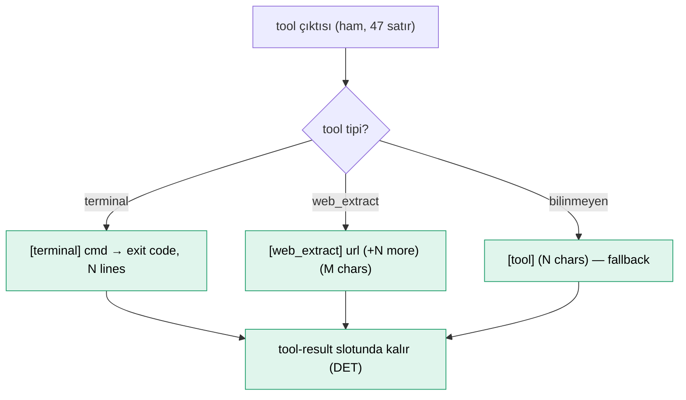

## 1.2 Headroom ✅ — tip-özel algoritmik tool-çıktısı sıkıştırma (bize en yakın)

**Tool-trace işi:** Ajanla LLM arasına giren **proxy**; tool çıktısını "bir içerik tipi" sayıp içerik-tipine göre **algoritmik** (LLM'siz) compressor'a yönlendirir. Kayıplı ama **geri-çağrılabilir** (CCR).

**Kullanılan fonksiyonlar (tool-çıktısı yolu):**
| Sembol | Ne yapar |
|---|---|
| `ContentRouter` | Tool çıktısının tipini tespit → uygun compressor (JSON/kod/log/arama/diff/metin). |
| `SmartCrusher::crush(content, query)` | **JSON tool çıktısı** (audit log, API sonucu): kayıpsız şema dedup → kayıplı satır düşürme. Sorgu-farkında satır seçimi (`HybridScorer` = BM25+fastembed). |
| `KeepErrorsConstraint` · `KeepStructuralOutliersConstraint` | Hata satırlarını ve aykırıları **asla atma** (bizim verbatim gibi). |
| `estimate_bloat` | JSON parse etmeden ucuz byte-tarama ile şişkinlik tahmini. |
| `CodeAwareCompressor` (`preserve_imports`, `preserve_signatures`) | **Kod tool çıktısı**: AST — import/imza korur, gövde kırpar. |
| `LogCompressor` / `SearchCompressor` / `DiffCompressor` | **log/grep/diff tool çıktıları** için özel (uyarı dedup, error-boost, hunk sıralama). |
| `KompressCompressor` (`final_scores >0.5`) | **Metin tool çıktısı**: token-classifier ModernBERT — önemli token'ları seçer (generatif değil). |
| CCR `<<ccr:HASH>>` + `headroom_retrieve(hash)` | Atılan içerik yerelde saklanır; model hash ile **orijinali geri çağırır** (kayıpsız). |

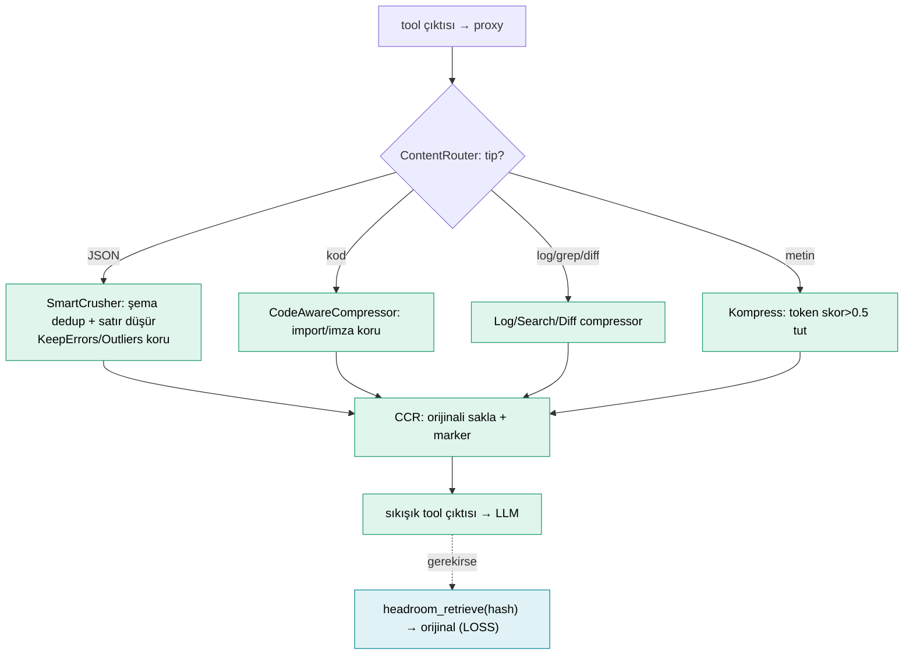

## 1.3 OpenAI Codex ✅ — tool çıktısı orta-kesme

**Tool-trace işi:** İki şey — (a) ingest'te her tool çıktısını **ortasından keser**, (b) compaction'da tool çıktılarını **siler** (özete erir).

**Kullanılan fonksiyonlar:**
| Sembol | Ne yapar |
|---|---|
| `tool_output_token_limit` | Tool çıktısını saklarken uygulanan token bütçesi. |
| `TruncationPolicy::Bytes(n)` / `Tokens(n)` | Kesme birimi. |
| `truncate_middle_chars` / `truncate_middle_with_token_budget` | Çıktının **ortasını** keser (baş+son kalır, "…N truncated…"). İlişkiye bakmaz — sadece boyut. |
| (compaction'da) | Tool çıktıları fiziksel silinir, LLM handoff özetine erir. |

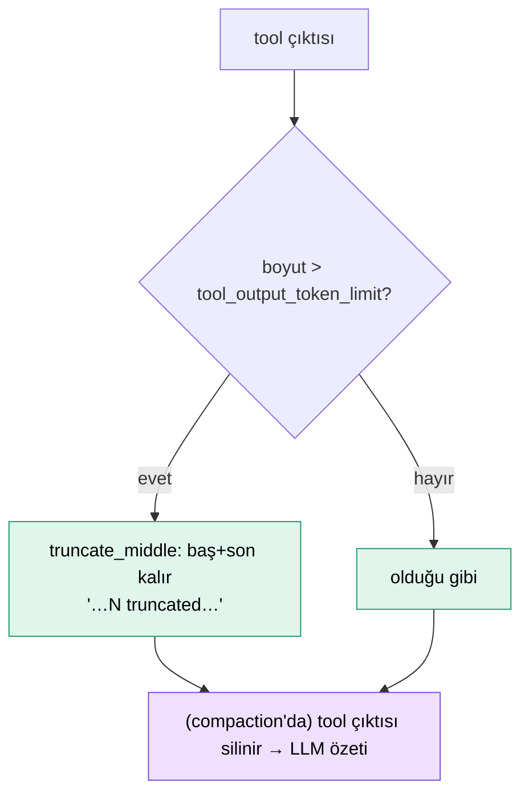

## 1.4 Anthropic Claude Code 📄 — tool_result temizleme + koruma

**Tool-trace işi:** Eski tool sonuçlarını `[Old tool result content cleared]` placeholder'ıyla **temizler** (context editing / B.11); aktif/son tool çağrıları korunur. Compaction sonrası son 5 düzenlenen dosyayı **tekrar okur** (state reconstruction).

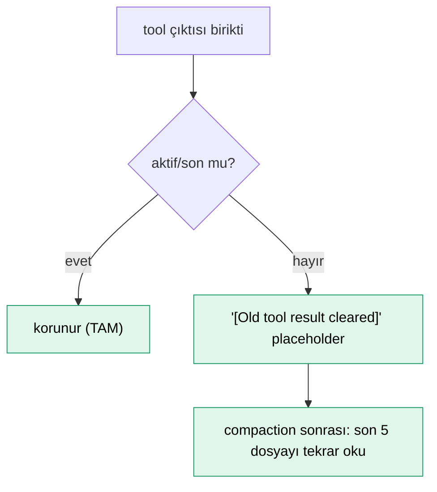

## 1.5 OpenClaw ✅ — oversized tool sonucu kesme (LLM'e gitmeden önce)

**Tool-trace işi:** Bağlam taştığında (overflow), **pahalı LLM compaction'a başvurmadan önce** en büyük tool sonuçlarını canlı mesaj kümesinde kırpar. "Önce ucuz kurtarma dene" mantığı — çoğu overflow'un sebebi birkaç dev tool çıktısıdır (build log, dosya dökümü), onları kesmek çoğu zaman compaction'a hiç gerek bırakmaz.

**Kullanılan fonksiyonlar (sırayla):**
| Sembol | Ne yapar |
|---|---|
| `sessionLikelyHasOversizedToolResults(session)` | **Ucuz ön-kontrol:** oturumda boyut sınırını aşan tool sonucu var mı? (tam tarama değil, hızlı tahmin) |
| `resolveLiveToolResultMaxChars(...)` | Bir tool sonucunun canlı bağlamda kalabileceği **maksimum karakter** sınırını çözer (modele/ayara göre). |
| `truncateOversizedToolResultsInActiveTarget(target)` | Sınırı aşan tool sonuçlarını **aktif hedefte** (modele gidecek canlı mesaj kümesi) kırpar. Sadece "oversized" olanlar; küçükler dokunulmaz. |

Bu bir "output compaction" — tek tek büyük çıktıları küçültür, ilişkiye (tekrar/bayat) bakmaz. Yetmezse genel motora (LLM/lossless/native köprü) geçer.

> **Dürüstlük notu (lossless-claw):** Önceki taslakta lossless-claw'ı "özet yok, sadece offload+retrieval" diye tanımlamıştım — bu muhtemelen **yanlış**. Grep'te motorun bir **`summaryModel` config'i** olduğu görüldü (`plugins.entries.lossless-claw.config.summaryModel`), yani bir **model kullanıyor**. "Lossless" büyük olasılıkla "geri-alınabilir/kayıpsız kurtarma" demek, "LLM yok" değil. Ayrıca motorun **kendi algoritması bir plugin** (bu repoda routing/config-repair var, engine implementasyonu yok) — dolayısıyla yönlendirmeyi doğruladım, iç algoritmayı **doğrulayamadım**. `contextEngine` bir **plugin slot**'u; lossless-claw varsayılan.

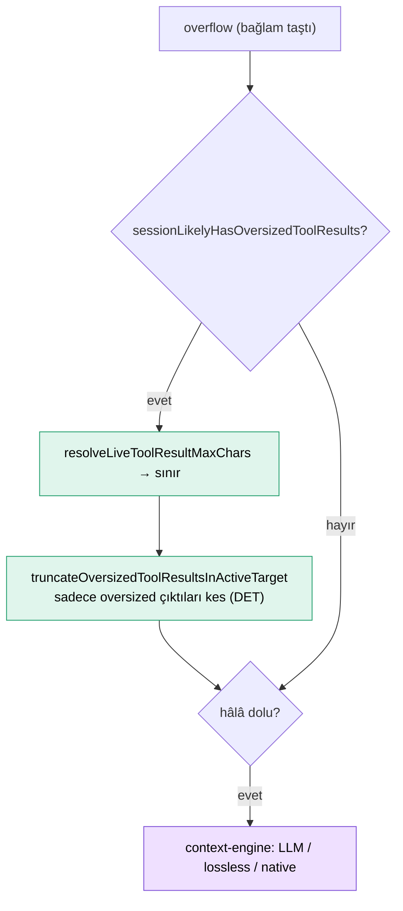

## 1.6 OpenHands ✅ — ObservationMasking (gözlem = tool çıktısı)

**Tool-trace işi:** OpenHands'te ajan döngüsü **Event** üretir: `Action` (ajanın kararı — "şu komutu çalıştır") + `Observation` (sonucu — yani **tool çıktısı**). `ObservationMasking` condenser, eski **Observation**'ların içeriğini bir **maske/placeholder** ile değiştirir; olay yapısı (Action↔Observation eşleşmesi) durur ama şişkin gövde gider. LLM çağırmaz.

**Neden maskeleme, özetleme değil?** Lindenbauer'in bulgusu (§11): **masking ≈ özetleme kalitesi, ~yarı maliyet.** Yani "eski tool çıktısını modele özetletmek" yerine sadece gövdesini gizlemek çoğu zaman yeterli ve çok daha ucuz.

**Tam condenser kataloğu (grep-doğrulandı — 10 strateji):**
| Condenser | Satır | Strateji | Tool-trace? |
|---|---|---|---|
| `NoOpCondenser` | 22 | pass-through (hiç sıkıştırma) | — |
| `RecentEventsCondenser` | 31 | sadece son N olayı tut | 🟩 DET |
| **`ObservationMaskingCondenser`** | 39 | **Observation (tool çıktısı) gövdesini placeholder'a çevir** — `attention_window` (varsayılan 100) içindekiler maskelenmez | 🟩 DET |
| **`BrowserOutputCondenser`** | 49 | **verbose browser tool çıktısını** özel temizle (tool-özel!) | 🟩 DET |
| `AmortizedForgettingCondenser` | 69 | eski olayları olasılıksal düşür (üstel azalma) | 🟩 DET |
| `LLMAttentionCondenser` | 140 | LLM ile olay önemini skorla, yüksekleri tut | 🟪 LLM |
| `LLMSummarizingCondenser` | 182 | LLM özet, geçmişi değiştirir (tool-özel değil) | 🟪 LLM |
| `ConversationWindowCondenser` | 188 | kayan pencere (keep-first/keep-last) | 🟩 DET |
| `StructuredSummaryCondenser` | 329 | LLM yapılı özet (görev-ilerleme takibi) | 🟪 LLM |
| **`Pipeline`** | 50 | **birden çok condenser'ı zincirle** | — |

**`Pipeline` kombinatörü kilit:** ör. `BrowserOutputCondenser → ObservationMaskingCondenser → LLMSummarizingCondenser` — önce browser gürültüsünü temizle, sonra verbose gözlemleri maskele, sonra özetle. Bağlamı **kademeli** sıkar (bizim faz-faz yaklaşımımıza benzer!). `ObservationMaskingCondenserConfig(attention_window=100)` ile ayarlanır.

Kritik: **tool-trace işi** = ObservationMasking + BrowserOutput + RecentEvents (yeşil, tool çıktısına dokunur); LLM condenser'lar genel context (mor, tool-özel değil).

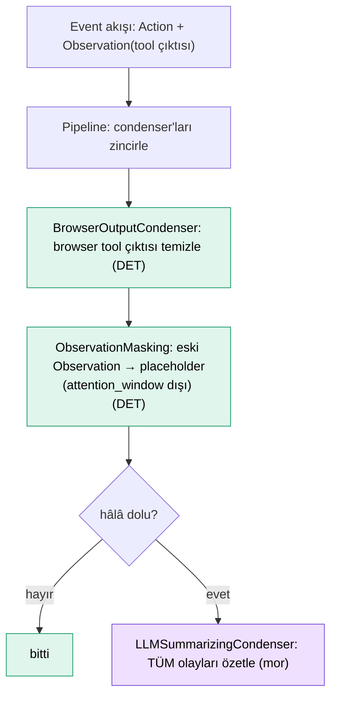

## 1.7 Google gemini-cli ✅ — bayat browser snapshot'ını supersede (belirli tool için staleness)

**Tool-trace işi (düzeltilmiş — grep'le netleşti):** `onBeforeTurn` **genel** bir kancadır (ajan tanımı model çağrısından önce geçmişi değiştirebilir). Ama **shipped somut implementasyon** browser subagent'ına özel: `supersedeStaleSnapshots` — `take_snapshot` tool'unun eski çıktılarını (her biri **tam accessibility tree**, sadece "güncel sayfa" anlamlı) placeholder'la değiştirir. Yani **belirli bir tool için staleness** — Cline'ın dosya-okuma dedup'ının browser-snapshot muadili.

**Kullanılan semboller (grep-doğrulandı):**
| Sembol | Ne yapar |
|---|---|
| `onBeforeTurn(chat, signal)` | **Genel** kanca — model çağrısından önce geçmişi değiştir. Diğer ajanlar kendi supersede'ini takabilir. |
| **`supersedeStaleSnapshots(chat)`** | Shipped kullanım — eski `take_snapshot` çıktılarını bayat sayıp değiştirir (sadece en güncel sayfa snapshot'ı kalır). |
| `SNAPSHOT_SUPERSEDED_PLACEHOLDER` | *"[Snapshot superseded — a newer snapshot exists later in this conversation…]"* — bizim SİL notumuzun snapshot-özel hali. |
| `tryCompressChat(prompt_id, force, signal)` | (ayrı, genel) tüm konuşmayı LLM'le özetler. |
| `COMPRESSION_FAILED_INFLATED_TOKEN_COUNT` | Özet ham'dan büyürse → iptal (**fayda freni**, bizimkiyle aynı). |

Yani gemini'nin **tool-trace** kısmı: browser snapshot'ları için "en güncel kalır, eskiler bayat" (yeşil, staleness) + genel `onBeforeTurn` kancası. `tryCompressChat` genel context'tir (mor). **Not:** bu, Cline gibi, belirli bir tool için (take_snapshot) "son-en-taze" staleness — tezimizi destekleyen ikinci örnek.

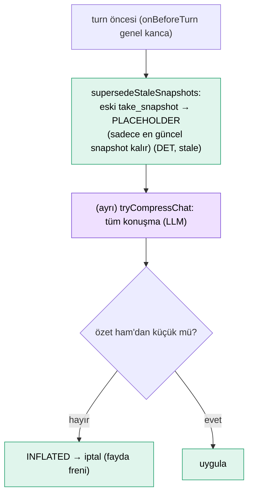

## 1.8 Roo-Code ✅ — dosya-okuma tool çıktılarını "katlama"

**Tool-trace işi:** En ilginç deterministik davranış. `generateFoldedFileContext()` eski **dosya okuma tool çıktılarını** ham içerik yerine **yapısal outline'a katlar** (tree-sitter ile). Yani "dosyanın 500 satırı" yerine "şu fonksiyonlar/tanımlar var" özeti kalır — bir IDE'nin kod-katlama (folding) özelliği gibi. Bu, "aynı dosya bağlamda ham duruyor" israfına en yakın deterministik çözüm.

**"Katlama" tam olarak ne:** `parseSourceCodeDefinitionsForFile` (tree-sitter) dosyayı ayrıştırıp **tanım listesini** (fonksiyon/sınıf/method imzaları) çıkarır; ham gövde atılır, outline kalır. Bizim `tool_gist`'in kod-özel, çok daha zengin hali.

**Kullanılan fonksiyonlar (tam pipeline — grep-doğrulandı):**
| Sembol | Ne yapar |
|---|---|
| `manageContext()` (eski `truncateConversationIfNeeded`) | Ana giriş — bağlam yönetimini yönetir. |
| `generateFoldedFileContext()` · `parseSourceCodeDefinitionsForFile` | Dosya okuma çıktısını tree-sitter outline'ına katlar (DET, tool-trace kısmı). |
| `summarizeConversation()` | autoCondense açıksa LLM özeti (özet=user). |
| **`truncateConversation(messages, fracToRemove=0.5, taskId)`** | **Non-destructive sliding-window** (fallback): mesajları **silmez**, `truncationParent` ile etiketler (gizler) + truncation marker ekler. `fracToRemove=0.5` (ilk hariç mesajların yarısını gizle). OpenCode'un timestamp-hide'ına benzer. |
| `injectSyntheticToolResults()` | Sentetik tool_result enjekte eder — tool_call↔tool_result eşleşmesi bozulmasın (bizim messages köprüsü kaygısı!). |
| `getEffectiveApiHistory()` · `cleanupAfterTruncation()` · `condenseParent` | Efektif geçmiş (gizlenenler hariç) · kırpma sonrası temizlik · zincir bağlama. |

Roo'nun üç yolu: dosya-fold (yeşil, tool-trace) → LLM condense (mor) → non-destructive sliding-window truncation (yeşil, fallback). Cline'ın aksine **duplicate file-read dedup'ı YOK** (grep-doğrulandı) — sadece fold.

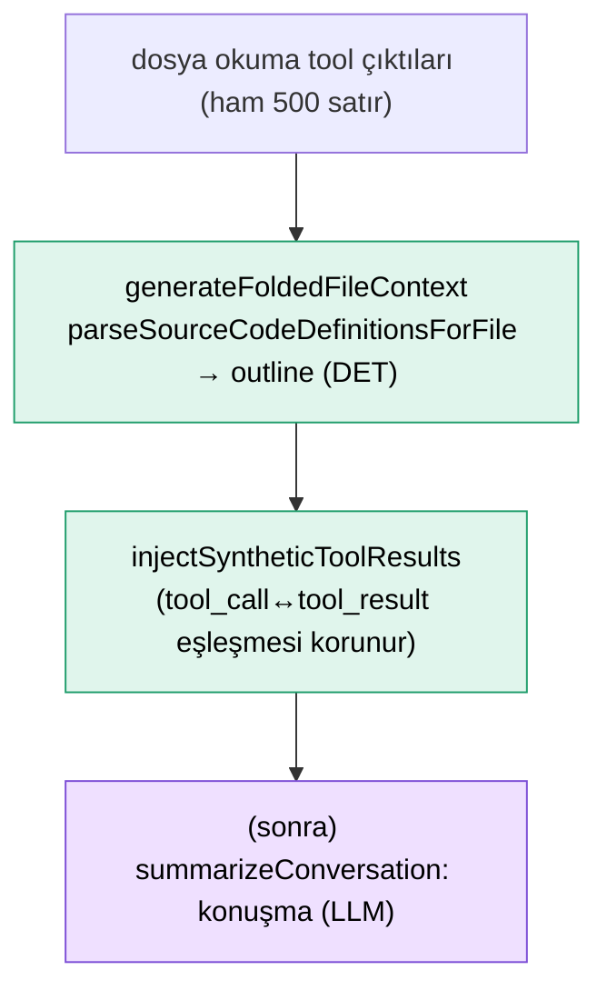

## 1.9 OpenCode (sst) ✅📄 — tool çıktısını zaman-damgasıyla "gizleme"

**"Gizleme" (timestamp-hide) tam olarak ne:** OpenCode, eski tool çıktısını mesaj listesinden **silmez** — bir **zaman sınırı** koyar ve o sınırdan eski içeriği **modele gönderilen bağlamdan hariç tutar**, ama transcript deposunda **olduğu gibi kalır** (geri alınabilir/scroll'lanabilir). Yani "soft delete by time": veri diskte durur, sadece prompt'a **konmaz**.

**Kanıt (SDK kodundan ✅):** `SessionTime` yapısında `Created` · `Updated` · **`Compacting`** alanları var — `Compacting` bir **zaman-damgası sınırı**. Ve bir `SessionCompacted` event'i + `session/{id}/summarize` endpoint'i var. Yani compaction bir zaman noktası işaretler; o noktadan eskisi görünmez olur.

**Neden silmek yerine gizlemek:**
1. **Geri alınabilir** — OpenCode'un mesaj `revert`/restore mekanizması var ("Restore all reverted messages"); gizlenen içerik kaybolmaz, geri getirilebilir.
2. **Kayıt bozulmaz** — transcript tam kalır (audit, dallanma, yeniden oynatma için).
3. **Eşleşme korunur** — tool_call↔tool_result çifti depoda durduğu için yapı bozulmaz.

**İki adımlı akış (blog 📄):**
- **Adım 1 (DET):** Pruning >20K token açacaksa, `Compacting` sınırından eski tool çıktılarını **gizle** (silme). `skill` çıktıları asla gizlenmez; son 40K token + son 2 user turn korunur.
- **Adım 2 (LLM, gerekirse):** Hâlâ doluysa gizlenmemiş kalanı özetletir; sonra son user mesajını **replay** eder (özet kullanıcının dilini takip eder).

Fark: Codex "sil" (kalıcı kayıp), Claude Code "clear placeholder" (yerinde temizle), **OpenCode "gizle" (depoda tut, prompt'tan çıkar)** — üçü de tool çıktısını küçültür ama farklı geri-dönülebilirlikle.

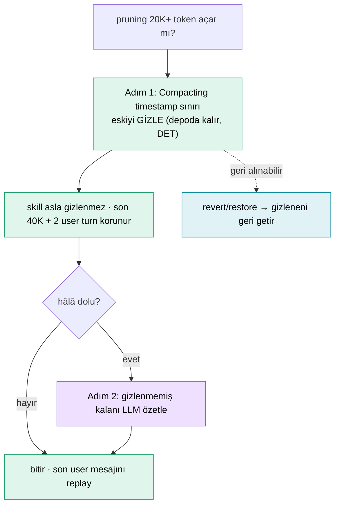

## 1.10 Cline ✅ — duplicate/stale **dosya okuması** kaldırma (bize EN yakın)

**Tool-trace işi:** Cline'ın üç mekanizması var; en önemlisi (ve bu manzarada bize **en yakın** olanı): aynı dosya birden çok okunduğunda **eski okumayı kaldırıp** yerine "en güncele bak" notu koyar. Bu **dedup + staleness** — deterministik, LLM'siz.

**Kullanılan fonksiyonlar (üçü de):**
| Sembol | Ne yapar |
|---|---|
| **`formatResponse.duplicateFileReadNotice()`** | Aynı dosyanın **eski okumasını** kaldırır: *"[[NOTE] This file read has been removed to save space… Refer to the **latest** file read for the **most up to date** version.]"* → **dedup** (tekrar okuma) + **staleness** ("en güncel = son okuma"). Sürüm sayacı yok ama "son okuma tazedir" kuralı bizim staleness'imizin dosya-özel hali. |
| `getNextTruncationRange(history, deletedRange, "quarter"\|"half")` | Limite yaklaşınca eski mesajların **çeyreğini/yarısını** at (deterministik sliding-window); `conversationHistoryDeletedRange` ile izler. |
| `contextTruncationNotice()` · `CONTEXT_WINDOW_WARNING_THRESHOLD_PERCENT = 50` | Kırpma bildirimi + %50 uyarı eşiği. |
| `summarize_task` (`basic\|agentic`) | (son çare) LLM condense. |

Yani Cline, tool-trace ekseninde **üç katman**: dosya-okuma dedup/staleness (yeşil, bize yakın) → sliding-window truncation (yeşil) → LLM condense (mor).

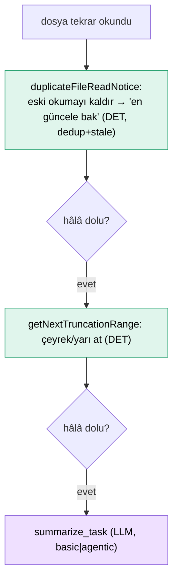

## 1.11 SWE-agent ✅ — history processor'larla gözlem (tool çıktısı) eleme

**Tool-trace işi:** SWE-agent'ta `observation` = environment/tool çıktısı. **Pluggable `history_processors`** (OpenHands condenser'larına benzer) tool çıktılarını deterministik işler. **Orijinal SWE-agent makalesinin** yöntemi budur — alanın en eski deterministik yaklaşımlarından.

**Kullanılan sınıflar (grep-doğrulandı, `history_processors.py`):**
| Sınıf | Ne yapar |
|---|---|
| `DefaultHistoryProcessor` | Pass-through (değiştirmez). |
| **`LastNObservations(n=5)`** | *"En klasik processor, orijinal makalede kullanıldı"* — **son n gözlem hariç hepsini eler**; elenen gözlem yerine **"Old environment output: (n lines omitted)"** konur (DET, tool-özel). |
| `ClosedWindowHistoryProcessor` | Pencere-tabanlı gözlem sınırlama. |
| `TagToolCallObservations` | Tool-call gözlemlerini etiketler (seçici işleme için). |
| `CacheControlHistoryProcessor` | Cache kontrolü (prompt cache). |

`LastNObservations` bizim koruma penceresi + SİL kombinasyonuna benzer: son N tool çıktısı ham, eskiler "(n satır atlandı)" notuna iner. Ama ilişki (tekrar/bayat/sürüm) değil, sadece **konum** (son N).

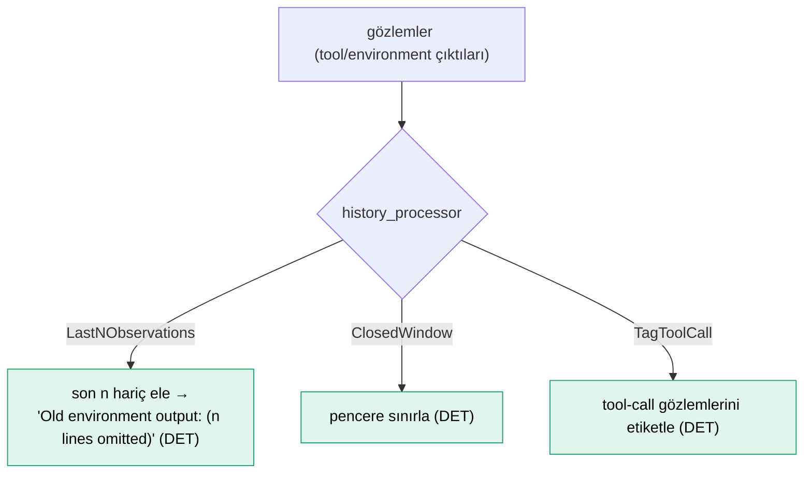

---

# §2 — Tool-trace-farkında OLMAYAN sistemler (tool çıktısı = diyalog)

Bu sistemler tool çıktısına **özel davranmaz** — tüm `SessionEntry`/mesajı birlikte LLM'e özetletirler. Yani *context* compaction yaparlar, *tool-trace* değil. Kısaca:

| Sistem | Ne yapar | Tool çıktısına özel? |
|---|---|---|
| **QM** ✅ | LLM tüm-geçmiş özeti, çift-tavan (400 girdi/120K token), `contextSummaryPayload` başa | ❌ tüm `SessionEntry` aynı |
| **Plandex** ✅ | rolling summary, özel summarizer rolü, arka plan | ❌ tüm konuşma |
| **Aider** ✅ | `history.py` → `ChatSummary.summarize()`: LLM whole-history özeti, **recursive-halving** (uzunsa ikiye böl, depth cap 5) + **multi-model fallback** (`simple_send_with_retries`, sırayla dener); özet=user, `summary_prefix`'li. + repo-map (ayrı). | ❌ konuşma bütünü |
| **Amp / Goose** 🔖⚠️ | thread/konuşma özeti (genel bilgi) | ❌ |
| **LangGraph** 🔖⚠️ | `SummarizationNode` / `trim_messages` (genel bilgi) | ❌ |
| **Letta/MemGPT** 🔖⚠️ | bellek paging / öz-düzenleyen hafıza (genel bilgi) | ❌ (bellek yönetimi, tool-trace değil) |

Bunlar için tool çıktısı, geçmişin herhangi bir parçası gibi özetlenir; "aynı tool'u tekrar çağırdın" ya da "bu tool okuması bayatladı" kavramı **yoktur**.

> **⚠️ Doğrulama açığı:** Amp (Sourcegraph — büyük ölçüde kapalı), Goose, LangGraph, Letta/MemGPT bu turda **grep'le doğrulanamadı** (denenen terimlerle sonuç çıkmadı; repo'lar farklı adlandırma kullanıyor olabilir ya da mantık başka modülde). Bunları "genel bilgiden" (🔖) sayın, kesin değil — özellikle "tool-trace-özel yok" iddiası bu dördü için **teyit edilmedi**. Cline/SWE-agent örneği (§1'e taşındılar) gösterdi ki grep'lemeden "yok" demek risklidir.

---

# §3 — Bizim sistem (hybrid-compaction) — tamamı ilişki-farkında tool-trace

**Tool-trace işi:** Sistemin **tamamı** tool izi üzerine. Her tool çağrısını ledger'a işler ve **çağrılar arası ilişkiyi** bilir: aynı kaynağın tekrarı (dedup), sürüm/TTL ile bayatlık (staleness), kategori (read/write/search), ve CWL episode bağımlılığı. Sıfır LLM (opsiyonel katman hariç).

**Fonksiyonlar (tool-trace çekirdeği):**
| Sembol | Ne yapar |
|---|---|
| `ledger.record(name, args, output, seq)` | Her tool çağrısını kaynak/sürüm/kategori/TTL ile işler. |
| `is_stale(seq)` | İki kapı: mutasyon (`obs.local_counter < current`) VEYA volatilite (`step − obs.step > ttl`). |
| `_detect_duplicate` | Aynı kaynak+sürüm daha önce okundu mu → tekrar. |
| `tool_gist(name, args, output, meta)` | Tip-farkında tek-satır `sonuç` (Hermes'ten). |
| `_evict` / `_clear` (fayda freni) | ÖZET (5-alan) / SİL (stub); özet ham'dan büyükse geri al. |
| `evictable_expl` (CWL) | Bağımlılık-farkında episode eviction. |
| `render_event(ev, filter_safe)` | Kader'i messages'a yaz; `tool_call_id` korunur. |

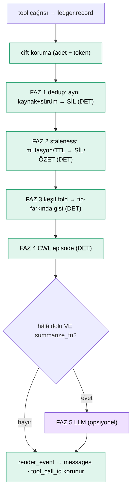

---

# §4 — Tool-trace ekseninde karşılaştırma

| Sistem | Tool çıktısına ne yapar | Yöntem | Çağrılar-arası ilişki? |
|---|---|---|---|
| **Hermes** | tip-farkında **tek satır** | DET şablon | ❌ (drop_stale kaba) |
| **Headroom** | tipe göre **algoritmik sıkıştır** + geri-çağır | DET + küçük model | ❌ (satır-içi dedup var, çağrı-arası yok) |
| **Codex** | **orta-kes** + sil | DET boyut | ❌ |
| **Claude Code** | **temizle** (placeholder) | DET | ❌ |
| **OpenClaw** | oversized **kes** | DET | ❌ |
| **OpenHands** | eski gözlemi **maskele** | DET | ❌ |
| **SWE-agent** | son N gözlem hariç **ele** ("n lines omitted") | DET | ❌ (konum, ilişki değil) |
| **gemini-cli** | bayat **snapshot**'ı supersede | DET | ✅ **kısmi stale** (take_snapshot-özel, sürümsüz) |
| **Roo** | dosya okumasını **katla** | DET (tree-sitter) | kısmi (fold, sürümsüz) |
| **Cline** | **eski dosya okumasını kaldır** ("en güncele bak") | DET | ✅ **kısmi dedup+stale** (dosya-özel, sürümsüz) |
| **OpenCode** | zaman-damgasıyla **gizle** | DET | ❌ |
| **QM/Plandex/…** | özel yok — birlikte özetle | LLM | ❌ |
| **BİZ** | **dedup + bayat + kategori + CWL** | DET ledger | ✅ **her kaynak, sürüm/TTL, CWL** |

## Üç gözlem (düzeltilmiş — bkz. dürüstlük notu)
1. **Tool-trace-farkında sistemlerin çoğu tekil çıktıyı** ele alır (kes / tek-satıra indir / maskele / gizle) — yani **output compaction**. §13'ün "output compaction bir şeyi kaçırır" çizgisi: tek çıktıyı küçültür, **çağrılar arası** israfı görmez.
2. **Çağrılar-arası ilişkiyi (gerçek "trace" compaction) kısmen gören sistemler var** — ve bu, önceki iddiamı **çürütüyor**:
   - **Cline** — `duplicateFileReadNotice`: aynı dosya tekrar okununca **eski okumayı kaldırır**, "en güncele bak" der. Bu **dedup + staleness** (dosya-özel, deterministik). En yakın örnek.
   - **gemini-cli** — bayat tool çıktısını supersede (sürümsüz).
   - **Roo** — dosya okumasını katlar (dedup değil, yapısal fold).
3. **Bizim farkımız — "yok" değil, "genel":** Cline dedup/staleness'i **sadece dosya okumaları** için, sürüm sayacı olmadan yapar. Bizim ledger **her kaynak** için (ticker, issue, doc, org...), **sürüm sayacı + TTL volatilitesi + CWL episode** ile yapar. Yani fark **kapsam ve mekanizma** (dosya-özel kural vs genel ledger), **varlık/yokluk** değil.

> **Dürüstlük notu:** İlk sürümde "hiçbir sistemde ilişki-farkında dedup/staleness yok, sadece bizde" demiştim — bu **yanlıştı**. Cline'ın `duplicateFileReadNotice`'ı (grep-doğrulandı) dosya okumaları için tam bunu yapıyor. Doğru ifade: **genel, sürüm/TTL-farkında ilişki ledger'ı** (her kaynak + CWL) manzarada hâlâ tek bizde; ama dosya-özel dedup/staleness Cline'da var.

**Alınacak fikirler (tool-trace için):** Cline'ın dosya-okuma dedup notu (bizim ledger'ın basit hali — doğruluyor ki fikir sağlam) · Hermes'in tip-farkında tek-satır şablonu · Headroom'un tip-özel compressor'ları + CCR geri-çağırma · gemini-cli'nin fayda freni. `tool_gist` + `render_event`'i zenginleştirir (özellikle Headroom-tarzı CCR retrieve: SİL yerine "seq ile geri getir").

---

**Kaynaklar (tool-trace ilgili dosyalar):**
- Hermes: `NousResearch/hermes-agent` — `context_compressor.py` (`_summarize_tool_result`, `drop_stale_api_content`) ✅
- Headroom: `headroomlabs-ai/headroom` — `content_router.py`, `smart_crusher.py`, `crusher.rs`, `code_compressor.py`, `kompress_compressor.py`, `ccr/`, `log/search/diff_compressor.rs` ✅
- Codex: `openai/codex` — `tool_output_token_limit`, `utils/output-truncation`, `compact.rs` ✅
- OpenClaw: `openclaw/openclaw` — `tool-result-truncation`, `overflow-context-recovery.ts` ✅
- OpenHands: `OpenHands/software-agent-sdk` — `condenser/` (ObservationMasking) ✅
- gemini-cli: `google-gemini/gemini-cli` — `agents/local-executor.ts` (onBeforeTurn), `core/client.ts` ✅
- Roo: `RooCodeInc/Roo-Code` — `core/condense/foldedFileContext` ✅
- QM: `yc-software/qm` — `core/orchestrator/compaction.ts` (tool çıktısı = SessionEntry, özel yok) ✅
- [Codex/Claude Code/OpenCode karşılaştırması — Justin3go](https://justin3go.com/en/posts/2026/04/09-context-compaction-in-codex-claude-code-and-opencode) 📄

*Ağustos 2026 tarama durumu. ✅ gerçek koddan, 📄 karşılaştırmalı yazıdan, 🔖 genel bilgiden. Yalnız tool-trace kapsamı; genel context compaction bilerek dışarıda.*
