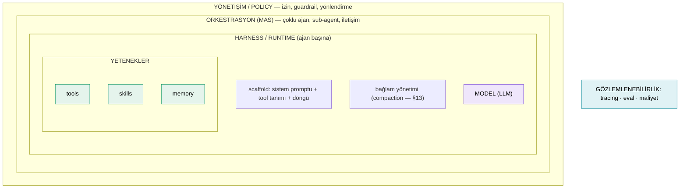
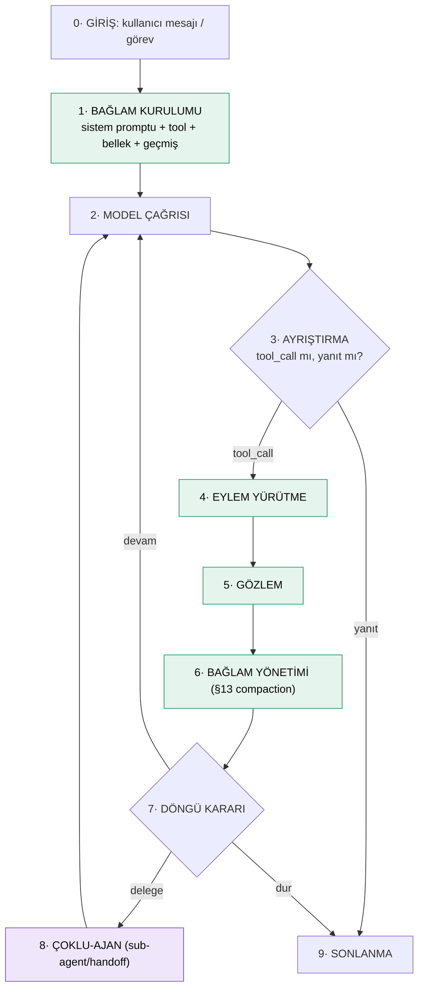

# 14 — Büyük Agentic Mimariler: Mega-Atlas (mimari + harness, birleşik)

**Ağustos 2026 · §14 (birleşik) · doküman + kod taraması**

Bu doküman iki bakışı **tek yerde** birleştirir: her büyük ajanın (a) **mimarisi** — 8 eksende ne yaptığı (harness/scaffold · tool · skill · memory · MAS/orkestrasyon · sub-agent · iletişim · policy) ve (b) **harness'ı baştan sona** — kullanıcı girdisinden nihai yanıta kontrol döngüsünün her adımı, tam haritayla. Her sistem tek bölümde: **8-eksen tablosu + harness adımları + harness haritası + öne çıkan.**

> **Doğrulama:** ✅ resmi doküman/koddan · 📄 karşılaştırmalı yazı/makaleden · 🔖 genel bilgiden.
> §13 (tool-trace compaction) bu atlasın "aşama 6 (bağlam yönetimi)" derinliğidir; oraya atıf verilir.

---

## §0 — İki çerçeve: katman haritası + evrensel harness iskeleti

### 0.1 Katmanlar (mimari)
Büyük ajan sistemi bir soğandır — dıştan içe:



### 0.2 Evrensel harness iskeleti (9 aşama)
Ne kadar farklı görünseler de her harness şu 9 aşamayı bir döngüde koşturur. Sistemleri ayıran, bu aşamaları **nasıl** doldurduklarıdır.



### 0.3 8-eksen analiz şablonu

| eksen | soru |
|---|---|
| **harness / scaffold** | döngü nasıl kurulu? (loop primitive: ReAct / plan-execute / generate-test-repair / retry / tree-search) |
| **tool** | tool nasıl tanımlanır/çağrılır? (native FC / MCP / XML / registry) |
| **skill** | paketlenmiş prosedür var mı? |
| **memory** | kısa/uzun/epizodik + retrieval nasıl? |
| **MAS / orkestrasyon** | tek mi çoklu mu? desen (supervisor/hiyerarşik/swarm/group-chat/assembly-line)? |
| **sub-agent** | uzman alt-ajan? kendi context/izni? |
| **iletişim** | handoff / pub-sub / shared state / structured schema? |
| **policy** | izin/güvenlik/guardrail? |

**Taksonomi (Inside the Scaffold, arXiv 2604.03515 📄):** mimariler ayrık tipler değil, **5 döngü ilkesinin** (ReAct, generate-test-repair, plan-execute, multi-attempt retry, tree search) sürekli-eksende bileşimleri; 13 ajanın 11'i birden çok ilke kullanıyor.

### 0.4 Dört aile
- **A · Orkestrasyon framework'leri** (harness = graf/koordinatör): LangGraph, CrewAI, AutoGen/AG2, OpenAI Agents SDK, MetaGPT.
- **B · Harness-merkezli ürün ajanları** (harness = zengin runtime): Claude Agent SDK, OpenHands, Goose, Hermes.
- **C · Bellek-merkezli** (harness = bellek etrafında): Letta/MemGPT.
- **D · Kodlama/CLI ajanları** (§13'ün tool-trace sistemleri, tam-mimari): Codex, Cline, Roo, Aider, gemini-cli, OpenCode, OpenClaw, Plandex, QM, SWE-agent (+ Headroom: ajan değil, sıkıştırma-proxy).

---

# A · Orkestrasyon Framework'leri — harness = graf/koordinatör

## A.1 LangGraph ✅

**Konum:** Düğüm=ajan/tool/bellek, kenar=akış olan **graf**. Tek ajandan çoklu-ajana aynı primitiflerle.

| eksen | nasıl |
|---|---|
| harness/scaffold | graf yürütme motoru; koşullu/döngüsel kenarlar. Loop: ReAct + plan-execute |
| tool | LangChain `@tool`; ToolNode yürütür |
| skill | ayrı soyutlama yok (prompt+tool) |
| memory | **checkpointer** (kısa, thread state) + **store** (uzun, cross-thread) |
| MAS | **supervisor** (merkezi koordinatör) veya **swarm** (merkez yok, akran devri) |
| sub-agent | alt-ajanlar birer graf düğümü/ayrı graf |
| iletişim | **handoff tools** (`create_handoff_tool` — tüm geçmişi taşır) + paylaşılan state |
| policy | `interrupt`/HITL, koşullu kenarlar |

**Harness baştan sona:** (1) `graph.invoke({messages}, {thread_id})` → (2) checkpointer o thread'in son state'ini yükler (kaldığı yer); `pre_model_hook` bağlamı yeniden yazabilir (compaction köprüsü buraya) → (3) "agent" düğümü `call_model` (bind_tools) → (4) `tools_condition`: `tool_calls` varsa **ToolNode**, yoksa `END` → (5) ToolNode her çağrıyı çalıştırır → `ToolMessage` → (6) her düğüm dönüşünde **checkpointer state'i DB'ye yazar** (snapshot=kurtarma noktası) → (7) kenar "agent"e geri → tekrar model → (8) supervisor/swarm'da `Command(goto=...)` ile alt-ajana handoff (tüm geçmiş taşınır), iş bitince geri → (9) `END`.

**Kritik:** `Command` hem state-güncelleme hem yönlendirme taşır. Checkpointer time-travel + `interrupt` sağlar. Store = cross-thread uzun bellek.

```mermaid
flowchart TD
  IN["invoke(messages, thread_id)"] --> LD["checkpointer: state yükle"]
  LD --> PMH["pre_model_hook: bağlamı yeniden yaz (opsiyonel)"]
  PMH --> AG["agent: call_model (bind_tools)"]
  AG --> TC{tools_condition}
  TC -->|tool_calls| TN["ToolNode → ToolMessage"]
  TN --> CP["checkpointer: snapshot DB"]
  CP --> AG
  TC -->|handoff| SUP["Command(goto=alt-ajan)"]
  SUP --> AG
  TC -->|yanıt| END["END"]
  classDef a fill:#e5f4ec,stroke:#1f9d6b,color:#000; class LD,PMH,AG,TN,CP a
  classDef d fill:#efe6fb,stroke:#7c4dd6,color:#000; class SUP d
```
**Öne çıkan:** Alt-yapı (state+checkpointer) her deseni taşır; supervisor↔swarm aynı graf primitifleriyle. En "kütüphane" olanı.

## A.2 CrewAI ✅

**Konum:** İnsan-ekibi metaforu. 4 primitif: **Agent · Task · Crew · Flow**.

| eksen | nasıl |
|---|---|
| harness/scaffold | Crew yürütücü; process = `sequential` / `hierarchical`. Loop: plan-execute |
| tool | agent-başına tool (CrewAI+LangChain) |
| skill | rol/backstory + task talimatı (örtük) |
| memory | **katmanlı**: short (bu koşu) · long (SQLite, koşular-arası) · entity (kişi/nesne) |
| MAS | **hierarchical**: otomatik **manager agent** planlar, delege eder, doğrular |
| sub-agent | manager'ın delege ettiği worker'lar; Flow'da alt-crew |
| iletişim | task-context zinciri + manager delegasyonu |
| policy | task doğrulama (expected_output), guardrail, insan onayı |

**Harness baştan sona:** (1) `crew.kickoff(inputs)` → (2) her Agent promptu = role+goal+backstory+tool(+memory); task = description+expected_output → (3) process `hierarchical` ise CrewAI **manager agent** yaratır → (4) manager **`Delegate work to coworker`** ile uygun agent'a atar → (5) agent ReAct'la tool çağırır → (6) manager çıktıyı `expected_output`'a göre **doğrular**; yetersizse yeniden delege → (7) katmanlı bellek güncellenir → (8) task-context sonraki task'a zincir → (9) tüm task'lar bitince Crew çıktısı. **Flow ayrı harness:** `@start`/`@listen`/`@router` ile olay-güdümlü, deterministik.

**Kritik:** Crew (özerklik) vs Flow (determinizm) ayrımı; üç-katman bellek task-döngüsüne gömülü.

```mermaid
flowchart TD
  K["crew.kickoff"] --> P{process?}
  P -->|hierarchical| MG["manager agent (auto)"]
  MG -->|Delegate work| A1["worker: ReAct + tool"]
  A1 --> VAL{expected_output doğru mu?}
  VAL -->|hayır| MG
  VAL -->|evet| NEXT["sonraki task (context zinciri)"]
  NEXT --> MG
  MG & A1 --> MEM["short/long/entity memory"]
  NEXT --> OUT["Crew çıktısı"]
  classDef a fill:#e5f4ec,stroke:#1f9d6b,color:#000; class MG,A1,NEXT a
```
**Öne çıkan:** Rol/backstory + üç-katman bellek + Crew/Flow ayrımı. En "insan-ekibi" metaforlu.

## A.3 AutoGen / AG2 ✅

**Konum:** Ajanlar **ortak mesaj thread'i** paylaşır (pub/sub); `GroupChatManager` orkestra şefi. AG2 (eski AutoGen) event-güdümlü async çekirdek.

| eksen | nasıl |
|---|---|
| harness/scaffold | GroupChatManager döngüsü (konuşmacı-seç→topla→yayınla) |
| tool | agent'a bağlı fonksiyon; tool-executor agent deseni |
| skill | agent profili/sistem promptu |
| memory | ortak mesaj thread'i; harici bellek eklenebilir |
| MAS | **Group Chat** + desen: **AutoPattern** (LLM konuşmacı seçer), round-robin, manuel |
| sub-agent | ajanlar eşit; nested group-chat |
| iletişim | **pub/sub ortak thread** + hedefleme (`AgentTarget`, `RevertToUserTarget`) |
| policy | konuşmacı-seçim kuralı; UserProxyAgent; termination |

**Harness baştan sona:** (1) `manager.initiate_chat(message)` → (2) her agent kendi `system_message`; ortak thread herkese görünür → (3) `GroupChatManager` **speaker-selection** (AutoPattern/round-robin) → (4) seçilen agent yanıtlar (tool önerebilir; `UserProxyAgent`/executor çalıştırır) → (5) yanıt thread'e **broadcast** (tüm aboneler görür) → (6) döngü: seç→topla→yayınla → (7) termination (max tur / "TERMINATE" / insan) → (8) `RevertToUserTarget` ile insana/başka ajana devir → (9) son mesaj/özet.

**Kritik:** konuşmacı-seçimi harness'ın beyni; `UserProxyAgent` hem insan-döngü hem kod-yürütücü; event-güdümlü aktör modeli.

```mermaid
flowchart TD
  I["initiate_chat"] --> POOL[("ortak thread (pub/sub)")]
  POOL --> SEL["GroupChatManager: konuşmacı seç"]
  SEL --> SPK["seçilen agent yanıtlar"]
  SPK --> EXE["UserProxy/executor: tool çalıştır"]
  EXE --> BC["thread'e broadcast"]
  BC --> POOL
  SEL -->|RevertToUser| USR["insan"]
  BC --> TRM{termination?}
  TRM -->|hayır| SEL
  TRM -->|evet| OUT["son mesaj/özet"]
  classDef a fill:#e5f4ec,stroke:#1f9d6b,color:#000; class SEL,SPK,EXE,BC a
```
**Öne çıkan:** Konuşma-merkezli MAS; ortak thread + akıllı konuşmacı seçimi.

## A.4 OpenAI Agents SDK ✅

**Konum:** Swarm'ın production hâli. Minimalist: Agent · Tool · Handoff · Guardrail. `Runner` döngüyü yönetir.

| eksen | nasıl |
|---|---|
| harness/scaffold | `Runner` (turn+tool+handoff+guardrail+session). Loop: ReAct |
| tool | `@function_tool`; **agents-as-tools** |
| skill | ayrı yok (instructions+tool) |
| memory | **Sessions** (`session_id` ile geçmiş otomatik) |
| MAS | **handoff** (kontrol devri, bağlam taşır) veya **agents-as-tools** (delege, kontrol döner) |
| sub-agent | handoff hedefi / tool-olarak-ajan |
| iletişim | **handoff** + paylaşılan session |
| policy | **Guardrails** — paralel çalışır, fail-fast |

**Harness baştan sona:** (1) `Runner.run(agent, input, session)` → (2) instructions + tool; Session varsa geçmiş yüklenir → (3) **input guardrails paralel** başlar; tetiklenirse **fail-fast** (döngü başlamaz) → (4) model çağrısı → (5) `function_tool` çalışır / **handoff** hedef agent'a kontrol devri (bağlam taşınır) / **agents-as-tool** alt-agent tool gibi (kontrol döner) → (6) tool sonucu geçmişe, Session'a yazılır → (7) final output gelene kadar döner (`max_turns`) → (8) handoff ana çoklu-ajan deseni → (9) **output guardrails** → final output.

**Kritik:** **handoff (devir) ≠ agents-as-tool (delege)**; guardrail paralel/fail-fast; Session otomatik bellek.

```mermaid
flowchart TD
  R["Runner.run(agent, input, session)"] --> SES["Session: geçmiş yükle"]
  SES --> IG["input guardrails (paralel)"]
  IG -->|tetiklendi| STOP["fail-fast"]
  IG -->|temiz| M["model"]
  M --> D{çıktı?}
  D -->|function_tool| T["tool"] --> M
  D -->|handoff| H["KONTROL DEVRİ (bağlam taşınır)"] --> M
  D -->|agents-as-tool| AT["alt-agent tool (kontrol döner)"] --> M
  D -->|final| OG["output guardrails"] --> OUT["final output"]
  classDef a fill:#e5f4ec,stroke:#1f9d6b,color:#000; class SES,M,T,AT a
  classDef d fill:#efe6fb,stroke:#7c4dd6,color:#000; class H d
```
**Öne çıkan:** Az primitif, keskin handoff/agents-as-tool ayrımı, paralel guardrail.

## A.5 MetaGPT ✅

**Konum:** İnsan **SOP**'unu MAS'a kodlar: yazılım şirketi (PM→Mimar→Mühendis→QA). Ortak Environment (message pool).

| eksen | nasıl |
|---|---|
| harness/scaffold | SOP montaj-hattı. Loop: plan-execute |
| tool | rol-özel (kod yaz/çalıştır) |
| skill | **SOP = kurumsal skill** |
| memory | **shared message pool** (rol profiline göre abonelik) |
| MAS | **assembly-line** (sıralı, rol-özelleşme) |
| sub-agent | sabit roller (PM/Mimar/Mühendis/QA) |
| iletişim | **pub/sub pool** + **structured message schema** (serbest-metin değil) |
| policy | yapılandırılmış çıktı = kalite güvencesi |

**Harness baştan sona:** (1) `Team.run(idea)` → (2) her `Role` profil + `watch` (hangi mesaj tiplerine abone); ortak Environment → (3) rol mikro-döngüsü **`_observe → _think → _act`**: (a) havuzda bana ait yeni mesaj? (b) hangi Action? (c) Action çalıştır → (4) rol-özel Action (yaz/tasarla/kodla/test) → (5) çıktı **structured Message** olarak havuza publish (bilgi bozulmasını azaltır) → (6) sonraki rol `watch` tetiklenince ilerler (montaj hattı) → (7) havuz+rol belleği → (8) assembly-line → (9) SOP tamam (QA geçti/max round) → kod tabanı.

**Kritik:** `_observe/_think/_act` her rolün mikro-döngüsü; structured schema = harness'ın kalite mekanizması.

```mermaid
flowchart TD
  ID["Team.run(idea)"] --> ENV[("Environment: message pool (pub/sub)")]
  ENV --> OBS["Role._observe: bana ait mesaj?"]
  OBS --> THK["_think: hangi Action?"]
  THK --> ACT["_act: rol Action'ı"]
  ACT --> PUB["structured Message publish"]
  PUB --> ENV
  ENV -.watch.-> NEXT["sonraki rol (PM→Mimar→Müh→QA)"]
  NEXT --> OBS
  PUB --> DONE{SOP tamam?}
  DONE -->|evet| OUT["kod tabanı"]
  classDef a fill:#e5f4ec,stroke:#1f9d6b,color:#000; class OBS,THK,ACT,PUB,NEXT a
```
**Öne çıkan:** SOP + structured-schema iletişimi — "kurumsal süreç", bilgi bozulmasına en dirençli.

---

# B · Harness-merkezli Ürün Ajanları — harness = zengin runtime

## B.1 Claude Agent SDK ✅

**Konum:** Claude Code'un altyapısı kütüphane olarak. Tek güçlü ajan + zengin runtime; subagent'lar opsiyonel çoklu-ajan.

| eksen | nasıl |
|---|---|
| harness/scaffold | tam agentic runtime; turn içi kontrol dışarı verilmez. Loop: ReAct+retry |
| tool | built-in (Read/Write/Edit/Bash/Grep/Glob/Web) + **MCP** + custom |
| skill | **Skills** — çağrılınca ana konuşmaya yüklenen prompt/prosedür şablonları |
| memory | **Sessions** (resume → okunan dosyalar/çıkarımlar) + CLAUDE.md + context editing |
| MAS | lead + **subagent** ("agent teams") |
| sub-agent | **her subagent kendi context + prompt + tool izni** (araştırma subagent'ı dosya yazamaz) |
| iletişim | lead↔subagent görev/özet |
| policy | **permission + hooks** (Pre/PostToolUse/Stop/SessionStart…) |

**Harness baştan sona:** (1) `query(prompt, options)` → (2) **SessionStart hook** + CLAUDE.md/resume → (3) sistem promptu + built-in/MCP/custom tool + hafıza → (4) **UserPromptSubmit hook** → (5) model → **turn** başlar → (6) **PreToolUse hook** (tehlikeliyi blokla/izin kontrol) → (7) tool çalışır (Bash sandbox/MCP/dosya) → (8) **PostToolUse hook** (logla/değiştir) → turn içinde tekrar (uygulama kodu araya girmez) → (9) **subagent**: model `Task` verir → subagent **kendi context+prompt+izinle** çalışır, **özet** döner (lead transcript'i temiz) → (10) **Stop hook** (koşul yoksa durmayı bloklar) → SessionEnd + kaydet.

**Kritik:** hook'lar = deterministik policy motoru (LLM'e güvenmeden); subagent izolasyonu = bağlam-hijyeni + yetki-ayrımı; turn-içi kontrol verilmez → hook şart.

```mermaid
flowchart TD
  Q["query(prompt, options)"] --> SS["SessionStart hook + CLAUDE.md/resume"]
  SS --> UPS["UserPromptSubmit hook"]
  UPS --> M["model → turn"]
  M --> PRE["PreToolUse hook: blokla/izin"]
  PRE -->|izin| EX["tool (Bash/MCP/dosya)"]
  PRE -->|blokla| M
  EX --> POST["PostToolUse hook"]
  POST --> M
  M -->|Task| SA["subagent: kendi context+prompt+izin → özet"]
  SA --> M
  M --> STOP{Stop hook: durabilir mi?}
  STOP -->|hayır| M
  STOP -->|evet| SE["SessionEnd + kaydet"]
  classDef a fill:#e5f4ec,stroke:#1f9d6b,color:#000; class SS,UPS,M,EX a
  classDef d fill:#efe6fb,stroke:#7c4dd6,color:#000; class PRE,POST,STOP,SA d
```
**Öne çıkan:** Hook'lar + izole-context subagent'lar (izin-ayrımı). Policy/güvenlik en olgun.

## B.2 OpenHands ✅

**Konum:** Yazılım ajanı platformu. **Event-sourced**: her şey tiplenmiş event (Action/Observation) olarak tek EventStream'den akar; Agent stateless; AgentController süpervizör.

| eksen | nasıl |
|---|---|
| harness/scaffold | **event stream** (pub/sub) + AgentController. Loop: CodeAct+retry |
| tool | CodeAct — eylemler kod (bash/python) + browser/editor uzmanları |
| skill | **microagents** (doğal-dil/tetikleyici hafif ajanlar) |
| memory | **condenser**'lar (ObservationMasking/LLMSummarizing — §13) |
| MAS | tek generalist (CodeAct) + **delegation** |
| sub-agent | **AgentDelegateAction** — parent child controller doğurur, aynı stream'de |
| iletişim | **event stream** (Action/Observation) |
| policy | AgentController kısıt + güvenlik-inceleme + stuck detection |

**Harness baştan sona:** (1) `User Message` event → EventStream → (2) `ConversationMemory` EventLog'u mesaja çevirir + microagent enjekte + condenser sıkıştırır → (3) **AgentController.step** (kısıt/stuck kontrol) → (4) `CodeActAgent.step` → bir **Action** (`CmdRunAction`/`FileEditAction`/`IPythonRunCellAction`/`BrowseInteractiveAction`/`AgentDelegateAction`/`AgentFinishAction`) → (5) Action **sandbox**'ta (Docker) çalışır → **Observation** → (6) Observation stream'e publish → agent sonraki step'te görür → (7) condenser'lar stream'de sıkıştırır → (8) `AgentDelegateAction` → parent **child controller** yaratır, event'ler iletilir (aynı stream'de, replay'e tabi), biterken `AgentDelegateObservation` özet döner → (9) `AgentFinishAction` + güvenlik-inceleme.

**Kritik:** event-sourcing → replay+audit doğal; stateless Agent → kolay kurtarma; CodeAct → eylemler kod (tek güçlü arayüz).

```mermaid
flowchart TD
  U["User Message event"] --> ES[("EventStream + EventLog")]
  ES --> CM["ConversationMemory + microagent + condenser"]
  CM --> AC["AgentController.step (kısıt/stuck)"]
  AC --> AG["CodeActAgent.step → Action"]
  AG -->|CmdRun/FileEdit| RT["Runtime sandbox (Docker)"]
  RT -->|Observation| ES
  AG -->|AgentDelegateAction| CH["child controller (BrowsingAgent)"]
  CH --> ES
  AG -->|AgentFinishAction| DONE["güvenlik-inceleme → bitti"]
  classDef a fill:#e5f4ec,stroke:#1f9d6b,color:#000; class CM,AC,AG,RT a
  classDef d fill:#efe6fb,stroke:#7c4dd6,color:#000; class CH d
```
**Öne çıkan:** Event-sourced — delegasyon/bellek/güvenlik tek stream'e asılı; replay/audit doğal. §13 condenser'lar buranın bellek katmanı.

## B.3 Goose ✅

**Konum:** Block'un açık ajanı. Üç katman: runtime · MCP-extensions · recipe. Recipe hangi tool'un yükleneceğine karar verir (ajan değil).

| eksen | nasıl |
|---|---|
| harness/scaffold | runtime (plan→call→eval→repeat). Loop: ReAct |
| tool | **her tool bir MCP server** (70+ resmi, config ile ekle) |
| skill | **recipe** (YAML: hedef+extension+adım+checkpoint+sub-recipe) |
| memory | MCP resource storage (memory extension) |
| MAS | tek + **subagent** (paralel iş) |
| sub-agent | **native subagent süreci** (ayrı, izole) |
| iletişim | recipe/sub-recipe zinciri |
| policy | extension izni + recipe checkpoint |

**Harness baştan sona:** (1) `goose run --recipe X.yaml` → (2) YAML: hedef + **gerekli extension'lar** + adım/checkpoint → (3) seçili MCP extension'lar başlar → tool listesi montaj → (4) runtime **plan→tool çağır→değerlendir** → (5) her tool bir **MCP server**'a gider (GitHub/Jira/dosya/memory) → (6) sonuç geçmişe; checkpoint ilerleme → (7) döngü (recipe numaralı adım verirse yapılandırılmış) → (8) **subagent süreci** spawn (paralel iş, ana context kirlenmez) → (9) recipe/görev bitince.

**Kritik:** MCP-her-şey (tool=config); recipe=determinizm (free-form değil numaralı akış — Block'ta %60 kullanım); subagent ayrı süreç.

```mermaid
flowchart TD
  RUN["goose run --recipe X.yaml"] --> RC["recipe: hedef+extension+adım"]
  RC --> EXT["MCP extension'ları başlat → tool listesi"]
  EXT --> LOOP["runtime: plan→call→eval"]
  LOOP --> MCP["MCP server (GitHub/Jira/dosya/memory)"]
  MCP --> LOOP
  LOOP -->|spawn| SUB["subagent süreci (izole)"]
  SUB -->|sonuç| LOOP
  LOOP --> CKP["checkpoint → bitti"]
  classDef a fill:#e5f4ec,stroke:#1f9d6b,color:#000; class RC,EXT,LOOP,MCP a
  classDef d fill:#efe6fb,stroke:#7c4dd6,color:#000; class SUB d
```
**Öne çıkan:** MCP-her-şey + recipe determinizmi. Config-ile-genişleme.

## B.4 Hermes ✅

**Konum:** NousResearch açık-model FC ajanı. Ekseni **titiz sistem promptu** + XML-delimiter döngü (açık modeller için).

| eksen | nasıl |
|---|---|
| harness/scaffold | prompt-güdümlü; `<scratch_pad>` akıl yürüt, `<tool_call>` çağır. Loop: ReAct + **self-recursion** |
| tool | **XML delimiter** FC (`<tool_call>{json}</tool_call>`) |
| skill | few-shot + objective |
| memory | özyineli özet zinciri; tool çıktısı tek-satır (`_summarize_tool_result`, §13) |
| MAS | tek ajan (dış ajan/skill tool olarak) |
| sub-agent | doğrudan yok |
| iletişim | tek-ajan |
| policy | recursion-derinlik sınırı + XML şema doğrulaması |

**Harness baştan sona:** (1) kullanıcı mesajı → (2) `PromptManager`+`PromptSchema` (Pydantic) YAML promptu runtime verisiyle birleştirir: **Role**+**Objective**+**Tools**(XML imzalar)+**Examples** → (3) model → (4) çıktı `<scratch_pad>` (akıl yürüt) + `<tool_call>{json}` içerir; harness **XML parse eder** (native FC değil) → (5) `<tool_call>` çalışır → `<tool_response>` → (6) "önceki özete analiz ekle" → asistan CoT zinciri + tool çıktısı tek-satır → (7) **self-recursion** (yapılandırılabilir derinlik, sonsuz döngü engeli) → (8) tek ajan → (9) derinlik dolunca/tool bitince nihai yanıt.

**Kritik:** XML delimiter (açık modeller robust native FC yapamaz → metin-içi taşı, parse et); PromptManager veri-güdümlü/doğrulanabilir prompt; self-recursion+scratch_pad çok-adım akıl yürütme.

```mermaid
flowchart TD
  U["kullanıcı"] --> PM["PromptManager+Schema: Role+Objective+Tools(XML)+Examples"]
  PM --> M["model"]
  M --> PARSE["XML parse: &lt;scratch_pad&gt; + &lt;tool_call&gt;"]
  PARSE -->|scratch_pad| M
  PARSE -->|tool_call| EX["tool → &lt;tool_response&gt;"]
  EX --> SUM["özete analiz ekle + tool tek-satır"]
  SUM --> REC{recursion < limit?}
  REC -->|evet| M
  REC -->|hayır| OUT["nihai yanıt"]
  classDef a fill:#e5f4ec,stroke:#1f9d6b,color:#000; class PM,M,EX,SUM a
```
**Öne çıkan:** Prompt-mimarisi + XML-delimiter FC — açık modellerde robust tool-use referansı.

---

# C · Bellek-merkezli — harness bellek etrafında döner

## C.1 Letta / MemGPT ✅

**Konum:** LLM'i **işletim sistemi** gibi kullanır (bağlam=RAM). Ajan kendi belleğini **fonksiyon çağırarak** yönetir (self-editing paging).

| eksen | nasıl |
|---|---|
| harness/scaffold | bellek-yönetimli reasoning; her yanıt = fonksiyon. Loop: ReAct+bellek-eylem |
| tool | **bellek araçları**: `core_memory_append/replace`, `conversation_search`, `archival_memory_insert/search`, `send_message` |
| skill | persona/memory blokları |
| memory | **üç katman**: Core (RAM, bağlamda) · Recall (disk cache) · Archival (soğuk depo); **memory blocks** (pinli, düzenlenebilir) |
| MAS | tek + **paylaşılan memory blocks** (çok-ajan bellek) |
| sub-agent | bellek-paylaşan ajanlar |
| iletişim | paylaşılan/düzenlenebilir bloklar |
| policy | blok sınırı/boyut; bellek ajan kontrolünde |

**Harness baştan sona:** (1) mesaj/event → (2) bağlam: sistem + **Core Memory blokları** (pinli: user/persona/task) + son konuşma; Core dolmaya yakınsa eski içerik Recall/Archival'e **page-out** → (3) model reasoning; **her yanıt bir fonksiyon** → (4) bellek fonksiyonu: `core_memory_append/replace` (RAM düzenle), `conversation_search` (Recall), `archival_insert/search` (soğuk depo), ya da normal tool → (5) sonuç bağlama; `send_message` kullanıcıya → (6) **self-editing**: ajan kendi kararıyla neyi hatırlayacağını yazar (otomatik compaction DEĞİL) → (7) `request_heartbeat` ile tek turda çoklu adım → (8) **paylaşılan blok** bir bloğu çok ajanca yönetilebilir kılar → (9) `send_message` sonrası bekle (stateful — durum kalıcı).

**Kritik:** self-editing (bellek = ajanın tool'la yaptığı iş, harness'ın otomatik işi değil — Cline/OpenHands compaction'ının tersi); memory blocks pinli+düzenlenebilir; stateful (server restart'ta bellek durur).

```mermaid
flowchart TD
  U["mesaj/event"] --> CTX["bağlam: sistem + Core blokları(pinli) + son konuşma"]
  CTX --> M["model: her yanıt = fonksiyon"]
  M -->|core_memory_append/replace| CORE[("Core: RAM")]
  M -->|conversation_search| REC[("Recall: disk cache")]
  M -->|archival_insert/search| ARC[("Archival: soğuk depo")]
  M -->|normal tool| TOOL["tool"]
  CORE & REC & ARC & TOOL --> HB{request_heartbeat?}
  HB -->|evet| M
  M -->|send_message| OUT["yanıt (bekle)"]
  CORE -.paylaşılan blok.-> M2["başka ajan"]
  classDef a fill:#e5f4ec,stroke:#1f9d6b,color:#000; class CTX,M,TOOL a
  classDef mem fill:#e0f2f5,stroke:#0d8b9c,color:#000; class CORE,REC,ARC mem
```
**Öne çıkan:** Self-editing bellek + OS-benzeri katmanlar. Bellek mimarinin merkezi; ajan neyi hatırlayacağına kendi karar verir.

---

# D · Kodlama/CLI Ajanları — harness = terminal/IDE döngüsü

> §13'te "tek ajan" sandığım birçoğu aslında **gerçek sub-agent/rol yapısına** sahip (Roo, gemini-cli, OpenClaw, OpenCode, Plandex) — sadece tool-trace merceğinde görünmüyordu. Tek-ajan kalanlar: Codex, Cline, Aider, SWE-agent. QM çok-**kullanıcı** (çok-ajan değil). Headroom ajan değil, ara-katman.

## D.1 OpenAI Codex ✅ — sandbox'lı agent loop
| eksen | nasıl |
|---|---|
| harness | agent loop; prompt-cache'e duyarlı (tool sırası sabit). Loop: plan-execute+retry |
| tool | shell (sandboxed) + MCP (sandbox dışı, kendi guardrail'i) |
| skill | `AGENTS.md`/`AGENTS.override.md` (kök→cwd, 32 KiB) |
| memory | orta-kes + compaction handoff (§13) |
| MAS/sub-agent | **tek ajan** (Codex→MCP-server olup Agents SDK ile çokluya sokulabilir) |
| policy | **approval policy** + **granüler onay** (çok-adım shell'de her komuta approval ID) + `requirements.toml` org-kısıt |

**Harness:** (1) `codex "görev"` → (2) `AGENTS.md` zinciri + shell tool (sabit sıra=cache) → (3) model → (4) `shell` `tool_call` → (5) **approval** (on-request→insana; granüler ID) → (6) **OS-sandbox** (ağ yok, yazma=workspace) → (7) çıktı orta-kes → (8) taşarsa compaction handoff → (9) döngü→bitiş.
```mermaid
flowchart TD
  C["codex 'görev'"] --> CTX["AGENTS.md + shell tool (sabit sıra)"]
  CTX --> M["model"]
  M -->|shell tool_call| AP{approval?}
  AP -->|onayla (granüler ID)| SB["OS-sandbox: ağ yok"]
  SB --> TR["orta-kes → geçmiş"]
  TR --> OVF{taştı?}
  OVF -->|evet| CMP["compaction handoff"] --> M
  OVF -->|hayır| M
  classDef a fill:#e5f4ec,stroke:#1f9d6b,color:#000; class CTX,M,SB,TR a
```
**Öne çıkan:** OS-sandbox + granüler onay + org `requirements.toml`. En sıkı tek-ajan policy.

## D.2 Cline ✅ — Plan/Act iki-faz
| eksen | nasıl |
|---|---|
| harness | **Plan/Act** iki-faz. Loop: ReAct | tool: VSCode+terminal+MCP | skill: `.clinerules` |
| memory | dedup (`duplicateFileReadNotice`)+truncation+`summarize_task` (§13) |
| MAS/sub-agent | **tek ajan** | policy: **her edit/komut onayı** + checkpoint |

**Harness:** (1) görev → (2) **Plan modu**: bağlam+plan yaz, **kullanıcı onaylar** (dosyaya dokunulmaz) → (3) **Act modu**: tool_call (VSCode/terminal/MCP) → (4) **her edit/komut onayı** → (5) çalıştır+checkpoint → (6) dosya tekrar→`duplicateFileReadNotice` → (7) limitte `getNextTruncationRange` → (8) döngü → (9) `attempt_completion`.
```mermaid
flowchart TD
  T["görev"] --> PLAN["Plan: bağlam+plan"]
  PLAN --> OK1{kullanıcı onayı}
  OK1 -->|evet| ACT["Act: tool_call"]
  ACT --> OK2{her edit onayı}
  OK2 -->|onayla| RUN["çalıştır+checkpoint"]
  RUN --> ACT
  ACT -->|attempt_completion| DONE["bitti"]
  classDef a fill:#e5f4ec,stroke:#1f9d6b,color:#000; class PLAN,ACT,RUN a
```
**Öne çıkan:** Plan/Act + zorunlu onay. En insan-kontrollü tek ajan.

## D.3 Roo-Code ✅ — çok-mod + Boomerang orchestrator
| eksen | nasıl |
|---|---|
| harness | **çoklu-mod** (architect/code/ask/debug/custom). Loop: ReAct | tool: dosya+tree-sitter+MCP (mode-bazlı izin) |
| memory | `generateFoldedFileContext`+non-destructive truncation (§13) |
| MAS/sub-agent | **Orchestrator (Boomerang)** — subtask'a böl, mode'a delege, **her subtask izole context**, özet döner |
| policy | mode-bazlı tool izni (rol-ayrımı) |

**Harness:** (1) görev bir mode'a → (2) **Orchestrator**: subtask'lara böl → (3) her subtask'ı uygun mode'a **`new_task` ile delege** → (4) subtask **izole context'te** (kendi konuşma) çalışır → (5) `attempt_completion`→**özet** parent'a → (6) Orchestrator özetle sonraki subtask'ı planlar → (7) hepsi bitince birleştir.
```mermaid
flowchart TD
  T["görev"] --> O{Orchestrator}
  O -->|new_task| M1["code mode (izole context)"]
  O -->|new_task| M2["debug mode (izole)"]
  M1 -->|özet| O
  M2 -->|özet| O
  O -->|hepsi bitti| MERGE["birleştir"]
  classDef a fill:#e5f4ec,stroke:#1f9d6b,color:#000; class M1,M2 a
  classDef d fill:#efe6fb,stroke:#7c4dd6,color:#000; class O d
```
**Öne çıkan:** Boomerang = Claude subagent'ının kodlama muadili (izole context+özet-dönüş). Cline'dan asıl fark.

## D.4 Aider ✅ — repo-map + architect/editor iki-model
| eksen | nasıl |
|---|---|
| harness | **architect/editor** iki-model. Loop: plan-execute+generate-test-repair | tool: dosya+git, **edit formats** |
| memory | **repo-map** (tree-sitter imza haritası)+`ChatSummary` recursive-halving (§13) |
| MAS/sub-agent | iki-model rolü (tek konuşma) | policy: **atomik git commit** |

**Harness:** (1) dosya ekle+istek → (2) **repo-map** (tüm repo imzaları, dosya yüklemeden)+eklenen dosyalar → (3) **architect** (thinking) adım-adım plan → (4) **editor** (cheap) `diff` uygular → (5) dosyaya uygula → (6) **lint+test**; non-zero'da generate-test-repair → (7) **atomik git commit** → (8) uzunsa `ChatSummary` halving → (9) bitiş.
```mermaid
flowchart TD
  U["dosya+istek"] --> RM["repo-map (imzalar)+dosyalar"]
  RM --> ARCH["architect: adım-adım plan"]
  ARCH --> ED["editor: diff uygula"]
  ED --> TEST{lint+test?}
  TEST -->|hayır| ARCH
  TEST -->|evet| GIT["atomik git commit"]
  classDef a fill:#e5f4ec,stroke:#1f9d6b,color:#000; class RM,ARCH,ED,GIT a
```
**Öne çıkan:** repo-map bağlam mimarisi + architect/editor maliyet-ayrımı (%30-50). Git-native audit.

## D.5 gemini-cli ✅ — onBeforeTurn + registry-izole subagent
| eksen | nasıl |
|---|---|
| harness | `onBeforeTurn` kancası. Loop: ReAct | tool: built-in+**MCP**, `.clone()` izole |
| memory | `supersedeStaleSnapshots` (§13)+**shadow-git checkpoint** (`/restore`) | skill: `GEMINI.md` katmanlı |
| MAS/sub-agent | **subagent** — `LocalAgentExecutor` **private ToolRegistry+PromptRegistry+ResourceRegistry** |
| policy | subagent tool-izolasyonu |

**Harness:** (1) görev → (2) `GEMINI.md` katmanlı+tool → (3) **`onBeforeTurn`**: model öncesi geçmişi değiştir (`supersedeStaleSnapshots`) → (4) model → (5) `tool_call`; **edit öncesi shadow-git snapshot** → (6) çalıştır → (7) döngü → (8) **delege**: `LocalAgentExecutor` kendi private registry'lerini kurar, core tool'lar `.clone()` ile izole `messageBus`'a, ana context'ten memory/JIT enjekte → (9) `/restore` ile geri-al.
```mermaid
flowchart TD
  T["görev"] --> CTX["GEMINI.md katmanlı+tool"]
  CTX --> OBT["onBeforeTurn: supersedeStaleSnapshots"]
  OBT --> M["model"]
  M -->|tool_call| SNAP["shadow-git snapshot"]
  SNAP --> EX["çalıştır"] --> M
  M -->|delege| LAE["LocalAgentExecutor: private ToolRegistry+PromptRegistry+ResourceRegistry"]
  LAE -->|izole messageBus+memory/JIT| M
  classDef a fill:#e5f4ec,stroke:#1f9d6b,color:#000; class CTX,OBT,M,EX a
  classDef d fill:#efe6fb,stroke:#7c4dd6,color:#000; class LAE d
```
**Öne çıkan:** Registry-düzeyi subagent izolasyonu + shadow-git tam geri-al.

## D.6 OpenCode ✅ — client/server + Plan/Build
| eksen | nasıl |
|---|---|
| harness | **kalıcı client/server** (HTTP+SSE). Loop: ReAct | tool: server'da, **MCP+LSP** |
| memory | **SQLite session** (SSH-drop'a dayanır)+`SessionTime.Compacting` gizleme (§13) |
| MAS/sub-agent | **subagent** (`@`-mention/delege) | policy: **Plan(salt-okuma)/Build(tam)** |

**Harness:** (1) frontend **HTTP+SSE ile server'a** → (2) server: **SQLite session**+**LSP otomatik**(diagnostics/symbols)+MCP → (3) mod Plan/Build → (4) LLM (75+ sağlayıcı) → (5) `tool_call` → tool **server'da** → (6) sonuç SSE stream+session'a yaz → (7) taşarsa `Compacting` gizle → (8) **subagent** `@`-mention/delege → (9) döngü.
```mermaid
flowchart TD
  FE["frontend (HTTP+SSE)"] --> SRV["server: SQLite+LSP+MCP"]
  SRV --> MODE{Plan/Build}
  MODE --> M["model (75+)"]
  M -->|tool_call| EX["tool server'da"]
  EX -->|SSE| FE
  EX --> SES["SQLite session"] --> M
  M -->|@mention| SUB["subagent"] --> M
  classDef a fill:#e5f4ec,stroke:#1f9d6b,color:#000; class SRV,M,EX,SES a
  classDef d fill:#efe6fb,stroke:#7c4dd6,color:#000; class SUB d
```
**Öne çıkan:** Client/server dayanıklılığı (oturum SSH-drop'a dayanır)+LSP+Plan/Build izin modu.

## D.7 OpenClaw ✅ — kernel-plugin + izole child agent
| eksen | nasıl |
|---|---|
| harness | **kernel-plugin**: `pi-coding-agent` TCB+eklenti. Loop: ReAct+plan | tool: plugin+MCP |
| memory | overflow-recovery compaction (§13) | skill: **`SKILL.md`** (registry) |
| MAS/sub-agent | **izole child agent** (restricted tool policy+depth limit+bağımsız session) |
| policy | subagent restricted policy+depth; context-engine tekil slot |

**Harness:** (1) görev → (2) **kernel** (minimal TCB): `SKILL.md`+plugin tool+context-engine → (3) model → (4) `tool_call`→plugin/MCP → (5) **her çağrı öncesi** tool-result boyut kontrol+**preflight/overflow-recovery compaction** → (6) döngü → (7) **child agent** doğur (restricted policy+depth limit+bağımsız session, iletişim kanalı) → (8) `/compact` manuel → (9) bitiş.
```mermaid
flowchart TD
  T["görev"] --> K["kernel(TCB): SKILL.md+plugin+context-engine"]
  K --> M["model"]
  M -->|tool_call| EX["plugin/MCP"]
  EX --> PRE["çağrı öncesi: boyut+overflow-recovery compaction"]
  PRE --> M
  M -->|delege| CH["child agent: restricted policy+depth limit"]
  CH -->|kanal| M
  classDef a fill:#e5f4ec,stroke:#1f9d6b,color:#000; class K,M,EX,PRE a
  classDef d fill:#efe6fb,stroke:#7c4dd6,color:#000; class CH d
```
**Öne çıkan:** Kernel-plugin TCB (minimal güvenilir çekirdek+eklenti)+depth-limitli izole subagent.

## D.8 Plandex ✅ — çok-rollü planlama hattı
| eksen | nasıl |
|---|---|
| harness | rol-hattı. Loop: plan-execute | tool: dosya+exec |
| memory | **project map**→adıma göre dosya seçimi (kayan bağlam)+background özetleyici |
| MAS/sub-agent | **çok-rol**: Planner(ana)+Architect(auto-context)+Coder+background(özetleyici/finished-checker/builder/namer) |
| policy | rol-bazlı model/context sınırı |

**Harness:** (1) `plandex new`+istek → (2) **project map** üret/yükle → (3) **Architect**: project-map ile bağlam seç → (4) **Planner**: adım-adım plan (large-context fallback) → (5) **Coder**: her adımı yaz → (6) **background**: builder+summarizer(`max-convo-tokens`)+finished-checker+namer → (7) her adımda ilgili dosya seçilir (kayan bağlam) → (8) plan bitene kadar → (9) `plandex apply`→git.
```mermaid
flowchart TD
  N["plandex new"] --> PMAP["project map"]
  PMAP --> ARCH["Architect: bağlam seç"]
  ARCH --> PLAN["Planner: plan"]
  PLAN --> CODE["Coder: adım yaz"]
  CODE --> BG["background: builder+summarizer+finished-checker"]
  BG --> CHK{bitti mi?}
  CHK -->|hayır, kayan bağlam| PLAN
  CHK -->|evet| APPLY["apply→git"]
  classDef a fill:#e5f4ec,stroke:#1f9d6b,color:#000; class ARCH,PLAN,CODE,BG a
```
**Öne çıkan:** Rol-bazlı hat, her role farklı model. Kayan project-map bağlamı.

## D.9 QM (Quartermaster) ✅ — headless core + scope izolasyonu
| eksen | nasıl |
|---|---|
| harness | **headless TS core** policy+loop; her substrate arayüz arkasında | tool: sabit yüzey+`execute` (izole durable sandbox) |
| memory | **her kişi/oda scoped memory** (Postgres)+whole-history compaction (§13) |
| MAS/sub-agent | çok-**kullanıcı/oda scope** (çok-ajan değil) | policy: **headless-core policy**+scope permission/keychain/cron |

**Harness:** (1) kişi/oda (scope) mesajı (Slack/web) → (2) **headless core** scope durumunu Postgres'ten yükler (memory+files+keychain+permissions+cron) → (3) **policy** core'da (scope yetkisi) → (4) agent loop (model-agnostik: Pi/OpenCode/Codex/Claude Code aynı core'u sürer) → (5) `execute`→scope-izole **durable sandbox** → (6) sonuç → (7) whole-history compaction → (8) Postgres'e (memory+queued work) → (9) döngü.
```mermaid
flowchart TD
  U["kişi/oda (scope) mesajı"] --> CORE["headless core: scope durumu (Postgres)"]
  CORE --> POL["policy: scope yetkisi"]
  POL --> M["agent loop (model-agnostik)"]
  M -->|execute| SB["scope-izole durable sandbox"]
  SB --> M
  M --> DB["Postgres: memory+queued work"] --> M
  classDef a fill:#e5f4ec,stroke:#1f9d6b,color:#000; class CORE,POL,M,SB a
```
**Öne çıkan:** Substrate-arkasında-arayüz+scope izolasyonu+policy core'da. "Multiplayer"=çok-kullanıcı, çok-ajan değil.

## D.10 SWE-agent ✅ — ACI (agent-computer interface)
| eksen | nasıl |
|---|---|
| harness | ReAct; **ACI** — ajana özel kısıtlı komut arayüzü | tool: özel ACI komutları (LM-dostu) |
| memory | `history_processors` (LastN, §13) | MAS/sub-agent: **tek ajan** | policy: ACI kısıtlı komut seti |

**Harness:** (1) issue → (2) ACI **LM-dostu komut dokümanı**+repo → (3) model (ReAct) → (4) **ACI komutu** (`open`/`goto`/`edit`/`search_file`/`scroll` — insan shell'i değil, dar/güvenli/LM-anlaşılır) → (5) çalıştır→observation → (6) `history_processors` (LastN) → (7) döngü → (8) `submit`.
```mermaid
flowchart TD
  I["issue"] --> CTX["ACI komut dokümanı+repo"]
  CTX --> M["model (ReAct)"]
  M -->|ACI komutu| EX["çalıştır→observation"]
  EX --> HP["history_processors: LastN"]
  HP --> M
  M -->|submit| DONE["bitti"]
  classDef a fill:#e5f4ec,stroke:#1f9d6b,color:#000; class CTX,M,EX,HP a
```
**Öne çıkan:** ACI tezi — "ajan için tool arayüzü insan CLI'ından farklı tasarlanmalı". Tool-arayüz tasarımının akademik referansı.

## D.11 Headroom ✅ — ajan değil, sıkıştırma-proxy (harness eklentisi)
Kendi loop'u **yok**; herhangi ajanın harness'ıyla LLM'i **arasına girer** (evrensel iskeletin aşama 1↔2 arası). Akış: bağlam hazır → **proxy yakalar** → `ContentRouter` tip bulur → tip-özel compressor (SmartCrusher/CodeAware/Log/Search/Diff/Kompress) → **CCR** orijinali saklar+`<<ccr:HASH>>` marker → sıkışık bağlam LLM'e → model `headroom_retrieve(hash)` ile geri çağırır (§13).
```mermaid
flowchart TD
  H["herhangi harness: bağlam hazır"] --> PX["Headroom proxy"]
  PX --> CR{ContentRouter: tip?}
  CR --> COMP["tip-özel compressor"]
  COMP --> CCR["CCR: orijinal sakla+&lt;&lt;ccr:HASH&gt;&gt;"]
  CCR --> LLM["sıkışık → LLM"]
  LLM -.gerekirse.-> RET["headroom_retrieve(hash)→orijinal"]
  classDef a fill:#e5f4ec,stroke:#1f9d6b,color:#000; class PX,CR,COMP,CCR a
```
**Öne çıkan:** "Sistem" değil, herhangi harness'a takılan bağlam-sıkıştırma katmanı.

---

# §7 — Birleşik karşılaştırma matrisi

| sistem | aile | harness/loop | MAS deseni | sub-agent | iletişim | memory | policy |
|---|---|---|---|---|---|---|---|
| **LangGraph** | A | graf (ReAct+plan) | supervisor/swarm | graf düğümü | handoff+state | checkpointer+store | interrupt/HITL |
| **CrewAI** | A | Crew+manager | hierarchical | delege agent | task-context | short/long/entity | task doğrulama |
| **AutoGen/AG2** | A | GroupChatManager | group-chat pub/sub | nested chat | ortak thread+target | thread belleği | konuşmacı kuralı |
| **OpenAI SDK** | A | Runner (ReAct) | handoff/agents-as-tool | handoff hedefi | handoff (bağlam taşır) | Sessions | guardrails (paralel) |
| **MetaGPT** | A | SOP montaj hattı | assembly-line | sabit roller | pub/sub pool+schema | message pool | structured çıktı |
| **Claude SDK** | B | hook'lu runtime | lead+subagent | **izole context+izin** | görev/özet | Sessions+context-edit | **hooks+permission** |
| **OpenHands** | B | event-stream+controller | tek+delegation | AgentDelegateAction | **event stream** | condenser'lar | controller+güvenlik |
| **Goose** | B | runtime+recipe | tek+subagent | native süreç | recipe zinciri | MCP-memory | extension izni+recipe |
| **Hermes** | B | prompt+XML+recursion | tek ajan | — | tek-ajan | özyineli özet | recursion sınırı |
| **Letta** | C | bellek-reasoning | tek+paylaşılan blok | bellek-paylaşan | **memory blocks** | **core/recall/archival** | blok sınırı |
| **Codex** | D | sandbox loop | tek ajan | — | tek-ajan | orta-kes+handoff | granüler onay+requirements.toml |
| **Cline** | D | Plan/Act | tek ajan | — | tek-ajan | dedup+truncation | her-edit onayı |
| **Roo** | D | çok-mod+boomerang | **subtask delege** | izole-context mode | özet-dönüş | fold | mode-bazlı izin |
| **Aider** | D | architect/editor | iki-model rolü | — | rol-devri | **repo-map**+halving | git-commit audit |
| **gemini-cli** | D | onBeforeTurn+ReAct | **subagent isolation** | private registries | izole messageBus | supersede+shadow-git | tool-izolasyon |
| **OpenCode** | D | client/server | **subagent (@/delege)** | primary→sub | SSE | SQLite+gizle | Plan/Build |
| **OpenClaw** | D | kernel-plugin | **izole child** | depth-limitli | parent↔child kanal | overflow-recovery | restricted policy |
| **Plandex** | D | çok-rol hattı | **çok-rol** | rol=uzman | rol-zinciri | project-map kayan | rol model/context sınırı |
| **QM** | D | headless-core | çok-**kullanıcı** scope | scope izole | scope izolasyonu | whole-history | headless-core policy |
| **SWE-agent** | D | ACI ReAct | tek ajan | — | tek-ajan | LastN | ACI kısıtlı komut |
| **Headroom** | — | (proxy) | — | — | — | ContentRouter+CCR | KeepErrors kısıtı |

## §8 — Gözlemler

1. **"MAS" tek şey değil — 5 iletişim omurgası:** handoff (LangGraph/OpenAI) · hiyerarşik-delegasyon (CrewAI/Claude) · pub/sub ortak-thread (AutoGen/MetaGPT) · event-stream (OpenHands) · paylaşılan-bellek (Letta). Omurga seçmek = mimari seçmek.
2. **Sub-agent = ölçekleme değil, izolasyon:** ortak imza *delege→izole context'te çalıştır→özet döndür*. Fark **izolasyonun derinliği**: sadece context (Roo) → +tool-registry (gemini) → +izin+depth-limit (Claude/OpenClaw) → ayrı süreç (Goose) → ayrı event-controller (OpenHands).
3. **Policy en olgun harness-ürünlerde:** hook (Claude) · guardrail (OpenAI) · approval (Codex/Cline) · controller (OpenHands) · headless-core (QM). Framework'ler "mekanizma" verir, ürün-güvenliğini sana bırakır.
4. **Bellek iki felsefe:** harness-gömülü otomatik (§13 compaction: Cline/OpenHands/Codex) vs **ajan-yönetimli self-editing** (Letta). Biri deterministik, diğeri ajan kararı.
5. **Skill sürekli eksende:** örtük rol/backstory (CrewAI) → yapılandırılmış prosedür (recipe/SOP: Goose/MetaGPT) → yüklenebilir şablon (Skills: Claude/OpenClaw SKILL.md).
6. **Loop tekil değil (Inside the Scaffold):** hepsi ReAct+(retry/plan-execute/generate-test-repair) karışımı. "Saf ReAct" pratikte az.
7. **Dürüstlük düzeltmesi — kodlama CLI'ları "tek ajan" değil:** §13 tool-trace merceğinde tek-ajan sanmıştım; tam-mimari bakınca Roo/gemini-cli/OpenClaw/OpenCode/Plandex gerçek sub-agent/rol yapısına sahip. **Ders:** bir merceğin göstermediği boyut başka mercekte çıkar — sistemi tek eksende yargılama.
8. **Üç harness felsefesi:** (a) **sabit-döngü+kanca** (Claude/Codex/Cline — güç hook/approval'da) · (b) **graf/koordinatör** (LangGraph/AutoGen/CrewAI/OpenAI/MetaGPT — güç topolojide) · (c) **event-sourced/servis** (OpenHands/QM/OpenCode — güç dayanıklılık+replay+izolasyon).

---

**Kaynaklar:** §14/§15 ile ortak — LangGraph [supervisor](https://reference.langchain.com/python/langgraph-supervisor)/[swarm](https://github.com/langchain-ai/langgraph-swarm-py) · CrewAI [docs](https://docs.crewai.com/) · AutoGen [AG2 v0.9](https://docs.ag2.ai/latest/docs/blog/2025/04/28/0.9-Release-Announcement/)/[paper](https://arxiv.org/pdf/2308.08155) · OpenAI [Agents SDK](https://openai.github.io/openai-agents-python/) · MetaGPT [paper](https://arxiv.org/html/2308.00352v6) · Claude SDK [prod guide](https://inference.net/content/claude-agent-sdk-production-guide/) · OpenHands [paper](https://arxiv.org/pdf/2407.16741)/[DeepWiki](https://deepwiki.com/All-Hands-AI/OpenHands) · Goose [docs](https://block-goose.mintlify.app/) · Hermes [DeepWiki](https://deepwiki.com/NousResearch/Hermes-Function-Calling/4.1-system-prompt-architecture) · Letta [docs](https://docs.letta.com/) · Codex [agent loop](https://openai.com/index/unrolling-the-codex-agent-loop/) · Roo [Boomerang](https://docs.roocode.com/features/boomerang-tasks) · Aider [architect](https://aider.chat/2024/09/26/architect.html) · gemini-cli [subagent PR#22718](https://github.com/google-gemini/gemini-cli/pull/22718) · OpenCode [DeepWiki](https://deepwiki.com/sst/opencode/3.2-agent-system) · OpenClaw [DeepWiki](https://deepwiki.com/openclaw/openclaw/9.6-subagent-management) · Plandex [roles](https://docs.plandex.ai/models/roles/) · QM [repo](https://github.com/yc-software/qm) · Taksonomi [Inside the Scaffold 2604.03515](https://arxiv.org/abs/2604.03515) 📄

*Ağustos 2026. ✅ resmi doküman/kod, 📄 makale, 🔖 genel. §14 (atlas) + §15 (harness anatomileri) bu mega-atlasta birleşti. Kodlama kümesi §13 tool-trace-doğrulanmış.*
