# Usta Rehber — Tool-Trace Compaction + Task Management (Tek Okuyuşta Her Şey)

> **Bu belge ne için?** Şimdiye kadar iki konuda yazdığımız tüm md/PDF/POC'ları **tek, sıralı ve olabildiğince anlaşılır** bir rehberde topluyor. Amaç: bir kez okuyunca **hem anlayasın hem de başkasına anlatabilesin**.
>
> **Nasıl okunur?** Sırayla. Her bölüm bir öncekinin üstüne biner. Terimler ilk geçtiği yerde tanımlanır; sonda tam **sözlük** var. Diyagramlar mermaid'dir (GitHub/artifact'ta çizim olarak render olur). Her bölümün sonunda **"Tek cümle"** özeti vardır — anlatırken bunları kullan.
>
> **İki konu, tek omurga:** Bir ajan iki şeyi yönetir — **(I) bir işin İÇİNDEKİ tool adımlarını** (context'e sığsınlar) = *tool-trace compaction*; **(II) işin KENDİSİNİ** (kuyruk, retry, çökme sonrası devam) = *task management*. Rehber bu iki katman üzerine kurulu.

---

# 0. Büyük resim — bir ajan neyi yönetir?

Bir LLM-ajanı bir **döngüde** çalışır: düşün → bir **tool** çağır (dosya oku, komut çalıştır, web getir) → sonucu gör → tekrar düşün… Bu döngü iki ayrı yerde "taşar", ve iki ayrı problemimiz buradan doğar:

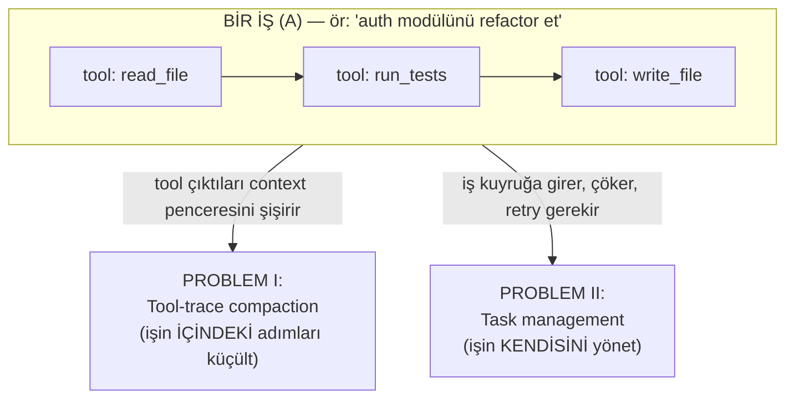

Üç ölçeği (katmanı) baştan ayıralım — tüm rehber bu kelimeleri kullanır:

| Katman | Ne | Örnek |
|---|---|---|
| **A — İŞ / JOB** | Yaşam döngüsü olan bütün hedef | "auth modülünü refactor et" |
| **B — ADIM** | Tek tool çağrısı / LLM turu | `read_file(auth.py)` |
| **C — ALT-AJAN** | A'nın parçası için açılan alt-iş | "40 dosyayı tara" |

- **Tool-trace compaction**, bir **A-işinin İÇİNDEKİ B-adımlarının** izini (çıktısını) küçültür — amaç: context penceresi taşmasın.
- **Task management**, **A-işinin KENDİSİNİ** yönetir — amaç: iş kuyruğa girsin, planlansın, çökse de kaybolmasın.

> **Tek cümle:** Tool-trace = *işin içindeki adımlar context'e sığsın*; task-management = *işin kendisi worker çökse de kaybolmasın.* Farklı katmanlar, farklı çözümler.

---

# KISIM I — TOOL-TRACE COMPACTION (işin İÇİNİ yönetmek)

## I.1 Nedir, neden gerekir?

**Context penceresi (context window):** modelin bir seferde "görebildiği" metnin üst sınırı (token cinsinden). **Token** ≈ ~4 karakterlik metin parçası. Ajan tool çağırdıkça, her çağrının **izi (trace)** — çağrı + dönen çıktı — pencereye eklenir. Büyük çıktılar (40 KB'lık dosya, 5000 satır test log'u) pencereyi hızla doldurur.

**Tool-trace compaction:** bu izi — **mesaj bütünlüğünü ve `tool_call ↔ tool_result` eşleşmesini bozmadan** — küçültme sanatı.

**Bozulmaması gereken tek kural (invariant):** her `tool_call`'un (asistanın "şunu çağır" demesi) bir `tool_result`'u (dönen çıktı) olmalı. Biri silinip öbürü kalırsa (yetim) sağlayıcı API isteği **reddeder**. Ayrıca **yakın kuyruk (tail)** korunur — ajanın az önce gördüğü, hâlâ üstünde çalıştığı adımlar.

> **Tek cümle:** Tool-trace compaction = tool çıktılarının context'i şişiren izini, çift-eşleşmeyi ve yakın geçmişi bozmadan küçültmek.

## I.2 İki ekol

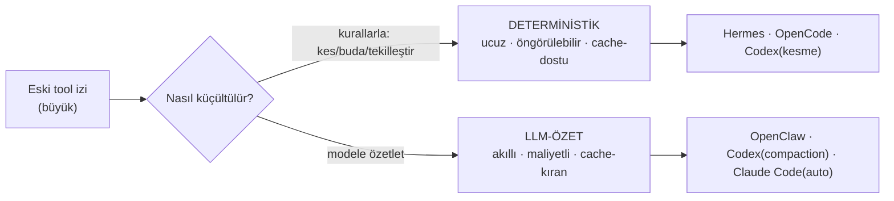

- **Deterministik (LLM'siz):** kurallarla budar/keser/tekilleştirir. Ucuz, tahmin edilebilir, **prompt-cache**'i az bozar. (prompt-cache = sağlayıcının daha önce gördüğü mesaj önekini yeniden ücretlendirmemesi; eski mesajı değiştirirsen cache bozulur.)
- **LLM-özet:** eski izi bir modele verip **bilgi-taşıyan özet** ürettirir. Daha akıllı ama maliyetli ve cache-kırar.
- Çoğu sistem **ikisini katmanlı** kullanır: önce ucuz deterministik kat, yetmezse LLM katı.

## I.3 Sekiz sistem, teker teker

### Hermes — deterministik **4 geçiş** (LLM'siz)
`_prune_old_tool_results`, korunan tail'in öncesinde 4 geçiş:
1. **Dedup:** byte-identik tool sonuçları → en yenisi tam kalır, eskiler "#N'in kopyası" referansına iner (kayıpsız). Sabit: `_DEDUP_FLOOR=200` (bunun altını dedup etme).
2. **Informative summary:** büyük benzersiz sonuç → **tip-farkında tek satır** (ör. `[read_file] read auth.py (40,000 chars)`). Asla çökmez (bozuk çağrıda bile backstop).
3. **Arg truncation:** >500 karakterlik `tool_call` argümanı JSON **içinde** kırpılır (geçerli JSON kalır → 400 riski yok).
4. **Basınç demotion'ı:** korunan bölge bile tavanı aşarsa kademeli demote — ama **en yeni tool son çare** olarak saklanır.
- **Proaktif + prompt-cache sözleşmesi:** budama cache'i bozacağı için **ancak ≥4096 token geri kazanılacaksa commit** eder; yoksa dokunmaz.
- **Örnek (POC):** 33.063 → 2.101 token (**%93.6**); mesaj sayısı değişmez (silme yok), çift bütünlüğü korunur.
> **Tek cümle:** Hermes, tail'i koruyup öncesini 4 deterministik geçişle (dedup→özet→arg-kırp→basınç) LLM'siz küçültür, cache'i ancak kazanç büyükse bozar.

### OpenClaw — **LLM chunk-özetleme** (12 adım)
Deterministik budamaz; tool-çiftlerini bozmadan **chunk'lar ve chunk'ları LLM'e özetletir**. Akış: `[0] tetik (boş yer < pencere×0.5)` → `[1] sanitize (SECURITY: toolResult.details silinir → API_KEY özete giremez)` → `[2] estimate` → `[3] projection (dev gövde → 8KB örnek + "omittedChars"; içerik hafif ama AĞIRLIK boyut-doğru; TEXT_SAMPLE=8192, TRUNCATE_THRESHOLD=32768)` → `[4] adaptif oran (mesajlar ağırsa chunk 0.40→0.15'e kısılır)` → `[5] gruplama (tool_call↔result atomik grup)` → `[6] chunk` → `[7] oversized (tek mesaj > pencere×0.5 → özetlenemez → tek satır NOT, çifti birlikte düşer)` → `[8] stage-split` → `[9] worker-thread` → `[10] LLM özet` → `[11] onarım (yetim çift → sentetik sonuç)` → `[12] uygula`.
- **Örnek (POC):** 138.850 → 66 token; **sır sızmadı** (details silindi), çift bütünlüğü korundu.
> **Tek cümle:** OpenClaw, sırrı söküp devi ele alıp çiftleri koruyarak izi chunk'lar ve LLM'e özetletir.

### OpenCode — **iki katman** (canlı spill + deterministik prune)
- **Katman A (canlı spill):** tool çıktısı ÜRETİLİRKEN >2000 satır / 50KB ise **diske dökülür**, context'e önizleme + referans girer (`truncate.ts`).
- **Katman B (deterministik prune):** eşikte **sondan başa yürür**; **son-2-turn + en-yeni-40K + `skill`** korunur; ötesi buda-adayı; toplam budanabilir > `PRUNE_MINIMUM=20K` ise **`compacted` damgası** basılır (fayda-freni); serialize'da damgalı çıktı `TOOL_OUTPUT_MAX_CHARS=2000`'e iner. Yetmezse **overflow LLM özeti**.
- **Örnek (POC):** 111.714 → 76.167 token; **skill korundu**, silme yok.
> **Tek cümle:** OpenCode büyük çıktıyı üretim anında diske döker, sonra eşikte son-2-turn+40K+skill'i koruyup gerisini deterministik budar.

### Codex — **ortadan-kesme + model-turn windowing**
- **Katman A (`truncate_middle`):** tek çıktı bütçeyi aşarsa **baş + son tutulur, ORTA atılır**, "Warning: truncated output" başlığı eklenir; görseller (multimodal) **kesilmez**.
- **Katman B (compaction bir MODEL TURN'üdür):** history pencereye sığmazsa önce **dinamik fit-to-window trim** (en eski function-output'lar placeholder'a çevrilir; yakın turn korunur); yetmezse `SUMMARIZATION_PROMPT` ile **handoff özeti** üretilir ve `CompactedItem` zinciriyle **yeni pencere** açılır (resume edilebilir = windowing).
- **Örnek (POC):** olay-güdümlü; 3 turn'de **2 window** (resume zinciri).
> **Tek cümle:** Codex çıktıyı baş+son tutup ortasını keser; history taşınca eskiyi placeholder'a çevirir, yetmezse handoff özetiyle yeni bir pencereye devreder.

### Claude Code — **micro + auto + subagent kaçışı** (kapalı kaynak → gözlem)
- **Microcompaction:** büyük tek tool çıktısı (gözlem: 93KB WebFetch) **diske** yazılır, context'e ~500t önizleme + referans kalır.
- **Auto-compaction:** context eşiğe gelince eski turn'ler **konuşma özetine** iner; `PreCompact`/`PostCompact` **hook**'ları sarar; `/compact` ile manuel de tetiklenir.
- **Subagent kaçış yolu:** büyük yan-iş **ayrı context penceresinde** koşar, ana pencereye **sadece özet** döner (sıkıştırmaya alternatif).
- **Örnek (POC):** micro→disk, 1 auto-compaction, subagent özeti — ara adımlar ana context'e hiç girmez.
> **Tek cümle:** Claude Code büyük çıktıyı diske alır, eşikte konuşmayı özetler, büyük yan-işi ayrı pencereye kaçırıp sadece özetini geri alır.

### Kimi Code — **hibrit: deterministik kırpma + LLM handoff-özet** (iki katman, en olgunlarından)
Resmî Moonshot AI CLI'ı; iki seviyede çalışır:
- **Katman A (per-tool deterministik kırpma):** her tool çıktısı üretilirken `result-builder.ts` ile `maxChars` + `maxLineLength` sınırına kırpılır; işaret `[...truncated]` + "Output is truncated to fit in the message." (OpenCode Katman A / Codex `truncate_middle` muadili). Görsel için `image-compress.ts`.
- **Katman B (event-sourced LLM handoff-özet):** eşik `fullCompaction/strategy.ts` — `reservedContextSize=50_000`, `shouldCompact(usedSize)`. Özet `compactionHandoff.ts` ile üretilir; user-mesajlarının **head'i (2K token) + tail'i** korunur, **orta elide edilir** (`compaction_elision`), sıkışan user-mesajı **20K token**'a sınırlanır. Compaction bir **op**'tur (`context.apply_compaction`) → **wire-replay / snapshot reducer** ile **resume edilebilir** (Codex windowing felsefesi).
> **Tek cümle:** Kimi çıktıyı üretimde deterministik kırpar (A), context dolunca event-sourced/replay-edilebilir LLM handoff-özetiyle (user head/tail koru, orta elide) sıkıştırır (B) — Codex+OpenCode birleşimi.

### MiniMax Mini-Agent — **token-limit LLM özeti** (tek katman)
Resmî MiniMax demo'su; saf LLM-özet:
- **Tetik (`_summarize_messages`):** `estimated_tokens > token_limit` **veya** `api_total_tokens > token_limit` — **çift tetik** (yerel `tiktoken` tahmini **ya da** API'nin raporladığı gerçek token). Varsayılan `token_limit = 80_000`.
- **Şekil:** özet sonrası `system → user1 → summary1 → user2 → summary2 …` — **user turları korunur**, aralarındaki asistan/tool işi LLM özetine iner. `_skip_next_token_check` = anti-thrash (özetten hemen sonra kontrolü atla).
- Deterministik per-tool katmanı **yok**.
> **Tek cümle:** MiniMax, tahmini veya gerçek token 80K'yı aşınca konuşmayı user-turları koruyarak LLM'e özetletir (OpenClaw/Claude Code ekolünün en sade hâli).

### DeepSeek-code — **basit compaction tetiği** (⚠️ topluluk)
`yksanjo/deepseek-code` (DeepSeek'in resmî kod-ajanı yok; bu topluluk):
- `conversation.py`: `max_messages=100`; `needs_compaction()` → `len(messages) > 100` olunca sadece **öneri** döndürür. Gerçek sıkıştırma minimal; per-tool kırpma / handoff-özet mimarisi yok.
> **Tek cümle:** DeepSeek-code yalnızca 100 mesajı aşınca "compaction lazım" sinyali verir; olgun bir tool-trace mekanizması yoktur.

## I.4 Ortak kural + I.5 Karşılaştırma

Hepsinde ortak: **(a) tool_call↔tool_result çifti bozulmaz, (b) yakın tail korunur, (c) silme değil küçültme tercih edilir.**

| Sistem | Ekol | Ana mekanizma | Korunan | Örnek kazanç |
|---|---|---|---|---|
| **Hermes** | Deterministik | 4 geçiş (dedup/özet/arg/basınç) | tail (token-bütçe, floor 8) | %93.6 |
| **OpenClaw** | LLM-özet | 12 adım, chunk→LLM | head+tail, çiftler | 138.850→66 |
| **OpenCode** | Deterministik(+LLM) | spill + backward-prune | son-2-turn+40K+skill | 111.714→76.167 |
| **Codex** | Deterministik+LLM | ortadan-kes + windowing | yakın turn, resume zinciri | 2 window |
| **Claude Code** | LLM(+disk) | micro+auto+subagent | son turn'ler | 1 auto-compaction |
| **Kimi Code** | **Hibrit** | per-tool kırp (A) + LLM handoff-özet (B), event-sourced/replay | user head(2K)+tail, elision | (koddan) |
| **MiniMax** | LLM-özet | token>80K → user-koruyan özet | user turları | (koddan) |
| **DeepSeek-code** | İlkel | >100 mesaj → öneri | — | (topluluk) |

**Ekol haritası:** *Deterministik ağırlıklı* → Hermes, OpenCode. *LLM-özet* → OpenClaw, MiniMax, Claude Code(auto). *Hibrit (iki katman)* → OpenCode(+LLM), Codex, **Kimi**. *İlkel* → DeepSeek-code. **Kimi ≈ Codex+OpenCode birleşimi** (en olgun hibrit).

### I.5.1 Neden bazıları %99, bazıları %31 kısaltıyor?

Tablodaki uçurum (OpenCode %31.8 ↔ Codex %99.9) bir **kalite farkı değil, amaç farkıdır**. Beş etken belirliyor:

**1) Amaç: pencereyi *derle* mi, *boşalt* mı?**
İki temel duruş var:
- **Seyreltenler** (OpenCode, Hermes) — oturum devam ederken bağlamı derli toplu tutar; model çalışmaya *aynı pencerede* devam eder, o yüzden çok şey atamazlar.
- **Pencere kapatanlar** (Codex, Claude Code auto, OpenClaw) — eski pencereyi özete indirip **yeni bir sayfa açar**. Doğal olarak %99'a çıkar, çünkü geride sadece özet kalır.

> Yüksek yüzde "daha iyi sıkıştırma" değil, **"daha radikal karar"** demektir.

**2) Geri alınabilirlik: attığın geri gelebiliyor mu?**
- **Diske döken** (OpenCode Katman A, Claude Code micro) tam içeriği saklar, context'e referans bırakır → kaybı *ucuz*, o yüzden agresif olmasına gerek yoktur.
- **Özete indiren** (OpenClaw, Codex Katman B) içeriği **kalıcı** olarak damıtır → geri dönüş yok, bu yüzden daha dikkatli ama daha kazançlıdır.

**3) Koruma penceresinin genişliği**
En belirleyici teknik etken. OpenCode **son-2-turn + en-yeni-40K + `skill`**'i dokunulmaz sayar; bizim POC'ta korunan bölge zaten 76K tuttuğu için kazanç %31.8'de kaldı. Codex'te böyle bir kalıcı koruma yoktur — pencere kapanır, sadece handoff özeti ve son birkaç mesaj taşınır.

**4) Tetikleme anı: proaktif mi, taşınca mı?**
- **Proaktif** (OpenCode prune, Hermes) — her turda çalışır, o yüzden *her seferinde az* alır; bedava olduğu için sık çalışması sorun değil.
- **Eşikte** (Codex, Claude Code, OpenClaw) — ancak pencere dolunca devreye girer, bu yüzden *bir kerede çok* alır.

**5) Fayda-freni ve prompt cache**
OpenCode, kazanç `PRUNE_MINIMUM=20K`'yı geçmiyorsa **hiçbir şey yapmaz** — çünkü içeriği değiştirmek prompt cache'i kırar ve küçük kazanç için buna değmez. Bu fren tek başına yüzdeyi bilinçli olarak düşük tutar. LLM-özet ekolünde böyle bir fren yoktur; zaten pahalı bir çağrı yapılıyorsa mümkün olduğunca çok yer açılır.

#### Ölçülen bedel: agresiflik ajanı yeniden çalışmaya iter
Demo ajanında (`demo-brain-agent/`) canlı gözlendi: `hermes` + düşük bütçede bir tool çıktısı tek satıra indi ve model **"içerik gelmedi, tekrar aratın"** diyerek aynı veriyi yeniden istedi. Yani kazanılan token'ın bir kısmı **yeniden tool çağrısı olarak geri harcanır**. Aynı deneyde `none` stratejisiyle koşu 43,5 sn sürerken sıkıştıranlarla ~12 sn'ye indi (**~3,5× hızlanma**) — yani compaction hem gerekli hem de aşırısı zararlı.

#### Doğru okuma
| Soru | Bak |
|---|---|
| "Hangisi en çok sıkıştırıyor?" | ❌ yanlış soru |
| "Sıkıştırdıktan sonra **ne kaldı**?" | ✅ doğru soru |
| "Model işini yapabildi mi, tekrar tool çağırdı mı?" | ✅ asıl ölçüt |
| "Kayıp geri alınabilir mi (disk/referans)?" | ✅ riski belirler |

> **Tek cümle:** Düşük yüzde muhafazakârlığın (geri alınabilir kayıp + geniş koruma + cache dostu), yüksek yüzde radikalliğin (pencere kapatma + kalıcı özet) işaretidir; doğru seçim ajanın *aynı pencerede mi devam edeceği* yoksa *temiz sayfa mı açacağı* sorusuna bağlıdır.

**Çalışan kanıt:** `report/tool-trace-poc-web.html` (interaktif) — ilk beş sistemi adım adım koşturur, her ilerlemede transkriptin gerçek farkını gösterir.

---

# KISIM II — TASK MANAGEMENT (işin KENDİSİNİ yönetmek)

## II.1 "Task" ne demek + terminoloji tuzağı

Bu kısımda **task = A (İŞ/JOB)** — yaşam döngüsü olan iş birimi. **Tuzak:** kelime her araçta farklı katmanı gösterir:
- **Airflow/Celery dokümanında "task" = B (adım).** (Airflow'da bir DAG düğümü; Celery'de bir fonksiyon çağrısı.)
- **Temporal/agent-engine'de "task" = A (iş).** (Temporal Workflow; Hermes Kanban kartı.)

Yani *"Airflow task retry yapar"* → bir **adımı (B)** yeniden koşar; *"Temporal task'ı sürdürür"* → bütün **işi (A)** kurtarır. **Aynı kelime, farklı katman.** Aşağıdaki her şey **A seviyesine** göredir.

## II.2 Bir task'ın (A) hayatı + iki retry

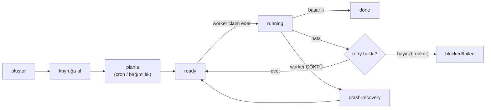

**İki retry'ı karıştırma** (kararın yarısı bu):
- **(a) API-retry:** 429/5xx için backoff — hafif, **hepsinde** var.
- **(b) Task-retry:** worker çöktü, iş baştan/kaldığı yerden sürsün — **asıl zor olan**; koçun sorduğu bu.

> **Tek cümle:** Her iş oluştur→kuyruk→planla→çalış→(hata) retry→(çökme) kurtar→bitti döngüsünden geçer; asıl zor kısım "worker çökerse iş kaybolmasın".

## II.3 Task nasıl yaratılır — şemayı çatı koyar, değeri model doldurur

- **Task'ın YAPISI (hangi alanlar var)** → **çatı sabit tanımlar** (Hermes `create_task(title, body, parents, assignee, …)`). Model yeni alan icat etmez.
- **Bir task'ın DEĞERLERİ** → **çoğunlukla model runtime'da** bir tool çağırıp parametrelerini doldurur (`kanban(action="create", title=…, parents=[…])`); ya da insan/gateway/cron yaratır.
- **Ajan task'ı DİNAMİKtir:** sıradaki adıma (B) model **çalışma anında** karar verir; hatta yeni işler (A) runtime'da doğabilir. (Airflow'un beklediği **statik DAG**'ın tersi.)

> **Tek cümle:** Şema = çatının koyduğu form; doldurma = modelin o forma uygun JSON değerleri üretmesi (dinamik). Model formu değiştirmez, kutucukları doldurur.

## II.4 Dört aday, teker teker (+ taksonomi)

### Airflow — "zamanlı DAG'ların kralı"
İşi önceden **statik DAG** olarak yazarsın; **Scheduler** zamanı/bağımlılığı gözetip adımları **executor**'a dağıtır; durum **metadata DB** + zengin UI. Retry adımı **baştan** koşar; zombie task'lar heartbeat kaçınca temizlenir. En güçlü yanı **scheduling + backfill/catchup**. Sınır: dinamik ajan döngüsüne uymaz.

### Celery — "dağıtık task kuyruğu"
Fonksiyonu (B) bir **broker**'a (Redis/RabbitMQ) atarsın, **worker** çeker. Native worker havuzu → çok iyi yatay ölçek. **at-least-once** (idempotency **sende**); `acks_late` (iş bitince ack) + visibility-timeout tuzağı. Çok-adımlı iş (A) kavramı yok — Canvas ile sen kurarsın; "nerede kaldım"ı sen tutarsın.

### Temporal — "durable execution"
İş (A) = **kod** (Workflow); adım (B) = **Activity**. Her olay **event-history**'ye yazılır; worker çökünce **replay** edip biten activity'leri **atlar** → **kaldığı yerden devam + exactly-once**. Activity başına `RetryPolicy`. Bedel: cluster/Cloud + **determinizm disiplini** (LLM'i activity'e sar). En güçlü dayanıklılık.

### Mevcut agent engine'ler (dört rota)
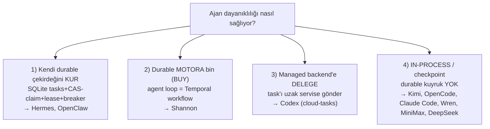
- **Hermes/OpenClaw (kur):** SQLite'ta `tasks` FSM; **CAS-claim** (`WHERE claim_lock IS NULL` → at-most-once), **lease+heartbeat**, PID-crash-reclaim, **circuit-breaker**, handoff özeti. Düşük operasyon, tam kontrol.
- **Shannon (buy):** agent loop'u **Temporal workflow/activity** olarak koşar; insan-onayı Temporal **signal**, time-travel-debug = replay. "Temporal'a bin" rotasının canlı kanıtı.
- **Codex (delege):** yerelde `rollout` (resume) + HTTP-backoff; ağır işi **cloud-tasks** managed backend'e (`TaskStatus`: Pending→Ready→Applied) devreder.
- **In-process (durable kuyruk yok):** oturum + checkpoint; hız+basitlik ama tek başına "çökse de kaybolmasın" vermez. İçinde bir yelpaze var (detayı §II.5):
  - **Kimi Code** — bu kategorinin **en olgunu**: `Task` FSM (subagent/bash/tool), subagent-turn (özet damıtır, retry'lı), **`ToolAccesses` ile kaynak-farkındalıklı concurrency scheduler**, event-sourced **persisted-session resume**.
  - **OpenCode / Claude Code / Wren** — oturum + git-snapshot/checkpoint; bg-job bellek-içi.
  - **MiniMax / DeepSeek-code** — en sade: MiniMax API-backoff retry'lı (`retry.py`, max_retries=3) ama disk-resume yok; DeepSeek-code task-yönetimsiz.

## II.5 Dayanıklılık merdiveni — in-process → persisted-session → durable kuyruk

Task-yönetiminin özü tek soruda: **süreç/worker ortada çökerse iş ne olur?** Üç seviye var; soldan sağa dayanıklılık artar. (Senaryo: iş "Sipariş #4711", worker tam ortada çöktü.)

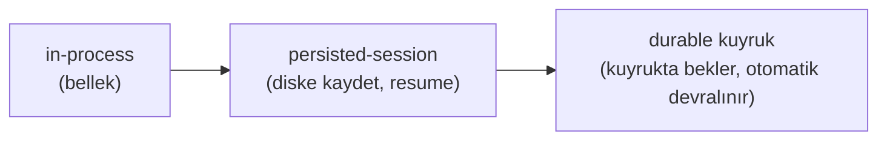

### (1) in-process (süreç-içi)
- **State nerede:** yalnız çalışan sürecin **RAM'i** (mesaj geçmişi, arka-plan job'ları).
- **Çökme testi:** süreç ölür → **her şey uçar**; yeniden açınca **sıfırdan** başlarsın.
- **Örnek:** OpenCode `BackgroundJob` (bellek-içi), Claude Code, **MiniMax**, **DeepSeek-code**.
- **Sınır:** "worker çökse de iş kaybolmasın" garantisi **yok**. Hız+basitlik için (interaktif tek-kullanıcı).

### (2) persisted-session (kalıcı oturum)
- **State nerede:** **disk** — her adım/olay checkpoint ya da event-log'a yazılır; her oturumun `session_id`/`thread_id`'si var.
- **Çökme testi:** süreç ölür → yeniden başlat, **o oturumu tekrar aç** → **son checkpoint'ten kaldığı yerden** devam. Veri kaybolmaz.
- **Örnek:** **Kimi Code** (event-sourced context, wire-replay/snapshot → resume), Codex `rollout`, LangGraph checkpointer, Wren.
- **Kritik incelik (PASİF):** durum saklanır ama **kimse otomatik devam ettirmez** — o oturumu **sen/kullanıcı tekrar açmalısın**. "Bekleyen işler kuyruğu" yoktur; sadece "istersen bu oturumu geri yükle" vardır.

### (3) durable kuyruk (dayanıklı kuyruk)
- **State nerede:** kalıcı kuyruk/DB (Hermes SQLite `tasks`, Celery broker, Temporal task queue, Airflow metadata DB).
- **Çökme testi:** worker ölür → iş **kuyrukta kalır** → **başka worker otomatik devralır** (lease dolar / mesaj yeniden teslim / event-history replay). Kimsenin oturumu açması gerekmez — sistem toparlar.
- **Örnek:** **Hermes** (CAS-claim+lease+`detect_crashed_workers`), **Celery** (redelivery+`acks_late`), **Temporal** (task queue+replay), **Airflow** (scheduler+zombie reap).
- **Sınır:** operasyonel maliyet (DB/broker/dispatcher işletmek).

### Asıl fark: persisted-session ≠ durable kuyruk (en çok karışan)
İkisi de diske yazar, ikisinde de veri kaybolmaz. Fark **pasif vs aktif**:

| | persisted-session | durable kuyruk |
|---|---|---|
| Bekleyen iş kuyruğu | ❌ | ✅ |
| **Kim devam ettirir?** | **sen/kullanıcı** (oturumu tekrar açar) | **sistem otomatik** (başka worker devralır) |
| Çoklu worker'a dağıtım | ❌ | ✅ |
| Örnek | Kimi, Codex-rollout, LangGraph, Wren | Hermes, Celery, Temporal, Airflow |

- **persisted-session (Kimi):** worker çöktü → durum diskte; ama iş **kullanıcı tekrar açana kadar bekler** → otonom filo için yetersiz.
- **durable kuyruk (Hermes):** worker çöktü → lease dolar → **başka worker otomatik claim eder** → kimse dokunmadan devam → otonom filo için gereken bu.

> **Tek cümle:** in-process = bellekte (ölürse gider); persisted-session = diske yazılır ama devamı SEN açarsın; durable kuyruk = işler kuyrukta bekler ve worker çökse SİSTEM otomatik devralır. Otonom, hata-toleranslı task yönetimi ancak **durable kuyruk** ile olur.

## II.6 Scheduling (zamanlı task)

| Sistem | Kim ateşler | Ne başlar | Backfill/catchup |
|---|---|---|---|
| **Airflow** | Scheduler | DagRun (statik) | **en güçlü** |
| **Hermes/OpenClaw** | 60s ticker / cron provider | agent run (dinamik) | zayıf (managed'la iyi) |
| **Temporal** | Temporal Schedules | durable Workflow | `catchupWindow`+backfill |
| **Celery Beat** | ayrı Beat daemon | kuyruğa task | telafi yok |

Not: cron **her ajanda yok** — sadece engine tipi (Hermes/OpenClaw) ya da Temporal-destekli (Shannon).

## II.7 ASIL FARK — worker işin ortasında çökerse?

Bütün karar bu tek soruya iner. İş: `fetch ✅ → process ✅ → write ⏳ (worker ÇÖKTÜ)`. **Gerçek POC'larla ölçtük** — retry'da `fetch` **kaç kez** koşuyor?

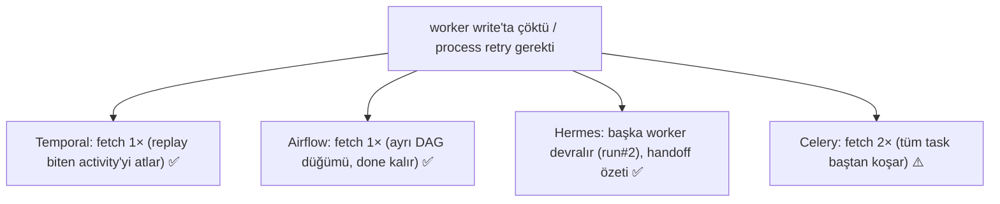

**Ölçülen gerçek çıktı** (`poc-task-mgmt/`):
- **Temporal:** `process` 2×, `fetch/deliver` 1× — biten activity atlanır (kaldığı yerden).
- **Celery:** `fetch` **2×** — retry tüm task'ı baştan koşturur → A-seviyesi resume **sende**.
- **Hermes:** CRASH → `release_stale_claims()` otomatik → worker-B devraldı (`run#2`) → done; **at-most-once** (ikinci worker `None` aldı).

> **Tek cümle:** Temporal/Airflow tamamlanan kısmı korur (fetch 1×); Celery tüm işi baştan koşar (fetch 2×); Hermes çökmeyi otomatik toparlayıp handoff'la devreder. "Yerleşik A-recovery" ile "sen inşa edersin" farkı tam burada.

## II.8 Karar ağacı + öneri

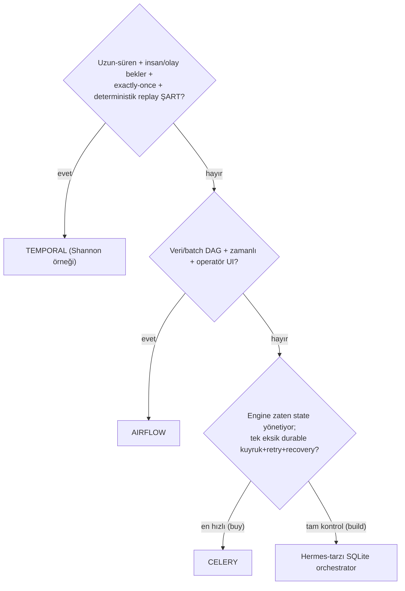
**brain_chat_V2 önerisi:** zaten oturum/state yönetiyorsa → **buy:** +Celery (kuyruğu devret), ya da **build:** Hermes-tarzı hafif durable çekirdek (Postgres/SQLite, CAS-claim, lease, breaker; ~1-2K satır). Temporal'a ancak çok-makineli/uzun-bekleyen ihtiyaç netleşince geç.

**Çalışan kanıt:** `poc-task-mgmt/` — Hermes/Temporal/Celery **gerçek** framework'lerle koşuyor; `web_server.py` ile tarayıcıdan görsel test.

---

# KISIM III — İKİSİ NASIL BİRLEŞİR + ÖĞRETME KİTİ

## III.1 İki katman, tek resim

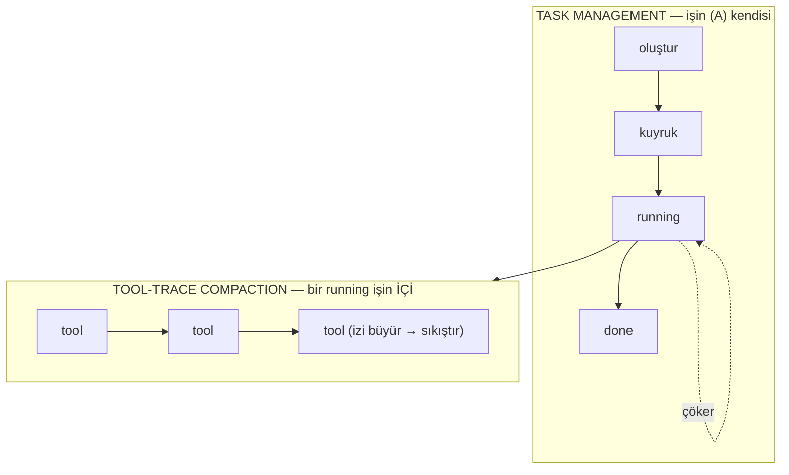
- **Task management** dışarıda: işi doğurur, kuyruğa alır, çökerse kurtarır.
- **Tool-trace compaction** içeride: o iş **çalışırken** (running) tool izini context'e sığdırır.
- İkisi **farklı katman**, farklı araçlar; ama aynı ajanı ayakta tutar.

## III.2 Her sistem tek paragraf (iki konu birden)

- **Hermes** — Tool-trace'i deterministik 4 geçişle LLM'siz küçültür; task'ı ise SQLite `tasks` FSM + CAS-claim + lease + breaker ile yönetip çökmeyi otomatik toparlar. Hem içeriyi hem işi kendi çekirdeğinde çözen tek ajan.
- **OpenClaw** — Tool-trace'i sırrı söküp chunk'layıp LLM'e özetleterek; task'ı SQLite-only kuyruk + gateway restart-recovery + terminal-outcome ile. Hermes'ten sonra en olgun durable profil.
- **OpenCode** — Tool-trace'i iki katmanla (spill + deterministik prune); task'ı ise in-process (`Task` tool, bellek-içi bg-job, git-snapshot revert). İç güçlü, işin dayanıklılığı zayıf.
- **Codex** — Tool-trace'i ortadan-kesme + model-turn windowing ile; task'ı yerelde rollout-resume, ağır işi managed cloud backend'e delege. Hibrit.
- **Claude Code** — Tool-trace'i micro+auto+subagent-kaçışı ile; task-seviyesi durable yönetimi yok (interaktif CLI). İç zengin, iş dayanıklılığı kapsam dışı.
- **Shannon** — (tool-trace'i token-budget ile yönetir) task'ı **Temporal** üstünde koşar → durable/retry/replay hazır. "Buy" rotasının kanıtı.
- **Wren** — Task = veri sorusu → LangGraph ReAct + deterministik semantik motor (wren-engine). In-process/checkpoint.
- **Kimi Code** — Tool-trace'i **hibrit** çözer (per-tool deterministik kırpma + eşikte event-sourced LLM handoff-özeti, user head/tail koru + orta elide); task'ı **persisted-session** modeliyle yönetir (`Task` FSM, subagent-turn, `ToolAccesses` concurrency scheduler, replay-resume). In-process kategorisinin en olgunu; durable kuyruk yok.
- **MiniMax Mini-Agent** — Tool-trace'i saf **LLM-özetle** (token>80K → user-koruyan özet); task'ı süreç-içi + API-backoff retry (`retry.py`). Temiz ama sade; durable yok.
- **DeepSeek-code** (topluluk) — Tool-trace'i ilkel tetikle (>100 mesaj); task-yönetimi yok. En alt uç.
- **Airflow / Celery / Temporal** — Ajan değil, **altyapı**: sırasıyla statik-DAG scheduler / dağıtık kuyruk / durable-execution motoru. Agent engine'lerin task tarafında "build/buy/delegate" için referans altyapılar.

## III.3 Sözlük (tek yerde)

| Terim | Kısa açıklama |
|---|---|
| **token / context window** | ~4 karakterlik metin birimi / modelin bir seferde görebildiği üst sınır |
| **tool trace** | tool çağrıları + dönen çıktıların context'teki izi |
| **prompt-cache** | sağlayıcının gördüğü mesaj önekini yeniden ücretlendirmemesi; eski mesajı değiştirmek bozar |
| **prune / dedup / truncate** | buda / tekilleştir / kes |
| **tool_call ↔ tool_result** | asistanın çağrısı ile dönen çıktı; ayrılırsa (yetim) API reddeder |
| **tail (kuyruk) koruma** | yakın geçmiş mesajları budamadan koru |
| **spill** | büyük çıktıyı diske döküp context'e önizleme+referans bırakma |
| **windowing (Codex)** | eski history'yi özetleyip yeni, resume-edilebilir pencereye devretme |
| **task (A/B/C)** | iş/job (A) · adım (B) · alt-ajan (C); belgede task=A |
| **enqueue / broker / worker** | kuyruğa alma / kuyruğun yaşadığı yer / işi koşturan süreç |
| **scheduler / cron / backfill** | ne zaman çalışacağına karar / zaman ifadesi / kaçan geçmişi telafi |
| **DAG** | adımların önceden çizili, döngüsüz bağımlılık grafiği (statik) |
| **workflow / activity** | Temporal: iş (A) kodu / tek yan-etkili adım (B) |
| **event history / replay** | işin değişmez kaydı / çökme sonrası tekrar oynatıp biteni atlama |
| **determinism / idempotency** | aynı girdi→aynı yol / aynı işi iki kez yapmak zarar vermesin |
| **at-most / at-least / exactly-once** | en fazla / en az / tam bir kez çalışma garantisi |
| **CAS-claim** | "koşul hâlâ doğruysa kap" atomik işlemi; kilitsiz at-most-once |
| **lease / heartbeat** | süreli claim / canlılık sinyali; çökme tespiti |
| **circuit breaker** | üst üste N hatada durup insana bırakma |
| **handoff özeti** | deneme sonu "nereye kadar geldim" notu; sonraki deneme devam eder |
| **durable execution** | iş, süreç ölse de kalıcı; kaldığı yerden sürer |
| **build / buy / delegate / in-process** | kendi çekirdeğini kur / durable motora bin / managed'a devret / süreç-içi (dayanıksız) |

## III.4 "2 dakikada anlat" — öğretme kiti

**Asansör konuşması (ezber):**
> "Bir ajanı ayakta tutmak iki ayrı problem. **Birincisi**, iş çalışırken tool çıktıları context penceresini şişirir — bunu **tool-trace compaction** ile çözeriz: ya deterministik budarız (Hermes), ya LLM'e özetletiriz (OpenClaw), çoğu da ikisini katmanlar; kural: çift-eşleşmeyi ve yakın geçmişi bozma. **İkincisi**, işin kendisi kuyruğa girmeli, planlanmalı ve **worker çökse de kaybolmamalı** — bu **task management**. Airflow zamanlı statik-DAG'ların kralı ama dinamik ajana uymaz; Celery dağıtık kuyruk verir ama 'kaldığı yerden devam'ı sen yazarsın; Temporal işi kaldığı yerden sürdürür ama operasyonu ağır. Ajanlar üç yoldan birine gidiyor: kendi SQLite çekirdeğini kurmak (Hermes), Temporal'a binmek (Shannon), ya da managed'a devretmek (Codex). Farkın kanıtı tek soruda: worker çökünce fetch kaç kez koşar — Temporal'da 1, Celery'de 2."

**Anlatırken 7 anahtar cümle:**
1. İki katman: tool-trace = işin içi; task-mgmt = işin kendisi.
2. Tool-trace kuralı: çift-eşleşme + tail bozulmaz.
3. İki ekol: deterministik (ucuz, cache-dostu) vs LLM-özet (akıllı, cache-kırar).
4. "task" kelimesi Airflow/Celery'de adım (B), Temporal/ajanda iş (A).
5. İki retry: API-çağrısı (hepsinde) vs task-seviyesi (asıl zor).
6. Asıl fark crash-recovery: "yerleşik" (Temporal/Hermes) vs "sen inşa edersin" (Celery).
7. Ajan rotaları: build (Hermes) / buy (Shannon→Temporal) / delegate (Codex) / in-process (dayanıksız).

**Olası sorular (hazır cevap):**
- *"Neden hep Temporal değil?"* → LLM adımı non-deterministik; determinizmi korumak için her adımı activity'e sarmak + cluster işletmek ağır. Çoğu ajan yükü için SQLite çekirdeği (Hermes) pratik karşılığını daha ucuza verir.
- *"Tool-trace ile task-mgmt aynı şey mi?"* → Hayır; biri bir işin içindeki adımları context'e sığdırır, öbürü işin kendisini yaşam döngüsünde yönetir.
- *"Ajan task'ı neden Airflow'a uymaz?"* → Airflow statik DAG bekler; ajan sıradaki adıma runtime'da karar verir (dinamik).

---

## Kaynak belgeler (bu rehberin damıttığı)
- **Tool-trace:** `hermes-tool-trace-compaction.md`, `openclaw-/opencode-/codex-/claude-code-tool-trace-compaction-teknik.md`, `tool-trace-compaction-butun.pdf`, `tool-trace-poc-web.html`.
- **Task-management:** `task-yonetimi-altyapi-karari.md` (+ Ek A), `task-management-sunum-ve-flowchart.md`, `task-management-analizi.md`.
- **Çalışan POC'lar:** `poc/` (tool-trace, 5 sistem) · `poc-task-mgmt/` (gerçek Airflow/Celery/Temporal/Hermes + `web_server.py`).

> **Son söz:** Bu tek belgeyi kavradıysan, hem *bir ajanın context'ini nasıl ayakta tuttuğunu* (tool-trace) hem *işlerini nasıl dayanıklı yönettiğini* (task-mgmt) — sekiz ajan (Hermes, OpenClaw, OpenCode, Codex, Claude Code, Kimi, MiniMax, DeepSeek) + Wren/Shannon ve üç altyapı (Airflow/Celery/Temporal) üzerinden — anlatabilecek seviyedesin.

Elimizdeki ölçümlerle, dört stratejinin artı-eksileri:

1. Kendi çekirdeğimiz (SQLite board) — build
İyi yanları

Operasyonel maliyet ~sıfır — tek dosya, ek servis yok, Docker yok
Tam kontrol — FSM, DAG kapısı, checkpoint, breaker: hepsi bizim kodumuz, istediğimiz gibi eğilir
Dinamik graf tam destekli — ajan çalışma anında düğüm ekleyebiliyor (spawn_task)
Checkpoint'ten devam ölçüldü — worker tur ortasında çöktü, recover_stale otomatik topladı, turn0 tekrar koşmadı
Şeffaf denetim izi — created → claimed → recovered → claimed → completed, SQLite'tan doğrudan sorgulanabilir
Hızlı — 5 düğüm 11 sn; kayıtlı akış yeniden koşumu 0,1 sn
Kötü yanları

Yazdığın kadar var — exactly-once, dağıtık kilit, backpressure gibi şeyler senin sorumluluğun
Scheduling yok — cron/backfill istersen dışarıdan eklemelisin
Tek-makine varsayımı — SQLite ile çok-makineli ölçek zor (Postgres'e taşımak gerekir)
Test edilmemiş uç durumlar — bizim demoda gerçek eşzamanlı worker yarışı hâlâ kanıtlanmadı
Bakım yükü sende: her yeni ihtiyaç (öncelik, kota, retry politikası) elle kodlanır
2. Temporal — buy, durable execution
İyi yanları

En güçlü dayanıklılık — event-history replay, biten activity atlanır (exactly-once)
Tam denetim izi — bizim koşuda 95 durable event; her adım kalıcı
Activity-seviyesi retry politikası hazır (RetryPolicy)
Uzun-süren iş / insan onayı için tasarlanmış (signal, timer, saatlerce/günlerce bekleyebilir)
Scheduling + backfill dahili
Kötü yanları

Operasyonel yük yüksek — cluster ya da Cloud; kurulum, izleme, sürüm yönetimi
Determinizm disiplini zorunlu — LLM/rastgele/IO yalnız activity içinde olabilir; workflow gövdesi saf kalmalı. Kural ihlali sinsi hatalar üretir
Kod kısıtları — workflow sınıfı modül seviyesinde olmalı (bunu canlı yaşadık, "local classes unsupported")
Payload sınırı — biz state'i activity payload'ında taşıyoruz; sıkıştırma olmasa ~10-20 turda duvara toslar (~2MB limit). Doğrusu referans geçirmek
Yavaş başlangıç: dev server + worker ayağa kalkması
3. Celery — buy, dağıtık kuyruk
İyi yanları

En iyi yatay ölçek — native worker havuzu, olgun ekosistem
Basit zihinsel model — fonksiyonu kuyruğa at, worker çeksin
at-least-once + acks_late — worker çökerse mesaj yeniden teslim edilir
Broker seçenekleri esnek (Redis/RabbitMQ)
Kötü yanları

DAG/bağımlılık kavramı YOK — bizim demoda board'u yine biz yönettik; Celery sadece dağıtım katmanı oldu
Retry task'ı BAŞTAN koşturur — tamamlanan adımlar tekrarlanır; "kaldığı yerden devam" senin işin
State takibi zayıf — result backend kurmazsan hiçbir şey görmüyorsun
En yavaş bizim ölçümde: 23,3 sn (worker süreç başlatma + broker gecikmesi)
Broker işletme yükü (orta seviye ama sıfır değil)
4. Airflow — zamanlı statik DAG
İyi yanları

Scheduling'de rakipsiz — cron + backfill/catchup + max_active_runs
Operatör UI'ı en zengin — koşu geçmişi, log, yeniden tetikleme
Olgun ekosistem — yüzlerce hazır operatör/provider
Düğüm-seviyesi retry, upstream done kalır
Kötü yanları

Dinamik graf YAPISAL OLARAK imkânsız — DAG parse zamanında bilinmeli. Bizim graf çalışma anında LLM kararıyla doğuyor → verecek DAG yok. Bu demonun en net bulgusu
Üç kaçış yolu da bedelli: .expand graf şeklini sabitler · tek düğüme sıkıştırırsan Airflow sadece scheduler olur · DAG dosyası ürettirirsen parse gecikmesi + kırılganlık
En ağır operasyon — scheduler + webserver + metadata DB
Ajanın "sonucu görünce planı değiştirmesi" mümkün değil (donmuş graf)
Özet karar tablosu
own	Temporal	Celery	Airflow
Dinamik ajan grafı	✅ tam	✅ tam	⚠️ kısmi	❌ yok
Kaldığı yerden devam	✅ checkpoint	✅ replay	❌ baştan	⚠️ düğüm bazlı
Scheduling	❌	✅	⚠️ Beat	✅✅ en güçlü
Yatay ölçek	⚠️	✅	✅✅	✅
Denetim izi	✅	✅✅	❌	✅✅
Operasyon yükü	✅✅ çok düşük	❌ yüksek	⚠️ orta	❌ yüksek

---

# EK — Her sistemin tool-trace akışı, TEK PARAGRAFTA

> Aşağıdakiler §I.3'ün "anlatım" hali: her sistemin akışını baştan sona, tek nefeste.
> Sunumda ya da birine anlatırken doğrudan bunları kullan.

## Hermes — deterministik 4 geçiş

Hermes hiç LLM kullanmaz, her şeyi kurallarla yapar ve bunu **proaktif** olarak, yani pencere dolmadan da çalıştırır; önce geçmişi bir `prune_boundary` ile ikiye böler — bu sınır token bütçesiyle geriye doğru sayılarak bulunur ve en az 8 mesaj (`_MAX_TAIL_MESSAGE_FLOOR`) her hâlükârda korunur — sonra sınırın **öncesindeki** bölgeye sırayla dört geçiş uygular: **(1) dedup**, byte-identik tool sonuçlarından en yenisini tam bırakıp eskileri `[Duplicate of #N]` referansına indirir (kayıpsız, çünkü içerik zaten başka yerde duruyor; `_DEDUP_FLOOR=200` altındakilere dokunmaz); **(2) informative summary**, büyük ve benzersiz sonuçları **tip-farkında tek satıra** çevirir (`[read_file] dosya okundu (40.000 chars) · ilk satır: …`) ve bu fonksiyon asla çökmez, bozuk çağrıda bile bir backstop metin döner; **(3) arg truncation**, 500 karakteri aşan `tool_call` argümanlarını **JSON'ın içinde** kırpar ki çıktı geçerli JSON kalsın ve sağlayıcı 400 dönmesin; **(4) basınç demotion'ı**, korunan tail'in *kendisi* yumuşak tavanı (bütçe × 1.5) aşarsa devreye giren emniyet valfidir ve kademeli çalışır — önce en yeni tool **hariç** korunan bölgedeki büyükleri demote eder, tavanın altına iner inmez durur, hepsi yetmezse son çare olarak **en yeni tool'u da** feda eder; tüm bu işlem boyunca **hiçbir mesaj silinmez**, sadece içerik küçülür, dolayısıyla `tool_call ↔ tool_result` eşleşmesi bozulmaz; ve kritik bir fren vardır: budama prompt-cache'i bozacağı için Hermes **ancak ≥4096 token geri kazanılacaksa commit** eder, aksi halde hiçbir şeye dokunmaz — POC'ta sonuç 33.063 → 2.101 token (%93.6), mesaj sayısı sabit.

## OpenClaw — LLM chunk-özetleme (12 adım)

OpenClaw deterministik budama yapmaz, işi tamamen LLM'e devreder ama bunu **güvenli ve bütünlüğü koruyarak** yapmak için 12 adımlık bir boru hattı kurar: boş yer pencerenin yarısının altına düşünce **[0] tetiklenir**, önce **[1] sanitize** ile `toolResult.details` alanı sökülür — bu bir güvenlik adımıdır, çünkü özet LLM'e gidecektir ve API anahtarı gibi sırların özete sızması engellenmelidir — ardından **[2] estimate** ile boyut ölçülür ve **[3] projection** devreye girer: dev gövdeler 8KB'lık bir örneğe indirilip yanına `omittedChars` bilgisi konur, yani özetlenecek içerik hafifler ama **ağırlık hesabı boyut-doğru kalır** (`TEXT_SAMPLE=8192`, `TRUNCATE_THRESHOLD=32768`); **[4] adaptif oran** mesajların ağırlığına göre chunk oranını 0.40'tan 0.15'e kadar kısar; **[5] gruplama** en kritik adımdır — `tool_call` ile `tool_result` **atomik bir grup** sayılır, asla ayrı chunk'lara düşmezler; **[6] chunk** ile parçalar oluşur, **[7] oversized** tek başına pencerenin yarısını aşan mesajı özetlemeye kalkmaz, onu tek satırlık bir NOT'a indirir ve çiftini birlikte düşürür; **[8] stage-split** ve **[9] worker-thread** ile parçalar paralel işlenir, **[10] LLM özet** her chunk için damıtılmış metin üretir, **[11] onarım** özet sonrası yetim kalmış çiftlere sentetik sonuç uydurup zinciri tamir eder ve **[12] uygula** ile yeni geçmiş yerine konur — POC'ta 138.850 → 66 token, sır sızmadı, çift bütünlüğü korundu.

## OpenCode — canlı spill + deterministik prune

OpenCode compaction'ı iki ayrı anda devreye girer: **birincisi tool çıktısı daha üretilirken** — `truncate.ts` çıktının 2000 satırı ya da 50KB'ı aştığını görürse metni diske yazar ve context'e yalnız ~2000 karakterlik önizlemeyle bir dosya referansı bırakır, yani dev çıktı context'e **hiç girmez**; **ikincisi eşikte çalışan deterministik prune**, ki overflow'u beklemez, LLM kullanmadığı için bedavadır ve her turda proaktif koşar — sondan başa yürür ve bir koruma hiyerarşisi uygular: **son 2 kullanıcı turu** dokunulmaz, önceki bir **compaction özetine** rastlarsa durur, **`skill`** çıktılarını atlar, **zaten `compacted` damgalı** bir tool görürse önceki prune'un sınırına geldiğini anlayıp durur, ve ötedeki tool çıktılarını toplarken kümülatif toplam **40K'yı aşana kadar** hepsini korur; bu sıcak bölgenin ötesindekiler **buda-adayı** olur ama hemen budanmaz — araya **fayda-freni** girer: adayların toplamı **20K'yı geçmiyorsa hiçbir şey yapılmaz**, çünkü damgalamak serialize edilen içeriği değiştirir ve **prompt cache'i kırar**; geçiyorsa `state.time.compacted` alanına zaman damgası basılır ve asıl küçülme **serialize anında** olur (damgalı çıktı `TOOL_OUTPUT_MAX_CHARS=2000` karaktere iner); bu boyunca **hiçbir mesaj silinmez** ve tam içerik zaten diskte durduğu için geri çağrılabilir; hâlâ `usable = pencere − 20K` sınırı aşılıyorsa son çare **overflow LLM özeti** devreye girer — POC'ta 111.714 → 76.167 token (%31.8), çünkü amaç pencereyi boşaltmak değil, canlı çalışırken bağlamı derli toplu tutmaktır.

## Codex — ortadan-kesme + model-turn windowing

Codex hiçbir şeyi diske dökmez, onun yerine "neyi kesersem en az bilgi kaybederim" sorusuna oynar: ilk katmanda `truncate_middle` devreye girer ve tek bir tool çıktısı bütçeyi aştığında **baş ile sonu tutup ortayı atar**, üstüne `Warning: truncated output` başlığı ekler — bu tercih tesadüf değildir, çünkü bir dosyanın ya da komut çıktısının **başı** (imports, imza) ve **sonu** (hata satırı, exit kodu) en bilgilendirici kısımlardır, ortadaki tekrarlı gövde ise en az bilgi taşır — ve görseller bu kesmeden **muaftır** çünkü bir resmin ortasını atmak onu anlamsız kılar; ikinci katman Codex'i ayıran şeydir: **compaction ayrı bir bakım işi değil, bizzat bir MODEL TURN'üdür** — history sığmadığında önce **dinamik fit-to-window trim** çalışır, en eski `function_call_output`'lar teker teker placeholder'a çevrilir (içerik gider, çağrı iskeleti kalır ki çift zinciri kırılmasın) ve yakın turn'ler korunur; bu ucuz adım yetmezse `SUMMARIZATION_PROMPT` ile modele bir **handoff özeti** yazdırılır ve bu özet bir `CompactedItem` olarak **yeni bir pencerenin başına** konur, eski pencere kapanır; kritik nokta bunun bir "silme" değil **devretme** olmasıdır — pencereler `CompactedItem` zinciriyle bağlıdır, oturum **resume edilebilir**, geriye izlenebilir (*windowing*) — POC'ta 3 turn'de 2 pencere açıldı ve ham 123.254 token yalnız 136 token'lık aktif context'e indi (%99.9), çünkü Codex pencereyi *seyreltmez, kapatır*.

## Claude Code — micro + auto + subagent kaçışı

Claude Code kapalı kaynaktır, dolayısıyla aşağıdaki akış dokümantasyon ve **birebir gözlemlenen davranışa** dayanır (93KB'lık bir `WebFetch` çıktısının diske dökülmesi bu oturumda görüldü); üç mekanizma tool'lar tetiklendikçe sırayla ortaya çıkar: **(A) microcompaction**, tek bir tool çıktısı ~4000 token'ı aştığında metni `.claude/projects/.../tool-results/` altına diske yazar ve context'e yalnız ~500 token'lık önizleme ile `Full output saved to: …` referansı bırakır — bu tamamen otomatiktir ve modele "gerekirse dosyadan okuyabilirsin" mesajı verir; **(B) auto-compaction**, context pencerenin ~%80'ine ulaştığında devreye girer, eski turn'ler bir **konuşma özetine** indirilir (ilerleme, alınan kararlar, kalan iş) ve yalnız son birkaç turn verbatim korunur — bu işlem `PreCompact` ve `PostCompact` **hook**'larıyla sarmalanmıştır, yani kullanıcı compaction'ı engelleyebilir ya da öncesinde/sonrasında kendi kodunu çalıştırabilir; ayrıca bir **anti-thrash** koruması vardır: korunan turn'ler tek başına eşiği dolduruyorsa compaction yer açamayacağı için yapılmaz ve kullanıcıya "yeni thread aç" önerilir; **(C) subagent kaçış yolu** ise compaction'a bir *alternatiftir* — büyük bir yan-iş (ör. "40 dosyayı tara") **ayrı bir context penceresinde** koşturulur ve ana pencereye yalnızca damıtılmış özet döner, yani ara adımlar ana context'e **hiç girmez**; POC'ta ölçülen: ham 126.487 token → 13.189 (%89.6), bunun içinde 80K'lık tarama işi subagent sayesinde ana pencereye hiç uğramadı.

## Kimi Code — hibrit: per-tool kırpma + event-sourced LLM handoff

Kimi Code bu kategorinin en olgunlarındandır çünkü Codex ile OpenCode'un iki iyi fikrini birleştirir: **Katman A**'da her tool çıktısı daha üretilirken `result-builder.ts` tarafından `maxChars` ve `maxLineLength` sınırlarına kırpılır, sonuna `[...truncated]` ve "Output is truncated to fit in the message." işareti konur (OpenCode'un canlı spill'inin, Codex'in `truncate_middle`'ının muadili; görseller için ayrıca `image-compress.ts` vardır); **Katman B**'de ise eşik `fullCompaction/strategy.ts` içinde `reservedContextSize=50_000` ile tanımlıdır ve `shouldCompact(usedSize)` karar verir — tetiklendiğinde `compactionHandoff.ts` bir **handoff özeti** üretir, ama buradaki incelik şudur: kullanıcı mesajlarının **başı (2K token) ve sonu korunur, ortası elide edilir** (`compaction_elision`) ve sıkışan bir user-mesajı en fazla 20K token'a sınırlanır — yani kullanıcının niyeti hiç kaybolmaz; en ayırt edici özelliği ise compaction'ın bir **op** olarak (`context.apply_compaction`) event-sourced akışa yazılmasıdır: bu sayede oturum **wire-replay** ya da snapshot reducer ile yeniden kurulabilir, yani compaction geri izlenebilir bir olaydır (Codex'in windowing felsefesi + OpenCode'un deterministik kırpması aynı sistemde).

## MiniMax Mini-Agent — tek katmanlı token-limit özeti

MiniMax en sade yaklaşımı temsil eder: deterministik bir per-tool kırpma katmanı **yoktur**, tek bir eşik vardır — toplam token 80K'yı aştığında geçmiş bir LLM'e verilip özetlenir; özetlemede **kullanıcı turları korunur** (asistan/tool gürültüsü damıtılır, kullanıcının söyledikleri kalır) çünkü niyet bilgisi en değerli olandır; ayrıca API tarafında `retry.py` ile `max_retries=3` bir backoff mekanizması bulunur ama bu **API-retry**'dır, task-seviyesi bir kurtarma değildir ve disk-resume yoktur; yani MiniMax "context dolarsa özetle, gerisini dert etme" diyen minimal bir tasarımdır — çalışır ama ne kayıp kontrolü (neyin atıldığını bilemezsin) ne de geri alınabilirlik (diske döküm yok) sunar.

## DeepSeek-code — ilkel tetik (⚠️ topluluk sürümü)

DeepSeek-code'da gerçek bir compaction **yoktur**: mesaj sayısı 100'ü aştığında kullanıcıya "geçmişi temizle / yeni oturum aç" gibi bir **öneri** üretilir, o kadar; ne tool-çıktısı kırpma, ne özetleme, ne diske döküm, ne de çift-bütünlüğü koruması vardır — bu yüzden rehberde bir çözüm olarak değil, **karşılaştırma tabanı** olarak durur: diğer yedi sistemin çözdüğü problemin çözülmediğinde neye benzediğini gösterir (ayrıca bu bir topluluk implementasyonudur, resmî değildir).

> **Sekizini tek cümlede:** Hermes kurallarla küçültür · OpenClaw sırrı söküp chunk'ları LLM'e özetletir · OpenCode büyüğü diske döküp gerisini muhafazakârca budar · Codex ortayı kesip pencereyi kapatır · Claude Code diske döker, eskiyi özetler, ağır işi ayrı pencereye kaçırır · Kimi ikisini birleştirip olayı replay-edilebilir yapar · MiniMax sadece eşikte özetler · DeepSeek-code hiçbir şey yapmaz.

---

# EK-2 — Adım adım akış: SADECE tool-trace'i ilgilendiren aşamalar

> Bu ek, sistemlerin **tüm** compaction akışını değil, yalnızca **tool izine dokunan**
> adımları içerir. Genel context-yönetimi adımları (tetik eşiği, token sayımı, worker
> thread'i, konuşma özeti, cache freni…) bilerek **dışarıda bırakıldı** — her bölümün
> sonunda hangileri elendiği yazılı.
>
> Ölçüt: adım ya **tool çıktısına** dokunuyorsa ya da **`tool_call ↔ tool_result`
> çiftini** ilgilendiriyorsa buraya girdi.

### Tetik özeti — kim ne zaman devreye giriyor?

İki tür tetik var: **üretim anında** (tek çıktının boyutuna bakar) ve **eşikte**
(context'in toplamına bakar). Çoğu sistemde ikisi birden vardır.

| Sistem | Üretim anında (tek çıktı) | Eşikte (toplam context) |
|---|---|---|
| **Hermes** | — | **proaktif: her turda** (pencere dolmasa da); ama kazanç <4096t ise commit etmez |
| **OpenClaw** | — | **boş yer < pencere × 0.5** (yani kullanılan > %50) |
| **OpenCode** | **>2000 satır VEYA >50KB** → diske spill | **proaktif: her turda** (prune açıksa); overflow özeti ancak `kullanılan ≥ pencere − 20K` |
| **Codex** | **tek çıktı ayrılan bütçeyi aşarsa** → truncate_middle | **history pencereye sığmazsa** → placeholder trim, yetmezse yeni pencere |
| **Claude Code** | **>~4K token** → microcompaction (diske) | **context > ~%80** → auto-compaction |

**Subagent (Claude Code)** bu tabloya girmez: eşik değil **karar**dır — ajan büyük bir yan-işi
ayrı pencerede koşturmayı seçer, böylece tool izi hiç oluşmaz.

> **Kalıp:** *üretim anında* tetiklenenler **boyut** filtresidir (tek çıktı çok mu büyük?),
> *eşikte* tetiklenenler **birikim** filtresidir (toplam taştı mı?). Biri diğerinin yerini tutmaz —
> çünkü eşiğin altında kalan orta boy çıktılar birike birike pencereyi doldurur (bkz. §I.5.1).

#### İki ayrı "bütçe" — karıştırmayın

Metinlerde geçen "bütçe" kelimesi **iki farklı şeyi** anlatır; sistemlerin tetiklerini okurken
hangisinden bahsedildiğine dikkat:

| | **Tek-çıktı tavanı** | **Pencere bütçesi** |
|---|---|---|
| Neyi ölçer | **bir** tool çıktısının boyutu | **tüm** context'in toplamı |
| Kime bakar | o mesaja, tek başına | geçmişin tamamına |
| Pencere doluluğu önemli mi | **hayır** — pencere boşken de keser | evet, tanım gereği |
| Örnek sabitler | Codex `TOOL_BUDGET_TOKENS=5.000` · OpenCode `2000 satır / 50KB` · Claude Code `~4K token` | Codex `CONTEXT_WINDOW=30.000` · OpenClaw `pencere×0.5` · OpenCode `pencere−20K` · Claude Code `~%80` |
| Hangi katman | Katman A (üretim anında) | Katman B (eşikte) |

**Codex'te `truncate_middle` bütçeyi nasıl kullanır:** tavan **ikiye bölünür** — yarısı baştan,
yarısı sondan korunur, orta atılır:

```python
keep = budget_tokens * 4     # 5.000 token ≈ 20.000 karakter
head = text[: keep // 2]     # ilk  10.000 karakter
tail = text[-keep // 2:]     # son  10.000 karakter
```

Kesilen çıktının başına şu başlık konur — model neyi kaçırdığını **bilir**, gerekirse hedefli
bir çağrı yapar:

```
Warning: truncated output (original token count: 23,530)
Total output lines: 2,291

<ilk 10.000 karakter>
...[orta atlandı]...
<son 10.000 karakter>
```

Bir çıktı **hem** (A)'da kesilip **sonra** (B)'de windowing'e de yakalanabilir — sıralı iki filtre,
biri diğerini iptal etmez.

> **Not:** POC'taki sayılar (5.000 / 30.000) sabittir; gerçek Codex'te bu bir model-format
> sınırıdır (`MODEL_FORMAT_MAX_BYTES` / `MAX_LINES` mertebesinde) ve modele/ayara göre değişir.
> Değişen **sayı**dır, **mekanizma** değil.

---

## Hermes — 4 tool-trace geçişi

**Ne zaman tetiklenir:** **Proaktif** — pencere dolmasını beklemez, LLM kullanmadığı için
bedavadır ve her turda çalışabilir. Tek fren: toplam kazanç **4096 token**'ın altındaysa
hiçbir şeye dokunmaz (prompt-cache'i boşuna bozmamak için).

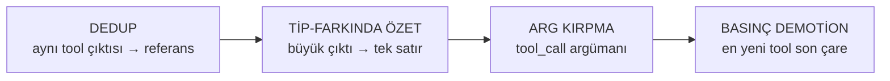

**1 · Dedup** — Byte-byte aynı **tool sonucu** iki kez tutulmaz; en yenisi tam kalır, eskiler `[Duplicate of #N]` referansına iner. Kayıpsızdır çünkü içerik hâlâ transcript'te duruyor.

**2 · Tip-farkında özet** — Büyük ve benzersiz **tool çıktısı**, tool'un *tipine göre* tek satıra iner (`[read_file] dosya okundu (40.000 chars)` / `[grep] 120 eşleşme`). Hangi tool, ne kadar veri — bu kalır; içerik gider.

**3 · Argüman kırpma** — Sadece sonuç değil **`tool_call`'un argümanı** da şişebilir; 500 karakteri aşan argüman JSON'ın *içinde* kırpılır ki çıktı geçerli JSON kalsın ve sağlayıcı 400 dönmesin.

**4 · Basınç demotion'ı** — Korunan bölge bile taşarsa **tool sonuçları** kademeli demote edilir; **en yeni tool bilinçli olarak en sona saklanır** ve ancak son çare olarak feda edilir.

*Tool-trace dışı (bu şemada yok):* proaktif tetik · boundary hesabı · 4096-token cache freni.

---

## OpenClaw — 5 tool-trace adımı (12'nin içinden)

**Ne zaman tetiklenir:** **[0] adımında** — boş yer pencerenin yarısının altına düştüğünde
(`boş < pencere × 0.5`). Yani tool izi pencereyi yarılamışsa. Üretim anında çalışan bir
katmanı **yoktur**; her şey bu tek eşikte olur.

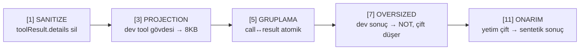

**[1] Sanitize** — `toolResult.details` alanı silinir. Tool çıktısı birazdan bir LLM'e gidecek; API anahtarı gibi sırların özete sızması **burada** engellenir.

**[3] Projection** — Dev **tool gövdeleri** 8KB örneğe indirilir ama ağırlıkları gerçek boyutta sayılmaya devam eder. Çalışma kopyasıdır, final transcript'e girmez; amacı özetleyici LLM'i patlatmamak.

**[5] Gruplama** — `tool_call` ile `tool_result` **atomik bir grup** sayılır; asla ayrı chunk'lara düşemezler, yoksa çift kırılır ve API isteği reddedilir.

**[7] Oversized** — Tek başına pencerenin yarısını aşan **tool sonucu** özetlenmeye *çalışılmaz*; tek satır NOT'a iner (`[Large toolResult (~104K tokens) omitted]`) ve **çifti birlikte düşer**. Bu özet değil, bilinçli feragattir.

**[11] Onarım** — Özetleme sonrası çifti kopmuş bir `tool_call` kaldıysa ona **sentetik sonuç** uydurulur; zincir kırık bırakılmaz.

*Tool-trace dışı:* [0] tetik · [2] estimate · [4] adaptif oran · [8] stage-split · [9] worker · [10] LLM özeti · [12] uygula.
*(Not: [6] chunk kısmen tool-farkındadır — [5]'in kurduğu atomik grupları bölmez.)*

---

## OpenCode — 5 tool-trace adımı

**Ne zaman tetiklenir:** **İki ayrı anda.** (A) Tool çıktısı **üretilirken**: >2000 satır
veya >50KB ise anında diske döker. (B) **Her turda proaktif** prune (`cfg.compaction.prune`
açıksa) — bedava olduğu için overflow beklemez; LLM'li overflow özeti ise ancak
`kullanılan ≥ pencere − 20K buffer` olunca devreye girer.

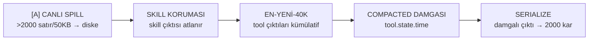

**[A] Canlı spill** — **Tool çıktısı üretilirken** 2000 satırı ya da 50KB'ı aşarsa diske yazılır; context'e önizleme + dosya referansı girer. Dev çıktı context'e **hiç girmez** ve tam içerik geri çağrılabilir.

**[B] Skill koruması** — `skill` **tool çıktıları** budamadan muaftır; referans materyaldir, eskise de değerini yitirmez.

**[B] En-yeni-40K** — Korunan tail'in ötesindeki **tool çıktıları** kümülatif toplanır; toplam 40K'ya varana kadar hepsi korunur, ötesi buda-adayı olur. Yani ölçüt mesaj sayısı değil, **tool izinin hacmi**.

**[B] Compacted damgası** — Buda kararı, tool'un `state.time.compacted` alanına basılan zaman damgasıdır. İçerik o an değişmez; damga hem "serialize'da küçült" hem de sonraki prune için "buradan öteye geçme" anlamına gelir.

**[B] Serialize** — Asıl küçülme burada: damgalı **tool çıktısı** context'e yazılırken `TOOL_OUTPUT_MAX_CHARS=2000` karaktere iner. Mesaj **silinmez**, çift bozulmaz.

*Tool-trace dışı:* proaktif tetik · son-2-turn koruması (turn bazlı) · 20K fayda-freni (cache) · overflow LLM özeti.

---

## Codex — 3 tool-trace adımı

**Ne zaman tetiklenir:** (A) **Tek tool çıktısı, kendisine tanınan tavanı aştığında**
`truncate_middle` anında devreye girer — bu tavan pencereden **bağımsız sabit bir sınırdır**
(POC'ta `TOOL_BUDGET_TOKENS = 5.000`); pencere bomboş olsa bile kesme yapılır.
(B) **History pencereye sığmadığında** (POC'ta `CONTEXT_WINDOW = 30.000`) önce placeholder
trim, o da yetmezse handoff özeti + yeni pencere. Yani Codex proaktif çalışmaz — **taşınca**
müdahale eder; ama (A) bir "taşma" değil, girişte uygulanan boyut filtresidir.

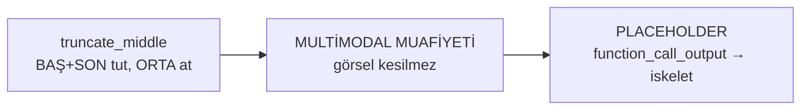

**1 · truncate_middle** — Tek bir **tool çıktısı** bütçeyi aşarsa başı ve sonu tutulur, ortası atılır; üstüne `Warning: truncated output` konur. Gerekçe: çıktının başı (imports/imza) ve sonu (hata satırı/exit kodu) en bilgilendirici, ortası en tekrarlı kısımdır.

**2 · Multimodal muafiyeti** — Görsel içerikli tool sonuçları bu kesmeden muaftır; bir resmin ortasını atmak onu tamamen anlamsız kılar.

**3 · Placeholder trim** — History sığmazsa en eski **`function_call_output`**'lar teker teker placeholder'a çevrilir: içerik gider, **çağrı iskeleti kalır** — böylece `tool_call ↔ tool_result` zinciri kırılmaz.

*Tool-trace dışı:* handoff özeti (`SUMMARIZATION_PROMPT`) · `CompactedItem` ile yeni pencere açma (windowing) — bunlar konuşma seviyesidir, tool iziyle sınırlı değildir.*

---

## Claude Code — 2 tool-trace mekanizması

**Ne zaman tetiklenir:** (A) Microcompaction, **tek tool çıktısı ~4K token'ı aştığında**
üretim anında (gözlem). (C) Subagent kaçışı bir **eşik değil karardır** — ajan büyük bir
yan-işi ayrı pencerede koşturmayı seçer, böylece tool izi ana context'te **hiç oluşmaz**.
*(Auto-compaction ~%80'de tetiklenir ama o konuşma seviyesidir, bu şemada yok.)*

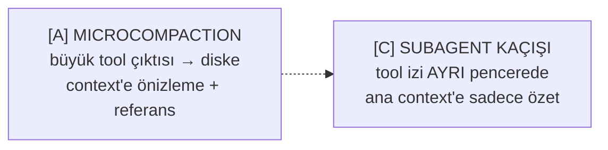

**[A] Microcompaction** — Tek bir **tool çıktısı** ~4K token'ı aşarsa diske yazılır (`tool-results/…txt`) ve context'te ~500 token'lık önizleme + `Full output saved to:` referansı kalır. Model içeriğin kaybolmadığını, gerekirse dosyadan okuyabileceğini bilir.

**[C] Subagent kaçışı** — Compaction'a *alternatif*: büyük bir yan-iş ayrı bir context penceresinde koşar, ana pencereye yalnız damıtılmış özet döner. Ara adımların **tool izi ana context'e hiç girmez** — yani sıkıştırılacak bir iz **oluşmaz bile**. Sıkıştırmanın en ucuz hali: hiç üretmemek.

*Tool-trace dışı:* auto-compaction (konuşma özeti, turn seviyesi) · Pre/PostCompact hook'ları · anti-thrash koruması.

---

> **Beş sistemi tool-trace ekseninde tek cümlede:** Hermes *tool sonuçlarını tekilleştirip tek satıra indirir ve en yeniyi son çare tutar* · OpenClaw *sırrı söker, devi feragatle düşürür, çifti atomik tutar ve kopanı tamir eder* · OpenCode *büyüğü üretimde diske alır, tool izini hacimle (40K) ölçer, damgalayıp serialize'da kısar* · Codex *çıktının ortasını keser, görseli muaf tutar, eskiyi iskelete indirir* · Claude Code *büyüğü diske alır, ağır işin izini hiç ana pencereye sokmaz*.
