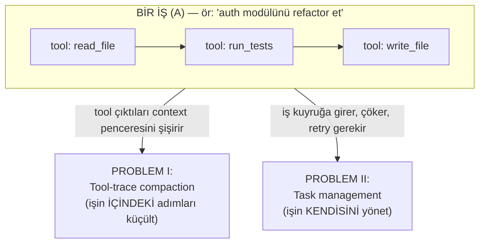
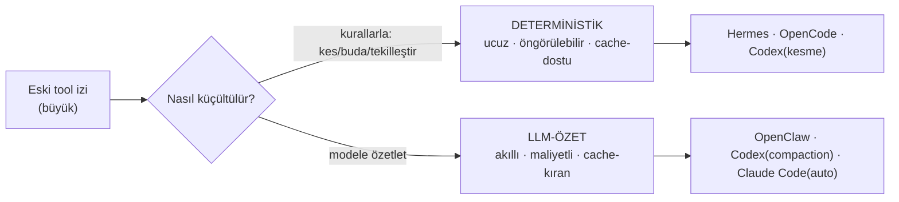
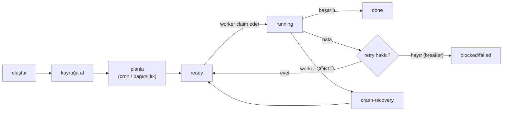
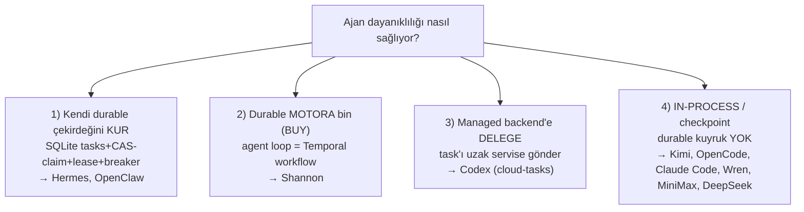
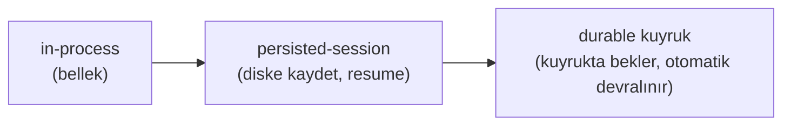
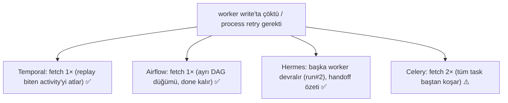
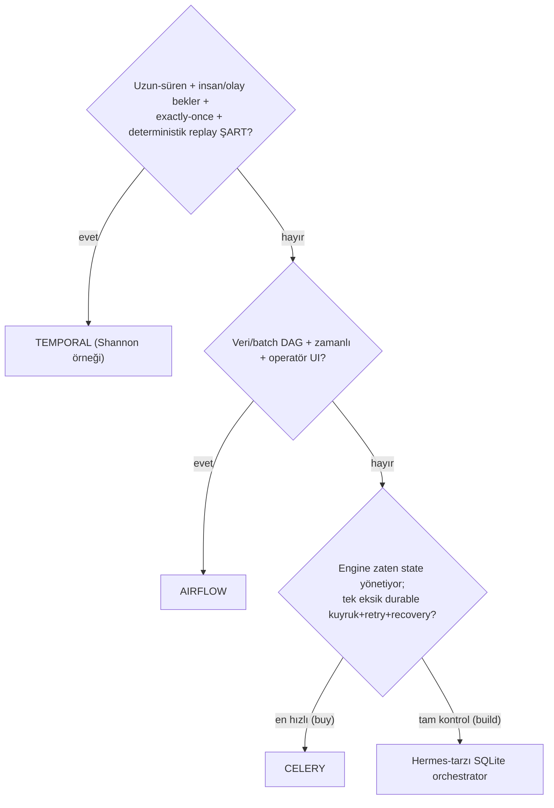
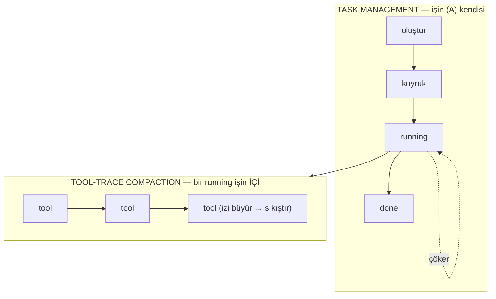

# Usta Rehber — Tool-Trace Compaction + Task Management (Tek Okuyuşta Her Şey)

> **Bu belge ne için?** Şimdiye kadar iki konuda yazdığımız tüm md/PDF/POC'ları **tek, sıralı ve olabildiğince anlaşılır** bir rehberde topluyor. Amaç: bir kez okuyunca **hem anlayasın hem de başkasına anlatabilesin**.
>
> **Nasıl okunur?** Sırayla. Her bölüm bir öncekinin üstüne biner. Terimler ilk geçtiği yerde tanımlanır; sonda tam **sözlük** var. Diyagramlar mermaid'dir (GitHub/artifact'ta çizim olarak render olur). Her bölümün sonunda **"Tek cümle"** özeti vardır — anlatırken bunları kullan.
>
> **İki konu, tek omurga:** Bir ajan iki şeyi yönetir — **(I) bir işin İÇİNDEKİ tool adımlarını** (context'e sığsınlar) = *tool-trace compaction*; **(II) işin KENDİSİNİ** (kuyruk, retry, çökme sonrası devam) = *task management*. Rehber bu iki katman üzerine kurulu.

---

# 0. Büyük resim — bir ajan neyi yönetir?

Bir LLM-ajanı bir **döngüde** çalışır: düşün → bir **tool** çağır (dosya oku, komut çalıştır, web getir) → sonucu gör → tekrar düşün… Bu döngü iki ayrı yerde "taşar", ve iki ayrı problemimiz buradan doğar:

Üç ölçeği (katmanı) baştan ayıralım — tüm rehber bu kelimeleri kullanır:

| Katman | Ne | Örnek |
|---|---|---|
| **A — İŞ / JOB** | Yaşam döngüsü olan bütün hedef | "auth modülünü refactor et" |
| **B — ADIM** | Tek tool çağrısı / LLM turu | `read_file(auth.py)` |
| **C — ALT-AJAN** | A'nın parçası için açılan alt-iş | "40 dosyayı tara" |

- **Tool-trace compaction**, bir **A-işinin İÇİNDEKİ B-adımlarının** izini (çıktısını) küçültür — amaç: context penceresi taşmasın.
- **Task management**, **A-işinin KENDİSİNİ** yönetir — amaç: iş kuyruğa girsin, planlansın, çökse de kaybolmasın.

> **Tek cümle:** Tool-trace = *işin içindeki adımlar context'e sığsın*; task-management = *işin kendisi worker çökse de kaybolmasın.* Farklı katmanlar, farklı çözümler.

---

# KISIM I — TOOL-TRACE COMPACTION (işin İÇİNİ yönetmek)

## I.1 Nedir, neden gerekir?

**Context penceresi (context window):** modelin bir seferde "görebildiği" metnin üst sınırı (token cinsinden). **Token** ≈ ~4 karakterlik metin parçası. Ajan tool çağırdıkça, her çağrının **izi (trace)** — çağrı + dönen çıktı — pencereye eklenir. Büyük çıktılar (40 KB'lık dosya, 5000 satır test log'u) pencereyi hızla doldurur.

**Tool-trace compaction:** bu izi — **mesaj bütünlüğünü ve `tool_call ↔ tool_result` eşleşmesini bozmadan** — küçültme sanatı.

**Bozulmaması gereken tek kural (invariant):** her `tool_call`'un (asistanın "şunu çağır" demesi) bir `tool_result`'u (dönen çıktı) olmalı. Biri silinip öbürü kalırsa (yetim) sağlayıcı API isteği **reddeder**. Ayrıca **yakın kuyruk (tail)** korunur — ajanın az önce gördüğü, hâlâ üstünde çalıştığı adımlar.

> **Tek cümle:** Tool-trace compaction = tool çıktılarının context'i şişiren izini, çift-eşleşmeyi ve yakın geçmişi bozmadan küçültmek.

## I.2 İki ekol

- **Deterministik (LLM'siz):** kurallarla budar/keser/tekilleştirir. Ucuz, tahmin edilebilir, **prompt-cache**'i az bozar. (prompt-cache = sağlayıcının daha önce gördüğü mesaj önekini yeniden ücretlendirmemesi; eski mesajı değiştirirsen cache bozulur.)
- **LLM-özet:** eski izi bir modele verip **bilgi-taşıyan özet** ürettirir. Daha akıllı ama maliyetli ve cache-kırar.
- Çoğu sistem **ikisini katmanlı** kullanır: önce ucuz deterministik kat, yetmezse LLM katı.

## I.3 Sekiz sistem, teker teker

### Hermes — deterministik **4 geçiş** (LLM'siz)
`_prune_old_tool_results`, korunan tail'in öncesinde 4 geçiş:
1. **Dedup:** byte-identik tool sonuçları → en yenisi tam kalır, eskiler "#N'in kopyası" referansına iner (kayıpsız). Sabit: `_DEDUP_FLOOR=200` (bunun altını dedup etme).
2. **Informative summary:** büyük benzersiz sonuç → **tip-farkında tek satır** (ör. `[read_file] read auth.py (40,000 chars)`). Asla çökmez (bozuk çağrıda bile backstop).
3. **Arg truncation:** >500 karakterlik `tool_call` argümanı JSON **içinde** kırpılır (geçerli JSON kalır → 400 riski yok).
4. **Basınç demotion'ı:** korunan bölge bile tavanı aşarsa kademeli demote — ama **en yeni tool son çare** olarak saklanır.
- **Proaktif + prompt-cache sözleşmesi:** budama cache'i bozacağı için **ancak ≥4096 token geri kazanılacaksa commit** eder; yoksa dokunmaz.
- **Örnek (POC):** 33.063 → 2.101 token (**%93.6**); mesaj sayısı değişmez (silme yok), çift bütünlüğü korunur.
> **Tek cümle:** Hermes, tail'i koruyup öncesini 4 deterministik geçişle (dedup→özet→arg-kırp→basınç) LLM'siz küçültür, cache'i ancak kazanç büyükse bozar.

### OpenClaw — **LLM chunk-özetleme** (12 adım)
Deterministik budamaz; tool-çiftlerini bozmadan **chunk'lar ve chunk'ları LLM'e özetletir**. Akış: `[0] tetik (boş yer < pencere×0.5)` → `[1] sanitize (SECURITY: toolResult.details silinir → API_KEY özete giremez)` → `[2] estimate` → `[3] projection (dev gövde → 8KB örnek + "omittedChars"; içerik hafif ama AĞIRLIK boyut-doğru; TEXT_SAMPLE=8192, TRUNCATE_THRESHOLD=32768)` → `[4] adaptif oran (mesajlar ağırsa chunk 0.40→0.15'e kısılır)` → `[5] gruplama (tool_call↔result atomik grup)` → `[6] chunk` → `[7] oversized (tek mesaj > pencere×0.5 → özetlenemez → tek satır NOT, çifti birlikte düşer)` → `[8] stage-split` → `[9] worker-thread` → `[10] LLM özet` → `[11] onarım (yetim çift → sentetik sonuç)` → `[12] uygula`.
- **Örnek (POC):** 138.850 → 66 token; **sır sızmadı** (details silindi), çift bütünlüğü korundu.
> **Tek cümle:** OpenClaw, sırrı söküp devi ele alıp çiftleri koruyarak izi chunk'lar ve LLM'e özetletir.

### OpenCode — **iki katman** (canlı spill + deterministik prune)
- **Katman A (canlı spill):** tool çıktısı ÜRETİLİRKEN >2000 satır / 50KB ise **diske dökülür**, context'e önizleme + referans girer (`truncate.ts`).
- **Katman B (deterministik prune):** eşikte **sondan başa yürür**; **son-2-turn + en-yeni-40K + `skill`** korunur; ötesi buda-adayı; toplam budanabilir > `PRUNE_MINIMUM=20K` ise **`compacted` damgası** basılır (fayda-freni); serialize'da damgalı çıktı `TOOL_OUTPUT_MAX_CHARS=2000`'e iner. Yetmezse **overflow LLM özeti**.
- **Örnek (POC):** 111.714 → 76.167 token; **skill korundu**, silme yok.
> **Tek cümle:** OpenCode büyük çıktıyı üretim anında diske döker, sonra eşikte son-2-turn+40K+skill'i koruyup gerisini deterministik budar.

### Codex — **ortadan-kesme + model-turn windowing**
- **Katman A (`truncate_middle`):** tek çıktı bütçeyi aşarsa **baş + son tutulur, ORTA atılır**, "Warning: truncated output" başlığı eklenir; görseller (multimodal) **kesilmez**.
- **Katman B (compaction bir MODEL TURN'üdür):** history pencereye sığmazsa önce **dinamik fit-to-window trim** (en eski function-output'lar placeholder'a çevrilir; yakın turn korunur); yetmezse `SUMMARIZATION_PROMPT` ile **handoff özeti** üretilir ve `CompactedItem` zinciriyle **yeni pencere** açılır (resume edilebilir = windowing).
- **Örnek (POC):** olay-güdümlü; 3 turn'de **2 window** (resume zinciri).
> **Tek cümle:** Codex çıktıyı baş+son tutup ortasını keser; history taşınca eskiyi placeholder'a çevirir, yetmezse handoff özetiyle yeni bir pencereye devreder.

### Claude Code — **micro + auto + subagent kaçışı** (kapalı kaynak → gözlem)
- **Microcompaction:** büyük tek tool çıktısı (gözlem: 93KB WebFetch) **diske** yazılır, context'e ~500t önizleme + referans kalır.
- **Auto-compaction:** context eşiğe gelince eski turn'ler **konuşma özetine** iner; `PreCompact`/`PostCompact` **hook**'ları sarar; `/compact` ile manuel de tetiklenir.
- **Subagent kaçış yolu:** büyük yan-iş **ayrı context penceresinde** koşar, ana pencereye **sadece özet** döner (sıkıştırmaya alternatif).
- **Örnek (POC):** micro→disk, 1 auto-compaction, subagent özeti — ara adımlar ana context'e hiç girmez.
> **Tek cümle:** Claude Code büyük çıktıyı diske alır, eşikte konuşmayı özetler, büyük yan-işi ayrı pencereye kaçırıp sadece özetini geri alır.

### Kimi Code — **hibrit: deterministik kırpma + LLM handoff-özet** (iki katman, en olgunlarından)
Resmî Moonshot AI CLI'ı; iki seviyede çalışır:
- **Katman A (per-tool deterministik kırpma):** her tool çıktısı üretilirken `result-builder.ts` ile `maxChars` + `maxLineLength` sınırına kırpılır; işaret `[...truncated]` + "Output is truncated to fit in the message." (OpenCode Katman A / Codex `truncate_middle` muadili). Görsel için `image-compress.ts`.
- **Katman B (event-sourced LLM handoff-özet):** eşik `fullCompaction/strategy.ts` — `reservedContextSize=50_000`, `shouldCompact(usedSize)`. Özet `compactionHandoff.ts` ile üretilir; user-mesajlarının **head'i (2K token) + tail'i** korunur, **orta elide edilir** (`compaction_elision`), sıkışan user-mesajı **20K token**'a sınırlanır. Compaction bir **op**'tur (`context.apply_compaction`) → **wire-replay / snapshot reducer** ile **resume edilebilir** (Codex windowing felsefesi).
> **Tek cümle:** Kimi çıktıyı üretimde deterministik kırpar (A), context dolunca event-sourced/replay-edilebilir LLM handoff-özetiyle (user head/tail koru, orta elide) sıkıştırır (B) — Codex+OpenCode birleşimi.

### MiniMax Mini-Agent — **token-limit LLM özeti** (tek katman)
Resmî MiniMax demo'su; saf LLM-özet:
- **Tetik (`_summarize_messages`):** `estimated_tokens > token_limit` **veya** `api_total_tokens > token_limit` — **çift tetik** (yerel `tiktoken` tahmini **ya da** API'nin raporladığı gerçek token). Varsayılan `token_limit = 80_000`.
- **Şekil:** özet sonrası `system → user1 → summary1 → user2 → summary2 …` — **user turları korunur**, aralarındaki asistan/tool işi LLM özetine iner. `_skip_next_token_check` = anti-thrash (özetten hemen sonra kontrolü atla).
- Deterministik per-tool katmanı **yok**.
> **Tek cümle:** MiniMax, tahmini veya gerçek token 80K'yı aşınca konuşmayı user-turları koruyarak LLM'e özetletir (OpenClaw/Claude Code ekolünün en sade hâli).

### DeepSeek-code — **basit compaction tetiği** (⚠️ topluluk)
`yksanjo/deepseek-code` (DeepSeek'in resmî kod-ajanı yok; bu topluluk):
- `conversation.py`: `max_messages=100`; `needs_compaction()` → `len(messages) > 100` olunca sadece **öneri** döndürür. Gerçek sıkıştırma minimal; per-tool kırpma / handoff-özet mimarisi yok.
> **Tek cümle:** DeepSeek-code yalnızca 100 mesajı aşınca "compaction lazım" sinyali verir; olgun bir tool-trace mekanizması yoktur.

## I.4 Ortak kural + I.5 Karşılaştırma

Hepsinde ortak: **(a) tool_call↔tool_result çifti bozulmaz, (b) yakın tail korunur, (c) silme değil küçültme tercih edilir.**

| Sistem | Ekol | Ana mekanizma | Korunan | Örnek kazanç |
|---|---|---|---|---|
| **Hermes** | Deterministik | 4 geçiş (dedup/özet/arg/basınç) | tail (token-bütçe, floor 8) | %93.6 |
| **OpenClaw** | LLM-özet | 12 adım, chunk→LLM | head+tail, çiftler | 138.850→66 |
| **OpenCode** | Deterministik(+LLM) | spill + backward-prune | son-2-turn+40K+skill | 111.714→76.167 |
| **Codex** | Deterministik+LLM | ortadan-kes + windowing | yakın turn, resume zinciri | 2 window |
| **Claude Code** | LLM(+disk) | micro+auto+subagent | son turn'ler | 1 auto-compaction |
| **Kimi Code** | **Hibrit** | per-tool kırp (A) + LLM handoff-özet (B), event-sourced/replay | user head(2K)+tail, elision | (koddan) |
| **MiniMax** | LLM-özet | token>80K → user-koruyan özet | user turları | (koddan) |
| **DeepSeek-code** | İlkel | >100 mesaj → öneri | — | (topluluk) |

**Ekol haritası:** *Deterministik ağırlıklı* → Hermes, OpenCode. *LLM-özet* → OpenClaw, MiniMax, Claude Code(auto). *Hibrit (iki katman)* → OpenCode(+LLM), Codex, **Kimi**. *İlkel* → DeepSeek-code. **Kimi ≈ Codex+OpenCode birleşimi** (en olgun hibrit).

**Çalışan kanıt:** `report/tool-trace-poc-web.html` (interaktif) — ilk beş sistemi adım adım koşturur, her ilerlemede transkriptin gerçek farkını gösterir.

---

# KISIM II — TASK MANAGEMENT (işin KENDİSİNİ yönetmek)

## II.1 "Task" ne demek + terminoloji tuzağı

Bu kısımda **task = A (İŞ/JOB)** — yaşam döngüsü olan iş birimi. **Tuzak:** kelime her araçta farklı katmanı gösterir:
- **Airflow/Celery dokümanında "task" = B (adım).** (Airflow'da bir DAG düğümü; Celery'de bir fonksiyon çağrısı.)
- **Temporal/agent-engine'de "task" = A (iş).** (Temporal Workflow; Hermes Kanban kartı.)

Yani *"Airflow task retry yapar"* → bir **adımı (B)** yeniden koşar; *"Temporal task'ı sürdürür"* → bütün **işi (A)** kurtarır. **Aynı kelime, farklı katman.** Aşağıdaki her şey **A seviyesine** göredir.

## II.2 Bir task'ın (A) hayatı + iki retry

**İki retry'ı karıştırma** (kararın yarısı bu):
- **(a) API-retry:** 429/5xx için backoff — hafif, **hepsinde** var.
- **(b) Task-retry:** worker çöktü, iş baştan/kaldığı yerden sürsün — **asıl zor olan**; koçun sorduğu bu.

> **Tek cümle:** Her iş oluştur→kuyruk→planla→çalış→(hata) retry→(çökme) kurtar→bitti döngüsünden geçer; asıl zor kısım "worker çökerse iş kaybolmasın".

## II.3 Task nasıl yaratılır — şemayı çatı koyar, değeri model doldurur

- **Task'ın YAPISI (hangi alanlar var)** → **çatı sabit tanımlar** (Hermes `create_task(title, body, parents, assignee, …)`). Model yeni alan icat etmez.
- **Bir task'ın DEĞERLERİ** → **çoğunlukla model runtime'da** bir tool çağırıp parametrelerini doldurur (`kanban(action="create", title=…, parents=[…])`); ya da insan/gateway/cron yaratır.
- **Ajan task'ı DİNAMİKtir:** sıradaki adıma (B) model **çalışma anında** karar verir; hatta yeni işler (A) runtime'da doğabilir. (Airflow'un beklediği **statik DAG**'ın tersi.)

> **Tek cümle:** Şema = çatının koyduğu form; doldurma = modelin o forma uygun JSON değerleri üretmesi (dinamik). Model formu değiştirmez, kutucukları doldurur.

## II.4 Dört aday, teker teker (+ taksonomi)

### Airflow — "zamanlı DAG'ların kralı"
İşi önceden **statik DAG** olarak yazarsın; **Scheduler** zamanı/bağımlılığı gözetip adımları **executor**'a dağıtır; durum **metadata DB** + zengin UI. Retry adımı **baştan** koşar; zombie task'lar heartbeat kaçınca temizlenir. En güçlü yanı **scheduling + backfill/catchup**. Sınır: dinamik ajan döngüsüne uymaz.

### Celery — "dağıtık task kuyruğu"
Fonksiyonu (B) bir **broker**'a (Redis/RabbitMQ) atarsın, **worker** çeker. Native worker havuzu → çok iyi yatay ölçek. **at-least-once** (idempotency **sende**); `acks_late` (iş bitince ack) + visibility-timeout tuzağı. Çok-adımlı iş (A) kavramı yok — Canvas ile sen kurarsın; "nerede kaldım"ı sen tutarsın.

### Temporal — "durable execution"
İş (A) = **kod** (Workflow); adım (B) = **Activity**. Her olay **event-history**'ye yazılır; worker çökünce **replay** edip biten activity'leri **atlar** → **kaldığı yerden devam + exactly-once**. Activity başına `RetryPolicy`. Bedel: cluster/Cloud + **determinizm disiplini** (LLM'i activity'e sar). En güçlü dayanıklılık.

### Mevcut agent engine'ler (dört rota)

- **Hermes/OpenClaw (kur):** SQLite'ta `tasks` FSM; **CAS-claim** (`WHERE claim_lock IS NULL` → at-most-once), **lease+heartbeat**, PID-crash-reclaim, **circuit-breaker**, handoff özeti. Düşük operasyon, tam kontrol.
- **Shannon (buy):** agent loop'u **Temporal workflow/activity** olarak koşar; insan-onayı Temporal **signal**, time-travel-debug = replay. "Temporal'a bin" rotasının canlı kanıtı.
- **Codex (delege):** yerelde `rollout` (resume) + HTTP-backoff; ağır işi **cloud-tasks** managed backend'e (`TaskStatus`: Pending→Ready→Applied) devreder.
- **In-process (durable kuyruk yok):** oturum + checkpoint; hız+basitlik ama tek başına "çökse de kaybolmasın" vermez. İçinde bir yelpaze var (detayı §II.5):
  - **Kimi Code** — bu kategorinin **en olgunu**: `Task` FSM (subagent/bash/tool), subagent-turn (özet damıtır, retry'lı), **`ToolAccesses` ile kaynak-farkındalıklı concurrency scheduler**, event-sourced **persisted-session resume**.
  - **OpenCode / Claude Code / Wren** — oturum + git-snapshot/checkpoint; bg-job bellek-içi.
  - **MiniMax / DeepSeek-code** — en sade: MiniMax API-backoff retry'lı (`retry.py`, max_retries=3) ama disk-resume yok; DeepSeek-code task-yönetimsiz.

## II.5 Dayanıklılık merdiveni — in-process → persisted-session → durable kuyruk

Task-yönetiminin özü tek soruda: **süreç/worker ortada çökerse iş ne olur?** Üç seviye var; soldan sağa dayanıklılık artar. (Senaryo: iş "Sipariş #4711", worker tam ortada çöktü.)

### (1) in-process (süreç-içi)
- **State nerede:** yalnız çalışan sürecin **RAM'i** (mesaj geçmişi, arka-plan job'ları).
- **Çökme testi:** süreç ölür → **her şey uçar**; yeniden açınca **sıfırdan** başlarsın.
- **Örnek:** OpenCode `BackgroundJob` (bellek-içi), Claude Code, **MiniMax**, **DeepSeek-code**.
- **Sınır:** "worker çökse de iş kaybolmasın" garantisi **yok**. Hız+basitlik için (interaktif tek-kullanıcı).

### (2) persisted-session (kalıcı oturum)
- **State nerede:** **disk** — her adım/olay checkpoint ya da event-log'a yazılır; her oturumun `session_id`/`thread_id`'si var.
- **Çökme testi:** süreç ölür → yeniden başlat, **o oturumu tekrar aç** → **son checkpoint'ten kaldığı yerden** devam. Veri kaybolmaz.
- **Örnek:** **Kimi Code** (event-sourced context, wire-replay/snapshot → resume), Codex `rollout`, LangGraph checkpointer, Wren.
- **Kritik incelik (PASİF):** durum saklanır ama **kimse otomatik devam ettirmez** — o oturumu **sen/kullanıcı tekrar açmalısın**. "Bekleyen işler kuyruğu" yoktur; sadece "istersen bu oturumu geri yükle" vardır.

### (3) durable kuyruk (dayanıklı kuyruk)
- **State nerede:** kalıcı kuyruk/DB (Hermes SQLite `tasks`, Celery broker, Temporal task queue, Airflow metadata DB).
- **Çökme testi:** worker ölür → iş **kuyrukta kalır** → **başka worker otomatik devralır** (lease dolar / mesaj yeniden teslim / event-history replay). Kimsenin oturumu açması gerekmez — sistem toparlar.
- **Örnek:** **Hermes** (CAS-claim+lease+`detect_crashed_workers`), **Celery** (redelivery+`acks_late`), **Temporal** (task queue+replay), **Airflow** (scheduler+zombie reap).
- **Sınır:** operasyonel maliyet (DB/broker/dispatcher işletmek).

### Asıl fark: persisted-session ≠ durable kuyruk (en çok karışan)
İkisi de diske yazar, ikisinde de veri kaybolmaz. Fark **pasif vs aktif**:

| | persisted-session | durable kuyruk |
|---|---|---|
| Bekleyen iş kuyruğu | ❌ | ✅ |
| **Kim devam ettirir?** | **sen/kullanıcı** (oturumu tekrar açar) | **sistem otomatik** (başka worker devralır) |
| Çoklu worker'a dağıtım | ❌ | ✅ |
| Örnek | Kimi, Codex-rollout, LangGraph, Wren | Hermes, Celery, Temporal, Airflow |

- **persisted-session (Kimi):** worker çöktü → durum diskte; ama iş **kullanıcı tekrar açana kadar bekler** → otonom filo için yetersiz.
- **durable kuyruk (Hermes):** worker çöktü → lease dolar → **başka worker otomatik claim eder** → kimse dokunmadan devam → otonom filo için gereken bu.

> **Tek cümle:** in-process = bellekte (ölürse gider); persisted-session = diske yazılır ama devamı SEN açarsın; durable kuyruk = işler kuyrukta bekler ve worker çökse SİSTEM otomatik devralır. Otonom, hata-toleranslı task yönetimi ancak **durable kuyruk** ile olur.

## II.6 Scheduling (zamanlı task)

| Sistem | Kim ateşler | Ne başlar | Backfill/catchup |
|---|---|---|---|
| **Airflow** | Scheduler | DagRun (statik) | **en güçlü** |
| **Hermes/OpenClaw** | 60s ticker / cron provider | agent run (dinamik) | zayıf (managed'la iyi) |
| **Temporal** | Temporal Schedules | durable Workflow | `catchupWindow`+backfill |
| **Celery Beat** | ayrı Beat daemon | kuyruğa task | telafi yok |

Not: cron **her ajanda yok** — sadece engine tipi (Hermes/OpenClaw) ya da Temporal-destekli (Shannon).

## II.7 ASIL FARK — worker işin ortasında çökerse?

Bütün karar bu tek soruya iner. İş: `fetch ✅ → process ✅ → write ⏳ (worker ÇÖKTÜ)`. **Gerçek POC'larla ölçtük** — retry'da `fetch` **kaç kez** koşuyor?

**Ölçülen gerçek çıktı** (`poc-task-mgmt/`):
- **Temporal:** `process` 2×, `fetch/deliver` 1× — biten activity atlanır (kaldığı yerden).
- **Celery:** `fetch` **2×** — retry tüm task'ı baştan koşturur → A-seviyesi resume **sende**.
- **Hermes:** CRASH → `release_stale_claims()` otomatik → worker-B devraldı (`run#2`) → done; **at-most-once** (ikinci worker `None` aldı).

> **Tek cümle:** Temporal/Airflow tamamlanan kısmı korur (fetch 1×); Celery tüm işi baştan koşar (fetch 2×); Hermes çökmeyi otomatik toparlayıp handoff'la devreder. "Yerleşik A-recovery" ile "sen inşa edersin" farkı tam burada.

## II.8 Karar ağacı + öneri

**brain_chat_V2 önerisi:** zaten oturum/state yönetiyorsa → **buy:** +Celery (kuyruğu devret), ya da **build:** Hermes-tarzı hafif durable çekirdek (Postgres/SQLite, CAS-claim, lease, breaker; ~1-2K satır). Temporal'a ancak çok-makineli/uzun-bekleyen ihtiyaç netleşince geç.

**Çalışan kanıt:** `poc-task-mgmt/` — Hermes/Temporal/Celery **gerçek** framework'lerle koşuyor; `web_server.py` ile tarayıcıdan görsel test.

---

# KISIM III — İKİSİ NASIL BİRLEŞİR + ÖĞRETME KİTİ

## III.1 İki katman, tek resim

- **Task management** dışarıda: işi doğurur, kuyruğa alır, çökerse kurtarır.
- **Tool-trace compaction** içeride: o iş **çalışırken** (running) tool izini context'e sığdırır.
- İkisi **farklı katman**, farklı araçlar; ama aynı ajanı ayakta tutar.

## III.2 Her sistem tek paragraf (iki konu birden)

- **Hermes** — Tool-trace'i deterministik 4 geçişle LLM'siz küçültür; task'ı ise SQLite `tasks` FSM + CAS-claim + lease + breaker ile yönetip çökmeyi otomatik toparlar. Hem içeriyi hem işi kendi çekirdeğinde çözen tek ajan.
- **OpenClaw** — Tool-trace'i sırrı söküp chunk'layıp LLM'e özetleterek; task'ı SQLite-only kuyruk + gateway restart-recovery + terminal-outcome ile. Hermes'ten sonra en olgun durable profil.
- **OpenCode** — Tool-trace'i iki katmanla (spill + deterministik prune); task'ı ise in-process (`Task` tool, bellek-içi bg-job, git-snapshot revert). İç güçlü, işin dayanıklılığı zayıf.
- **Codex** — Tool-trace'i ortadan-kesme + model-turn windowing ile; task'ı yerelde rollout-resume, ağır işi managed cloud backend'e delege. Hibrit.
- **Claude Code** — Tool-trace'i micro+auto+subagent-kaçışı ile; task-seviyesi durable yönetimi yok (interaktif CLI). İç zengin, iş dayanıklılığı kapsam dışı.
- **Shannon** — (tool-trace'i token-budget ile yönetir) task'ı **Temporal** üstünde koşar → durable/retry/replay hazır. "Buy" rotasının kanıtı.
- **Wren** — Task = veri sorusu → LangGraph ReAct + deterministik semantik motor (wren-engine). In-process/checkpoint.
- **Kimi Code** — Tool-trace'i **hibrit** çözer (per-tool deterministik kırpma + eşikte event-sourced LLM handoff-özeti, user head/tail koru + orta elide); task'ı **persisted-session** modeliyle yönetir (`Task` FSM, subagent-turn, `ToolAccesses` concurrency scheduler, replay-resume). In-process kategorisinin en olgunu; durable kuyruk yok.
- **MiniMax Mini-Agent** — Tool-trace'i saf **LLM-özetle** (token>80K → user-koruyan özet); task'ı süreç-içi + API-backoff retry (`retry.py`). Temiz ama sade; durable yok.
- **DeepSeek-code** (topluluk) — Tool-trace'i ilkel tetikle (>100 mesaj); task-yönetimi yok. En alt uç.
- **Airflow / Celery / Temporal** — Ajan değil, **altyapı**: sırasıyla statik-DAG scheduler / dağıtık kuyruk / durable-execution motoru. Agent engine'lerin task tarafında "build/buy/delegate" için referans altyapılar.

## III.3 Sözlük (tek yerde)

| Terim | Kısa açıklama |
|---|---|
| **token / context window** | ~4 karakterlik metin birimi / modelin bir seferde görebildiği üst sınır |
| **tool trace** | tool çağrıları + dönen çıktıların context'teki izi |
| **prompt-cache** | sağlayıcının gördüğü mesaj önekini yeniden ücretlendirmemesi; eski mesajı değiştirmek bozar |
| **prune / dedup / truncate** | buda / tekilleştir / kes |
| **tool_call ↔ tool_result** | asistanın çağrısı ile dönen çıktı; ayrılırsa (yetim) API reddeder |
| **tail (kuyruk) koruma** | yakın geçmiş mesajları budamadan koru |
| **spill** | büyük çıktıyı diske döküp context'e önizleme+referans bırakma |
| **windowing (Codex)** | eski history'yi özetleyip yeni, resume-edilebilir pencereye devretme |
| **task (A/B/C)** | iş/job (A) · adım (B) · alt-ajan (C); belgede task=A |
| **enqueue / broker / worker** | kuyruğa alma / kuyruğun yaşadığı yer / işi koşturan süreç |
| **scheduler / cron / backfill** | ne zaman çalışacağına karar / zaman ifadesi / kaçan geçmişi telafi |
| **DAG** | adımların önceden çizili, döngüsüz bağımlılık grafiği (statik) |
| **workflow / activity** | Temporal: iş (A) kodu / tek yan-etkili adım (B) |
| **event history / replay** | işin değişmez kaydı / çökme sonrası tekrar oynatıp biteni atlama |
| **determinism / idempotency** | aynı girdi→aynı yol / aynı işi iki kez yapmak zarar vermesin |
| **at-most / at-least / exactly-once** | en fazla / en az / tam bir kez çalışma garantisi |
| **CAS-claim** | "koşul hâlâ doğruysa kap" atomik işlemi; kilitsiz at-most-once |
| **lease / heartbeat** | süreli claim / canlılık sinyali; çökme tespiti |
| **circuit breaker** | üst üste N hatada durup insana bırakma |
| **handoff özeti** | deneme sonu "nereye kadar geldim" notu; sonraki deneme devam eder |
| **durable execution** | iş, süreç ölse de kalıcı; kaldığı yerden sürer |
| **build / buy / delegate / in-process** | kendi çekirdeğini kur / durable motora bin / managed'a devret / süreç-içi (dayanıksız) |

## III.4 "2 dakikada anlat" — öğretme kiti

**Asansör konuşması (ezber):**
> "Bir ajanı ayakta tutmak iki ayrı problem. **Birincisi**, iş çalışırken tool çıktıları context penceresini şişirir — bunu **tool-trace compaction** ile çözeriz: ya deterministik budarız (Hermes), ya LLM'e özetletiriz (OpenClaw), çoğu da ikisini katmanlar; kural: çift-eşleşmeyi ve yakın geçmişi bozma. **İkincisi**, işin kendisi kuyruğa girmeli, planlanmalı ve **worker çökse de kaybolmamalı** — bu **task management**. Airflow zamanlı statik-DAG'ların kralı ama dinamik ajana uymaz; Celery dağıtık kuyruk verir ama 'kaldığı yerden devam'ı sen yazarsın; Temporal işi kaldığı yerden sürdürür ama operasyonu ağır. Ajanlar üç yoldan birine gidiyor: kendi SQLite çekirdeğini kurmak (Hermes), Temporal'a binmek (Shannon), ya da managed'a devretmek (Codex). Farkın kanıtı tek soruda: worker çökünce fetch kaç kez koşar — Temporal'da 1, Celery'de 2."

**Anlatırken 7 anahtar cümle:**
1. İki katman: tool-trace = işin içi; task-mgmt = işin kendisi.
2. Tool-trace kuralı: çift-eşleşme + tail bozulmaz.
3. İki ekol: deterministik (ucuz, cache-dostu) vs LLM-özet (akıllı, cache-kırar).
4. "task" kelimesi Airflow/Celery'de adım (B), Temporal/ajanda iş (A).
5. İki retry: API-çağrısı (hepsinde) vs task-seviyesi (asıl zor).
6. Asıl fark crash-recovery: "yerleşik" (Temporal/Hermes) vs "sen inşa edersin" (Celery).
7. Ajan rotaları: build (Hermes) / buy (Shannon→Temporal) / delegate (Codex) / in-process (dayanıksız).

**Olası sorular (hazır cevap):**
- *"Neden hep Temporal değil?"* → LLM adımı non-deterministik; determinizmi korumak için her adımı activity'e sarmak + cluster işletmek ağır. Çoğu ajan yükü için SQLite çekirdeği (Hermes) pratik karşılığını daha ucuza verir.
- *"Tool-trace ile task-mgmt aynı şey mi?"* → Hayır; biri bir işin içindeki adımları context'e sığdırır, öbürü işin kendisini yaşam döngüsünde yönetir.
- *"Ajan task'ı neden Airflow'a uymaz?"* → Airflow statik DAG bekler; ajan sıradaki adıma runtime'da karar verir (dinamik).

---

## Kaynak belgeler (bu rehberin damıttığı)
- **Tool-trace:** `hermes-tool-trace-compaction.md`, `openclaw-/opencode-/codex-/claude-code-tool-trace-compaction-teknik.md`, `tool-trace-compaction-butun.pdf`, `tool-trace-poc-web.html`.
- **Task-management:** `task-yonetimi-altyapi-karari.md` (+ Ek A), `task-management-sunum-ve-flowchart.md`, `task-management-analizi.md`.
- **Çalışan POC'lar:** `poc/` (tool-trace, 5 sistem) · `poc-task-mgmt/` (gerçek Airflow/Celery/Temporal/Hermes + `web_server.py`).

> **Son söz:** Bu tek belgeyi kavradıysan, hem *bir ajanın context'ini nasıl ayakta tuttuğunu* (tool-trace) hem *işlerini nasıl dayanıklı yönettiğini* (task-mgmt) — sekiz ajan (Hermes, OpenClaw, OpenCode, Codex, Claude Code, Kimi, MiniMax, DeepSeek) + Wren/Shannon ve üç altyapı (Airflow/Celery/Temporal) üzerinden — anlatabilecek seviyedesin.
