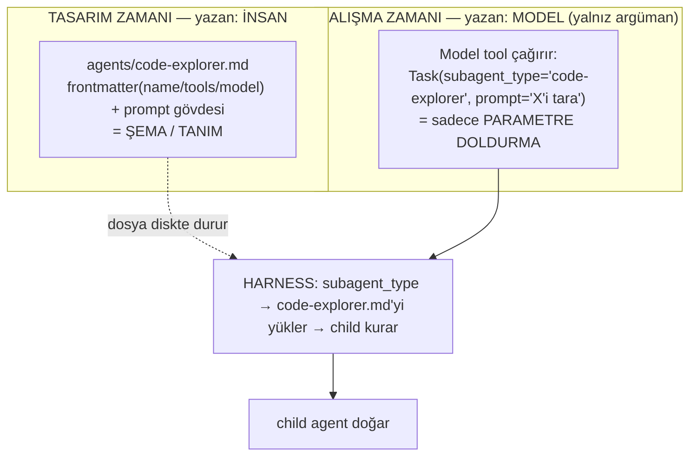

# Agent Nasıl Tanımlanır ve Spawn Edilir — 5 Sistemde Tam Mekanik

> **Soru:** Bir (sub)agent oluşurken **model mi şema yazıyor**, yoksa **sadece tool parametrelerini mi dolduruyor**? Ve bu 5 sistemde (Codex · OpenCode · Hermes · OpenClaw · Claude Code) agent'ı **neyle** tanımlıyorsun (JSON? YAML? MD? TOML?) — tam olarak nasıl?
>
> **Kısa cevap:** Model **asla şema yazmaz**; her zaman yalnızca bir **tool çağrısının JSON argümanlarını doldurur**. Şema/tanım ya **insan** (geliştirici) tarafından bir dosyada yazılır, ya da **harness** tarafından parametrelerden üretilir. Bu belge her sistemin bunu tam olarak nasıl yaptığını gerçek kaynak kodla gösterir (klonlar: [../harnesses/](../harnesses/)).

---

## 0. Çekirdek zihin modeli — iki katman, iki farklı "yazan"

"Agent oluşturmak" tek bir şey değil, **iki ayrı katmandır**:

| Katman | Ne | Kim yazar | Ne zaman |
|---|---|---|---|
| **1. Deklaratif tanım** | Agent'ın şeması: adı, tool'ları, modeli, system prompt'u | **İnsan** (bir dosya) *veya* **harness** (üretir) | Tasarım zamanı / spawn anında |
| **2. Runtime spawn** | "Şu agent'ı şu görevle çalıştır" çağrısı | **Model** (tool argümanı doldurur) | Çalışma zamanı |

**En kritik ayrım:** Model yalnızca **Katman 2**'yi yapar — ve orada bile *şema yazmaz*, sadece **argüman doldurur**.



Model'in ürettiği tek şey:
```json
{ "name": "Task", "arguments": { "subagent_type": "code-explorer", "prompt": "..." } }
```
Bu bir **şema değil**, bir **tool çağrısının argümanları**. `subagent_type` yalnızca bir *string* — önceden yazılmış tanıma **işaret eder**.

---

## 1. İki spawn yolu (tüm sistemlerde ortak)

### Yol A — insan-yazımı tanım + model referans verir
1. **İnsan** `agents/xyz.md` (veya config) yazar → şema.
2. **Model** `Task(subagent_type="xyz", prompt="…")` — parametre doldurur.
3. **Harness** `subagent_type`'ı görür → dosyayı yükler → child kurar.
> Model şemayı görmez bile; sadece adını doldurur. (Claude Code, OpenCode, Codex-roller, OpenClaw-allowAgents)

### Yol B — dosyasız, harness parametreden üretir
1. Önceden dosya **yok**.
2. **Model** `delegate_task(goal="…", context="…", role="leaf")` — parametre doldurur.
3. **Harness** goal+context'i **anında** system prompt'a çevirir → child kurar.
> Şema diye bir şey yok; child'ın "tanımı" = model'in doldurduğu parametreler + harness'ın şablonu. (Hermes `delegate_task`, Codex `spawn_agent`)

### Model şemayı hangi anlamda "görür"?
Model'e verilen tek şema, **tool'un giriş şemasıdır** (hangi parametreler var). Model bunu **okur ve doldurur**, yeni şema üretmez — tıpkı `read_file(path=...)`'te "dosya şeması" yazmayıp sadece `path`'i doldurduğun gibi.

```
<tools>   ← harness'ın modele gösterdiği tool ŞEMALARI (parametre listesi)
  {"name":"delegate_task","parameters":{"goal":…,"context":…,"role":…}}
</tools>
<tool_call>   ← model'in ÜRETTİĞİ: sadece değerleri doldurdu
  {"name":"delegate_task","arguments":{"goal":"auth'u denetle","role":"leaf"}}
</tool_call>
```

---

## 2. Sistem sistem — tam mekanik

### 2.1 Claude Code — Markdown + YAML frontmatter (Yol A)

**Tanım formatı:** `.claude/agents/*.md` — YAML frontmatter (şema) + gövde (system prompt). JSON **değil**.
```yaml
---
name: code-explorer
description: "…ne zaman delege edileceği… (bu satır, ana ajanın SEÇİM sinyalidir)"
tools: Glob, Grep, LS, Read, WebFetch      # ← child'ın TOOL KISITI
model: sonnet
color: yellow
---
Sen bir uzman kod analistisin…            # ← gövde = child'ın system prompt'u
```
Kaynak: [code-explorer.md](../harnesses/claude-code/plugins/feature-dev/agents/code-explorer.md).

**Nasıl işliyor (tam akış):**
1. İnsan bu MD'yi yazar (`.claude/agents/` veya bir plugin'in `agents/` klasörü).
2. Bootstrap'ta harness bu dosyaları tarar → her birini iç agent tanımına parse eder (frontmatter alanları + gövde).
3. Model `Task(subagent_type="code-explorer", prompt="…")` çağırır → **argüman doldurma**.
4. Harness tanımı yükler, `tools:` ile child'ın araç zarfını kısar, gövdeyi system prompt yapar, izole context açar.
5. Child çalışır → **tek özet** parent'a döner.

**Paketleme:** agent/command/skill/hook dördü bir plugin'de toplanır; manifest `plugin.json` **JSON**'dur — ama o *manifest*, agent'ın kendisi MD. (Kaynak: [plugin.json](../harnesses/claude-code/plugins/hookify/.claude-plugin/plugin.json))

### 2.2 OpenCode — Markdown-frontmatter *veya* JSON (Yol A)

**Tanım formatı — iki seçenek, aynı iç şemaya iner:**
- **Markdown + YAML frontmatter**: `.opencode/agent/*.md` — [config/markdown.ts](../harnesses/opencode/packages/opencode/src/config/markdown.ts) YAML frontmatter'ı parse eder (`FrontmatterError` fırlatır).
- **JSON**: `opencode.json` içinde `agent` anahtarı.

**İç şema:** [agent/agent.ts](../harnesses/opencode/packages/opencode/src/agent/agent.ts) `Info` (Effect Schema):
```ts
mode: "primary" | "subagent" | "all"
description, model, permission (Ruleset)
```

**Nasıl işliyor:**
1. İnsan MD *ya da* JSON yazar → ikisi de `Info` şemasına parse edilir.
2. `mode` belirler: `primary` (kullanıcıya bakar) / `subagent` (delege edilir).
3. Model `task(subagent_type, prompt, [background], [task_id])` çağırır — **argüman doldurma** ([tool/task.ts](../harnesses/opencode/packages/opencode/src/tool/task.ts)).
4. `Permission.evaluate("task", subagent_type)` izin kontrolü → `deriveSubagentSessionPermission` ile child'a **kısıtlı** izin türetilir.
5. Child ayrı **session**'da koşar; `task_id` verilirse aynı subagent devam eder (resume).

### 2.3 Codex — TOML config + roller (Yol A tanım + Yol B spawn)

**Tanım formatı:** `config.toml` — `[agents]` tablosu. TOML.
```toml
[agents]
max_threads = 4
max_concurrent_threads_per_session = 7
```
Bu TOML `AgentsToml` **Rust struct**'ına deserialize olur ([merge_tests.rs](../harnesses/codex/codex-rs/config/src/merge_tests.rs)). Roller de configure edilir: `multi_agent_v2` testinde `agent_type="custom"` = *configured role* + developer-instructions, **instruction precedence** kurallı.

**Nasıl işliyor (spawn = Yol B):**
1. Config'te ajan/rol limitleri + roller TOML ile tanımlı.
2. Model **`spawn_agent`** tool'unu çağırır → `agent_role` / `agent_nickname` / `agent_path` doldurur ([protocol/src/models.rs](../harnesses/codex/codex-rs/protocol/src/models.rs)).
3. Harness bir **thread fork** yapar (child thread), `forked_from_id` ile parent'ı kaydeder.
4. **agent-graph-store** parent/child topolojisini saklar; fork modu geçmiş-mirasını belirler (`no history`/`full`/`bounded`).
5. `CollabAgentSpawn{Begin,End}` event'leri yayılır; cloud'da **agent-identity (JWT)** ile imzalı kimlik.

### 2.4 Hermes — YAML profil + çoğunlukla DOSYASIZ (Yol B)

**Tanım formatı:** `~/.hermes/config.yaml` profilleri (YAML). Ama asıl subagent **dosyasız runtime'da** doğar.

**Nasıl işliyor (saf Yol B):**
1. (Ops.) profiller YAML'de; skill'ler `SKILL.md`.
2. Model **`delegate_task`** çağırır → `goal` / `context` / `role` / `background` / `tasks[]` doldurur ([delegate_tool.py](../harnesses/hermes-agent/tools/delegate_tool.py)).
3. Harness **anında** "odaklı system prompt" üretir (goal+context'ten) — **hiç dosya yazılmaz**.
4. Child: taze konuşma + yeni `task_id` + parent toolset'i **eksi `DELEGATE_BLOCKED_TOOLS`**.
5. `role`: `leaf` (varsayılan, çocuk açamaz) / `orchestrator` (delegation toolset'i geri alır). `MAX_DEPTH=1` düz.

**İstisna — model gerçekten dosya yazar:** `/learn` ([learn_prompt.py](../harnesses/hermes-agent/agent/learn_prompt.py)) ajanın `skill_manage` tool'uyla bir **SKILL.md yazmasını** sağlar. Ama bu bile bir *tool'un parametrelerini doldurmaktır*; fark, o içeriğin diske tanım dosyası olarak kaydedilmesidir.

### 2.5 OpenClaw — config → zod şema (Yol A + hibrit spawn)

**Tanım formatı — "JSON yaz → şema" modeline en birebir uyan:** config (JSON/YAML), **zod** ile doğrulanıp iç nesneye çevrilir. [zod-schema.agent-runtime.ts](../harnesses/openclaw/src/config/zod-schema.agent-runtime.ts):
```ts
subagents: z.object({
  delegationMode: z.enum(["suggest","prefer"]),
  allowAgents: z.array(z.string()),   // hangi agent'lar çağrılabilir
  model: AgentModelSchema,
  requireAgentId: z.boolean(),
}).strict()
// + tools.agentToAgent { enabled, allow[] }   + tools.swarm   + sessions.visibility: self|tree|agent|all
```
Skill'ler ayrıca `SKILL.md` ([.agents/skills/](../harnesses/openclaw/.agents/skills/)).

**Nasıl işliyor:**
1. İnsan config yazar → **zod** doğrular → iç agent nesnesi (`subagents`, `agentToAgent`, `swarm`).
2. Spawn **hibrit**: model tool'u *ya da* kullanıcı `/spawn_subagent investigate`.
3. Child bir **session** olur; **session-key** parent/child'ı kodlar, `getSubagentDepth` derinliği verir.
4. `subagent-registry` çalışan run'ları izler (execution/delivery status).
5. Derinlik freni: [agent-limits.ts](../harnesses/openclaw/src/config/agent-limits.ts) — depth-1 = leaf, nesting yalnız config opt-in.
6. `/subagents focus` ile mesajlar **doğrudan** bir child'a yönlenir (routing).

---

## 3. Tool'lar bu işe iki yönden değiyor

1. **Spawn'ın kendisi bir tool'dur** — model'e araç olarak sunulur:
   - `Task` (Claude, OpenCode) · `delegate_task` (Hermes) · `spawn_agent` (Codex) · `/spawn_subagent`+tool (OpenClaw).
2. **Tanım, child'ın tool'unu kısıtlar** — agent şemasının bir alanı = child'ın **yetki zarfı**:
   - `tools:` frontmatter (Claude) · `permission`/`deriveSubagentSessionPermission` (OpenCode) · `DELEGATE_BLOCKED_TOOLS` (Hermes) · `allowAgents`/`agentToAgent.allow` (OpenClaw) · config limitleri (Codex).

---

## 4. Slash komutları nasıl etki ediyor

Slash komutları **agent değildir**; ayrı bir bileşen tipi / tetik yüzeyidir:
- **Ayrı kardeş bileşen** — Claude Code: `commands/*.md` ve `agents/*.md` kardeş MD dosyaları; komut agent'ı *çağırabilir* ama kendisi agent değil. İkisi de aynı `plugin.json` altında paketlenir.
- **Doğrudan spawn eden slash** — OpenClaw `/spawn_subagent` komutu *doğrudan* subagent doğurur; `/subagents` onları yönetir (list/status/focus/log).
- **Turn işaretleyen slash** — Hermes `/moa` (bir turn'ü ensemble yapar), `/learn` (skill yazdırır), `/kanban` (panoya iş).

Yani slash = prompt-makrosu veya doğrudan tetik; kimi sadece bağlam enjekte eder, kimi agent kurar.

---

## 5. Karşılaştırma — agent'ı neyle tanımlıyorsun

| Sistem | Deklaratif tanım | **Format** | Spawn tool'u | Spawn yolu | Slash |
|---|---|---|---|---|---|
| **Claude Code** | `.claude/agents/*.md` | **MD + YAML frontmatter** | `Task` | A | `commands/*.md` (ayrı) |
| **OpenCode** | `.opencode/agent/*.md` veya `opencode.json` | **MD-frontmatter *veya* JSON** | `task` | A | `command/` config |
| **Codex** | `config.toml` `[agents]` + roller | **TOML → Rust struct** | `spawn_agent` | B | config-prompt |
| **Hermes** | `~/.hermes/config.yaml` profilleri | **YAML** (+ dosyasız runtime) | `delegate_task` | B | `/learn` `/moa` `/kanban` |
| **OpenClaw** | config `subagents`/`agentToAgent`/`swarm` | **config → zod şema (JSON/YAML)** | `/spawn_subagent` + tool | A+hibrit | `/spawn_subagent` `/subagents` |

**"JSON yazıp şema çıkarma" sezgisi:** en birebir **OpenClaw** (config→zod) ve **OpenCode'un JSON varyantında** var. Diğerlerinde aynı fikir farklı formatta: MD-frontmatter (Claude / OpenCode-md), TOML (Codex), YAML (Hermes). **Altta her zaman bir doğrulama şeması durur** (zod / Rust struct / Effect Schema / frontmatter parser).

---

## 6. Tek cümlelik zihin modeli

- **Şema/tanım** = veri sözleşmesi → **insan** yazar (Yol A) ya da **harness** üretir (Yol B); diskte/bellekte durur.
- **Model** = *hiçbir zaman şema yazmaz*; her zaman yalnızca **tool çağrısının JSON argümanlarını doldurur**. `subagent_type`/`agent_role` gibi bir parametre, doldurduğu değerle önceden yazılmış tanıma **köprü** kurar.
- Format sistemden sisteme değişir (MD/TOML/YAML/JSON), ama **fikir aynı**: bir *tanım* (şema) + model'in *parametre doldurması*.

---

## Kaynaklar
- Claude Code: `plugins/*/agents/*.md` · `.claude-plugin/plugin.json`
- OpenCode: `packages/opencode/src/agent/agent.ts` · `config/markdown.ts` · `tool/task.ts` · `agent/subagent-permissions.ts`
- Codex: `codex-rs/config/src/merge_tests.rs` (`[agents]`) · `protocol/src/models.rs` (`spawn_agent`) · `agent-graph-store` · `agent-identity`
- Hermes: `tools/delegate_tool.py` · `agent/learn_prompt.py` · `skills/*/DESCRIPTION.md`
- OpenClaw: `src/config/zod-schema.agent-runtime.ts` (`subagents`/`agentToAgent`/`swarm`) · `src/config/agent-limits.ts` · `.agents/skills/*/SKILL.md`
- İlgili: [mas-4-agent-karsilastirma.md](mas-4-agent-karsilastirma.md) · [hermes-agent-harness.md](hermes-agent-harness.md) · [claude-code-harness.md](claude-code-harness.md)
