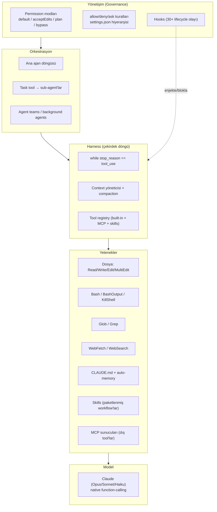
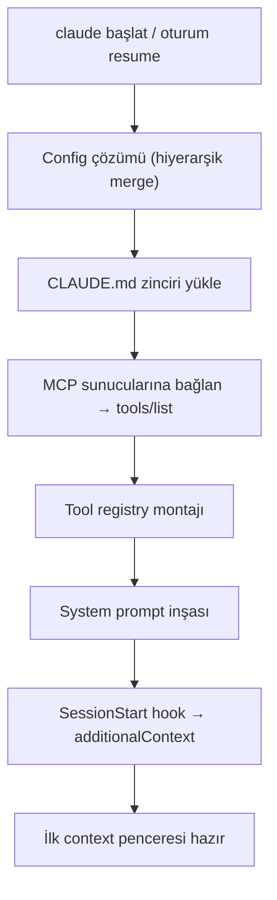
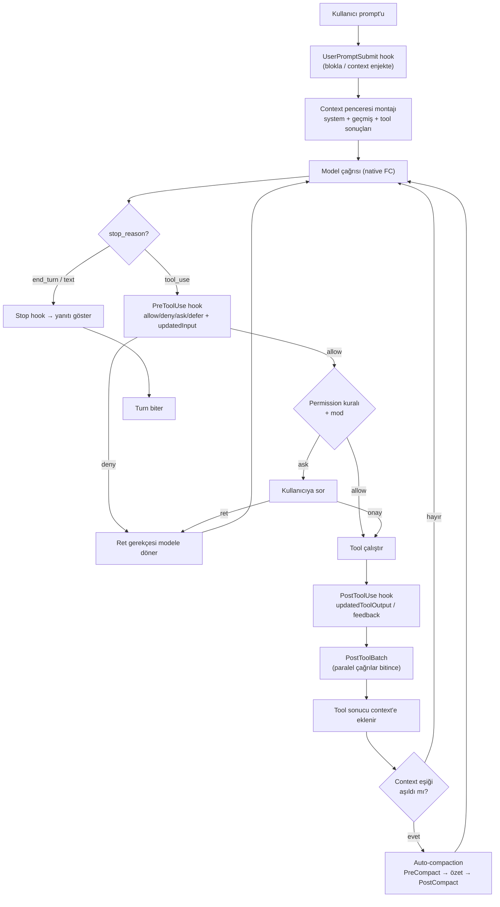
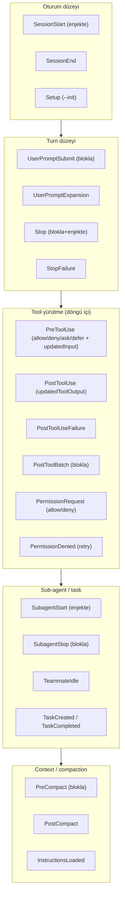
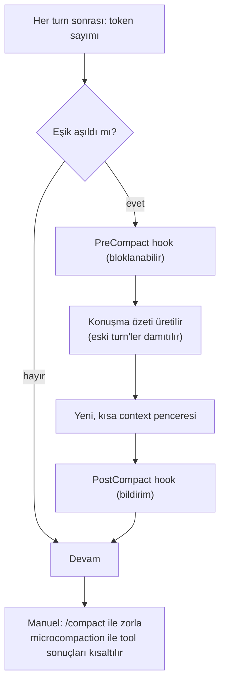
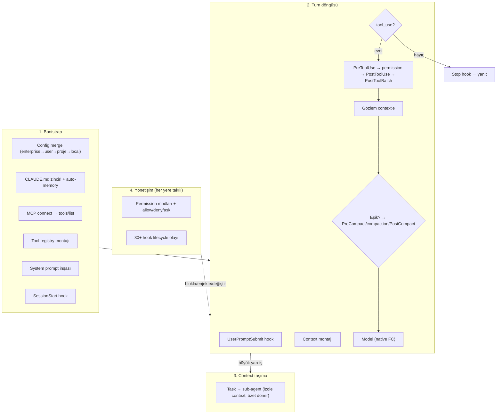

# Claude Code — Harness Anatomisi (Baştan Sona)

> **Kaynak notu (dürüstlük):** `github.com/anthropics/claude-code` reposu **çekirdek kaynak kodu içermez** — orası bir *dağıtım + issue-tracker + plugin/docs* hub'ıdır; CLI, minify edilmiş bir bundle olarak (`curl … | bash`, Homebrew, WinGet) dağıtılır. Bu belgedeki harness **üç kamuya-açık/doğrulanabilir kaynaktan** yeniden inşa edilmiştir:
> 1. **Resmî docs** — `code.claude.com/docs` (hooks lifecycle, sub-agents, memory, permissions, MCP, context-window sayfaları birebir).
> 2. **Claude Agent SDK** — Claude Code'un *açık kütüphane hâli* (`claude-agent-sdk` / `@anthropic-ai/claude-agent-sdk`): aynı harness, aynı built-in tool'lar, aynı loop.
> 3. **Çalışma-zamanı davranışı** — gözlemlenebilir sistem-reminder'lar, tool sözleşmeleri, permission modları.
>
> Yani "satır satır çekirdek kod" değil, **davranışsal + docs-doğrulanmış harness anatomisi**. Emin olunmayan yerler açıkça işaretlendi.

---

## 0. Katman haritası — Claude Code neyin üstünde durur



**Kilit içgörü:** Claude Code, **native function-calling** üstüne kurulu **sabit-döngü + kanca (hook)** tarzı bir harness'tir. Yani LangGraph gibi bir "graf" ya da CrewAI gibi bir "koordinatör" değil; tek bir `while` döngüsü + her aşamaya takılabilen **onlarca lifecycle kancası** vardır. Esneklik graf topolojisinden değil, **hook'lar + permission + subagent + skill** kombinasyonundan gelir.

---

## 1. Bootstrap (oturum açılışı) — döngü başlamadan önce

Model'e ilk istek gitmeden önce harness bir **başlatma dizisi** çalıştırır:



### 1.1 Config çözümü (hiyerarşik)
Ayarlar **en dardan en genişe** doğru üst üste biner (dar olan kazanır):
`enterprise policy` → `~/.claude/settings.json` (kullanıcı) → `.claude/settings.json` (proje) → `.claude/settings.local.json` (kişisel/gitignore) → CLI flag'leri.
Buradan gelen: model seçimi, permission modu, `allow/deny/ask` kuralları, hooks tanımları, MCP sunucu listesi, env değişkenleri.

### 1.2 CLAUDE.md zinciri (memory)
Harness, **birden çok** CLAUDE.md dosyasını sırayla okur ve context'e enjekte eder:
- **Enterprise/policy** düzeyi (varsa)
- **Kullanıcı** `~/.claude/CLAUDE.md` (tüm projeler)
- **Proje kökü** `./CLAUDE.md` (takımla paylaşılan)
- **Alt dizin** CLAUDE.md'leri (o dizinde çalışılırken)
- `@path/to/file` **import**'ları (CLAUDE.md içinden başka dosya çekme)
- `.claude/rules/*.md` → `InstructionsLoaded` hook'unu tetikler

Ayrıca **auto-memory**: Claude çalışırken öğrendiklerini (build komutları, debug içgörüleri) oturumlar arası kalıcı olarak biriktirir.

### 1.3 MCP bağlantısı → dinamik tool keşfi
Config'te tanımlı her MCP sunucusuna bağlanılır, `tools/list` çağrısıyla **tool'lar dinamik keşfedilir** (kod değişmeden). Bu tool'lar `mcp__<server>__<tool>` adıyla registry'ye eklenir. (MCP = "tool'u nereden alıyorum" katmanı; sunum yine native FC.)

### 1.4 Tool registry montajı
Üç kaynak tek bir kataloğa toplanır:
- **Built-in tool'lar** (aşağıda §3)
- **MCP tool'ları** (dinamik keşfedilen)
- **Skills** (paketlenmiş workflow'lar; `SlashCommand`/skill mekanizması)
Her tool bir **JSON Schema** ile modele native FC olarak sunulur.

### 1.5 System prompt inşası
Harness system prompt'u şunlardan derler: temel ajan talimatları + CLAUDE.md içerikleri + ortam bilgisi (cwd, git durumu, platform, tarih) + tool sözleşmeleri + aktif skill/policy kısıtları. (Şu an bu belgeyi üreten oturumda gördüğün `<system-reminder>` blokları bu montajın ürünüdür.)

### 1.6 `SessionStart` hook
Oturum başlarken çalışır; `additionalContext` ile context'e **ek bilgi enjekte edebilir** (bloklayamaz). Resume'da da tetiklenir.

---

## 2. Ana döngü — turn'ün kalbi

Harness'ın özü tek bir döngüdür: **model çağır → tool_use çıktısı mı? → izin/kanca kapıları → çalıştır → gözlemi geri besle → tekrar.**



**Önemli ayrımlar:**
- Bu **ReAct metin-parse değil**: model native `tool_use` blokları döndürür; harness metin ayrıştırmaz.
- Model **tek turn'de birden çok tool** çağırabilir (paralel). `PostToolBatch` tüm parti çözülünce çalışır.
- `stop_reason == end_turn` (veya sadece metin) → döngü kırılır, `Stop` hook çalışır, yanıt gösterilir.

---

## 3. Tool envanteri (yetenek yüzeyi)

| Tool | İş | Not |
|---|---|---|
| **Read** | Dosya oku (satır no'lu; PDF/görsel/notebook) | Yazmadan önce okuma zorunluluğu var (Edit için) |
| **Write** | Dosya oluştur/üzerine yaz | Önce Read edilmemiş dosyayı overwrite reddedilir |
| **Edit** | Tam-string değiştir (unique match) | `replace_all` opsiyonu |
| **MultiEdit** | Tek dosyada çok değişiklik | Atomik uygulanır |
| **Bash** | Kabuk komutu | `run_in_background`, timeout, sandbox modu |
| **BashOutput / KillShell** | Arka-plan kabuğu yönet | Uzun süreli süreçler |
| **Glob** | Dosya adı deseni | Hızlı dosya bulma |
| **Grep** | İçerik arama (ripgrep) | Regex, dosya-tipi filtresi |
| **WebFetch** | URL çek + küçük modelle özetle | 15 dk cache |
| **WebSearch** | Web araması | Domain filtreleri |
| **Task** | Sub-agent başlat | §5 |
| **TodoWrite** | Görev listesi izle | Planlama/ilerleme |
| **NotebookEdit** | Jupyter hücre düzenle | .ipynb |
| **SlashCommand / Skill** | Paketlenmiş workflow çağır | §6 |

Bunlara ek: MCP tool'ları (`mcp__…`), Artifact (bazı yüzeylerde), agent-team/schedule tool'ları.

---

## 4. Yönetişim katmanı — permission + hooks

Harness'ın "graf topolojisi olmadan esneklik" sağladığı yer burasıdır.

### 4.1 Permission modları
| Mod | Davranış |
|---|---|
| **default** | Riskli/dış-etkili eylemlerde kullanıcıya sorar |
| **acceptEdits** | Dosya düzenlemelerini otomatik onaylar (Bash yine sorabilir) |
| **plan** | **Salt-okunur**: keşif yapar, plan üretir, hiçbir mutasyon yapmaz; `ExitPlanMode` ile onaya sunar |
| **bypassPermissions** | Tüm kapıları atlar (yalnız güvenli ortamlarda) |

Üstüne **kural tabanı** biner: `allow` / `deny` / `ask` listeleri (örn. `Bash(rm *)` → deny, `Read(./src/**)` → allow). Kurallar settings hiyerarşisinden gelir.

### 4.2 Hooks — 30+ lifecycle olayı
Hook'lar harness'ın **her aşamasına takılan shell/HTTP komutlarıdır**. Exit kodu (0 başarı, 2 blokla) veya JSON (`decision`, `hookSpecificOutput`) ile karar döndürürler. Tam liste, döngüdeki yerine göre:



**Neyi ne yapabilir (özet):**
- **Bloklama**: PreToolUse, UserPromptSubmit, PostToolBatch, Stop, SubagentStop, PreCompact, PermissionRequest, TaskCreated/Completed…
- **Tool input değiştir**: PreToolUse, PermissionRequest (`updatedInput`)
- **Tool output değiştir**: PostToolUse (`updatedToolOutput`)
- **Context enjekte**: SessionStart, SubagentStart, UserPromptSubmit, PreToolUse, PostToolUse, Stop, SubagentStop (`additionalContext`)
- **Kontrol yok** (sadece bildirim): SessionEnd, PostCompact, Notification, FileChanged, CwdChanged…

Ek özel olaylar: `Elicitation` (MCP kullanıcı-girdisi), `WorktreeCreate/Remove`, `ConfigChange`, `MessageDisplay` (gösterimi değiştir, transcript'i değil).

---

## 5. Sub-agent'lar — Task tool ile context izolasyonu

Sub-agent, harness'ın **context'i temiz tutma** ve **kısıt dayatma** mekanizmasıdır.

```mermaid
flowchart LR
    MAIN["Ana ajan"] -->|Task(subagent_type, prompt)| SPAWN["Sub-agent doğar"]
    SPAWN --> ISO["İzole context penceresi<br/>kendi system prompt'u<br/>kendi tool alt-kümesi<br/>kendi permission'ları"]
    ISO --> WORK["Bağımsız çalışır<br/>(arama/log/dosya taraması)"]
    WORK --> SUM["Yalnız ÖZET döner"]
    SUM -->|kirli detay ana context'e girmez| MAIN
```

**Tanımlama** (`.claude/agents/*.md`, frontmatter):
- `name` — çağrı adı
- `description` — ana ajan **ne zaman delege edeceğini** buradan anlar
- `tools` — izin verilen tool alt-kümesi (kısıt dayatma)
- `model` — ucuz/hızlı modele (Haiku) yönlendirme opsiyonu

**Ortak imza (tüm büyük ajanlarla aynı):** *delege et → izole context'te çalıştır → özet döndür*. Fark, izolasyonun derinliği: Claude Code'da sub-agent **ayrı context penceresi + ayrı system prompt + ayrı permission**'a sahip.

**Neden önemli:** Arama sonuçları, loglar, dosya dökümleri ana konuşmayı **şişirmeden** işlenir; ana context'e sadece damıtılmış özet döner. Bu, compaction'a bir **alternatif/tamamlayıcı** context-yönetimidir (bkz. §6-ölçek: bizim tool-trace compaction'ımız *aynı* context'te sıkıştırırken, subagent *ayrı* context'e taşır).

Üst yapılar: **agent teams** (birbiriyle konuşan oturumlar), **background agents** (paralel tam-oturumlar, tek ekrandan izlenir).

---

## 6. Context yönetimi & compaction

Harness'ın **uzun-koşu** motoru. Pencere dolmaya yaklaşınca iki mekanizma devreye girer:



- **Auto-compaction**: pencere eşiğine gelince otomatik; eski turn'ler bir özete indirgenir, sonra döngü devam eder. Bu belgenin başındaki "*This session is being continued…*" özeti tam bu mekanizmanın ürünüdür.
- **`/compact`**: kullanıcı elle tetikler.
- **Microcompaction / tool-sonucu kısaltma**: büyük tool çıktıları (örn. 93 KB'lık WebFetch) diske yazılıp context'te referansa indirilir — bu oturumda birebir gördük.
- **PreCompact / PostCompact** hook'ları özet üretimini sarar (blokla / bildir).

> **POC bağlantısı:** Bizim [poc/](../poc/) tool-trace compaction'ımız bu katmanın **tool-mesajı seviyesinde, fate-tabanlı** bir özelleştirmesidir: `_render_messages` her tool gövdesini kaderine göre (TAM/KES/ÖZET/SİL…) yeniden yazar, `tool_call_id`'yi korur, pozisyon-tabanlı koruma penceresi (RECENT=2) ile son tool'ları dokunulmaz bırakır. Claude Code'un compaction'ı *konuşma-özeti* düzeyinde; bizimki *tek tool-trace* granülerliğinde + fayda-freni (`est(note) < raw_tokens`).

---

## 7. Skills, slash commands, plan mode

- **Skills** — paketlenmiş, tekrar-kullanılır workflow'lar (`/review-pr`, `/deploy-staging`). Bir skill çağrılınca talimatları o turn'e yüklenir (veya sub-agent'ta çalışır). Registry'ye tool gibi girerler.
- **Slash commands** — `/<isim>` ile kullanıcı tetikler; skill veya yerleşik komut.
- **Plan mode** — salt-okunur keşif → `ExitPlanMode` ile onaya plan sunma. Mutasyon yok; onay gelince normal moda geçer.

---

## 8. Çok-yüzeyli tek motor

Terminal / VS Code / JetBrains / Desktop / Web / mobil — hepsi **aynı Claude Code motorunu** kullanır. CLAUDE.md, settings, MCP sunucuları tüm yüzeylerde ortak. Oturum yüzeyler arası taşınabilir (`--teleport`, `/desktop`, Remote Control). Yani harness tek; yüzeyler sadece I/O adaptörü.

---

## 9. Uçtan uca — tek bakışta tam harness



---

## 10. Öne çıkanlar — Claude Code harness'ının imzası

1. **Sabit-döngü + kanca felsefesi** (graf/koordinatör değil): esneklik topolojiden değil, **30+ hook + permission + subagent + skill** kombinasyonundan.
2. **Native function-calling** — ReAct metin-parse yok; model yapısal `tool_use` döndürür, harness ayrıştırmaz.
3. **Yönetişim birinci-sınıf vatandaş**: permission modları (özellikle **plan mode** = salt-okunur) + kural tabanı + her aşamaya takılan hook'lar → dış-etkili eylemler kapı-kontrollü.
4. **İki katmanlı context yönetimi**: (a) *aynı* pencerede **auto-compaction/microcompaction**, (b) *ayrı* pencerede **sub-agent izolasyonu**. İkisi birlikte uzun-koşuyu mümkün kılar.
5. **Hiyerarşik memory**: enterprise→user→proje→alt-dizin CLAUDE.md + `@import` + auto-memory.
6. **Tek motor, çok yüzey**: terminal/IDE/desktop/web/mobil aynı harness; oturum taşınabilir.
7. **Açık uzatma yüzeyi**: MCP (dış tool keşfi) + Skills (paketli workflow) + Agent SDK (aynı harness'ı kütüphane olarak).

---

## Kaynaklar
- `code.claude.com/docs` — overview, hooks (lifecycle olay adları birebir), sub-agents, memory, context-window, permissions, MCP, skills, workflows.
- `github.com/anthropics/claude-code` — dağıtım/issue/plugin hub'ı (çekirdek kaynak **değil**).
- Claude Agent SDK — `code.claude.com/docs/en/agent-sdk` (Claude Code'un açık kütüphane hâli).
- "A harness for every task — dynamic workflows in Claude Code" (claude.com/blog).
- Çalışma-zamanı gözlemi (bu oturum): system-reminder montajı, microcompaction, permission modları.
- Karşılaştırma: bu reponun [report/14-agentic-mega-atlas.md](14-agentic-mega-atlas.md) §Claude SDK bölümü ve [poc/](../poc/) tool-trace compaction.
