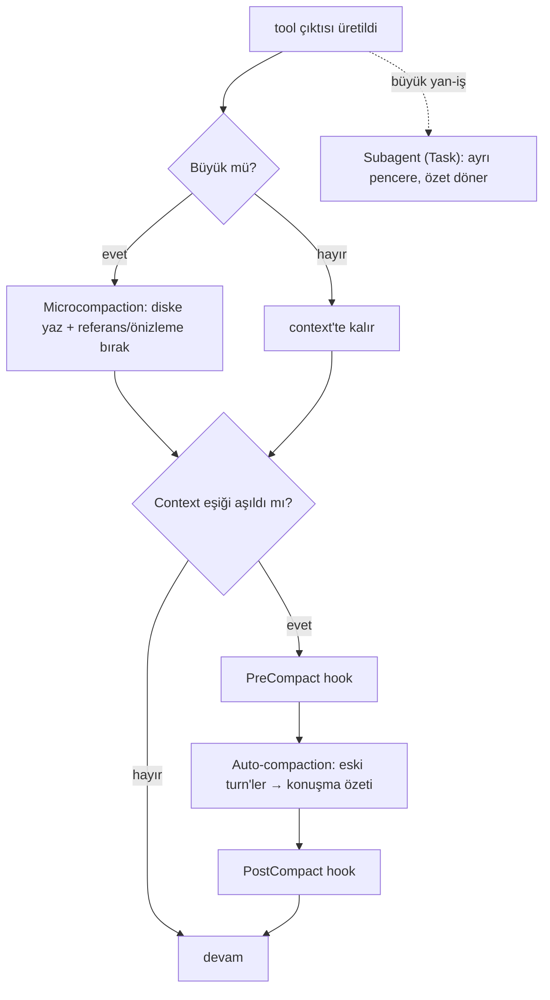

# Claude Code — Tool-Trace Compaction: Baştan Sona Tam Rehber (Teknik)

> **Kaynak notu (dürüstlük):** Claude Code'un CLI'ı **kapalı kaynaktır** (minify bundle). Bu belge, sabit isimleri/değerleri iddia etmez; her şey **iki doğrulanabilir kaynağa** dayanır: (1) resmî docs (`code.claude.com/docs` — hooks: PreCompact/PostCompact, context-window, memory) ve (2) **bu oturumda birebir gözlemlenen çalışma-zamanı davranışı** (93KB'lık bir WebFetch çıktısının diske dökülmesi + oturum başındaki auto-compaction özeti). Örnekler gerçek gözlemlerdir; "muhtemelen/belirsiz" işaretli yerler tahmindir.
>
> Akılda-kalıcı "dadı" sürümü için (sonra) bkz. `claude-code-tool-trace-compaction.md`.

---

## 0. Kimlik / felsefe — üç katman, iki kaçış yolu

Claude Code tool-trace'i **üç mekanizmayla** yönetir:

1. **Microcompaction (tool-sonucu düzeyi):** Büyük bir tool çıktısı **diske yazılır**, context'e sadece **referans + önizleme** girer. (Deterministik, LLM'siz — gözlemlendi.)
2. **Auto-compaction (konuşma düzeyi):** Token eşiğine gelince eski turn'ler bir **konuşma özetine** indirgenir. (LLM'li — gözlemlendi.)
3. **Subagent izolasyonu (kaçış yolu):** Yan işi *aynı* pencerede sıkıştırmak yerine **ayrı bir context penceresine** (Task tool) taşımak; sadece özet döner.

Yani Claude Code'un iki "kaçış yolu" var: **diske taşı** (microcompaction) veya **ayrı pencereye taşı** (subagent). Sıkıştırma son çare.

---

## 1. Sözlük

| Terim | Anlamı |
|---|---|
| **context window** | Modele gönderilen tüm mesaj yığını için token sınırı. |
| **tool-trace** | Tool çağrıları + sonuçlarının context içindeki toplamı. |
| **microcompaction** | Tek bir büyük tool çıktısını diske döküp yerine referans bırakma. |
| **disk referansı** | Context'te kalan "Full output saved to: …txt" satırı + kısa önizleme. |
| **auto-compaction** | Eşikte tüm konuşmanın bir özete indirgenmesi. |
| **/compact** | Kullanıcının elle tetiklediği compaction. |
| **PreCompact / PostCompact** | Compaction'ı saran hook olayları (docs). |
| **subagent** | Task tool ile açılan izole context; yan işi taşır, özet döndürür. |

---

## 2. Mekanizmalar (docs + gözlem)

| Mekanizma | Kaynak | Ne yapar |
|---|---|---|
| **Microcompaction** | 🔬 gözlem | Büyük tool çıktısı → disk dosyası + referans. Bu oturumda 93KB WebFetch bunu tetikledi. |
| **Auto-compaction** | 🔬 gözlem + docs | Eşikte konuşma özeti. Bu oturum "continued from previous conversation" özetiyle başladı. |
| **`/compact`** | 📄 docs | Manuel tetik. |
| **PreCompact hook** | 📄 docs (hooks) | Compaction ÖNCESİ; bloklanabilir. |
| **PostCompact hook** | 📄 docs (hooks) | Compaction SONRASI; bildirim. |
| **Subagent (Task)** | 📄 docs + gözlem | Yan işi ayrı pencereye taşır, özet döner. |

> **Sabitler:** Kapalı kaynak olduğu için eşik yüzdesi, önizleme boyutu gibi **kesin sayılar bilinmiyor.** Gözlem: önizleme ~2KB civarıydı, tam çıktı diske yazıldı.

---

## 3. Mimari



---

## 4. Adım adım — bu oturumdan GERÇEK örneklerle

### Adım 1 — Microcompaction: büyük tool çıktısı üretilince (🔬 gözlemlendi)

**Ne:** Bir tool büyük bir çıktı döndürünce, harness onu **context'e tam koymaz**; **diske yazar**, yerine referans + önizleme bırakır.

**Bu oturumdaki GERÇEK örnek** — bir `WebFetch` (sub-agents docs) 93.2KB döndürdü. Context'e giren:
```
<persisted-output>
Output too large (93.2KB). Full output saved to:
/home/altan/.claude/projects/.../tool-results/toolu_01BzYj7wFfTyUnU2PQrwWtMR.txt

Preview (first 2KB):
> ## Documentation Index ...
...
</persisted-output>
```
**Sonuç:** 93.2KB context'e hiç girmedi. Context'te kalan: **~2KB önizleme + disk yolu**. İçeriğe sonradan ihtiyaç olursa o dosya okunur.
**Neden akılda kalsın:** *Dev çıktı context'e değil, diske gider; geriye "adres" kalır.* Bu = **spill-to-disk / referans** (OpenCode'un `truncation-dir`'i, Hermes'in `context_references`'ı ile aynı fikir).

### Adım 2 — Auto-compaction: context eşiğine gelince (🔬 gözlemlendi + 📄 docs)

**Ne:** Konuşma çok uzayınca, eski turn'ler tek bir **konuşma özetine** indirgenir; sonra döngü devam eder.

**Bu oturumdaki GERÇEK örnek** — bu oturum şununla başladı:
```
This session is being continued from a previous conversation that ran out of context.
The summary below covers the earlier portion of the conversation.
Summary: ...
```
**Sonuç:** Önceki (çok uzun) konuşmanın tamamı yapılandırılmış bir özete indi (Primary Request, Key Concepts, Files, Errors, Pending Tasks…). Yeni pencere bu özetle başladı.
**Neden akılda kalsın:** *Konuşma pencereyi doldurunca, geçmiş bir "devir özetine" dönüşür.* (Hermes'in orta-turn özeti, OpenClaw'ın chunk özeti ile aynı aile.)

### Adım 3 — PreCompact / PostCompact hook (📄 docs)

**Ne:** Auto-compaction'ı **kancalar** sarar:
- **`PreCompact`** — compaction başlamadan; **bloklanabilir** (exit 2 veya `decision:"block"`), context enjekte edebilir.
- **`PostCompact`** — compaction bittikten sonra; **bildirim** (kontrol yok).
**Neden:** Kullanıcı/entegrasyon compaction'a müdahale edebilsin (ör. "şu dosyayı özete ekle" veya "şimdi compaction yapma").
**Örnek kullanım:** Bir `PreCompact` hook'u, önemli bir durum dosyasını `additionalContext` ile özete ekleyebilir.

### Adım 4 — `/compact` (manuel tetik, 📄 docs)

**Ne:** Kullanıcı `/compact` yazarak compaction'ı **elle** tetikler (eşiği beklemeden).
**Neden:** Kullanıcı "şimdi temizle, uzun bir işe girişeceğim" diyebilsin.

### Adım 5 — Subagent kaçış yolu (Task tool, 📄 docs + gözlem)

**Ne:** Büyük bir yan-iş (arama, log tarama, çok dosya okuma) ana pencereyi şişirecekse, harness onu **subagent'a** delege eder: subagent **ayrı bir context penceresinde** çalışır, ara adımları ana pencereye **hiç girmez**, sadece **özet** döner.
**Neden:** Bu, compaction'a bir **alternatif**tir: aynı pencerede sıkıştırmak yerine, kirli detayı hiç o pencereye sokmamak.
**Örnek:** "Şu 40 dosyayı tara ve login akışını özetle" → subagent 40 dosyayı kendi penceresinde okur, ana pencereye tek paragraf özet döner. 40 dosyanın içeriği ana context'e hiç girmez.
**Neden akılda kalsın:** *Kirli işi ayrı odada yap, ana odaya sadece özeti getir.* (OpenClaw'ın "arka oda"sıyla benzer ruh, ama orada temizlik; burada işin kendisi ayrı pencerede.)

---

## 5. Tüm hattın özeti (tek bakış)

| Katman | Tetik | Yöntem | Kaynak | Örnek (bu oturum) |
|---|---|---|---|---|
| Microcompaction | büyük tool çıktısı | diske yaz + referans | 🔬 gözlem | 93KB WebFetch → disk + 2KB önizleme |
| Auto-compaction | context eşiği | konuşma özeti | 🔬+📄 | oturum başı "continued from…" özeti |
| Hook | compaction anı | Pre/Post müdahale | 📄 docs | PreCompact blokla/enjekte |
| Manuel | `/compact` | elle tetik | 📄 docs | — |
| Subagent | büyük yan-iş | ayrı pencere, özet döner | 📄+🔬 | 40 dosya tarama → tek özet |

---

## 6. Dört sistemle fark

| Eksen | Hermes | OpenClaw | OpenCode | Codex | **Claude Code** |
|---|---|---|---|---|---|
| Tool çıktısı | informatif satır | detay şeritle+chunk | disk spill | ortadan-kes | **disk referansı (microcompaction)** |
| Konuşma | orta-turn LLM özet | chunk LLM özet | prune+LLM | model-turn+pencere | **auto-compaction (konuşma özeti)** |
| Kaçış yolu | — | — | — | windowing | **subagent (ayrı pencere)** |
| Kanca | — | — | — | Pre/Post | **PreCompact/PostCompact** |
| Kaynak | açık | açık | açık | açık | **kapalı (docs+gözlem)** |
| Ayırt edici | anti-thrash | worker plan | POC'a yakın | ortadan-kes+resume | **iki kaçış: diske ya da ayrı pencereye taşı** |

**Öz:** Claude Code, tool-trace'i **sıkıştırmaktan çok "taşır"**: dev çıktıyı diske (microcompaction) ya da yan-işi ayrı pencereye (subagent) taşır; ancak son çare olarak konuşmayı özetler (auto-compaction). Kapalı kaynak olduğu için sabitleri bilinmez ama davranışı bu oturumda birebir gözlendi.

---

## 7. POC eşlemesi

| Bizim POC (`poc/`) | Claude Code karşılığı |
|---|---|
| Referansa indirme (spill) | **Microcompaction** (disk referansı) — birebir aynı fikir |
| Konuşma özeti | **Auto-compaction** |
| Fayda-freni / eşik | (belirsiz — kapalı kaynak) |
| `tool_call_id` bütünlüğü | (harness dahili — gözlemlenemedi) |
| — (bizde yok) | **subagent kaçış yolu** (ayrı pencere) · **Pre/PostCompact hook** ekosistemi |

**Not:** Claude Code, bizim POC'un "referansa indirme" fikrini (microcompaction) ve konuşma özetini paylaşır; ama en güçlü fikri **subagent kaçış yolu** — tool-trace'i sıkıştırmak yerine hiç o pencereye sokmamak. Bu, "compaction"dan önce gelen bir context-yönetim stratejisidir.

---

## Kaynaklar
- 📄 `code.claude.com/docs` — hooks (PreCompact/PostCompact), context-window, sub-agents, memory.
- 🔬 Bu oturumun çalışma-zamanı gözlemi — 93KB WebFetch microcompaction'ı (`tool-results/…txt` referansı), oturum başı auto-compaction özeti.
- Karşılaştırma: [hermes-tool-trace-compaction.md](hermes-tool-trace-compaction.md) · [openclaw-tool-trace-compaction-teknik.md](openclaw-tool-trace-compaction-teknik.md) · [opencode-tool-trace-compaction-teknik.md](opencode-tool-trace-compaction-teknik.md) · [codex-tool-trace-compaction-teknik.md](codex-tool-trace-compaction-teknik.md) · [poc/](../poc/)
