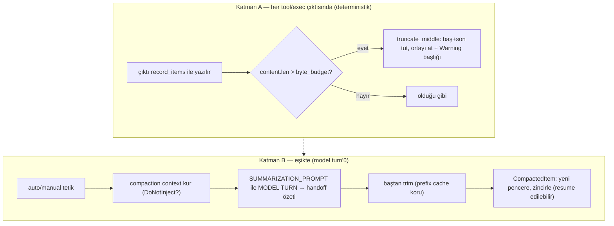

# Codex — Tool-Trace Compaction: Baştan Sona Tam Rehber

> **Amaç:** Codex'in (openai/codex, Rust) tool-trace / context compaction'ını **tek bir örnek trace'i tüm adımlardan geçirerek**, her adımda somut veriyle anlatmak — [OpenClaw](openclaw-tool-trace-compaction.md), [OpenCode](opencode-tool-trace-compaction-teknik.md), [Hermes](hermes-tool-trace-compaction.md) belgeleriyle aynı derinlikte. Kaynak: [../harnesses/codex/codex-rs/](../harnesses/codex/codex-rs/) — `utils/output-truncation/src/lib.rs`, `utils/string/src/truncate.rs`, `core/src/compact.rs`, `protocol/src/compacted_item.rs`, `prompts/templates/compact/`.

---

## 0. Kimlik / felsefe — iki katman: ortadan-kesme + "compaction bir turn'dür"

Codex iki mekanizma kullanır:

- **Katman A — per-tool-output ortadan-kesme (deterministik, LLM'siz):** Büyük bir tool/exec çıktısının **başı ve sonu korunur, ORTASI atılır** — bir uyarı başlığıyla.
- **Katman B — tarih compaction'ı bir MODEL TURN'ü olarak (LLM'li) + pencereli saklama:** Context dolunca, geçmişi bir **handoff özetiyle** değiştiren tam bir model turn'ü çalışır; bu özet **pencere (window)** olarak zincirlenir ve **geri sarılabilir/resume edilebilir**.

Codex'i ayıran iki şey: (1) **ortadan-kesme** (baş+son koru), (2) compaction'ın **kalıcı, pencereli, geri-sarılabilir** bir katman olması (yok etme değil).

---

## 1. Sözlük

| Terim | Anlamı |
|---|---|
| **TruncationPolicy** | Kesme bütçesi: `Bytes(n)` veya `Tokens(n)`. |
| **byte_budget** | Politikanın bayt karşılığı (Tokens ise token→bayt yaklaşık çevrimi). |
| **truncate_middle** | Baş + son tutup **ortayı** atan kesme (bir işaretle). |
| **ResponseItem** | Codex'in history birimi (mesaj/tool çağrısı/çıktı). |
| **record_items** | History'ye öğe yazma; kayıt anında truncation_policy uygulanır. |
| **compaction (turn)** | Geçmişi bir handoff özetiyle değiştiren tam model turn'ü. |
| **window (pencere)** | Bir compaction'ın ürettiği tarih katmanı; zincirlenir, resume edilebilir. |
| **CompactedItem** | Pencere kaydı: `window_number`, `first/previous_window_id`, `replacement_history`. |
| **DoNotInject** | Pre-turn/manuel compaction'da özeti history'ye enjekte etmeme varyantı. |
| **summary_prefix** | Resume'da özetin önüne eklenen "başka bir model bunu üretti, üstüne inşa et" metni. |
| **remote compaction** | Sunucu-tarafı compaction (v1/v2). |
| **prefix cache** | Sağlayıcının baştan-aynı mesajları önbelleklemesi; baştan trim onu korur. |

---

## 2. Sabitler / politikalar

```rust
// Katman A — utils/output-truncation + utils/string/truncate.rs
TruncationPolicy::Bytes(n)   → truncate_middle_chars(content, n)          // ortadan kes
TruncationPolicy::Tokens(n)  → truncate_middle_with_token_budget(content, n)
byte_budget()                // Tokens ise token→bayt yaklaşık
// formatted_truncate_text → "Warning: truncated output (original token count: N)\nTotal output lines: M\n\n..."
// InputImage / InputAudio / EncryptedContent → truncate EDİLMEZ (yalnız InputText)

// Katman B — core/src/compact.rs + prompts/templates/compact/
SUMMARIZATION_PROMPT   // "CONTEXT CHECKPOINT COMPACTION. Create a handoff summary..."
summary_prefix.md      // resume'da özet önüne eklenir
CompactionTrigger      // auto (inline) | manual
CompactionImplementation::Responses
InitialContextInjection::{ BeforeLastUserMessage | DoNotInject }
```

---

## 3. Mimari



---

## 4. Tek örnek trace, tüm adımlardan

Başlangıç (model context = **200.000 token**):
```
#0 [message system]  "Sen Codex'sin..."                                  ~2.000 tok
#1 [message user]    "auth modülünü refactor et"                          ~30 tok
#2 [function_call]   shell("pytest auth/")  call_id=c1
#3 [function_output c1]  2.500 satır test çıktısı                        ~15.000 tok
#4 [function_call]   read_file("auth/login.py") call_id=c2
#5 [function_output c2]  auth.py + bir ekran görüntüsü (InputImage)      ~40.000 tok
#6 [message user]    "login()'i sadeleştir"
#7 [message assistant] "Planım: ..."                                       ~40 tok
```

---

### Adım 1 — (Katman A) Çıktı record edilirken kesme kontrolü

**Ne:** `#3`/`#5` history'ye `record_items(&[...], truncation_policy)` ile yazılır. Kayıt anında politika uygulanır:
```rust
if content.len() <= policy.byte_budget() { return content }   // sığıyorsa dokunma
```
**Örnekte:** Diyelim `TruncationPolicy::Tokens(8000)` → `byte_budget ≈ 32.000 bayt`. `#3` (15K token ≈ 60KB) bütçeyi aşar → kesilir.

### Adım 2 — (Katman A) truncate_middle: baş + son tut, ORTAYI at

**Ne:** Codex çıktının **başını ve sonunu** korur, **ortasını** atar (`truncate_middle_chars`/`truncate_middle_with_token_budget`).
**Neden:** Bir komut çıktısında en değerli kısımlar genelde **baş** (ne çalıştı, ilk hatalar) ve **son** (özet/exit). Orta genelde tekrarlı gövde.

**Örnekte — #3:**
```
// ÖNCE (2.500 satır)
test_login PASSED
test_logout PASSED
... (2.480 satır daha) ...
=== 47 passed, 3 failed ===
exit 1
// SONRA (truncate_middle + formatted_truncate_text)
Warning: truncated output (original token count: 15000)
Total output lines: 2500

test_login PASSED           ← baş korundu
test_logout PASSED
...[orta atlandı]...        ← orta atıldı
=== 47 passed, 3 failed === ← son korundu
exit 1
```
Model hem kesildiğini **hem ne kadar** kesildiğini bilir (Warning başlığı).

### Adım 3 — (Katman A) Multimodal koruma

**Ne:** Yalnız `InputText` segmentleri birleştirilip kesilir; `InputImage` / `InputAudio` / `EncryptedContent` **dokunulmaz**.
**Örnekte — #5:** auth.py metni kesilir (ortadan), ama ekran görüntüsü (`InputImage`) olduğu gibi kalır.
```rust
let text_segments = items.filter(InputText);   // sadece metin
// InputImage/InputAudio/EncryptedContent → pas
if combined.len() <= policy.byte_budget() { return items }
```

### Adım 4 — (Katman B) Compaction tetiği

**Ne:** Context dolunca `run_inline_auto_compact_task` (otomatik) veya manuel `run_compact_task` çağrılır. `CompactionTrigger` = auto | manual.
**Örnekte:** Kesmelere rağmen context eşiği aşıldı → **auto compaction** başlar.

### Adım 5 — (Katman B) Compaction context'i kur

**Ne:** `build_compaction_initial_context` iki moda göre başlangıç bağlamı kurar:
- **`BeforeLastUserMessage`** — dünya-durumu (world_state) enjekte edilir (mid-turn).
- **`DoNotInject`** — özet history'ye enjekte edilmez (pre-turn/manuel).

**Örnekte:** auto/mid-turn → `BeforeLastUserMessage`, world_state ile.

### Adım 6 — (Katman B) Talimatı record et (truncation_policy ile)

**Ne:** Compaction talimatı bir user girdisi olarak history'ye kaydedilir:
```rust
let input = vec![UserInput::Text { text: SUMMARIZATION_PROMPT, ... }];
history.record_items(&[input], truncation_policy)   // kayıt anında yine kesme uygulanır
```
`SUMMARIZATION_PROMPT` (prompt.md):
> *"You are performing a CONTEXT CHECKPOINT COMPACTION. Create a handoff summary for another LLM that will resume the task. Include: current progress, key decisions, constraints, what remains, critical data/references."*

### Adım 7 — (Katman B) MODEL TURN: handoff özeti üret

**Ne:** Codex'in imzası — compaction bir **tam model turn'üdür**. `drain_to_completed` ile model, geçmişin bir **handoff özetini** üretir. Tek client session retry'lar boyunca korunur (sticky routing). `SessionBudgetExceeded`/`Interrupted` özel ele alınır.
**Örnekte üretilen özet:**
```
## İlerleme
- pytest çalıştı: 47 passed, 3 failed (auth/login testleri)
- auth/login.py okundu; login() 45. satırda çift-doğrulama var
## Kararlar
- token httpOnly cookie'de tutulacak
## Kalan
- login()'i böl, testleri düzelt
```

### Adım 8 — (Katman B) Cache-dostu trim (baştan kes)

**Ne:** Özet history'ye yazılırken, geçmiş **baştan** kırpılır, son mesajlar korunur.
Koddaki yorum: *"trim from the beginning to preserve cache (prefix-based) and keep recent messages intact."*
**Neden:** Sağlayıcının **prefix cache**'i baştan-aynı mesajlara dayanır. Ortadan/sondan kesmek cache'i bozar; baştan kesmek (eskiyi atıp özetle değiştirmek) en az cache hasarı verir.

### Adım 9 — (Katman B) Pencere (window) olarak sakla

**Ne:** Compaction bir `CompactedItem` üretir:
```rust
CompactedItem {
  message,                    // handoff özeti
  replacement_history,        // özetin yerini aldığı eski öğeler
  window_number,              // pencere sırası
  first_window_id, previous_window_id,   // pencere zinciri
}
```
**Neden:** Pencereler zincirlenir → eski rollout **resume edilebilir**. Compaction "yok etme" değil, **geri-sarılabilir tarih katmanı**. (Legacy `window_id` şekli bile kabul edilir — geriye uyumluluk.)

### Adım 10 — (Resume) summary_prefix ile devam

**Ne:** Oturum resume edilince özetin önüne `summary_prefix.md` eklenir:
> *"Another language model started to solve this problem and produced a summary... Use this to build on the work already done and avoid duplicating work."*
**Neden:** Yeni model, özetin bir **başka modelin** işi olduğunu bilsin ve tekrar etmesin.

### Adım 11 — (Kancalar + uzak) Pre/Post + remote

**Ne:** `run_pre_compact_hooks` / `run_post_compact_hooks` compaction'ı sarar (PreCompact/PostCompact). `compact_remote*.rs` **sunucu-tarafı** compaction sunar (v1/v2) + `compact_model_fallback` (özet modeli düşerse yedek).

### Adım 12 — Sonuç

**Örnekte SONRA:**
```
#0 [system]        "Sen Codex'sin..."                          ~2.000 tok  (baştan trim'de korundu mu? bkz not)
#1 [compacted]     handoff özeti (pytest 47/3, login() 45...)   ~200 tok   ← eski #1-#5 yerine
#2 [message user]  "login()'i sadeleştir"                        ~30 tok   ← son mesajlar korundu
#3 [message assistant] "Planım: ..."                             ~40 tok
   + CompactedItem{window_number:1, ...} kaydı (resume için)
```
```
~57K → ~2.3K token · handoff özeti + korunan tail · pencere zinciri resume'a hazır
```

---

## 5. Tüm hattın özeti (tek bakış)

| Adım | Katman | İşlem | Örnekteki sonuç |
|---|---|---|---|
| 1 | A | record'da bütçe aş? | #3 (60KB) > 32KB → kes |
| 2 | A | truncate_middle | baş+son tut, orta at + Warning |
| 3 | A | multimodal koru | #5 görüntü dokunulmaz |
| 4 | B | tetik | context eşiği → auto |
| 5 | B | context kur | BeforeLastUserMessage |
| 6 | B | talimat record | SUMMARIZATION_PROMPT |
| 7 | B | MODEL TURN | handoff özeti üret |
| 8 | B | baştan trim | prefix cache korunur |
| 9 | B | pencere sakla | CompactedItem zinciri |
| 10 | resume | summary_prefix | "başka model üretti" |
| 11 | B | hooks + remote | Pre/Post + sunucu-taraflı |
| 12 | — | sonuç | 57K → 2.3K, resume'a hazır |

---

## 6. Dört sistemle fark

| Eksen | Hermes | OpenClaw | OpenCode | **Codex** |
|---|---|---|---|---|
| Tool çıktısı | informatif 1-satır | detay şeritle+chunk | spill-to-disk | **ortadan-kes (baş+son)** |
| Tarih | orta-turn LLM özet | chunk LLM özet | prune + LLM | **model-turn handoff + pencere** |
| Kalıcılık | commit-fence | worker plan | compacted damga | **geri-sarılabilir pencere zinciri** |
| Cache | — | — | — | **baştan-trim (prefix koru)** |
| Ayırt edici | anti-thrash | güvenlik-şerit | POC'a yakın | **windowing + uzak/sunucu + summary_prefix** |

**Öz:** Codex tool çıktısını **ortadan keser** (baş+son koru) ve tarih compaction'ını **geri-sarılabilir pencere** olarak saklar — diğerlerinden en farklı iki fikir.

---

## 7. POC eşlemesi

| Bizim POC (`poc/`) | Codex karşılığı |
|---|---|
| `fate=KES` (kısaltma) | **truncate_middle** (ama ortadan, baş+son koru) |
| informatif not | **"Warning: truncated output (N tokens)"** başlığı |
| `tool_call_id` bütünlüğü | record_items + geçerli öğe yapısı |
| SUPERSEDE / tekrar | pencere zinciri (yeni pencere eskiyi replace) |
| — (bizde yok) | **ortadan-kesme** (biz baş/son atıyoruz, Codex ortayı) · **windowing/resume** · **baştan-trim cache koruması** · **uzak/sunucu compaction** |

**Ders:** Codex'in **ortadan-kesme** fikri bizde yok — biz genelde kuyruğu kesip başı tutuyoruz; Codex baş+son tutup ortayı atıyor (komut çıktıları için daha akıllı). Ve **windowing** (compaction'ı silmek yerine geri-sarılabilir katman yapmak) tamamen farklı bir felsefe.

---

## Kaynaklar
- [../harnesses/codex/codex-rs/utils/output-truncation/src/lib.rs](../harnesses/codex/codex-rs/utils/output-truncation/src/lib.rs) — `truncate_text` · `formatted_truncate_text` · multimodal filtre
- `utils/string/src/truncate.rs` — `truncate_middle_chars` · `truncate_middle_with_token_budget`
- `core/src/compact.rs` — `run_inline_auto_compact_task` · `run_compact_task` · `build_compaction_initial_context` · baştan-trim
- `protocol/src/compacted_item.rs` — `CompactedItem` (window zinciri)
- `prompts/templates/compact/{prompt,summary_prefix}.md` — handoff özeti + resume prefix
- Eş belgeler: [hermes-tool-trace-compaction.md](hermes-tool-trace-compaction.md) · [openclaw-tool-trace-compaction.md](openclaw-tool-trace-compaction.md) · [opencode-tool-trace-compaction.md](opencode-tool-trace-compaction-teknik.md) · [poc/](../poc/)
