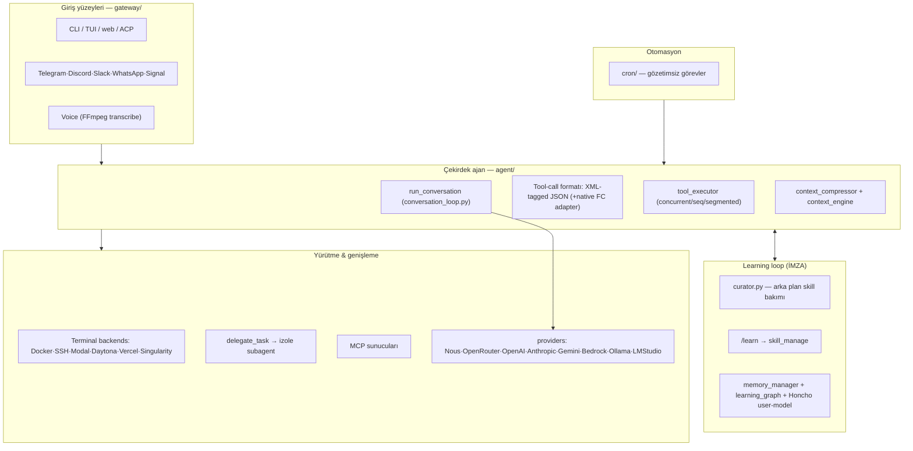
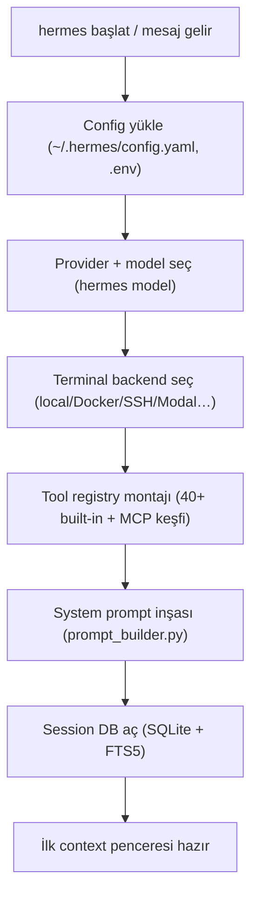
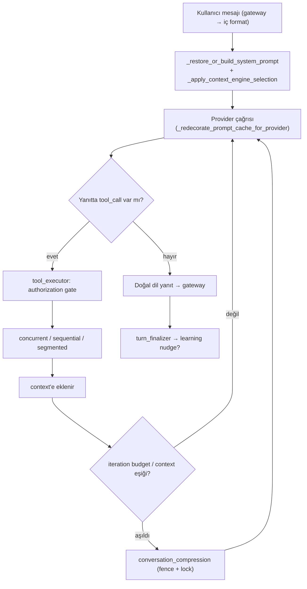
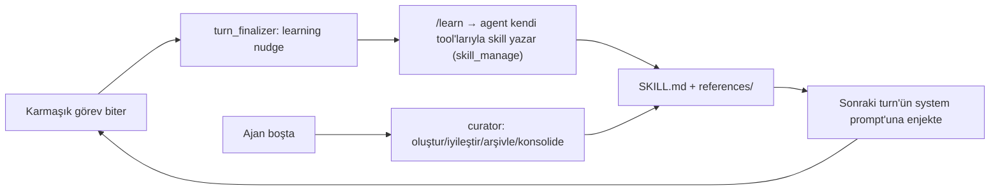
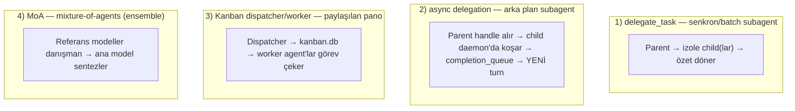
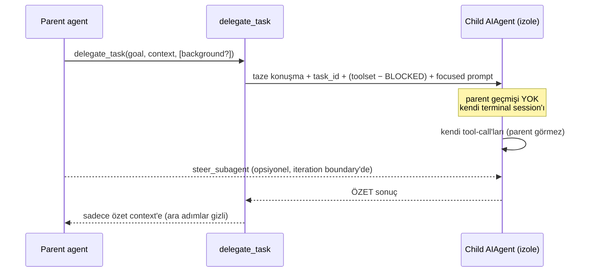
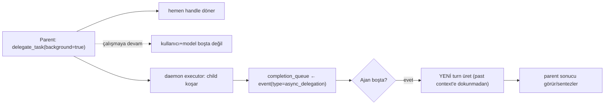
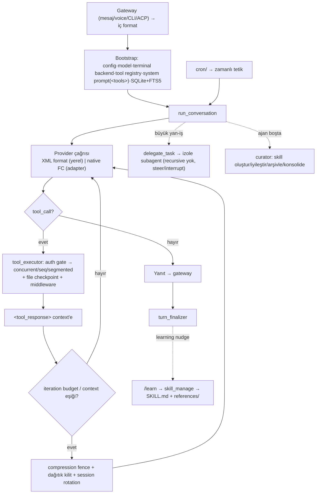

# Hermes-Agent — Harness Anatomisi (Baştan Sona)

> **Kaynak notu:** Bu belge, `github.com/NousResearch/Hermes-Agent` reposunun **gerçek kaynak kodu** üzerinden çıkarılmıştır (lokal klon: [harnesses/hermes-agent/](../harnesses/hermes-agent/)). Claude Code'un aksine Hermes-Agent **tam açık kaynaktır (MIT)** — dolayısıyla buradaki her iddia bir dosya/satıra dayanır. İncelenen çekirdek: `agent/` (128+ modül), `tools/` (40+ araç), `skills/`, `gateway/`, `providers/`, `cron/`.

---

## 0. Kimlik — bu tam olarak nedir?

Claude Code bir **üründür**; Hermes-Agent ise Nous Research'ün kendi **Hermes modelleriyle birlikte tasarlanmış**, açık, self-improving (kendini geliştiren) bir ajandır. Kendi tanımı: *"the only agent with a built-in learning loop — it creates skills from experience, improves them during use, ... builds a deepening model of who you are across sessions."*

**Teknoloji:** Python (birincil) + Node.js + Rust bileşenler. SQLite/FTS5 (oturum arama), FFmpeg (ses), ripgrep, MCP uyumlu.

**En kritik içgörü — model/harness ortak tasarımı:** Harness, Hermes modellerinin **eğitildiği trajectory formatını** yayar. [agent/agent_runtime_helpers.py](../harnesses/hermes-agent/agent/agent_runtime_helpers.py) içinde konuşmaları `"from": "gpt"` / `<think>` / `<tool_call>` bloklu **training-shaped trajectory**'ye çeviren kod vardır. Yani "prompt'a XML gömme" bir tercih değil, modelin fine-tune edildiği sözleşmedir. Bu, Hermes'i "genel bir framework"ten ayıran temel noktadır.

---

## 1. Katman haritası



**Harness felsefesi:** Claude Code "sabit-döngü + hook" ise, Hermes **"sabit-döngü + öğrenen bellek + çok-provider normalizasyonu"**. Esneklik hook'lardan değil; (a) skill/learning katmanından, (b) provider/terminal/gateway soyutlamalarından gelir.

---

## 2. İMZA #1: Tool-call formatı (XML-tagged JSON)

Hermes'in kalbi. [agent/agent_runtime_helpers.py:135-145](../harnesses/hermes-agent/agent/agent_runtime_helpers.py) system prompt'u birebir kurar:

```text
You are a function calling AI model. You are provided with function
signatures within <tools> </tools> XML tags. You may call one or more
functions... After calling & executing the functions, you will be provided
with function results within <tool_response> </tool_response> XML tags.
Here are the available tools:
<tools>
{ ...her araç için JSON şema... }
</tools>
For each function call return a JSON object... {'title':'FunctionCall',...}
Each function call should be enclosed within <tool_call> </tool_call> XML tags.
Example:
<tool_call>
{'name': <function-name>,'arguments': <args-dict>}
</tool_call>
```

**Dört etiket:**
| Etiket | Yön | İş |
|---|---|---|
| `<tools>…</tools>` | system→model | Araç kataloğu (JSON şemalar). Bu klasik **"XML registry"**. |
| `<tool_call>{json}</tool_call>` | model→harness | Model **XML içine JSON gömerek** çağırır. |
| `<tool_response>…</tool_response>` | harness→model | Tool sonucu böyle döner. |
| `<think>…</think>` | model | Reasoning bloğu. Native thinking kapalıysa `<REASONING_SCRATCHPAD>` → `<think>` çevrilir. |

**Parse mekaniği** ([agent_runtime_helpers.py:56-92](../harnesses/hermes-agent/agent/agent_runtime_helpers.py)):
```python
_TOOL_CALL_TAG_NAMES = ("tool_call", "tool_calls", "tool_result",
                        "function_call", "function_calls")
_TOOL_CALL_BLOCK_PATTERNS = (...regex per name...)
_STRAY_TOOL_CALL_CLOSER_PATTERN = re.compile(r'</(?:...|function)>\s*')
```
Model varyasyonlarına **toleranslı** (5 etiket adı), başıboş kapanış etiketlerini temizler.

**İMZA #2 — hibrit format (kritik nüans):** Hermes model-agnostiktir. Yerel/Hermes modelde **XML format**; Anthropic/Gemini/Bedrock'ta **native function-calling** kullanılır. Sağlayıcı adapter'ları her iki dünyayı **tek iç temsile** (`msg["tool_calls"]`) normalize eder:
- [agent/anthropic_adapter.py](../harnesses/hermes-agent/agent/anthropic_adapter.py)
- [agent/gemini_native_adapter.py](../harnesses/hermes-agent/agent/gemini_native_adapter.py)
- [agent/bedrock_adapter.py](../harnesses/hermes-agent/agent/bedrock_adapter.py)
- [agent/codex_responses_adapter.py](../harnesses/hermes-agent/agent/codex_responses_adapter.py)

Yani daha önce ayrı anlattığımız **"XML registry" ve "native FC" ikisi birden** — hangisinin kullanılacağı sağlayıcıya göre çalışma-zamanında seçilir.

---

## 3. Bootstrap (oturum açılışı)

[hermes_bootstrap.py](../harnesses/hermes-agent/hermes_bootstrap.py) + [agent/agent_init.py](../harnesses/hermes-agent/agent/agent_init.py):



1. **Config** — `~/.hermes/config.yaml` + `.env`; curator, provider, terminal ayarları.
2. **Model seçimi** — `hermes model` ile kod değişmeden model değişir (model-agnostik).
3. **Terminal backend** — tool'ların **nerede** koşacağı: local, Docker, SSH, Singularity, Modal, Daytona, Vercel Sandbox.
4. **Tool registry** — 40+ built-in araç + MCP sunucularından dinamik keşif.
5. **System prompt** ([agent/prompt_builder.py](../harnesses/hermes-agent/agent/prompt_builder.py)): kimlik + `<tools>` kataloğu + `PARALLEL_TOOL_CALL_GUIDANCE` + kullanıcı modeli + aktif skill'ler.
6. **Session DB** — SQLite + **FTS5** (full-text search) → geçmiş konuşma araması bunun üstünde.

---

## 4. Ana döngü — `run_conversation`

[agent/conversation_loop.py:1233](../harnesses/hermes-agent/agent/conversation_loop.py) (dosya **7334 satır**). Bir turn:



**Öne çıkan mekanizmalar:**
- **MoA (mixture-of-agents)** — [agent/moa_loop.py](../harnesses/hermes-agent/agent/moa_loop.py): birden çok modelin cevabını harmanlama.
- **Iteration budget** — [agent/iteration_budget.py](../harnesses/hermes-agent/agent/iteration_budget.py): sonsuz tool-döngüsü freni.
- **Prompt cache** — sağlayıcıya özel yeniden dekorasyon (`_redecorate_prompt_cache_for_provider`), statik system prompt cache'i (`_ensure_cached_system_prompt_static`).
- **Billing/entitlement kapıları** — Nous inference route için kredi/yetki kontrolleri.
- **Failover** — sağlayıcı düşerse system message senkronizasyonu (`_sync_failover_system_message`).

---

## 5. Tool yürütme — 3 kip + yetki kapısı

[agent/tool_executor.py](../harnesses/hermes-agent/agent/tool_executor.py) (**2403 satır**), üç yürütme kipi:

| Fonksiyon | Kip | Not |
|---|---|---|
| `execute_tool_calls_concurrent` | **Paralel** | Thread pool (`_max_workers_for_tool_batch`), `_ConcurrentToolAuthorizationGate` ile yetki senkronizasyonu |
| `execute_tool_calls_sequential` | **Sıralı** | Bağımlı işler |
| `execute_tool_calls_segmented` | **Segment** | Parça parça yürütme |

Her tool çağrısında (`_begin_tool_execution`):
- **Argüman parse** — `_parse_tool_arguments` (bozuk JSON'a toleranslı).
- **File checkpoint** — `_ensure_file_checkpoint`: dosya değişimleri **geri alınabilir** (checkpoint_manager).
- **Middleware** — `_run_agent_tool_execution_middleware`: enjeksiyon/denetim noktası.
- **Approval** — auto-approve / auto-deny callback'leri ([tools/approval.py](../harnesses/hermes-agent/tools/approval.py)).
- **Terminal yayını** — `_emit_terminal_post_tool_call` ile UI'a post-tool bildirimi.
- **Interrupt/cancel** — kullanıcı yarıda kesebilir (`_cancelled_tool_result`).

**40+ tool kategorisi** ([tools/](../harnesses/hermes-agent/tools/)): dosya (`file_tools`, `file_operations`), kod çalıştırma (`code_execution_tool`), tarayıcı (`browser_tool`, `browser_cdp_tool`, `computer_use`), görsel/video üretimi (`image_generation_tool`, `flux3_video_tool`), mesajlaşma (`discord_tool`, `feishu_*`), ev otomasyonu (`homeassistant_tool`), kanban (`kanban_tools`), cron (`cronjob_tools`), delegasyon (`delegate_tool`, `async_delegation`), MCP (`managed_tool_gateway`).

---

## 6. Context yönetimi — compression fence + dağıtık kilit

Claude Code compaction'ının **production-grade** ağır versiyonu. [agent/conversation_compression.py](../harnesses/hermes-agent/agent/conversation_compression.py) + [agent/context_compressor.py](../harnesses/hermes-agent/agent/context_compressor.py) + [agent/context_engine.py](../harnesses/hermes-agent/agent/context_engine.py):

- **`CompressionCommitFence`** — sıkıştırma **atomik** commit edilir; yarım kalırsa `_snapshot_compressor_attempt_state` / `_restore_compressor_attempt_state` ile geri sarılır.
- **Dağıtık kilit** — `session_db` üstünde lock; eşzamanlı sıkıştırmayı önler. Gerekirse **session rotation** (`recover_rotated_compression_session`, `_session_was_rotated_by_compression`).
- **Executor saturation** — sıkıştırma bir iş kuyruğudur (`_try_admit_compression_job` / `_release_compression_admission`), timeout'lu (`run_compress_context_with_progress_timeout`).
- **`context_references`** ([agent/context_references.py](../harnesses/hermes-agent/agent/context_references.py)) — büyük tool çıktıları **referansa** indirgenir (bizim POC'un microcompaction'ının muadili).
- **`context_breakdown`** — pencerede neyin ne kadar yer tuttuğunun analizi.

> **POC bağlantısı:** Bizim [poc/](../poc/) tool-trace compaction'ımız *tek tool-mesajı* granülerliğinde, fate-tabanlı (`_render_messages`) ve fayda-frenli (`est(note) < raw_tokens`). Hermes'inki *konuşma seviyesinde*, kilitli-atomik ve session-rotation'lı. İkisi farklı granülerlik: biz mesaj-içi kaderi yeniden yazarız; Hermes bütün pencereyi güvenli-commit ile sıkıştırır.

---

## 7. İMZA #3: Learning loop + skills (asıl fark)

Hermes'i diğer tüm ajanlardan ayıran katman. Üç ayak:

### 7.1 Skills = prosedürel bellek
[skills/](../harnesses/hermes-agent/skills/): her kategori (`research`, `github`, `email`, `creative`, `smart-home`…) bir **`DESCRIPTION.md`** ile tanımlı. `skills/index-cache/` — **anthropics/skills**, **openai skills**, **lobehub** indekslerini çeker. Yani hem yerleşik hem topluluk skill'leri birleşir.

### 7.2 `/learn` — canlı skill üretimi
[agent/learn_prompt.py](../harnesses/hermes-agent/agent/learn_prompt.py) docstring'i birebir: *"There is no separate distillation engine and no model-tool footprint: the agent does the work with its existing toolset."*

`/learn`, **ajanın kendi tool'larıyla** kaynağı toplayıp (`read_file`/`search_files`/`web_extract`/mevcut konuşma) `skill_manage` ile **Hermes skill-authoring standartlarına** uygun skill yazmasını sağlayan **tek bir prompt** kurar:
- Küçük kaynak → tek, sıkı `SKILL.md` (açıklama ≤60 karakter).
- Büyük kaynak (kitap/paper yığını) → **knowledge-base layout**: yalın `SKILL.md` index + `references/` dosyaları `skill_view` ile **talep üzerine** yüklenir (progressive disclosure — Claude Code skill deseninin aynısı).

Her yüzey (CLI `/learn`, gateway `/learn`, dashboard "Learn a skill") aynı `build_learn_prompt`'ı çağırır → **local/Docker/remote backend'de birebir** çalışır.

### 7.3 Curator — arka plan skill bakımı
[agent/curator.py](../harnesses/hermes-agent/agent/curator.py): *"background skill maintenance orchestrator."* Ajan **boştayken** (`min_idle_hours`) belirli aralıkla (`interval_hours`) çalışır ve skill kütüphanesini canlı tutar:
- Yeni skill **oluştur**
- Kullanılanları **iyileştir**
- Eskiyeni **arşivle** (`stale_after_days`, `archive_after_days`)
- Benzerleri **konsolide et** (`get_consolidate`)
- İsteğe bağlı yerleşik skill'leri bile **buda** (`get_prune_builtins`)

Yani skill kütüphanesi, kendini budayan/derinleştiren canlı bir organizma.

### 7.4 Bellek & kullanıcı modeli
- [agent/memory_manager.py](../harnesses/hermes-agent/agent/memory_manager.py) — bellek nudge'ları (periyodik "bunu kaydet" dürtüsü).
- [agent/learning_graph.py](../harnesses/hermes-agent/agent/learning_graph.py) + `learning_mutations.py` — öğrenme grafiği.
- **FTS5 geçmiş arama** + LLM özetleme — kendi eski konuşmalarını arar.
- **Honcho tabanlı kullanıcı modeli** — oturumlar arası "kullanıcının kim olduğunu" derinleştirir.



---

## 8. Multi-Agent System + Subagent mantığı (detaylı)

Hermes tek bir MAS mekanizması kullanmaz — **dört ayrı çok-ajan paterni** vardır ve her biri farklı bir iletişim omurgasına oturur. Bu bölüm hepsini gerçek kaynak koddan ayrıntılandırır.

### 8.0 Dört paterne genel bakış



| Patern | İletişim omurgası | Eşzamanlılık | Ne zaman |
|---|---|---|---|
| **delegate_task** | Fonksiyon-çağrısı + özet dönüş | Senkron veya batch-paralel | Odaklı yan-görev, sonuç ana context'e girsin |
| **async delegation** | **Paylaşılan `completion_queue`** (event) | Arka plan (non-blocking) | Uzun iş; kullanıcı/model beklemesin |
| **Kanban** | **Paylaşılan SQLite pano** (`kanban.db`) | Dispatcher → çok worker | Yapılandırılmış iş kuyruğu / gözetimsiz üretim |
| **MoA** | Bellek-içi referans harmanı | Paralel danışman modeller | Tek turn'ün kalitesini artırma |

---

### 8.1 delegate_task — subagent mimarisinin çekirdeği

[tools/delegate_tool.py](../harnesses/hermes-agent/tools/delegate_tool.py) docstring'i birebir:

> *"Spawns child AIAgent instances with isolated context, inherited toolsets, and their own terminal sessions. Supports single-task and batch (parallel) modes. Top-level model calls run in the background; orchestrator children wait for their own workers so they can synthesize the results. The parent's context only sees the delegation call and the summary result, never the child's intermediate tool calls or reasoning."*

**Her child şunu alır** (docstring'den):
- **Taze konuşma** — parent geçmişi YOK (`no parent history`).
- **Kendi `task_id`** — kendi terminal session'ı, kendi file-ops cache'i (izolasyon).
- **Parent'ın toolset'leri** — ama **child-only bloklu tool'lar çıkarılmış**.
- **Odaklı system prompt** — delege edilen `goal` + `context`'ten inşa.

**Ana izolasyon garantisi:** Parent'ın context'i yalnızca *delegation çağrısını* ve *özet sonucu* görür — child'ın ara tool-call'larını ve reasoning'ini **asla**. Bu, ana pencereyi şişmekten koruyan çekirdek mekanizma (context-yönetimine alternatif: sıkıştırmak yerine *izole etmek*).

**Child'a asla verilmeyen tool'lar** ([delegate_tool.py:47-54](../harnesses/hermes-agent/tools/delegate_tool.py)):
```python
DELEGATE_BLOCKED_TOOLS = frozenset([
    "delegate_task",  # recursive delegasyon yok
    "clarify",        # kullanıcıyla etkileşim yok
    "memory",         # paylaşılan MEMORY.md'ye yazma yok
    "send_message",   # platformlar-arası yan-etki yok
    "cronjob",        # parent adına iş zamanlama yok
])
```
Bu liste bir **güvenlik/yetki daraltma** kararıdır: child ne recursive çoğalabilir, ne kullanıcıyı rahatsız edebilir, ne paylaşılan belleğe/zamanlayıcıya dokunabilir, ne de dış platforma mesaj atabilir.

**Derinlik kontrolü** ([delegate_tool.py:127-133, 699-710](../harnesses/hermes-agent/tools/delegate_tool.py)):
```
MAX_DEPTH = 1   # varsayılan DÜZ: parent(0) → child(1); torun reddedilir
```
- Varsayılan **düz** hiyerarşi: parent depth-0, child depth-1, **torun yok**.
- `delegation.max_spawn_depth ≥ 2` yapılırsa iç içe orkestrasyona açılır.
- Nested delege, model tool adı vererek değil, **`role="orchestrator"`** ile verilir — orchestrator child'a `_build_child_agent` "delegation" toolset'ini **geri ekler**. Yani "worker" child'lar spawn edemez; sadece açıkça orchestrator rolü verilenler edebilir.

**Eşzamanlılık sınırı:** `_get_max_concurrent_children()` — varsayılan üst sınır ~10 (config'le değişir); batch modda paralel worker sayısını sınırlar.

**Roller — leaf vs orchestrator:**
- **leaf** — sadece işi yapar, çocuk açamaz (varsayılan).
- **orchestrator** — kendi worker'larını açar, onları bekler ve **sonuçları sentezler** ("orchestrator children wait for their own workers so they can synthesize the results").

**Steer / interrupt / pause** (canlı kontrol):
- `steer_subagent(...)` — ebeveyn, çalışan child'a mesaj enjekte eder; child bir sonraki **iteration boundary**'de (son tool sonucundan sonra) görür ([delegate_tool.py:235-279](../harnesses/hermes-agent/tools/delegate_tool.py)).
- `interrupt_subagent(id)` — hard-interrupt bayrağı; uçuştaki tool'lara yayılır, recurse eder.
- `set_spawn_paused(True)` — global olarak **yeni** spawn'ları durdurur; aktif child'lar koşmaya devam eder.

**İzolasyon güvenliği — delegation_context** ([agent/delegation_context.py](../harnesses/hermes-agent/agent/delegation_context.py)): child'lar parent ile **aynı Python process'inde** koşar. Bu tehlike yaratır: parent bir Kanban dispatcher worker'ı ise, child yanlışlıkla o dispatcher kimliğini (`HERMES_KANBAN_*` env) miras alabilir. `_DELEGATED_CHILD_CONTEXT` context-var'ı ile child'lar **fail-closed** olur — `os.environ`'ı parent için değiştirmeden, alt-süreç env'ini temizler (`scrub_kanban_env`). Yani izolasyon sadece context penceresi değil, **kimlik/env** düzeyinde de sağlanır.



---

### 8.2 async delegation — arka plan subagent'ı + event kuyruğu

[tools/async_delegation.py](../harnesses/hermes-agent/tools/async_delegation.py): `delegate_task(background=true)` bunu tetikler. Docstring'in verdiği mimari çok öğretici:

- Parent, child'ı **module-level daemon executor**'a atar ve **hemen bir handle** alır → kullanıcı ve model çalışmaya devam eder (non-blocking).
- Child bitince, **paylaşılan `process_registry.completion_queue`**'ya `type="async_delegation"` bir completion event'i **push edilir**.
- CLI (`cli.py` process_loop) ve gateway (`_run_process_watcher`) **ajan boştayken** bu kuyruğu zaten poll eder; her event'ten **taze bir user/internal turn** üretir.

**Neden bu kadar önemli — "past context'i asla mutasyona uğratma" invaryantı:** Docstring bunu açıkça söylüyor. Tamamlanma sonucu, çalışan bir agent loop'unun içine **enjekte edilmez**; bir tool sonucu ile assistant mesajı arasına **sıkıştırılmaz**. Onun yerine ajan boştayken **YENİ bir turn** olarak yüzeye çıkar. Bu:
1. Katı **mesaj-rol alternasyonunu** legal tutar,
2. **Prompt cache'i** bozmaz (geçmiş context değişmediği için),
3. Kuyruğun **de-dup + crash-recovery checkpoint**'ini bedavaya miras alır.

Completion payload'ı **zengin, kendine-yeten** bir "task-source" bloğu taşır (orijinal goal, parent'ın verdiği context, toolset'ler, model, dispatch zamanı) — böylece yeni turn tek başına anlamlı olur. Canlı ilerleme [tools/delegation_live_log.py](../harnesses/hermes-agent/tools/delegation_live_log.py) ile loglanır.



Bu, mega-atlas §14'teki **"event-stream / pub-sub"** MAS omurgasının somut örneğidir: ajanlar doğrudan birbirine değil, **paylaşılan bir olay kuyruğuna** yazar; tüketici (CLI/gateway) boştayken drain eder.

---

### 8.3 Kanban dispatcher/worker — paylaşılan pano (blackboard) MAS

[tools/kanban_tools.py](../harnesses/hermes-agent/tools/kanban_tools.py) tamamen ayrı bir MAS paternidir: **paylaşılan bir iş panosu** (`~/.hermes/kanban.db` SQLite). Docstring'den:

- Kanban tool'ları modele **yalnızca** dispatcher altında koşarken (`HERMES_KANBAN_TASK` env set) **veya** profil açıkça `kanban` toolset'ini etkinleştirdiğinde girer. Normal `hermes chat` bu tool'ları **görmez**.
- **Dispatcher** görevleri panoya yazar; **worker agent'lar** görev çeker, çalışır, `kanban(action="complete")` ile kapatır.
- Neden shell yerine tool? Çünkü worker'ın terminali Docker/Modal/SSH'a bakıyor olabilir — orada `hermes` kurulu değil, DB mount'lu değil. **Tool'lar ajanın Python process'inde koşar**, yani terminal backend ne olursa olsun `kanban.db`'ye ulaşır (backend-portability).

Bu, klasik **blackboard/shared-board** MAS'ıdır: ajanlar birbirine mesaj atmaz, ortak bir durum panosu üzerinden koordine olur (Claude Code agent-teams'in *shared task list*'iyle aynı fikir; orada JSON dosyası + file-lock, burada SQLite pano).

```mermaid
flowchart TB
    DISP["Dispatcher"] -->|görev ekle| DB[("kanban.db<br/>(paylaşılan pano)")]
    DB --> W1["Worker agent 1<br/>(HERMES_KANBAN_TASK)"]
    DB --> W2["Worker agent 2"]
    DB --> W3["Worker agent 3"]
    W1 -->|kanban(complete)| DB
    W2 -->|kanban(complete)| DB
    W3 -->|kanban(complete)| DB
    NOTE["İnsan: hermes kanban CLI / dashboard / /kanban → ajanı bypass eder"] -.-> DB
```

---

### 8.4 MoA (mixture-of-agents) — ensemble danışmanlık

[agent/moa_loop.py](../harnesses/hermes-agent/agent/moa_loop.py): `/moa` slash komutu bir user turn'ünü MoA-etkin işaretler. Kilit tasarım: **bu bir model-tool değildir** — normal Hermes loop tool-çağrısına ve turn sonlanmasına hâlâ sahiptir; MoA modülü sadece her model iterasyonundan **önce referans-model context'i toplar**.

Yani birden çok "danışman" model paralel çalışır, çıktıları (etiketli reference blokları olarak) ana modele beslenir, ana model **sentezler**. Bir gizlilik filtresi (`moa.privacy_filter`) danışman çıktılarındaki PII'yi maskeleyebilir. Bu tam anlamıyla "delegasyon" değil, bir **ensemble/oylama** paternidir — ama çok-model olduğu için MAS ailesine girer.

---

### 8.5 Özet — Hermes'in MAS haritası ve Claude Code ile kıyas

| | delegate_task | async delegation | Kanban | MoA |
|---|---|---|---|---|
| **Omurga** | fonksiyon-çağrısı + özet | paylaşılan event kuyruğu | paylaşılan SQLite pano | bellek-içi harman |
| **Ajanlar birbirini görür mü** | hayır (parent↔child) | hayır (kuyruk aracı) | hayır (pano aracı) | hayır (ana↔danışman) |
| **İzolasyon** | context + task_id + env | + arka plan daemon | + backend-portable DB | yok (tek turn) |
| **Recursive** | hayır (orchestrator hariç) | — | dispatcher→worker | — |
| **Claude Code karşılığı** | Task tool subagent | (yakın karşılığı yok) | agent-teams *shared task list* | (yok) |

**Ortak imza** (tüm sistemlerde aynı, atlas §14 tezi): *delege → izole context → özet döndür.* Hermes bunu **dört farklı omurgayla** uygular; fark, koordinasyonun *nerede* durduğu — fonksiyon dönüşünde mi, event kuyruğunda mı, paylaşılan panoda mı, yoksa ensemble harmanında mı.

**Claude Code ile temel fark:** Claude Code'un iki kademesi vardı (in-process Task subagent + yerel-JSON-mailbox agent-teams). Hermes'te **mailbox-tarzı doğrudan ajanlar-arası mesajlaşma yok** — bunun yerine *paylaşılan kuyruk* (async) ve *paylaşılan pano* (Kanban) kullanılır. İkisi de "blackboard" ailesi; Claude Code agent-teams ise "mailbox" ailesi. Bu, iki sistemin MAS felsefesindeki net ayrımdır.

---

## 9. Çok-platform gateway + terminal backends + providers

Hermes'in **en geniş yüzeyi** — üç eksende çarpım:

| Eksen | Seçenekler | Dosya |
|---|---|---|
| **Gateway (giriş)** | CLI, TUI, web, ACP + Telegram, Discord, Slack, WhatsApp, Signal, voice | [gateway/](../harnesses/hermes-agent/gateway/) |
| **Terminal backend (yürütme)** | local, Docker, SSH, Singularity, Modal, Daytona, Vercel Sandbox | [tools/environments](../harnesses/hermes-agent/tools/) |
| **Provider (model)** | Nous Portal, OpenRouter, OpenAI, Anthropic, Bedrock, Gemini native, Copilot ACP, LM Studio, Ollama | [providers/](../harnesses/hermes-agent/providers/) + `agent/*_adapter.py` |

Gateway tüm mesajlaşma platformlarını **tek iç mesaj formatına** normalize eder (Claude Code'un "tek motor, çok yüzey"inin mesajlaşma versiyonu). Terminal backend, tool'ların çalıştığı izolasyon kutusudur (Claude Code devcontainer sandbox'ının çok-hedefli hâli).

---

## 10. Cron / gözetimsiz otomasyon

[cron/](../harnesses/hermes-agent/cron/) + [tools/cronjob_tools.py](../harnesses/hermes-agent/tools/cronjob_tools.py) — built-in zamanlayıcı; gözetimsiz görevler, paralel iş için izole subagent spawn eder. (Claude Code Routines muadili — repoda [hermes-already-has-routines.md](../harnesses/hermes-agent/hermes-already-has-routines.md) notu var.)

---

## 11. Uçtan uca — tek harita



---

## 12. Öne çıkanlar — Hermes harness imzası

1. **Model-harness ortak tasarımı** — harness, Hermes modelinin eğitildiği `<tool_call>` XML trajectory'sini yayar; prompt-tabanlı format bu yüzden güvenilir (rastgele bir framework değil).
2. **Hibrit tool-call** — XML registry (yerel/Hermes) **+** native FC (Anthropic/Gemini/Bedrock), adapter'larla tek iç temsile normalize. Tek ajanda iki paradigma.
3. **Learning loop = asıl fark** — `/learn` (canlı skill üretimi, ayrı distilasyon motoru yok) + `curator` (arka planda kütüphaneyi budayan) + Honcho kullanıcı modeli + FTS5 geçmiş arama. Diğer hiçbir sistemde "kendini besleyen döngü" bu kadar merkezî değil.
4. **Production-grade context yönetimi** — commit-fence + dağıtık kilit + session rotation + executor saturation kontrolü.
5. **En geniş yüzey** — gateway (5+ mesajlaşma) × terminal backend (7) × provider (9) çarpımı.
6. **Subagent** — izole context, recursive delege yok, steer/interrupt, async delegasyon.
7. **Geri-alınabilirlik** — her tool çağrısında file checkpoint; interrupt/cancel.

---

## 13. Claude Code ile hızlı karşılaştırma

| Eksen | Claude Code | Hermes-Agent |
|---|---|---|
| Kaynak | Kapalı (bundle) | **Açık (MIT)** |
| Tool-call | Native FC | **XML registry + native FC hibrit** |
| Harness felsefesi | Sabit-döngü + 30+ hook | Sabit-döngü + **learning loop** + provider normalizasyonu |
| Genişleme | Plugin (command/agent/hook/skill) | **Skill + /learn + curator** + MCP |
| Bellek | CLAUDE.md + auto-memory | Skill kütüphanesi + FTS5 + **Honcho user-model** |
| Subagent | Task tool / agent teams (dosya-mailbox) | delegate_task (izole, recursive yok) |
| Sandbox | devcontainer + firewall | **7 terminal backend** (Docker/SSH/Modal/Daytona/Vercel…) |
| Yüzey | Terminal/IDE/desktop/web | + **5 mesajlaşma platformu** + voice |
| Context | auto-compaction + microcompaction | **commit-fence + lock + session-rotation** |
| İmza | Yönetişim (permission/plan-mode/hook) | **Self-improvement (skill/learn/curator)** |

---

## Kaynaklar
- Repo (lokal klon): [harnesses/hermes-agent/](../harnesses/hermes-agent/) — `github.com/NousResearch/Hermes-Agent` (MIT).
- Çekirdek dosyalar: `agent/conversation_loop.py`, `agent/agent_runtime_helpers.py`, `agent/tool_executor.py`, `agent/prompt_builder.py`, `agent/conversation_compression.py`, `agent/curator.py`, `agent/learn_prompt.py`, `tools/delegate_tool.py`, `skills/`.
- Karşılaştırma: [report/claude-code-harness.md](claude-code-harness.md), [report/14-agentic-mega-atlas.md](14-agentic-mega-atlas.md) §Hermes, [poc/](../poc/) tool-trace compaction.
