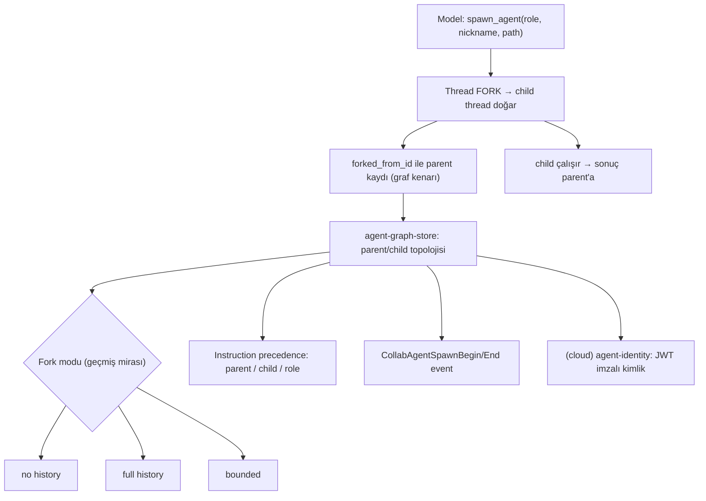
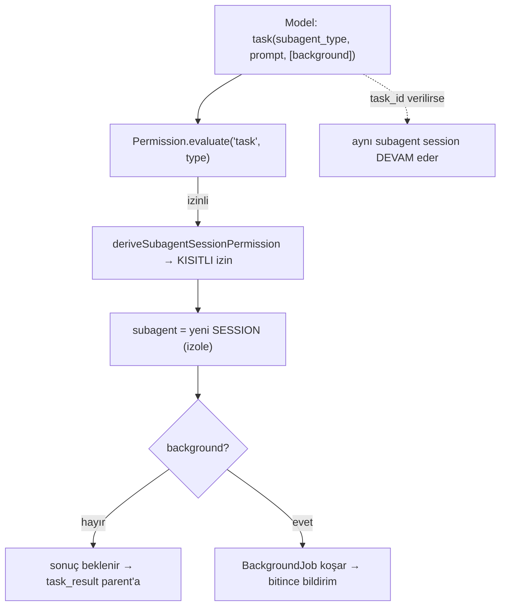
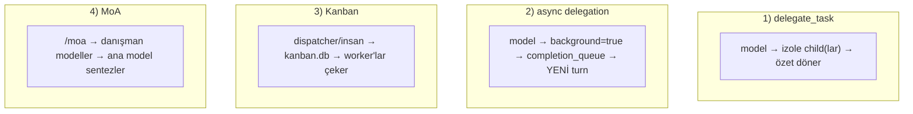
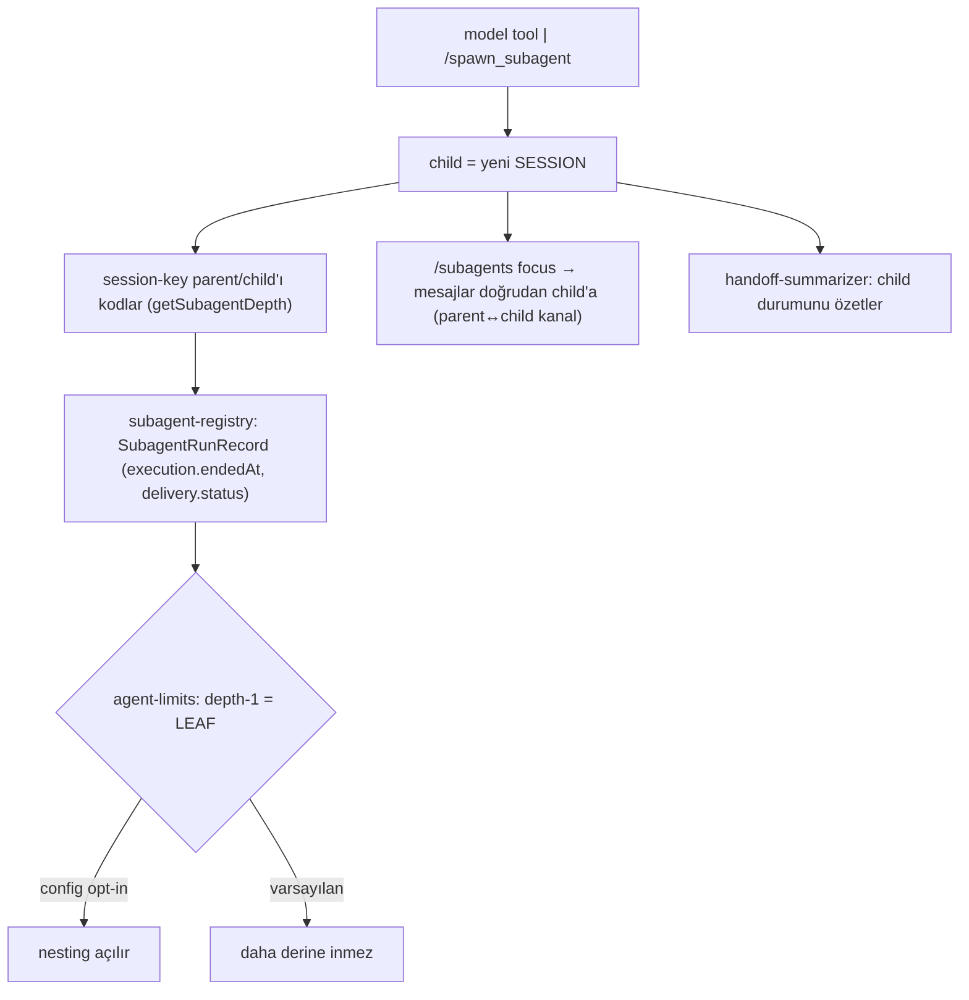
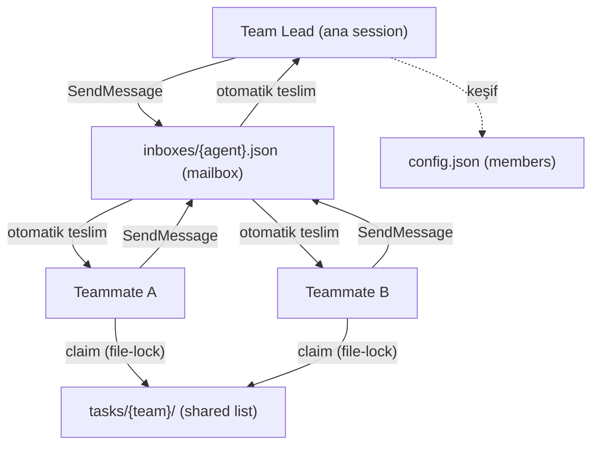

# Multi-Agent System + Subagent — Beş Ajan Karşılaştırması

> **Kapsam:** Codex · OpenCode · Hermes-Agent · OpenClaw · Claude Code. Bu belge, beş ajanın **çok-ajan (MAS) ve subagent** mekanizmasını *nasıl tetiklendiği → süreç nasıl aktığı → hangi terimlerin ne anlama geldiği* düzeyinde karşılaştırır. Her iddia bu oturumda incelenen **gerçek kaynak koda** dayanır (klonlar: [../harnesses/](../harnesses/)).

> **Düzeltme kaydı (dürüstlük):**
> - **OpenClaw GERÇEK bir ajan framework'üdür** (`openclaw/openclaw` 🦞 — *"Your assistant, on your devices, in your chats"*, TS/Node, MIT). Bu belgenin ilk sürümünde onu "Captain Claw oyunu, ajan değil" diye yanlış eledim — **iki kez hata**: önce branch adlarına (`316/325/354`) bakıp yanlış hüküm verdim, sonra bunu belgeye yazdım. Kaynak kod incelendi; atlas'ın orijinal *"izole child, depth-limit, parent↔child kanal"* girdisi **doğruymuş**. §4'te tam analiz var.
> - **Codex "tek ajan" değil** — `spawn_agent` + `multi_agent_v2` + collaboration namespace var (atlas eski bilgiyi taşıyordu).

---

## 0. Ortak çerçeve

### Tüm sistemlerde aynı olan imza
Dört sistem de aynı özü paylaşır:

> **delege et → izole context'te çalıştır → özet/sonuç döndür.**

Fark asla bu imzada değil; **dört eksende** ayrışır:
1. **Tetikleyici** — kim başlatır (model / kullanıcı / sistem).
2. **İzolasyon birimi** — child neyin içinde koşar (thread / session / process-içi task).
3. **Koordinasyon omurgası** — sonuç nereden akar (fonksiyon dönüşü / event kuyruğu / paylaşılan pano / mailbox).
4. **Recursive'e bakış** — child kendi child'ını açabilir mi (derinlik/kimlik/izin kısıtı).

### Üç tetikleyici tipi
- **Model-tetikli** — ajan *kendisi* bir tool çağırır (Codex `spawn_agent`, OpenCode `task`, Hermes `delegate_task`, Claude `Task`).
- **Kullanıcı-tetikli** — insan slash/CLI yazar (Hermes `/moa`, `/kanban`; Claude agent-teams doğal-dil).
- **Sistem-tetikli** — arka-plan süreci ortam değişkeni/cron ile başlatır (Hermes Kanban dispatcher).

### İki MAS ailesi (en derin ayrım)
- **Özet-dönüşlü delege** — child biter, tek özet parent'a döner (Codex, OpenCode, Claude `Task`, Hermes `delegate_task`).
- **Paylaşılan durum** — ajanlar ortak bir yere yazar:
  - **Blackboard (kara tahta)** — paylaşılan kuyruk/pano (Hermes async + Kanban).
  - **Mailbox (posta kutusu)** — her ajanın kutusu + **doğrudan** ajanlar-arası mesaj (Claude agent-teams).

---

## 1. Codex — fork tabanlı subagent grafı

**Kaynak (Rust, `codex-rs`):** `agent-graph-store`, `spawn_agent` tool'u, `SubAgentSource::ThreadSpawn`, `agent-identity` (JWT), `CollabAgentSpawn{Begin,End}Event`, `multi_agent_v2` testleri.

### Tetik: model → `spawn_agent`
Model, [protocol/src/models.rs](../harnesses/codex/codex-rs/protocol/src/models.rs)'te tanımlı **`spawn_agent`** aracını çağırır; `agent_role` / `agent_nickname` / `agent_path` verir.

### Akış


### Terimler
- **thread** — Codex'te konuşma/oturum birimi. Subagent = **fork'lanmış** yeni thread.
- **fork** — thread'i çatallayıp child yaratmak; **fork modu** child'ın parent geçmişini ne kadar aldığını belirler (`no history` / `full` / `bounded`).
- **agent-graph-store** — *"storage-neutral parent/child topology for thread-spawned agents"* — kim kimi doğurdu deposu; `ThreadSpawnEdgeStatus` = kenar durumu.
- **`forked_from_id`** — child'ın "ben kimden doğdum" kaydı (grafın kenarı).
- **instruction precedence** — çakışan talimatlarda öncelik (parent / child / role hangisi kazanır).
- **agent-identity (JWT)** — her spawn edilen ajana **kriptografik, imzalı kimlik** (`sign_task_registration_payload`, `decrypt_task_id_response`). Cloud task'larda yetki doğrulaması. **Codex'e özgü.**
- **collaboration namespace** — spawn olaylarının toplandığı isim-alanı; MAS'ın Codex'teki adı.

**Öz:** *model `spawn_agent` → thread fork → parent/child grafı → rol + geçmiş-miras modu → begin/end event + JWT kimlik.* İzolasyon **thread** düzeyinde; koordinasyon **graf deposu + event**.

---

## 2. OpenCode — Task-tool subagent (Claude Code ikizi)

**Kaynak (TypeScript/Effect):** `agent/agent.ts` (ajan modları), `tool/task.ts` (Task aracı), `agent/subagent-permissions.ts`, `tool/registry.ts`.

### Tetik: model → `task`
Model, registry'ye kayıtlı, izinle kapılı ([tool/registry.ts](../harnesses/opencode/packages/opencode/src/tool/registry.ts): `Permission.evaluate("task", …)`) **`task`** aracını çağırır. Parametreler ([tool/task.ts](../harnesses/opencode/packages/opencode/src/tool/task.ts)):
- **`subagent_type`** — hangi uzman ajan.
- **`prompt`** + **`description`** — görev + kısa etiket.
- **`background`** — `true`: asenkron, bitince bildir; `false` (varsayılan): sonucu bekle.
- **`task_id`** — önceki bir subagent oturumunu **sürdür** (yeni açma).

### Ajan modları — [agent/agent.ts](../harnesses/opencode/packages/opencode/src/agent/agent.ts)
```
mode: "primary" | "subagent" | "all"
```
- **primary** — kullanıcıyla konuşan üst-seviye (`default`, `plan`).
- **subagent** — yalnız delege edilince çağrılan (`general-purpose`, `explorer`).
- `plan` mode: edit tool'ları yasak (salt-okunur); `explorer`: hızlı kod tarama (quick/medium/very thorough).

### Akış


### Terimler
- **primary / subagent (mode)** — ajanın rolü: kullanıcıya mı bakar, delege mi edilir.
- **session** — OpenCode'da izole çalışma birimi (Codex "thread"inin karşılığı); her subagent kendi SessionID'sinde.
- **deriveSubagentSessionPermission** — child'ın iznini parent'tan **türetip daraltma** (child fazla yetki alamaz).
- **background/foreground** — asenkron mı, bekle mi. Background rehberi birebir Claude Code gibi (*"DO NOT sleep, poll… avoid working with the same files"*).
- **task_id (resume)** — aynı subagent'ı sürdürme kimliği (duraklat-devam et).

**Öz:** *model `task` → izin türetilir → subagent ayrı session'da → foreground/background → task_id ile devam.* Neredeyse **Claude Code Task tool'unun ikizi** + primary/subagent mod tanımları + Effect tabanlı session mimarisi.

---

## 3. Hermes-Agent — dört ayrı MAS paterni

**Kaynak (Python):** `tools/delegate_tool.py`, `tools/async_delegation.py`, `tools/kanban_tools.py`, `agent/moa_loop.py`. (Detaylı anlatım: [hermes-agent-harness.md](hermes-agent-harness.md) §8.)

Hermes tek MAS kullanmaz; **dört patern** farklı omurgalara oturur:



| Patern | Tetik | Omurga | Eşzamanlılık |
|---|---|---|---|
| **delegate_task** | model → tool | fonksiyon dönüşü (özet) | senkron / batch-paralel |
| **async delegation** | model → `background=true` | **completion_queue** (event) | arka plan (non-blocking) |
| **Kanban** | sistem/insan (dispatcher / `hermes kanban`) | **kanban.db** (blackboard) | dispatcher → çok worker |
| **MoA** | kullanıcı → `/moa` | bellek-içi harman | paralel danışman |

### Kilit terimler
- **`DELEGATE_BLOCKED_TOOLS`** — child'a asla verilmeyenler: `delegate_task` (recursive yok), `clarify`, `memory`, `send_message`, `cronjob`.
- **leaf vs orchestrator** — leaf çocuk açamaz (varsayılan); orchestrator "delegation" toolset'ini geri alır, worker'larını bekler ve sentezler. `MAX_DEPTH=1` düz; nested için `max_spawn_depth≥2`.
- **completion_queue** — paylaşılan tamamlanma-olayı kuyruğu; child bitince event push edilir, ajan boştayken YENİ turn olarak yüzeye çıkar (*"past context'i asla mutasyona uğratma"* → rol alternasyonu + prompt cache korunur).
- **dispatcher/worker** — Kanban'da işleri dağıtan koordinatör + panodan görev çeken ajan(lar); tool'lar in-process çalışır → **backend-portable** (Docker/Modal/SSH farketmez, `kanban.db`'ye ulaşır).
- **delegation_context** — child parent ile aynı process'te; context-var ile **fail-closed** olur (Kanban kimliğini/env'ini miras almaz).

**Öz:** Hermes MAS = *özet-dönüşlü delege* (delegate_task) **+ blackboard** (async kuyruk, Kanban pano) **+ ensemble** (MoA). Doğrudan ajanlar-arası mesaj **yok**.

---

## 4. OpenClaw — session-key ağacı + focus/routing

**Kaynak (TypeScript/Node):** `src/auto-reply/reply/commands-subagents*.ts`, `src/agents/subagent-registry.ts`, `src/routing/session-key.ts` (`getSubagentDepth`), `src/config/agent-limits.ts`, `src/auto-reply/handoff-summarizer.ts`. 🦞 Tek-operatör, çok-platform (WhatsApp/Telegram/Slack/Discord), Gateway'li — Hermes akrabası.

### Tetik: **hibrit** (model + kullanıcı)
- **Model** — [groups.ts](../harnesses/openclaw/src/auto-reply/reply/groups.ts): *"When subagent or session-spawn tools are available … prefer delegating bounded side investigations."*
- **Kullanıcı** — `/spawn_subagent investigate` + `/subagents` kontrol komutları (list / status / focus / log / info).

### Akış


### Terimler
- **session-key** — konuşma kimliği; parent/child ilişkisini içine kodlar → subagent **ağacı** buradan çıkar.
- **getSubagentDepth** — session'ın ağaçtaki derinliği.
- **agent-limits (leaf freni)** — [agent-limits.ts](../harnesses/openclaw/src/config/agent-limits.ts): *"Keep depth-1 subagents as leaves unless config explicitly opts into nesting"* → Hermes `MAX_DEPTH=1` / Claude "no nested teams" ile **aynı karar**.
- **subagent-registry / SubagentRunRecord** — çalışan subagent'ları izleyen kayıt defteri (aktif mi, teslim durumu).
- **focus / routing** — bir subagent'a **doğrudan** mesaj yönlendirme (Claude teammate-focus'un karşılığı, ama mailbox yerine **session-routing** ile).
- **handoff-summarizer** — model fallback'inde aktif subagent durumunu özetleyip yeni modele brifing verir.

**Öz:** OpenClaw MAS = *child session ağacı (session-key + registry) + leaf-depth freni + **focus/routing ile doğrudan child'a konuşma**.* "Mailbox ailesi"ne yakın (doğrudan child'a erişim) ama mekanik farklı (routing, JSON-inbox değil).

---

## 5. Claude Code — iki kademe: Task subagent + agent-teams

**Kaynak:** resmî docs + Agent SDK + çalışma-zamanı. (Detay: [claude-code-harness.md](claude-code-harness.md) §5.)

### Kademe 1 — Task subagent (in-process)
- Tetik: model → **`Task`** tool. Child izole context penceresinde koşar, **tek özet** döner. Tek yönlü (yalnız parent'a rapor). Subagent'lar birbiriyle konuşamaz.
- Tanım: `.claude/agents/*.md` (frontmatter: `name`, `description`, `tools`, `model`).

### Kademe 2 — agent-teams (deneysel, mailbox MAS)
- Tetik: **kullanıcı** doğal-dille "N teammate spawn et" (`CLAUDE_CODE_EXPERIMENTAL_AGENT_TEAMS=1` gerekli). İlk teammate doğunca team oluşur, ana session = **lead**.
- Teammate = ayrı, tam bir Claude instance'ı. İletişim **yerel JSON dosyalarıyla**:



### Terimler
- **lead / teammate** — koordine eden ana session + ayrı çalışan instance'lar.
- **mailbox** — `~/.claude/teams/{team}/inboxes/{agent}.json`; her ajanın **posta kutusu** (JSON dosyası).
- **`SendMessage`** — bir ajanın diğerine **doğrudan** isimle mesaj atma tool'u (bu, Claude'u diğer üçünden ayırır).
- **shared task list** — `~/.claude/tasks/{team}/`; **file-lock** ile claim (blackboard benzeri).
- **classifier** — ajanlar-arası her mesajı **güvenilmez girdi** sayan güvenlik katmanı.
- Sınırlar: session başına tek team, **nested team yok**, lead sabit, in-process teammate resume edilmez.

**Öz:** Claude MAS = *in-process özet-dönüşlü delege* (Task) **+ mailbox** (agent-teams: doğrudan mesaj + shared file list). **Tek "mailbox ailesi" örneği.**

---

## 6. Beşi yan yana — özet matris

| Eksen | **Codex** | **OpenCode** | **Hermes** | **OpenClaw** | **Claude Code** |
|---|---|---|---|---|---|
| **Dil** | Rust | TS/Effect | Python | TS/Node | (bundle) |
| **Tetik** | model `spawn_agent` | model `task` | model `delegate_task` (+`/moa`, dispatcher) | model + `/spawn_subagent` | model `Task` / kullanıcı (teams) |
| **İzolasyon birimi** | **thread (fork)** | **session** | task_id (aynı process) | **child session (session-key ağacı)** | context penceresi / session |
| **Koordinasyon** | agent-graph-store + collab event | primary/subagent + izin türetme | fonksiyon / **kuyruk** / **kanban pano** | **session-key ağacı + registry** | özet dönüş / **JSON mailbox** |
| **MAS ailesi** | özet-dönüş + graf | özet-dönüş | özet + **blackboard** + ensemble | özet + **routing** | özet + **mailbox** |
| **Recursive** | graf depth | izin türetme | `MAX_DEPTH=1` (orchestrator hariç) | **leaf@depth-1** (config opt-in) | nested team yok |
| **Doğrudan child'a konuşma** | ✗ | ✗ | ✗ | **✅ focus/routing** | ✅ `SendMessage` (mailbox) |
| **Ayırt edici** | **JWT ajan kimliği** · fork geçmiş-miras modu | Claude ikizi · resume (`task_id`) · Plan/Build | **dört ayrı patern** | **focus/routing + çok-platform gateway** | **mailbox** + shared task-list |

---

## 7. Muhabbetin özü — üç net tespit

1. **İmza herkeste aynı, aile farklı.** Beşi de *delege → izole → özet döndür* yapar. Ama Codex/OpenCode saf "özet-dönüş", Hermes buna **blackboard** (kuyruk+pano) ekler, Claude **mailbox** (JSON-inbox + doğrudan mesaj), OpenClaw ise **routing** (child'a doğrudan yönlenme, ama session üzerinden) sunar.

2. **İzolasyon birimi mimariyi belli eder.** Codex thread-fork (geçmiş mirası ayarlanabilir), OpenCode/OpenClaw/Claude session/context penceresi, Hermes aynı-process task_id (bu yüzden env-scrubbing gibi ekstra izolasyon gerekir). Birim ne kadar "ağır" (ayrı süreç/thread) ise, izolasyon o kadar güçlü ama koordinasyon o kadar maliyetli.

3. **Recursive'e herkes fren koyar, ama farklı yöntemle.** Codex graf-derinliği, OpenCode izin-türetme, Hermes `MAX_DEPTH`/blocked-tools, **OpenClaw leaf@depth-1 (config opt-in)**, Claude "no nested teams". Ortak sezgi: **kontrolsüz kendini-çoğaltma tehlikeli** — beşi de bunu yapısal olarak engeller. (Özellikle OpenClaw ve Hermes'in "depth-1 = leaf, nesting opt-in" kararı birebir aynı.)

**Tek başına ayrışan:** yalnız **Codex** ajanlara **kriptografik kimlik (JWT)** verir. **Doğrudan child'a konuşma** ise iki farklı mekanikle iki sistemde var: **Claude Code** (mailbox / `SendMessage`) ve **OpenClaw** (focus/session-routing). Codex/OpenCode/Hermes-delegate ise saf özet-dönüş — koordinasyon paylaşılan-durum veya fonksiyon dönüşü üzerinden.

> **Not:** Bu belge bir hata düzeltmesi taşır — OpenClaw ilk sürümde yanlışlıkla "ajan değil" diye elenmişti. Ders (atlas §8 gözlem-7 ile aynı): *bir merceğin/varsayımın göstermediği şey başka bir bakışta çıkar — sistemi tek sinyalle (burada: branch adları) yargılama.*

---

## Kaynaklar
- Klonlar: [../harnesses/codex/](../harnesses/codex/) · [../harnesses/opencode/](../harnesses/opencode/) · [../harnesses/hermes-agent/](../harnesses/hermes-agent/) · [../harnesses/openclaw/](../harnesses/openclaw/) · [../harnesses/claude-code/](../harnesses/claude-code/)
- Codex: `codex-rs/agent-graph-store` · `protocol/src/{models,protocol}.rs` (`spawn_agent`, `ThreadSpawn`) · `agent-identity` · `app-server/tests/suite/v2/multi_agent_v2_*`
- OpenCode: `packages/opencode/src/agent/agent.ts` · `tool/task.ts` · `agent/subagent-permissions.ts` · `tool/registry.ts`
- Hermes: `tools/delegate_tool.py` · `async_delegation.py` · `kanban_tools.py` · `agent/moa_loop.py`
- OpenClaw: `src/auto-reply/reply/commands-subagents*.ts` · `src/agents/subagent-registry.ts` · `src/routing/session-key.ts` (`getSubagentDepth`) · `src/config/agent-limits.ts` · `src/auto-reply/handoff-summarizer.ts`
- Claude Code: `code.claude.com/docs` (sub-agents, agent-teams, hooks)
- İlgili belgeler: [hermes-agent-harness.md](hermes-agent-harness.md) · [claude-code-harness.md](claude-code-harness.md) · [14-agentic-mega-atlas.md](14-agentic-mega-atlas.md)
