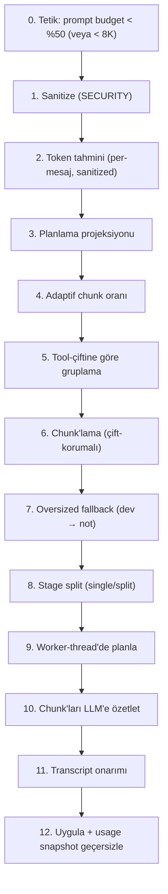

# OpenClaw — Tool-Trace Compaction: Baştan Sona Tam Rehber (Teknik)

> **Not:** Bu, OpenClaw tool-trace belgesinin **teknik / mühendislik** sürümüdür. Aynı içeriğin akılda-kalıcı "dadı" anlatımı için bkz. [openclaw-tool-trace-compaction.md](openclaw-tool-trace-compaction.md).
>
> **Amaç:** OpenClaw'ın tool-trace / context compaction'ını **tek bir örnek trace'i tüm adımlardan geçirerek**, her adımda somut veriyle (öncesi→sonrası) anlatmak. Kaynak: [../harnesses/openclaw/src/agents/](../harnesses/openclaw/src/agents/) — `compaction-planning.ts`, `compaction-planning.worker.ts`, `session-transcript-repair.ts`, `agent-compaction-constants.ts`.

---

## 0. Önce en kritik fark: OpenClaw ≠ Hermes felsefesi

Hermes tool-trace'i **deterministik** budar (LLM'siz: dedup + informatif tek-satır + arg kırpma). **OpenClaw bunu yapmaz.** OpenClaw'ın yaklaşımı:

> **Sanitize et → tool-çiftlerini bozmadan chunk'la → chunk'ları bir LLM'e özetlet.**

Yani OpenClaw'ın tool-trace mantığı esasen bir **LLM-chunk-özetleme** hattıdır. "Tool-trace"e özgü kısımlar şunlar:
1. **Güvenlik şeritlemesi** — tool sonucunun hassas `details`'ı özetleyici modele asla girmez.
2. **Tool-çifti bütünlüğü** — bir `call`/`result` çifti asla farklı chunk'lara bölünmez.
3. **Oversized tool sonucu → not** — özet isteğine sığmayan dev mesaj, içerik yerine bir nota iner.
4. **Transcript onarımı** — yetim (eşi kayıp) tool sonuçları sentetik sonuçla onarılır.

Ve tüm **planlama ayrı bir worker-thread'de** yapılır (ana döngü bloklanmaz).

---

## 1. Sözlük — her terim

| Terim | Anlamı |
|---|---|
| **context window** | Modele gönderilen tüm mesaj yığını için token sınırı. |
| **prompt budget** | Bu pencerede *prompt'a* (mesajlara) ayrılan pay; reserve token'lar düşüldükten sonra kalan. |
| **sanitize** | Özetlemeden önce hassas/model-görünmez içeriği ayıklama (`stripToolResultDetails` + runtime-context). |
| **toolResult.details** | Bir tool sonucunun ham/iç detay alanı (komut çıktısı iç bilgisi). Modele gösterilmez. |
| **runtime-context** | Yalnızca çalışma-zamanına ait, model-görünmez mesajlar (0 token sayılır). |
| **group (atomik grup)** | Bir tool `call` + `result` batch'inin bölünemez birimi. |
| **pendingToolCallIds** | Henüz sonucu gelmemiş tool çağrı id'leri kümesi; grup ancak bu boşalınca kapanır. |
| **chunk** | Bir özet isteğine gidecek mesaj paketi (birden çok atomik grup içerebilir). |
| **chunk ratio** | Bir chunk'ın pencerenin ne kadarını hedefleyeceği (BASE 0.4). |
| **adaptive ratio** | Mesajlar büyükse chunk oranını küçültme (0.4 → 0.15). |
| **oversized** | Tek başına özet isteğine sığmayacak kadar büyük mesaj. |
| **oversizedNote** | Oversized mesajın içeriği yerine konan kısa metin not. |
| **stage split** | Özetlemenin tek chunk mı (single) çok chunk mı (split) yapılacağı kararı. |
| **transcript repair** | Compaction sonrası call/result eşleşmesini geçerli tutma (yetim sonuç → sentetik). |
| **worker thread** | Ana döngüden ayrı iş-parçacığı; planlama burada koşar. |
| **SAFETY_MARGIN** | Token tahmini yanılma payı (1.2 = %20 pay). |

---

## 2. Sabitler (agent-compaction-constants.ts + compaction-planning.ts)

```ts
// Tetik / bütçe
MIN_PROMPT_BUDGET_TOKENS = 8_000    // prompt'a ayrılacak mutlak taban
MIN_PROMPT_BUDGET_RATIO  = 0.5      // pencerenin en az yarısı prompt'a kalmalı

// Chunk'lama
BASE_CHUNK_RATIO = 0.4              // bir chunk pencerenin %40'ını hedefler
MIN_CHUNK_RATIO  = 0.15            // adaptif küçültmenin alt sınırı
SAFETY_MARGIN    = 1.2             // token tahmini yanılma payı
DEFAULT_PARTS    = 2              // stage split varsayılan parça sayısı
SUMMARIZATION_OVERHEAD_TOKENS = 4096   // özet prompt+system+önceki özet+sarmalayıcı payı

// Projeksiyon (compaction-planning-projection.ts)
PLANNING_MAX_CHARS = 256 * 1024    // planlama projeksiyonu toplam bütçe
TEXT_TRUNCATE_THRESHOLD_CHARS = 32_768  // bunun altı tam tutulur
TEXT_SAMPLE_CHARS = 8_192          // büyükse sadece 8KB örnek
```

---

## 3. Mimari — hattın tamamı



---

## 4. Adım adım — TEK örnek trace tüm hattan geçiyor

Aşağıdaki adımların **hepsi aynı örnek trace üzerinde** ilerler; her adımda verinin o anki hâlini (öncesi→sonrası) gösteririm. Başlangıç trace'imiz (context window = **200.000 token**):

```
#0 [system]     "Sen OpenClaw'sın. auth modülünü refactor et."           ~2.000 tok
#1 [user]       "auth modülünü refactor et, login akışını sadeleştir"      ~30 tok
#2 [assistant]  tool_calls: read_file(auth.py)=c1, search_files(login)=c2
#3 [toolResult c1] auth.py'nin tamamı + details:{raw_stdout, cwd, env}   ~40.000 tok
#4 [toolResult c2] "47 eşleşme..." + details:{grep_flags}                 ~8.000 tok
#5 [assistant]  tool_calls: read_file(big_generated.py)=c3
#6 [toolResult c3] 200KB üretilmiş dosya + details                       ~110.000 tok
#7 [assistant]  "Refactor planı: login()'i böl, token'ı httpOnly yap..."  ~40 tok
#8 [runtime]    <runtime-context: iç durum, model-görünmez>              (0 tok sayılır)
```

---

### Adım 0 — Tetik (bütçe-tabanlı)

**Ne:** Compaction, prompt'a yeterli yer kalmayınca tetiklenir.
**Kural:** Pencerenin en az yarısı prompt'a kalamıyorsa (`MIN_PROMPT_BUDGET_RATIO = 0.5`) veya taban `MIN_PROMPT_BUDGET_TOKENS = 8_000` aşılıyorsa.

**Örnekte:**
```
Toplam trace ≈ 2.000+30+40.000+8.000+110.000+40 ≈ 160.070 tok
Boş kalan = 200.000 − 160.070 = 39.930 tok
Gerekli taban = 200.000 × 0.5 = 100.000 tok
39.930 < 100.000  →  ✅ COMPACTION TETİKLENİR
```

---

### Adım 1 — Sanitize (SECURITY, en kritik ön-adım)

**Ne:** Özetlemeden önce hassas + model-görünmez içerik ayıklanır.
`sanitizeCompactionMessages = stripToolResultDetails ∘ stripRuntimeContextCustomMessages`

**Neden:** Compaction metni bir **özet modeline** gider. Tool sonucunun `details`'ı (ham stdout, env, cwd) o modele giderse = hassas veri sızması.

**Örnekte — #3 mesajı:**
```jsonc
// ÖNCE
{ "role":"toolResult", "id":"c1",
  "content":"<auth.py 40K>",
  "details":{ "raw_stdout":"...", "cwd":"/home/user/secret", "env":{"API_KEY":"..."} } }
// SONRA (stripToolResultDetails → delete .details)
{ "role":"toolResult", "id":"c1", "content":"<auth.py 40K>" }
```
Ve **#8 runtime mesajı** tamamen çıkarılır (model-görünmez). `content` gövdeleri kalır; sadece `details` ve runtime girdileri gider.

---

### Adım 2 — Token tahmini (sanitized, per-mesaj, hizalı)

**Ne:** Her mesajın maliyeti ayrı ayrı, sanitized haliyle hesaplanır.
`estimatePerMessageTokens` → diziyle **1:1 hizalı**; model-görünmez mesajlar **0**.

**Örnekte üretilen dizi (index → token):**
```
[#0]=2000  [#1]=30  [#2]=15  [#3]=40000  [#4]=8000  [#5]=8  [#6]=110000  [#7]=40  [#8]=0
```
`#8` runtime olduğu için **0** (modele gitmiyor, baskı yaratmaz). Bu dizi bundan sonraki tüm adımların (chunk, oversized) girdisidir.

---

### Adım 3 — Planlama projeksiyonu

**Ne:** `projectCompactionMessagesForPlanning` — transcript'in **boyut-doğru ama içerik-hafif** bir kopyasını üretir: büyük gövdeler 8KB örneğe iner, atılan karakter sayısı damgalanır.
```ts
if (metin ≤ 32KB && bütçeye sığıyor):  return null       // tam tutulur
else:  sample = ilk 8KB; return { text: sample, omittedChars: toplam − 8KB }
// ağırlık = estimateTokens(sample) + ceil(omittedChars / 4);  toplam bütçe 256KB
```
**Neden:** Planlayıcı/worker, megabaytlarca gövdeyi taşımadan doğru token baskısını görebilmeli.

**Örnekte — #6 (110K):**
```
content → ilk 8.192 karakter örnek
__openclawCompactionPlanningOmittedChars = 101.808
ağırlık ≈ estimateTokens(8KB) + ceil(101.808/4) ≈ 2.048 + 25.452 ≈ 27.500 tok
```
Worker `#6`'yı doğru "büyük" görür ama 110K'lık gövdeyi hiç taşımaz. **Güvenlik detayı:** ölçülemeyen argüman `Number.MAX_SAFE_INTEGER` sayılır — baskıyı asla eksik gösterme, mutlaka oversized'a düşür.

---

### Adım 4 — Adaptif chunk oranı

**Ne:** Bir chunk'ın pencerenin ne kadarını hedefleyeceği, mesaj boyutuna göre ayarlanır.
```ts
avgRatio = (ortalama_mesaj_token × SAFETY_MARGIN) / contextWindow
if avgRatio > 0.10:
    reduction = min(avgRatio × 2, BASE−MIN)
    ratio = max(MIN_CHUNK_RATIO, BASE_CHUNK_RATIO − reduction)   // 0.4→0.15
else:
    ratio = BASE_CHUNK_RATIO                                     // 0.4
```
**Neden:** Mesajlar büyükse büyük chunk özet-modelinin limitini aşar → küçük chunk daha güvenli.

**Örnekte hesap:**
```
ortalama = 160.070 / 8 ≈ 20.009
avgRatio = 20.009 × 1.2 / 200.000 = 0.120   →  > 0.10
reduction = min(0.240, 0.25) = 0.240
ratio = max(0.15, 0.16) = 0.16
→ maxChunkTokens = 0.16 × 200.000 = 32.000 tok
```
Büyük mesajlar yüzünden hedef chunk 80K'dan (0.4) **32K'ya** indi.
**İki rejim:** `avgRatio ≤ 0.10` → 0.40 (tam boy); `> 0.125` → hep 0.15 (taban); arada dar bir geçiş bandı (0.10–0.125).

---

### Adım 5 — Tool-çiftine göre gruplama (bütünlük çekirdeği)

**Ne:** Mesajlar, bir `call`/`result` batch'i **bölünmeyecek** şekilde atomik gruplara ayrılır. Grup ancak `pendingToolCallIds` boşalınca kapanır.

```ts
if role == "assistant":
    toolCalls = (stopReason ∈ {aborted, error}) ? [] : extractToolCallsFromAssistant(message)
    pendingToolCallIds = Set(toolCalls.map(id))
elif role == "toolResult" and pendingToolCallIds.size > 0:
    resultId ? pendingToolCallIds.delete(resultId) : pendingToolCallIds.clear()
if pendingToolCallIds.size == 0:   # ← grup ANCAK burada kapanır
    groups.push(current); current = []
```

**Örnekte pending kümesinin evrimi:**
```
#0 system    → pending={}        → GRUP A kapanır: [#0]
#1 user      → pending={}        → GRUP B kapanır: [#1]
#2 assistant → pending={c1,c2}   → açık (2 çağrı bekliyor)
#3 result c1 → pending={c2}      → HÂLÂ açık
#4 result c2 → pending={}        → GRUP C kapanır: [#2,#3,#4]   ← call+2 result bir arada
#5 assistant → pending={c3}      → açık
#6 result c3 → pending={}        → GRUP D kapanır: [#5,#6]
#7 assistant → pending={} (tool yok) → GRUP E kapanır: [#7]
```
**5 grup:** `A[#0]  B[#1]  C[#2,#3,#4]  D[#5,#6]  E[#7]`.
**İnce detay:** `stopReason` `aborted/error` ise çağrılar `[]` sayılır (sonuç hiç gelmeyecek, sonsuza dek pending kalmasın).

---

### Adım 6 — Chunk'lama (çift-korumalı)

**Ne:** Atomik gruplar `maxChunkTokens`'a (Adım 4: 32K) kadar chunk'lara paketlenir. Grup **asla bölünmez**.
`effectiveMax = maxChunkTokens / SAFETY_MARGIN = 32.000 / 1.2 ≈ 26.667`

**Örnekte paketleme (grup token'ları: A=2000, B=30, C=48.015, D=110.008, E=40):**
```
+ A(2000), + B(30)          → current=[A,B] 2.030
+ C(48.015): 2.030+48.015 > 26.667 → CHUNK 1 = [A,B]; current=[C]
+ D(110.008): > 26.667 → CHUNK 2 = [C]; current=[D]
+ E(40): > 26.667 → CHUNK 3 = [D]; current=[E]
son → CHUNK 4 = [E]
```
**4 chunk:** `[A,B]  [C]  [D]  [E]`. `C` (48K) ve `D` (110K) tek başlarına eşiği aşıyor ama **grup bölünemediği için** tek chunk kaldılar — sonraki adımın (oversized) konusu.

---

### Adım 7 — Oversized fallback (tek mesaj devse → not)

**Ne:** Bir **tek mesaj** özet isteğine sığmayacak kadar büyükse (`contextWindow × 0.5`), içeriği yerine bir **not** konur.
```ts
oversizedThreshold = 200.000 × 0.5 = 100.000
if tokens × SAFETY_MARGIN > oversizedThreshold:
    oversizedNotes.push(`[Large ${role} (~${tokens/1000}K tokens) omitted from summary]`)
```

**Örnekte — #6 (110K):**
```
#6: 110.000 × 1.2 = 132.000 > 100.000  →  OVERSIZED
oversizedNote = "[Large toolResult (~110K tokens) omitted from summary]"
omitToolBatch = true  →  #5 (o batch'in çağrısı) da düşer
```
`#3` (40K): `40.000 × 1.2 = 48.000 < 100.000` → oversized değil, normal özetlenir.
**İnce detay:** Bir tool batch oversized diye atlanırsa kalan `assistant`/`toolResult` parçaları da düşer — ama araya sıkışmış **gerçek user mesajı** hayatta kalır.

---

### Adım 8 — Stage split (tek mi, çok mu chunk özetlensin)

**Ne:** Özetlenecek mesajlar tek seferde mi (`single`) yoksa parçalara bölünerek mi (`split`).
```ts
minMessagesForSplit = 4
if parts<=1 or messages.length<4 or totalTokens<=maxChunkTokens:  return {mode:"single"}
else:  return {mode:"split", chunks: splitMessagesByTokenShare(messages, parts)}
```
**Örnekte:** Özetlenecek normal içerik grup C (`[#2,#3,#4]`, 3 mesaj) — oversized D çıkarıldı.
```
messages.length = 3 (< 4)  →  mode: "single"
```
→ Grup C tek özet isteğinde özetlenir. (6-7 büyük mesaj kalsaydı → `split`: `DEFAULT_PARTS=2` ile iki eşit token-payı, yine çift bölmeden.)

---

### Adım 9 — Worker-thread'de planla

**Ne:** 4-8. adımların hesabı ana döngüde değil, `compaction-planning.worker.ts` içinde **ayrı iş-parçacığında** yapılır.
**Neden:** Büyük transcript'te token tahmini + gruplama + chunk'lama CPU-yoğun; ana döngüde yapılsa ajan donar.
**Örnekte:** Ana thread worker'a `{kind:"stageSplit", ...}` / `{kind:"oversizedFallback", ...}` yollar; worker planı döndürür; bu sırada ajan başka iş yapabilir.

---

### Adım 10 — Chunk'ları LLM'e özetlet

**Ne:** Hazır (sanitized, çift-korumalı) chunk bir **özet modeline** verilir; `SUMMARIZATION_OVERHEAD_TOKENS = 4096` prompt/system/önceki-özet payı.
**Örnekte — grup C özetlenir:**
```
Girdi: read_file(auth.py) + <auth.py 40K> + search_files(login) + "47 eşleşme"
Çıktı: "auth.py okundu (login/logout/token akışı). 'login' için 47 eşleşme;
        token httpOnly cookie'de; login() 45. satırda çift-doğrulama." (~250 tok)
```

---

### Adım 11 — Transcript onarımı

**Ne:** Compaction sonrası **eşi kayıp** (yetim) call/result çiftleri onarılır.
`repairToolUseResultPairing` eksik sonuç için **sentetik hata sonucu** ekler:
> *"[openclaw] missing tool result in session history; inserted synthetic error result for transcript repair."*
`sanitizeToolCallInputs` bozuk çağrı girdilerini düzeltir. **Neden:** Sağlayıcı geçerli call↔result eşleşmesi ister; yoksa replay 400 döner.

---

### Adım 12 — Uygula + usage snapshot geçersizle

**Ne:** Yeni transcript oturuma yazılır. `stripStaleAssistantUsageBeforeLatestCompaction` — compaction öncesi assistant **usage snapshot'larını sıfırlar** (`makeZeroUsageSnapshot`), çünkü o token sayıları artık geçersiz.

**Örnekte SONRA (final transcript):**
```
#0 [system]     "Sen OpenClaw'sın..."                                    ~2.000 tok
#1 [user]       "auth modülünü refactor et..."                            ~30 tok
#2 [summary]    "auth.py okundu... 47 eşleşme... login() 45. satır..."    ~250 tok   ← grup C özeti
#3 [note]       "[Large toolResult (~110K tokens) omitted from summary]"  ~15 tok    ← grup D
#4 [assistant]  "Refactor planı: login()'i böl, token httpOnly..."        ~40 tok   ← TAIL korundu
```
```
160.070 → ~2.335 token   (%98 kazanç)
tüm call/result eşleşmeleri geçerli · user sözü korundu · hassas details sızmadı
```

---

## 5. Tüm hattın özeti (tek bakış)

| Adım | Girdi | İşlem | Örnekteki sonuç |
|---|---|---|---|
| 0 Tetik | 160K/200K | boş < %50? | 39.9K < 100K → tetik |
| 1 Sanitize | ham mesajlar | `.details` + runtime sil | #3 details silindi, #8 çıktı |
| 2 Estimate | sanitized | per-mesaj token | `[2000,30,15,40000,8000,8,110000,40,0]` |
| 3 Project | mesajlar | 8KB örnek + omittedChars | #6 → 8KB + "atılan 101.808" |
| 4 Adaptif | ort. mesaj | oran 0.4→? | avgRatio 0.12 → ratio 0.16 → 32K |
| 5 Grupla | mesajlar | çifti bozma | 5 grup: A B C[#2-4] D[#5-6] E |
| 6 Chunk | gruplar | ≤32K paketle | 4 chunk: [A,B][C][D][E] |
| 7 Oversized | chunk'lar | dev → not | #6 → "~110K omitted", #5 düşer |
| 8 Stage split | kalan | single/split | 3 mesaj < 4 → single |
| 9 Worker | plan isteği | ayrı thread | ana döngü bloklanmaz |
| 10 LLM özet | grup C | özetlet | "auth.py... 47 eşleşme..." |
| 11 Onar | sonuç | yetim → sentetik | eşleşme geçerli |
| 12 Uygula | yeni transcript | yaz + usage sıfırla | 160K → 2.3K (%98) |

---

## 6. Hermes ile fark (iki "asistan" ajanı)

| Eksen | **Hermes** | **OpenClaw** |
|---|---|---|
| Ana yöntem | **deterministik** 3-pass (dedup + informatif satır + arg kırpma) | **LLM-chunk özetleme** (grupla → chunk → özetlet) |
| Tool sonucu | tip-farkında tek satıra iner (LLM'siz) | detay şeritlenir, chunk'lanır, **modele özetletilir** |
| Çift bütünlüğü | mesaj silinmez, id korunur | **grup bölme yasağı** (pending boşalınca kapat) |
| Dev tek mesaj | informatif özet | **oversizedNote** ("~NK omitted") |
| Güvenlik | özet sınırı redaksiyonu (#14665) | **toolResult.details şeritleme** (özetleyiciye sızmasın) |
| Nerede koşar | ana + kilitli | **ayrı worker-thread** |
| Onarım | — | **sentetik sonuç** (yetim call/result) |
| Maliyet | ucuz (çoğu LLM'siz) | LLM özeti gerekir (pahalı ama esnek) |

**Tek cümle:** Hermes "tool sonucunu deterministik kurallarla küçült"; OpenClaw "tool-çiftlerini güvenle grupla, modele özetlet".

---

## 7. POC eşlemesi — bizim iş nerede

| Bizim POC (`poc/`) | OpenClaw karşılığı |
|---|---|
| `tool_call_id` bütünlüğü (API 400) | **grup bölme yasağı** (`pendingToolCallIds`) |
| Fayda-freni | oversized eşiği (contextWindow×0.5) |
| Referansa indirme | **oversizedNote** ("~NK omitted") |
| `fate` işaretleme | — (OpenClaw yeniden-yazmaz, chunk'lar) |
| — (bizde yok) | **worker-thread planlama** · **güvenlik-şeritleme** · **transcript onarımı** · **adaptif chunk oranı** |

**Not:** OpenClaw, bizim POC'un "tek tool-mesajı yeniden yazma" modelinden farklı bir okuldadır — o **chunk-özetleme** okulu (Codex-history ve Claude Code'a yakın). Bizim POC ise Hermes/OpenCode okuluna (deterministik per-tool) daha yakın. En net ayrım: *tool sonucunu yerinde mi küçültüyorsun (deterministik), yoksa bir modele mi özetletiyorsun (chunk)?*

---

## Kaynaklar
- [../harnesses/openclaw/src/agents/compaction-planning.ts](../harnesses/openclaw/src/agents/compaction-planning.ts) — `groupCompactionMessages` · `chunkCompactionMessageGroups` · `computeAdaptiveChunkRatio` · `buildSummaryChunks` · `buildOversizedFallbackPlan` · `buildStageSplitPlan` · `sanitizeCompactionMessages` · `estimatePerMessageTokens`
- `compaction-planning-projection.ts` — `projectCompactionPlanningMessages` (8KB örnek + omittedChars, 256KB bütçe)
- `compaction-planning.worker.ts` — worker-thread giriş noktası
- `session-transcript-repair.ts` — `stripToolResultDetails` · `repairToolUseResultPairing` · `sanitizeToolCallInputs`
- `agent-compaction-constants.ts` — `MIN_PROMPT_BUDGET_TOKENS/RATIO`
- `embedded-agent-subscribe.handlers.compaction.ts` — `handleCompactionStart/End`
- `compaction-usage.ts` — `stripStaleAssistantUsageBeforeLatestCompaction`
- Akılda-kalıcı "dadı" sürümü: [openclaw-tool-trace-compaction.md](openclaw-tool-trace-compaction.md)
- Eş belgeler: [hermes-tool-trace-compaction.md](hermes-tool-trace-compaction.md) · [opencode-tool-trace-compaction.md](opencode-tool-trace-compaction.md) · [codex-tool-trace-compaction.md](codex-tool-trace-compaction.md)
