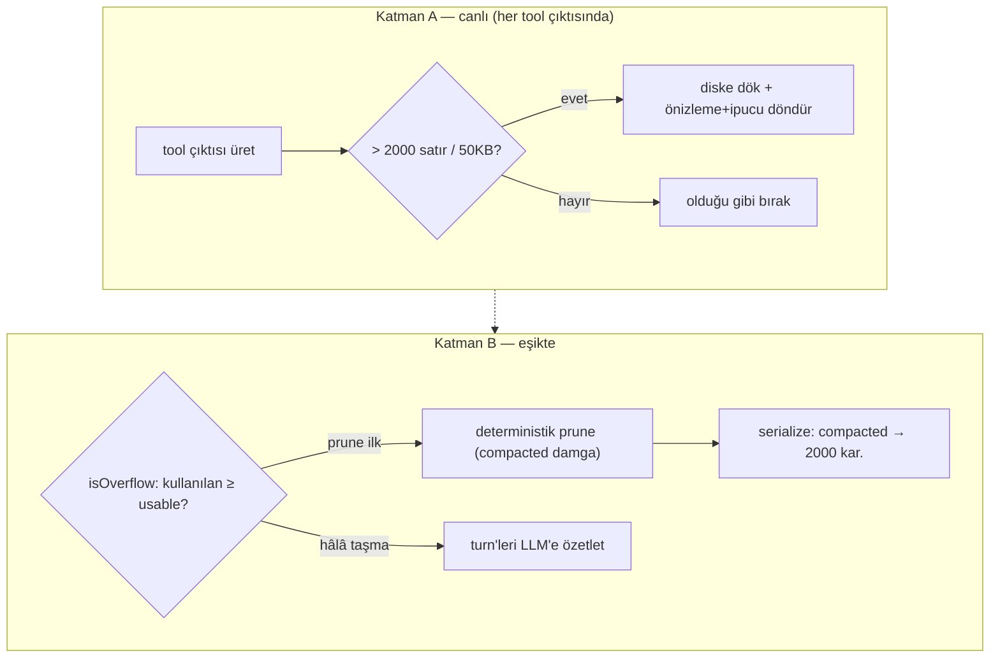

# OpenCode — Tool-Trace Compaction: Baştan Sona Tam Rehber

> **Amaç:** OpenCode'un tool-trace / context compaction'ını **tek bir örnek trace'i tüm adımlardan geçirerek**, her adımda somut veriyle (öncesi→sonrası) anlatmak — [OpenClaw](openclaw-tool-trace-compaction.md) ve [Hermes](hermes-tool-trace-compaction.md) belgeleriyle aynı derinlikte. Kaynak: [../harnesses/opencode/packages/opencode/src/](../harnesses/opencode/packages/opencode/src/) — `tool/truncate.ts`, `session/compaction.ts`, `session/overflow.ts`.

---

## 0. Kimlik / felsefe — iki bağımsız katman (POC'umuza en yakın)

OpenCode iki ayrı mekanizma kullanır:

- **Katman A — canlı tool-output spill (üretim anında):** Bir tool çıktısı üretilir üretilmez, çok büyükse **diske yazılır**, context'e sadece önizleme + "kayıtlı dosyaya bak" ipucu girer.
- **Katman B — deterministik prune + overflow LLM özeti (eşikte):** Context dolunca, eski tool çıktıları önce **deterministik işaretlenip** kısaltılır (LLM'siz); yetmezse turn'ler **LLM'e özetletilir**.

Sabitleri bizim POC'a şaşırtıcı yakın: `DEFAULT_TAIL_TURNS=2` (=bizim `RECENT=2`), `PRUNE_PROTECTED_TOOLS=["skill"]` (=korunan tool), `compacted` timestamp (=bizim `fate`).

---

## 1. Sözlük

| Terim | Anlamı |
|---|---|
| **part** | Bir mesajın içindeki birim (metin, tool çağrısı, tool sonucu). OpenCode mesajları `parts[]` taşır. |
| **tool part** | `type:"tool"` bir part; `state.status`, `state.output`, `state.time.compacted` alanları var. |
| **spill (dökme)** | Büyük tool çıktısını diske yazıp context'te referans/önizleme bırakma. |
| **truncation-dir** | Dökülen tam çıktının saklandığı disk klasörü (7 gün). |
| **prune** | Deterministik tool-output işaretleme (`compacted` damgası) + serialize'da kısaltma. |
| **compacted (damga)** | `part.state.time.compacted` — bu tool çıktısının sıkıştırıldığını işaretleyen zaman damgası (bizim `fate`). |
| **turn** | Bir `user` mesajıyla başlayan konuşma bloğu. |
| **usable** | Pencerede prompt'a ayrılan kullanılabilir token (reserve düşülmüş). |
| **overflow** | Kullanılan token `usable`'ı aşınca oluşan taşma → LLM özeti tetiklenir. |
| **preserve recent budget** | LLM özetinde korunan son-pencere token bütçesi. |

---

## 2. Sabitler

```ts
// Katman A — tool/truncate.ts
MAX_LINES = 2000            // tool çıktısı bu satırı aşarsa dök
MAX_BYTES = 50 * 1024       // ya da bu baytı (50KB)
RETENTION = 7 gün           // dökülen dosya saklama süresi
direction = "head" | "tail" // önizlemede baş mı son mu tutulsun

// Katman B — session/compaction.ts
PRUNE_MINIMUM = 20_000       // budama en az bu kadar kazanmıyorsa commit etme (fayda-freni)
PRUNE_PROTECT = 40_000       // en yeni bu kadar tool çıktısı korunur
TOOL_OUTPUT_MAX_CHARS = 2_000  // compacted çıktı serialize'da bu kadara iner
PRUNE_PROTECTED_TOOLS = ["skill"]  // asla budanmayan tool
DEFAULT_TAIL_TURNS = 2       // son 2 turn dokunulmaz
MIN/MAX_PRESERVE_RECENT_TOKENS = 2_000 / 8_000

// overflow.ts
COMPACTION_BUFFER = 20_000   // reserve token (çıktı için ayrılan)
```

---

## 3. Mimari



---

## 4. Tek örnek trace, tüm adımlardan

Başlangıç (model context = **200.000 token**):
```
#0 [system]     "Sen OpenCode'sun..."                                    ~2.000 tok
#1 [user]       "auth modülünü refactor et"                               ~30 tok
#2 [assistant]  part: tool bash("pytest auth/")
#3 [assistant]  part: tool(bash) state.output = 2.500 satırlık test çıktısı  (üretim anı)
#4 [user]       "şimdi login()'i sadeleştir"
#5 [assistant]  part: tool read_file(auth/login.py)
#6 [assistant]  part: tool(read) state.output = auth.py 40K
#7 [assistant]  part: tool skill_view(github)
#8 [assistant]  part: tool(skill) state.output = 6K skill talimatı
#9 [assistant]  "login()'i böldüm, token httpOnly yaptım."
```

---

### Adım 1 — (Katman A) Tool çıktısı üretilince canlı kontrol

**Ne:** `#3`'ün 2.500 satırlık `pytest` çıktısı üretilir üretilmez `truncate.ts` devreye girer.
```ts
if (satır > MAX_LINES(2000) || bayt > MAX_BYTES(50KB)):  → dök
```
**Örnekte:** 2.500 satır > 2.000 → **dökülür**.

### Adım 2 — (Katman A) Diske dök, önizleme+ipucu döndür

**Ne:** Tam metin `truncation-dir`'e yazılır; context'e önizleme + "kayıtlı dosyaya bak" ipucu girer.
```jsonc
// #3 state.output — ÖNCE (2.500 satır)
"........ 2500 satır test çıktısı ........"
// SONRA (context'e giren)
{ content: "<ilk ~2000 satır önizleme>\n...\n[Truncated. Full output: .opencode/truncation/abc123.txt]",
  truncated: true, outputPath: ".opencode/truncation/abc123.txt" }
```
`direction:"tail"` verilseydi son satırlar tutulurdu (exit satırı için). Dosya 7 gün saklanır. → Bu = **spill-to-disk**: dev çıktı context'e hiç tam girmez.

### Adım 3 — (Katman B) Overflow tetiği

**Ne:** Konuşma büyüdükçe her turn `isOverflow` kontrol edilir:
```ts
usable = model.limit.input − reserved      // reserved = min(20K, maxOutput)
isOverflow = kullanılan_token ≥ usable
```
**Örnekte:**
```
usable = 200.000 − 20.000 = 180.000
Kullanılan (spill sonrası bile auth.py 40K + skill 6K + ...) = 185.000 ≥ 180.000  →  ✅ OVERFLOW
```

### Adım 4 — (Katman B) Deterministik prune: geriye yürü

**Ne:** `cfg.compaction.prune` açıksa, önce **LLM'siz** budama denenir. Mesajlar **sondan başa** taranır:
```ts
turns = 0
loop: for msgIndex = son → 0:
    if role=="user": turns++
    if turns < 2: continue                       // DEFAULT_TAIL_TURNS: son 2 turn dokunma
    if assistant && summary: break               // önceki compaction sınırında dur
    for part in parts (sondan):
        if part.type != "tool" or status != "completed": continue
        if part.tool ∈ PRUNE_PROTECTED_TOOLS(["skill"]): continue   // skill'i koru
        if part.state.time.compacted: break       // zaten sıkışmış → dur
        estimate = Token.estimate(part.state.output)
        total += estimate
        if total <= PRUNE_PROTECT(40K): continue  // en yeni 40K tool çıktısını KORU
        pruned += estimate
        toPrune.push(part)
```
**Örnekte yürüyüş (sondan):**
```
#9 assistant metin (tool yok)              → atla
#8 skill_view çıktısı → PRUNE_PROTECTED → ATLA (skill korunur)
#7 (skill call)
#6 read auth.py (40K): turns<2? #4 user'dan beri 0 user geçti... 
   turns sayımı: #4 user'a gelene dek turns=0 → #6,#7,#8,#9 son turn (turns<2) → DOKUNMA
#4 user → turns=1 (hâlâ <2, koru)
#3 bash çıktısı (spill sonrası önizleme, ~2K): turns=1<2 → koru
#1 user → turns=2 → artık budanabilir
   ama #1'den öncesi sadece system → budanacak büyük tool yok
```
Bu örnekte son-2-turn koruması + 40K koruması çoğunu koruyor. **Daha eski, büyük bir tool çıktısı olsaydı** (turns≥2 bölgesinde, 40K'yı aşan) → `toPrune`'a girerdi.

### Adım 5 — (Katman B) Fayda-freni: sadece kazanç > 20K ise commit et

**Ne:**
```ts
if (pruned > PRUNE_MINIMUM(20_000)):
    for part in toPrune: part.state.time.compacted = Date.now(); updatePart(part)
```
**Neden:** Küçük bir budama (< 20K) uğraşmaya değmez. Ancak toplam prune > 20K ise işaretleme **commit** edilir.
**Örnekte:** Diyelim eski bölgede 55K'lık budanabilir tool çıktısı bulundu → `55K > 20K` → hepsine `compacted` damgası basılır.

### Adım 6 — (Katman B) Serialize: compacted çıktı kısalır

**Ne:** `compacted` damgalı tool çıktıları modele gönderilirken `TOOL_OUTPUT_MAX_CHARS = 2_000`'e iner.
```jsonc
// damgalı bir tool part — modele giden hâli
{ tool:"read_file", state:{ output:"<ilk 2000 karakter>...[compacted]" } }
```
Damga bir **"fate" bayrağıdır** (bizim `fate` alanının muadili): part silinmez, sadece serialize'da kısalır. Böylece `tool_call`↔`tool_result` eşleşmesi bozulmaz.

### Adım 7 — (Katman B) Hâlâ taşıyorsa: LLM özeti (processCompaction)

**Ne:** Prune yetmediyse turn'ler LLM'e özetletilir.
- **`turns()`** — mesajları turn'lere böl (her user bir turn başlatır; `compaction` part'lı user'lar atlanır).
- **`completedCompactions()`** — zaten özetlenmiş turn'leri izle (user'da `compaction` part'ı + assistant'ta `summary`).
- **`preserveRecentBudget = min(8K, max(2K, usable×0.25))`** — son pencere korunur.
- **`splitTurn`** — bir turn hâlâ bütçeyi aşıyorsa içinde bölme noktası bulunur.
- `summary.ts` + `compaction.txt` prompt'uyla özetlenir.

**Örnekte:**
```
preserveRecentBudget = min(8000, max(2000, 180000×0.25=45000)) = 8000
→ son 8K token'lık turn'ler korunur, öncekiler özete iner:
[summary] "auth.py okundu, pytest çalıştı (bkz .opencode/truncation/abc123.txt),
           login() sadeleştirildi, token httpOnly yapıldı."
```

### Adım 8 — Medya taşması (özel durum)

**Ne:** Prompt sağlayıcının boyut limitini medya (ek dosya/görsel) yüzünden aşarsa: sıkıştırılır + **medya kaldırılır** ve modele açıklama enjekte edilir:
> *"The previous request exceeded the provider's size limit due to large media attachments... media files were removed... suggest they try again with smaller or fewer files."*

---

## 5. Tüm hattın özeti (tek bakış)

| Adım | Katman | İşlem | Örnekteki sonuç |
|---|---|---|---|
| 1 | A | çıktı > 2000 satır? | #3 pytest 2.500 satır → dök |
| 2 | A | diske dök + önizleme | `.opencode/truncation/abc123.txt` + preview |
| 3 | B | isOverflow? | 185K ≥ 180K → taşma |
| 4 | B | deterministik prune walk | son-2-turn + 40K korundu |
| 5 | B | fayda-freni (>20K) | 55K bulundu → `compacted` damgası |
| 6 | B | serialize kısaltma | damgalılar → 2.000 kar. |
| 7 | B | yetmezse LLM özeti | preserveRecent=8K, öncesi özete |
| 8 | B | medya taşması | medya kaldır + açıkla |

---

## 6. Hermes / OpenClaw ile fark

| Eksen | Hermes | OpenClaw | **OpenCode** |
|---|---|---|---|
| Tool çıktısı | informatif 1-satır (LLM'siz) | detay şeritle + chunk | **diske dök (spill) + `compacted` damga** |
| Ana yöntem | deterministik 3-pass | LLM-chunk özetleme | **deterministik prune + gerekirse LLM** |
| Fayda-freni | #60451 | oversized eşiği | **`PRUNE_MINIMUM=20K`** |
| Son koruma | floor-8 + token-tail | budget %50 | **`DEFAULT_TAIL_TURNS=2` + 40K** |
| Korunan tool | head | — | **`["skill"]`** |
| Damga/işaret | içerik yeniden yazma | — | **`state.time.compacted` (fate)** |

**Öz:** OpenCode = Hermes'in deterministik ruhu + benzersiz **spill-to-disk** + turn-tabanlı LLM özeti. Bizim POC'a en yakın akraba.

---

## 7. POC eşlemesi

| Bizim POC (`poc/`) | OpenCode karşılığı |
|---|---|
| `RECENT=2` | **`DEFAULT_TAIL_TURNS=2`** (birebir) |
| `fate` işaretleme | **`part.state.time.compacted`** damgası |
| korunan tool | **`PRUNE_PROTECTED_TOOLS=["skill"]`** |
| fayda-freni | **`PRUNE_MINIMUM=20_000`** |
| `tool_call_id` bütünlüğü | part silinmez, serialize'da kısalır |
| referansa indirme | **spill-to-disk** (`truncation-dir` + outputPath) |
| — (bizde yok) | canlı üretim-anı dökme · overflow LLM özeti · medya kaldırma |

---

## Kaynaklar
- [../harnesses/opencode/packages/opencode/src/tool/truncate.ts](../harnesses/opencode/packages/opencode/src/tool/truncate.ts) — `MAX_LINES` · `MAX_BYTES` · spill · `RETENTION`
- `session/compaction.ts` — prune walk · `PRUNE_MINIMUM/PROTECT` · `TOOL_OUTPUT_MAX_CHARS` · `PRUNE_PROTECTED_TOOLS` · `DEFAULT_TAIL_TURNS` · `turns/completedCompactions/preserveRecentBudget/splitTurn`
- `session/overflow.ts` — `usable` · `isOverflow` · `COMPACTION_BUFFER`
- Eş belgeler: [hermes-tool-trace-compaction.md](hermes-tool-trace-compaction.md) · [openclaw-tool-trace-compaction.md](openclaw-tool-trace-compaction.md) · [poc/](../poc/)
