# Task Management — Sunum Metni + Ultra-Açıklayıcı Flowchart Rehberi

> Bu belge iki şey verir: **(1)** kürsüde ne diyeceğin (slayt-slayt konuşma metni), **(2)** her mekanizmayı **mermaid flowchart**'larla ve **her terimi kısa açıklamayla** anlatan, task management üzerine olabildiğince açıklayıcı bir rehber.
> Diagramlar ```mermaid``` bloklarıdır; GitHub/artifact/mermaid-destekli görüntüleyicilerde çizim olarak render olur.

---

# BÖLÜM A — Sunumda ne diyeyim? (slayt-slayt konuşma metni)

Her slaytta: **söyleyeceğin ana cümle** + **destekleyici 2–3 madde**. Toplam ~12–15 dk.

### Slayt 1 — Amaç
> "Amacımız: agent/workflow task'larının **oluşturulması, kuyruğa alınması, planlanması, çalıştırılması, retry'ı, durum takibi ve hata sonrası devamı** için hangi altyapıyı seçeceğimize karar vermek."
- Adaylar: **Airflow, Celery, Temporal, mevcut engine (brain_chat_V2)**.
- Eksenler: task yönetimi · retry/recovery · state · scheduling · concurrency · operasyonel karmaşıklık.

### Slayt 2 — Önce kelimeyi netleştirelim: "task" ne demek?
> "Kararı tartışmadan önce bir tuzağı temizleyeyim: 'task' kelimesi her araçta **farklı bir şeyi** kastediyor."
- **A = İŞ/JOB** (bütün hedef, ör. "auth refactor") — koçun kastettiği bu.
- **B = ADIM** (tek tool çağrısı, ör. `read_file`).
- Airflow/Celery "task" derken **B**'yi; Temporal/agent-engine **A**'yı kasteder. **Scorecard'ı A'ya göre normalize ettim.**

### Slayt 3 — Bir task'ın hayatı
> "Her task şu döngüden geçer: oluştur → kuyruk → planla → çalış → (hata olursa) retry → (çökerse) kurtar → bitti."
- Asıl zor kısım **sonda**: worker çökerse iş kaybolmasın, **kaldığı yerden devam etsin**.

### Slayt 4 — İki retry'ı karıştırmayın
> "Retry iki farklı şey demek olabiliyor; bunu ayırmak kararın yarısı."
- **(a) API-retry:** 429/5xx için backoff — hafif, hepsinde var.
- **(b) Task-retry:** worker çöktü, iş baştan/kaldığı yerden sürsün — **asıl zor olan**, koçun sorduğu.

### Slayt 5 — Airflow
> "Airflow zamanlı veri-pipeline'larının kralı; ama ajan için iki sınırı var."
- Güçlü: cron/scheduling, DAG bağımlılık, zengin UI.
- Sınır: retry adımı **baştan** koşar; iş **statik DAG** olmak zorunda (dinamik ajan döngüsüne uymaz).

### Slayt 6 — Celery
> "Celery = dağıtık task kuyruğu; hızlı ölçek verir ama workflow zekâsını sana bırakır."
- Güçlü: native worker havuzu, yatay ölçek, basit retry.
- Sınır: **at-least-once** (idempotency sende), çok-adımlı iş kavramı yok (Canvas ile sen kurarsın), "nerede kaldım" defterini sen tutarsın.

### Slayt 7 — Temporal
> "Temporal, ajan işleri için en güçlü dayanıklılık modeli: kod çöker, iş çökmez."
- Güçlü: **kaldığı yerden** devam (event-history replay), exactly-once activity, insan/olay için günlerce dayanıklı bekleme.
- Bedel: cluster/Cloud operasyonu + **determinizm disiplini** (LLM adımını activity'e sar).

### Slayt 8 — Mevcut agent engine'ler bunu nasıl yapıyor? (saha kanıtı)
> "Bunu havada tartışmadım; yedi bilinen ajanın kaynak kodunu söktüm."
- **Hermes/OpenClaw** → SQLite üstünde kendi durable çekirdeği.
- **Codex** → managed backend'e delege.
- **Shannon** → **doğrudan Temporal üstünde** (canlı açık-kaynak kanıt).
- **Wren/OpenCode/Claude Code** → in-process/checkpoint (hızlı ama tek başına durable değil).

### Slayt 9 — Asıl mesaj: crash-recovery farkı
> "Fark, worker işin ortasında çökünce ortaya çıkıyor."
- **Temporal/Hermes:** iş nerede kaldığını **sistem biliyor**, otomatik devam. (yerleşik)
- **Airflow:** sadece statik DAG düğümleri arası. **Celery:** o defteri **sen** yazarsın.

### Slayt 10 — Statik vs dinamik
> "Ajan işi statik değil: sıradaki adıma model **çalışma anında** karar verir."
- Airflow statik-DAG bekler → uymaz. Temporal (kod) ve agent-engine'ler dinamik + durable'ı birlikte verir.

### Slayt 11 — Karar + öneri
> "Tek kazanan yok; işin süresine ve exactly-once ihtiyacına bağlı."
- Uzun/insan-bekleyen/exactly-once → **Temporal**.
- Batch/zamanlı/UI → **Airflow**. Sadece kuyruk → **Celery**.
- Mevcut engine + dayanıklılık → **build (Hermes-tarzı SQLite)** ya da **buy (Temporal — Shannon gibi)**.

### Slayt 12 — Kapanış cümlesi
> "Önerim: brain_chat_V2 zaten state yönetiyor; en düşük riskli yol ya Celery ile kuyruğu devretmek, ya da Hermes-tarzı hafif bir durable çekirdek gömmek. Temporal'a ancak çok-makineli/uzun-bekleyen ihtiyaç netleşince geçelim."

---

# BÖLÜM B — Ultra-açıklayıcı rehber (flowchart'larla)

## 1. "Task" nedir? Üç katman

**Task (görev):** bir sistemin çalıştırması gereken iş birimi. Ama üç ölçekte olabilir:

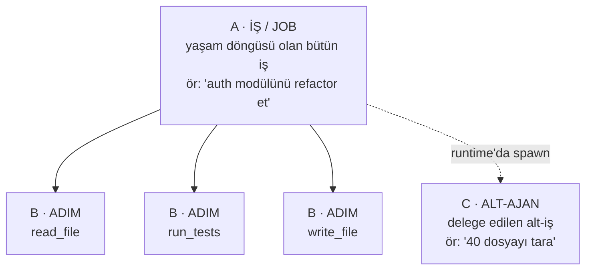

- **A = İŞ/JOB:** koçun "task"ı. Airflow'da *DAG-run*, Temporal'da *Workflow*, Hermes'te *Kanban kartı*.
- **B = ADIM:** tek tool çağrısı / LLM turu. Airflow'da *task düğümü*, Temporal'da *Activity*, Celery'de *task*.
- **C = ALT-AJAN:** A'nın bir parçası için açılan alt-iş (Hermes `delegate_task`, `Task` tool).
- **Tuzak:** Airflow/Celery "task" = B; Temporal/agent-engine "task" = A. **Aynı kelime, farklı katman.**

---

## 1.1 Task nasıl yaratılır — şemayı çatı koyar, değeri model doldurur

Burada iki katman var, karışan tam bu:
- **Task'ın YAPISI (hangi alanlar var)** → **çatı (Hermes/OpenClaw) kodda sabit tanımlar.** Model yeni alan icat edemez.
- **Bir task'ın DEĞERLERİ (title/body/assignee/parents/mode)** → **çalışma anında doldurulur, çoğu zaman model bir tool çağırıp parametrelerini doldurarak** (ama insan/gateway/cron da yaratabilir).

Yani "ajan task'ı kendi mi belirliyor?" → **Şemayı hayır (çatı), içeriği çoğunlukla evet (model, runtime'da).** Bu, *"model şema yazmaz, tool parametrelerini doldurur"* ilkesinin task'a uygulanmış hâli.

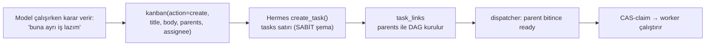

| Ne | Kim belirler | Ne zaman |
|---|---|---|
| Task'ın alanları (şema) | **Hermes/OpenClaw kodu** (sabit) | Kod yazılırken |
| Bir task'ın değerleri (title/body/assignee/mode) | **Çoğunlukla model** (tool args); ya da insan/gateway/cron | **Çalışma anında** |
| Bağımlılık grafiği (DAG) | **Model** (`parents=[...]`) veya hazır şablon (`create_swarm`) | Çalışma anında |
| Yürütme (claim/lease/retry/recovery) | **Çatının kendisi** (dispatcher + SQLite kernel) | Otomatik |

- **Hermes** — şema = `create_task()` alanları (`title, body, assignee, parents, priority, skills, model_override, max_retries, session_id, idempotency_key …`); model bunları `kanban(action="create", …)` tool'uyla doldurur, `parents` ile grafiği runtime'da büyütür.
- **OpenClaw** — şema = spawn enum'ları (`mode: run|session`, `context: isolated|fork`, `sandbox: inherit|require`); model spawn tool'unda bunlardan **seçer** + prompt yazar. Kalıcılık SQLite subagent-registry.

---

## 1.2 Gerçek task örnekleri — hangi ajan ne task'ı yaratıyor

Ortak kural: **task içeriğinin özü = modelin/kullanıcının yazdığı doğal-dil hedef** (`title/body/prompt/question`); çevresi çatının sabit metadata'sı.

**Hermes** — kodlama/iş hedefi (Kanban kartı = `tasks` satırı). Senaryo: *"auth modülünü refactor et."*
```json
{
  "id": "t_a6acd07d",
  "title": "auth modülünü refactor et",
  "body": "login() fonksiyonunu parçalara böl, token'ı httpOnly yap, pytest testlerini güncelle. Kabul: tüm testler geçmeli.",
  "assignee": "coder",
  "status": "ready",
  "priority": 5,
  "parents": [],
  "skills": ["software-development"],
  "max_retries": 2,
  "idempotency_key": "auth-refactor-2026-08",
  "session_id": "chat_9f2",
  "created_by": "gateway:telegram"
}
```
Model çalışırken kendi alt-task'ını doğurur (dinamik graf):
```python
kanban(action="create",
       title="login() birim testlerini yaz",
       body="auth/login.py için pytest; edge case: süresi dolmuş token, eksik header.",
       parents=["t_a6acd07d"],      # bağımlılık burada kurulur
       assignee="tester", skills=["software-development"])
```
Swarm (hazır topoloji, içerik runtime'da dolar):
```
root:      "Swarm: ödeme akışını denetle"            (hemen done + blackboard)
 ├ worker1 "Frontend ödeme formunu incele"           assignee=frontend
 ├ worker2 "Backend ödeme API'sini incele"           assignee=backend
 verifier  "Worker çıktılarını doğrula"   parents=[worker1,worker2]
 synth     "Bulguları tek rapora sentezle" parents=[verifier]
```

**OpenClaw** — kişisel-asistan işi (subagent spawn / cron). Senaryo: *"şu PDF faturayı özetle."*
```
spawn_subagent(
  agent="research", mode="run", context="isolated", sandbox="inherit",
  prompt="fatura.pdf'i oku; toplam tutar, KDV, son ödeme tarihini çıkar; 3 cümle özet.")
```
Cron örneği: *"her sabah 8'de hava durumunu at"* → içerik "İstanbul hava durumunu çek ve gönder", tetik `0 8 * * *`.

**Codex** — buluta delege kodlama işi.
```json
{
  "task_id": "task_01H9...",
  "prompt": "Fix the failing test in src/auth/login.test.ts; make login() reject expired tokens.",
  "environment": "repo:myorg/webapp@main",
  "status": "Pending",                    // → Ready → Applied
  "attempts": [{ "status": "Completed", "diff": "--- a/src/auth/login.ts ..." }]
}
```

**OpenCode / Claude Code** — süreç-içi subagent (kalıcı kayıt değil):
```
# OpenCode
task(subagent_type="explore", description="login akışını bul",
     prompt="40 dosyayı tara; auth kontrolü hangi dosyada, file:line ver.", background=true)

# Claude Code
Task(subagent_type="Explore", description="Find login flow",
     prompt="Search the codebase for the login flow; report file:line.")
```

**Wren** — veri sorusu (kalıcı iş kaydı yok):
```
{ question: "Geçen çeyrekte en çok satan 5 ürün, bölgeye göre kır", thread_id: "th_42" }
→ LangGraph: anla → MDL şema getir → SQL üret → wren-engine çalıştırır → grafik/cevap
```

**Shannon** — kullanıcı hedefi, Temporal workflow'una sarılı:
```
WorkflowExecution "AgentTask"
  input: "Q3 satışını analiz et; exec özeti taslağı; göndermeden ONAY iste"
  activities: [fetch_data, run_analysis, draft_summary,
               RequestApproval  ← Temporal SIGNAL (insan onayını DURABLE bekler),
               send_email]
```

**Bir bakışta:**

| Ajan | Task tipi | İçerik neyden oluşur |
|---|---|---|
| **Hermes** | Kodlama/iş hedefi (Kanban kartı) | `title`+`body` + `parents`/`assignee`/`skills` |
| **OpenClaw** | Asistan işi (subagent/cron) | `prompt` + `mode`(run/session) + `context`(isolated/fork) |
| **Codex** | Buluta delege kodlama | `prompt` + repo ortamı; `TaskStatus` bulutta |
| **OpenCode / Claude Code** | Süreç-içi subagent | `prompt` + `subagent_type` (+background) |
| **Wren** | Veri sorusu | doğal-dil `question` + `thread_id` |
| **Shannon** | Temporal workflow | kullanıcı hedefi → workflow input + activity'ler + signal |

**Özet:** Kodlama ajanlarında task = "şunu düzelt/yaz/bul"; asistan ajanında = "şunu özetle/hatırlat"; BI ajanında = "şu veriyi sorgula"; Shannon'da = herhangi bir hedef Temporal workflow'una sarılı. Her hâlde **içerik = doğal-dil hedef + sabit metadata**.

---

## 2. Bir task'ın (A) hayatı — genel yaşam döngüsü

Her altyapı, kelimeler değişse de, bu **durum makinesini (FSM = sonlu durum makinesi)** izler:

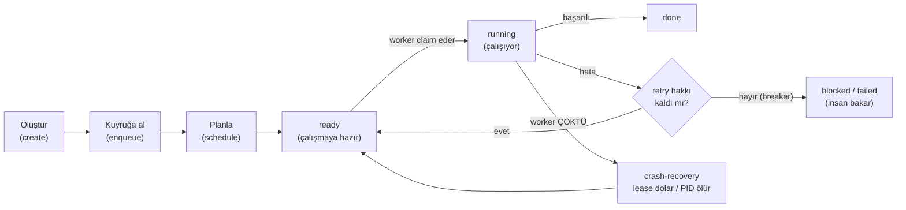

**Terimler:**
- **enqueue (kuyruğa alma):** işi "bekleyenler" sırasına koymak. Kuyruk **dayanıklıysa** (diskte/DB'de) sistem yeniden başlasa da iş kaybolmaz.
- **schedule (planlama):** *ne zaman* çalışacağına karar. İki tetik: **cron** (zaman) veya **bağımlılık** (parent işler bitince).
- **claim (kapma):** bir worker'ın işi "benim" diye üstlenmesi. İyi tasarımda **at-most-once** (en fazla bir worker kapar).
- **retry:** başarısız işi yeniden deneme. **Circuit breaker (devre kesici):** üst üste N başarısızlıkta durup insana bırakma (sonsuz döngüyü keser).
- **crash-recovery:** worker süreci ölünce işin kaybolmadan başka worker'a geçmesi.

---

## 2.1 Zamanlı (scheduled) task nasıl çalışır — Airflow vs Agent vs Temporal vs Celery

Örnek: **"her gün 08:00'de günlük satış özetini üret ve Slack'e gönder."** Zamanlı task = **bir zaman tetiği (cron/interval) → bir koşu başlatır.** Sistemler dört soruda ayrışır: *tetik nerede, kim ateşler, ne başlar, kaçan/çakışan ne olur.*

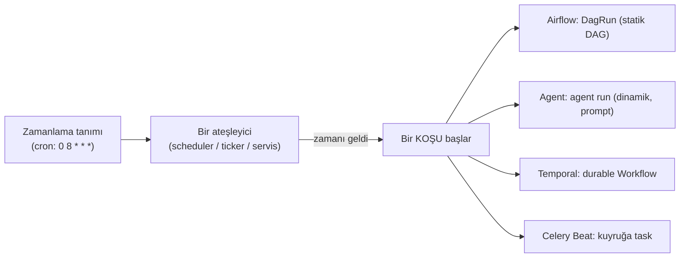

**Airflow** — scheduling'in ana evi. Tetik DAG'da; **Scheduler** süreci zamanı gelene bir **DagRun** açar. En güçlü yanı **catchup/backfill**: `catchup=True` start_date'ten bugüne tüm kaçan aralıkları geriye dönük koşar; her run'un *logical date*'i olduğundan geçmiş idempotent.
```python
with DAG("daily_sales", schedule="0 8 * * *",
         start_date=datetime(2026,1,1), catchup=False, max_active_runs=1):
    extract >> summarize >> send_slack
```
→ zamanlı = **statik DAG** koşusu.

**Agent (Hermes/OpenClaw)** — Hermes: model bir cron tool'u çağırır → `{schedule, prompt, delivery}` **`jobs.json`**'a yazılır; yerleşik **60 sn'lik daemon-thread ticker** (`InProcessCronScheduler`) her tick due job'ı bulur, `run_job` ile ajanı prompt'la koşturur, `_deliver_result` iletir. (Pluggable **Chronos** = managed/scale-to-zero.) OpenClaw: SQLite'ta zamanlı iş + **"scheduled authority"** politikası (hangi yetkiyle koşacağı sınırlı).
```
cron_create(schedule="0 8 * * *", timezone="Europe/Istanbul",
            prompt="Dünkü satışları çek, günlük özet çıkar, #satis kanalına gönder.")
```
→ zamanlı = **dinamik agent run** (içi runtime'da kararlaşır). Backfill zayıf; gateway kapalıysa pencere kaçar. **Not:** cron her ajanda yok — Codex/OpenCode/Claude Code/Wren'de yerleşik zamanlayıcı yok (talep-üzerine); scheduling sadece engine tipi (Hermes/OpenClaw) ya da Temporal-destekli (Shannon).

**Temporal** — bir **Schedule** nesnesi bir **Workflow**'u tetikler; tetiklenen iş **tam durable** (kaldığı yerden, retry, günlerce bekleme).
```
Schedule(
  spec   = ScheduleSpec(cron_expressions=["0 8 * * *"], time_zone="Europe/Istanbul"),
  action = StartWorkflow(DailySalesWorkflow),
  policy = SchedulePolicy(overlap=SKIP, catchup_window="1h"))
```
→ zamanlı **+ durable**; `catchupWindow`, overlap (`SKIP`/`BUFFER_ONE`/`ALLOW_ALL`), `pause`/`backfill`. Shannon bunu miras alır.

**Celery Beat** — ayrı **Beat** daemon'u periyodik olarak broker'a task **mesajı atar**; worker çeker. Downtime'da kaçan telafi edilmez; **tek Beat instance** olmalı.
```python
beat_schedule = {"daily-sales": {"task": "reports.daily_sales", "schedule": crontab(hour=8, minute=0)}}
```
→ zamanlı = **kuyruğa bir adım (B) atma**; en hafif, en az garanti.

| | Zamanlama nerede | Kim ateşler | Ne başlar | Kaçan/backfill | Çakışma | Tetiklenen iş durable? |
|---|---|---|---|---|---|---|
| **Airflow** | DAG `schedule=` | Scheduler | **DagRun** (statik) | **güçlü (catchup)** | `max_active_runs` | adım-retry; A kısmen |
| **Hermes/OpenClaw** | `jobs.json` / SQLite | 60s ticker / Chronos | **agent run** (dinamik) | zayıf (managed'la iyi) | provider'a bağlı | **evet** (kendi kernel) |
| **Temporal** | Schedule nesnesi | Temporal servisi | **durable Workflow** | `catchupWindow`+backfill | `SKIP/BUFFER/ALLOW` | **evet (tam)** |
| **Celery Beat** | `beat_schedule` | Beat daemon | **kuyruğa task** (B) | telafi yok | tek Beat instance | hayır (sen kurarsın) |

**Asıl fark:** Zamanlı tetik hepsinde var; fark **ne başladığında ve dayanıklılığında** — Airflow → statik DAG + en iyi backfill; Agent → dinamik prompt-run (backfill zayıf); Temporal → zamanlı + tam durable (uzun/insan-bekleyen işler için en güçlü); Celery Beat → sadece "zamanı gelince kuyruğa at".

---

## 3. Airflow — statik DAG + scheduler

**Fikir:** İşi (A) önceden **DAG** (Directed Acyclic Graph = yönlü, döngüsüz graf) olarak yazarsın; scheduler zamanı/bağımlılığı gözetip adımları (B) executor'a dağıtır.

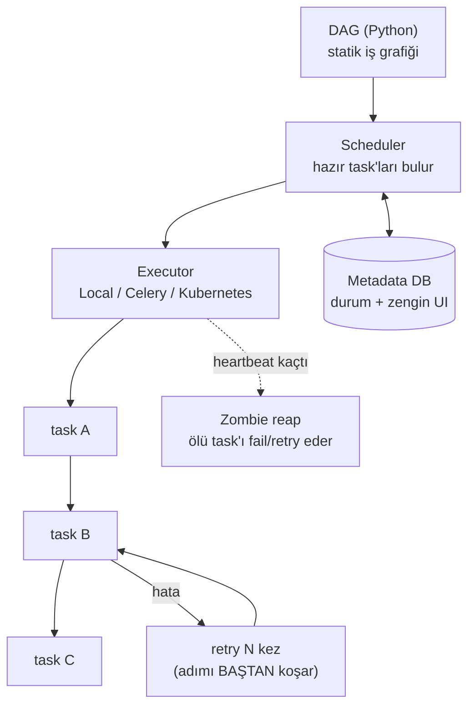

**Terimler:**
- **DAG:** adımların ve aralarındaki bağımlılıkların **önceden çizilmiş** haritası. Her koşuda aynı şekil.
- **Scheduler:** "hangi task şimdi çalışmaya hazır" kararını veren bileşen.
- **Executor:** task'ı gerçekte koşturan yer (yerel süreç / Celery worker / K8s pod).
- **Metadata DB:** hangi task'ın hangi durumda olduğunu tutan veritabanı (UI bunu gösterir).
- **Zombie task:** UI'da "çalışıyor" görünen ama süreci ölmüş task; scheduler **heartbeat** (canlılık sinyali) kaçınca temizler.
- **Sınır:** retry adımı **baştan** koşar; iş **statik** olmak zorunda → dinamik ajan döngüsüne uymaz.

---

## 4. Celery — dağıtık kuyruk + worker havuzu

**Fikir:** Bir fonksiyonu (B) bir **broker**'a (mesaj kuyruğu) atarsın; boştaki bir **worker** çeker, çalıştırır.

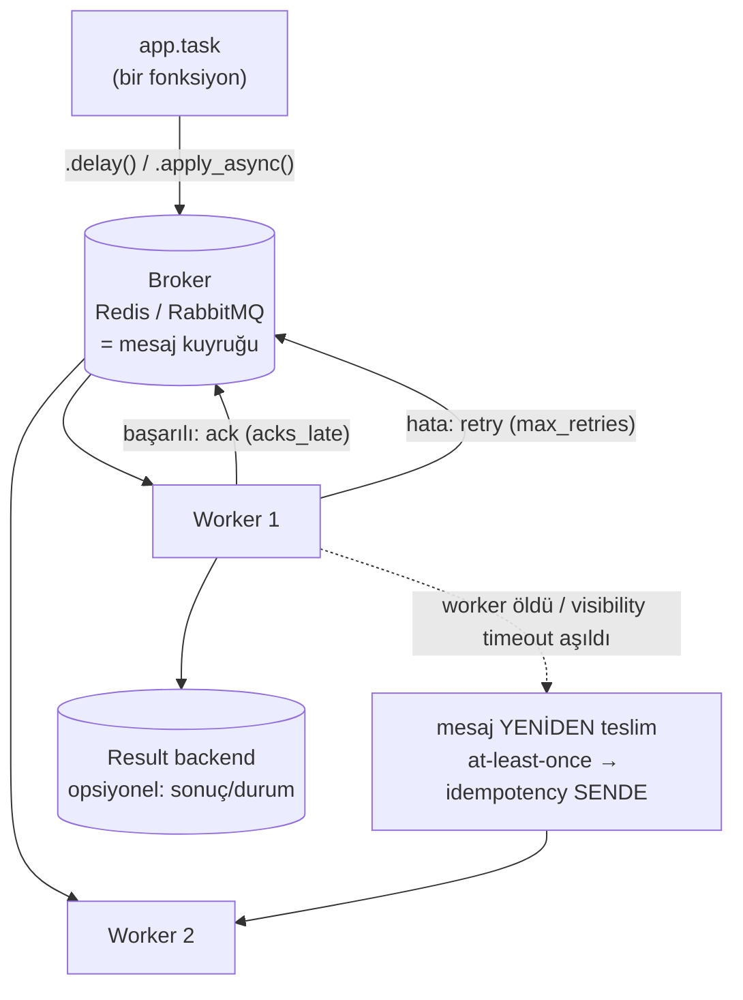

**Terimler:**
- **Broker (aracı):** kuyruğun yaşadığı yer (Redis/RabbitMQ). Task mesajları burada bekler.
- **Worker:** kuyruktan iş çekip çalıştıran süreç. Çok worker = **concurrency** (eşzamanlılık).
- **ack (acknowledge = onay):** worker'ın "bu mesajı işledim" demesi. **`acks_late`:** onayı **iş bitince** ver (çökerse mesaj kuyrukta kalır, kaybolmaz).
- **visibility timeout:** bir mesaj çekildikten sonra bu süre içinde onaylanmazsa **başka worker'a yeniden teslim edilir**. (Uzun task'larda tuzak: timeout > en uzun task olmalı.)
- **at-least-once (en az bir kez):** iş **en az** bir kez çalışır — bazen iki kez. O yüzden **idempotency** (aynı işi iki kez yapmak zarar vermesin) senin sorumluluğun.
- **Result backend:** görev sonucunu/durumunu saklayan opsiyonel depo.
- **Sınır:** çok-adımlı iş (A) kavramı yok; onu Canvas (`chain`/`group`/`chord`) ile sen kurarsın, "nerede kaldım"ı sen tutarsın.

---

## 5. Temporal — durable execution (kaldığı yerden devam)

**Fikir:** İş (A) = normal **kod** (Workflow). Her yan-etkili adım (B) = **Activity**. Sistem her olayı bir **event history**'ye yazar; worker çökerse kodu **replay** edip biten adımları atlar.

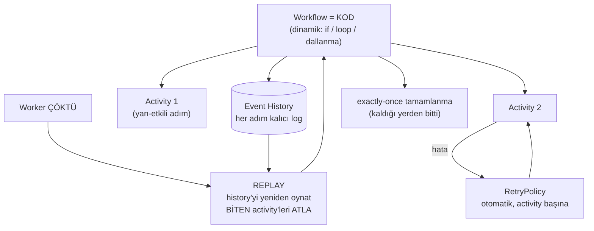

**Terimler:**
- **Durable execution (dayanıklı yürütme):** iş, süreç ölse bile **kalıcı** — kaldığı yerden sürer.
- **Workflow:** işin (A) kodu. **Activity:** tek bir yan-etkili adım (API çağrısı, DB yazma, LLM çağrısı).
- **Event history:** workflow'un başından beri olan her şeyin **değişmez kaydı** (event sourcing).
- **Replay (yeniden oynatma):** çökme sonrası kodu baştan çalıştırıp history'deki biten adımları **atlayarak** aynı noktaya gelme.
- **Determinism (determinizm):** aynı girdiyle workflow hep aynı yolu izlemeli → replay tutarlı olsun. Bu yüzden workflow kodunda **rastgele/saat/non-deterministik** çağrı **yasak**; onları activity'e sararsın.
- **exactly-once (tam bir kez):** biten activity replay'de tekrar çalışmaz → yan-etki bir kez.
- **Signal:** çalışan bir workflow'a dışarıdan mesaj/onay gönderme (insan-onayı, harici olay). **Continue-as-new:** çok uzayan history'yi taze bir workflow'a devretme.
- **Bedel:** Temporal cluster/Cloud + her adımın idempotent olması.

---

## 6. Hermes-tarzı engine — SQLite üstünde durable çekirdek (BUILD rotası)

**Fikir:** Task'lar bir **SQLite tablosunda** yaşar; bir **dispatcher** hazır işleri worker'lara **CAS-claim** ile dağıtır; kira (lease) + devre kesici ile çökme yönetilir.

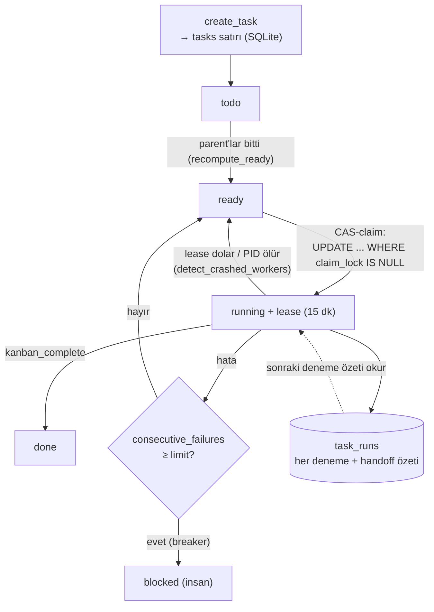

**Terimler:**
- **CAS (Compare-And-Swap = karşılaştır-ve-değiştir):** "koşul hâlâ doğruysa değiştir" atomik işlemi. Hermes'te `UPDATE ... WHERE status='ready' AND claim_lock IS NULL` → **rowcount=1** kazandın, **0** başkası kaptı. Dağıtık kilit gerekmez, **at-most-once** garanti.
- **lease (kira):** claim'in bir süre geçerli olması (15 dk). Worker canlıysa **heartbeat** ile yeniler; ölürse kira dolar, iş `ready`'ye döner.
- **detect_crashed_workers:** worker'ın PID'i (süreç kimliği) canlı mı diye bakar; değilse işi geri alır.
- **circuit breaker (devre kesici):** `consecutive_failures` (üst üste hata sayısı) eşiği aşınca task'ı `blocked`'a çeker → sonsuz retry fırtınasını keser.
- **handoff (devir özeti):** her deneme sonunda "nereye kadar geldim" özeti; sonraki deneme bunu okuyup **kaldığı yerden** devam eder.
- **idempotency_key:** aynı task'ı iki kez oluşturmayı engelleyen anahtar.

---

## 7. Shannon — agent loop'unu Temporal üstüne kurmak (BUY rotası, canlı kanıt)

**Fikir:** Ayrı bir orchestrator yazmak yerine, ajanın her adımını **Temporal workflow/activity** yap; dayanıklılığı hazır al.

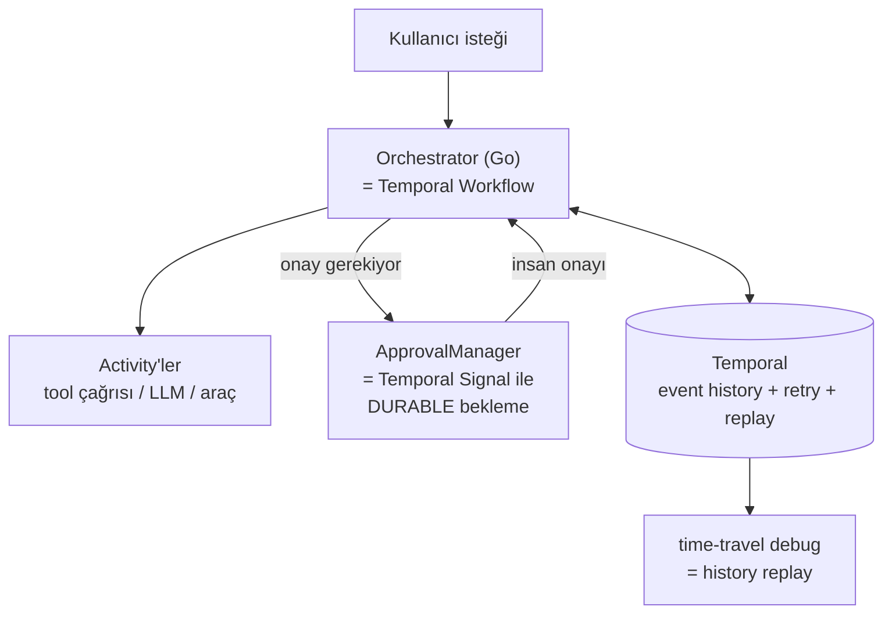

- Shannon, "**ağır dayanıklılığı managed/durable motora devret**" yolunun açık-kaynak kanıtı — ve seçtiği motor **Temporal**. brain_chat_V2 "buy" derse birebir referans.
- **human-in-the-loop (insan-döngüsü):** ajan bir adımda durup insan onayını bekler; Temporal signal'ıyla bu bekleme **günlerce dayanıklı**.

---

## 8. Wren / OpenCode / Claude Code — in-process / checkpoint

**Fikir:** İş, bir **oturum/thread** içinde koşar; durum her adımda bir **checkpoint**'e yazılır. Hızlı ve basit; ama **durable kuyruk yok** — süreç ölürse (checkpoint yoksa) iş kaybolur.

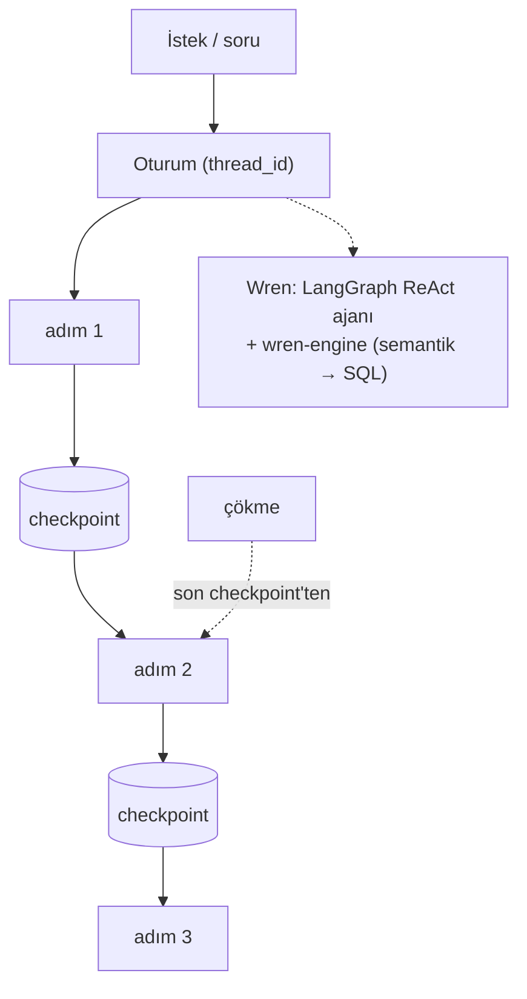

**Terimler:**
- **checkpoint (kontrol noktası):** o ana kadarki durumun kalıcı görüntüsü (LangGraph'ta *StateSnapshot*). **thread_id:** hangi oturuma ait olduğunu belirten anahtar.
- **resume (devam):** çökme sonrası **son checkpoint'ten** sürme. Tuzak: düğüm çoğu kez **baştan** koşar → checkpoint öncesi yan-etkiler **idempotent** olmalı.
- **Wren'e özel:** ajan tarafı **LangGraph**; **wren-engine** ise MDL semantik katmandan **deterministik SQL** üreten/çalıştıran **stateless sorgu motoru** (task orchestrator değil).
- **Sınır:** durable kuyruk / cron / crash-reclaim yok → tek başına "worker çökse de iş kaybolmasın" vermez.

---

## 9. ASIL FARK — worker işin ortasında çökerse ne olur?

Bütün karar aslında bu tek diyagrama iniyor. İş: `read ✅ → run_tests ✅ → write_file ⏳ (worker ÇÖKTÜ) → run_tests (hiç başlamadı)`

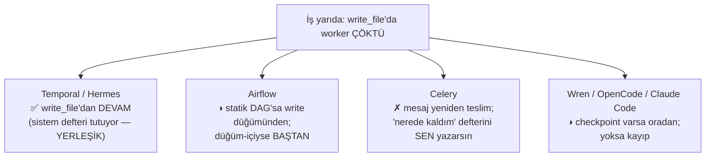

- **Yerleşik recovery:** "iş nerede kaldı" defterini **sistem** tutar → bedava gelir (Temporal, Hermes).
- **Sen inşa edersin:** o defteri (DB + durum makinesi + idempotency + çökme tespiti) **elle** yazarsın (Celery; Airflow kısmen).

---

## 10. Statik vs dinamik — ajan işi neden farklı?

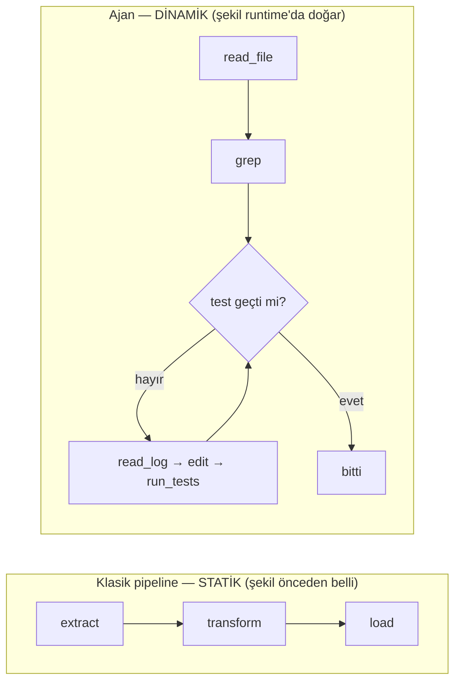

- **Static:** hangi adımlar/dallar **koşmadan önce** bellidir; her koşu aynı (Airflow'un varsayımı).
- **Dynamic:** sıradaki adıma **model çalışma anında**, sonuca bakarak karar verir; graf **koşarken** ortaya çıkar. Hatta yeni işler (A) runtime'da doğabilir.
- **Sonuç:** dinamik ajan işi statik DAG'a sığmaz. "Dinamik **ve** kaldığı yerden devam" isteyen için **Temporal** (kod-workflow) veya **Hermes-tarzı engine** doğru araç.

---

## 11. Karar ağacı

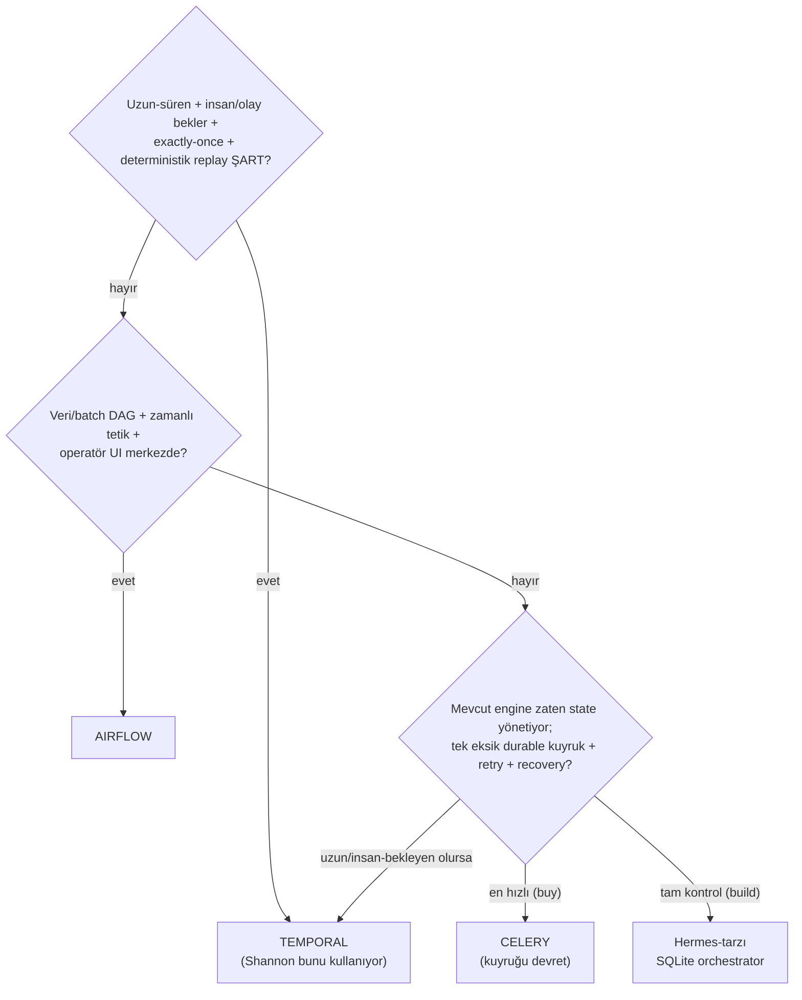

---

## 12. Bir bakışta terimler sözlüğü

| Terim | Kısa açıklama |
|---|---|
| **task (A/B/C)** | İş/JOB (A) · adım (B) · alt-ajan (C). Bu belgede "task" = A. |
| **enqueue / kuyruk** | İşi bekleyenler sırasına koymak. Dayanıklı kuyruk restart'ı atlatır. |
| **scheduler / cron** | *Ne zaman* çalışacağına karar (zaman ya da bağımlılık). |
| **executor / worker** | İşi gerçekte koşturan süreç. Çok worker = concurrency. |
| **broker** | Kuyruğun yaşadığı yer (Redis/RabbitMQ). |
| **DAG** | Adımların önceden çizili, döngüsüz bağımlılık grafiği. |
| **workflow / activity** | Temporal: iş (A) kodu / tek yan-etkili adım (B). |
| **event history / replay** | İşin değişmez kaydı / çökme sonrası tekrar oynatıp biteni atlama. |
| **determinism** | Aynı girdiyle hep aynı yol → replay tutarlı. |
| **idempotency** | Aynı işi iki kez yapmak zarar vermesin. |
| **at-most / at-least / exactly-once** | En fazla / en az / tam bir kez çalışma garantisi. |
| **retry / backoff** | Yeniden deneme / denemeler arası artan bekleme. |
| **circuit breaker** | Üst üste N hatada durup insana bırakma. |
| **claim / CAS** | İşi atomik "kapma"; at-most-once dağıtımın anahtarı. |
| **lease / heartbeat** | Kira (süreli claim) / canlılık sinyali; çökme tespiti. |
| **crash-recovery** | Worker ölünce işin kaybolmadan devri. |
| **zombie task** | Süreci ölmüş ama "çalışıyor" görünen task. |
| **visibility timeout** | Onaylanmayan mesajın yeniden teslim süresi (Celery). |
| **acks_late** | Onayı iş bitince ver → çökerse mesaj kaybolmaz. |
| **checkpoint / resume** | Durum görüntüsü / son görüntüden devam. |
| **handoff** | Deneme sonu "nereye kadar geldim" özeti. |
| **signal / human-in-the-loop** | Çalışan işe dış mesaj / insan onayı beklemesi. |
| **durable execution** | İş, süreç ölse de kalıcı; kaldığı yerden sürer. |

---

## Özet tek cümle
> **Task management = bir işin (A) doğuşundan bitişine kadar — kuyruk, plan, çalıştırma, retry ve özellikle çökme sonrası devam — kaybolmadan yönetilmesi.** Klasik araçlar (Airflow/Celery) bunu *adım (B)* seviyesinde verir, iş (A) dayanıklılığını sen kurarsın; Temporal ve Hermes-tarzı engine'ler *iş (A)* dayanıklılığını **yerleşik** verir. Ajan işi **dinamik** olduğundan, doğru araç Temporal (buy) veya Hermes-tarzı SQLite çekirdek (build).
