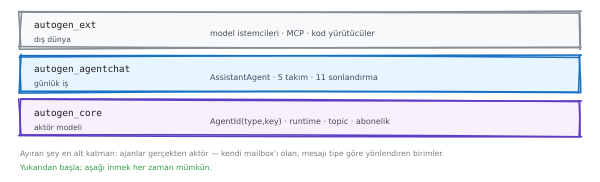
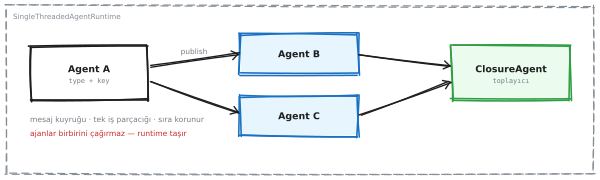
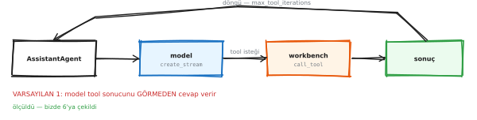
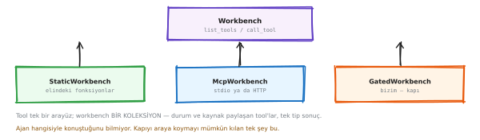
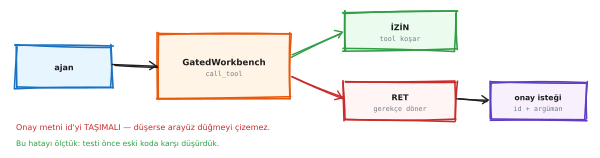
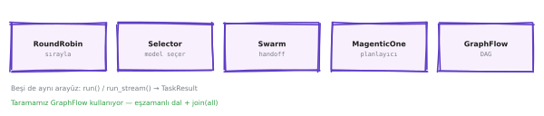
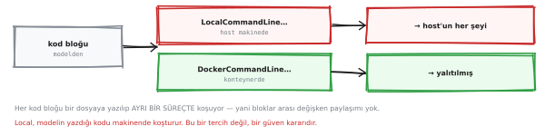

# Atlas — ajan altyapısı wiki'si

> **Bu ne:** KKB'de bir ajan sistemi kurarken bilinmesi gerekenler. Tek dosya,
> arayarak okunmak için. `Ctrl+F` ile gel, cevabı al, kapat.
>
> **Kaynak:** `vc-agent` deposu · 484 test · her sayı ölçüldü.
> Etiketler: **[ölçüldü]** koşturuldu · **[kaynak]** birincil metinden ·
> **[teyitsiz]** okundu, koşturulmadı.
>
> **Şemalar:** okumak için gömülü, değiştirmek için her birinin altında
> `.excalidraw` bağı var — dosyayı [excalidraw.com](https://excalidraw.com)'a
> sürüklemek yetiyor.

---

## İçindekiler

1. [Sözlük — beş terim](#s1)
2. [AutoGen: üç katman](#s2)
3. [Aktör modeli: ajanlar nasıl konuşuyor](#s3)
4. [Tool döngüsü ve sessiz varsayılanlar](#s4)
5. [Workbench: tool'ların tek kapısı](#s5)
6. [Onay kapısı](#s6)
7. [Takımlar ve faturaları](#s7)
8. [Kod yürütme ve Docker](#s8)
9. [Zamanlayıcı](#s9)
10. [OpenClaw'dan alınanlar](#s10)
11. [Denetim: iki kayıt hattı](#s11)
12. [Çerçeve seçimi](#s12)
13. [Bilinen sınırlar](#s13)

---

<a id="s1"></a>
## 1 · Sözlük

Beş terim; wiki'nin geri kalanı bunları kullanıyor.

| Terim | Ne demek |
|---|---|
| **Ajan** | Bir model + talimat + tool listesi + hafıza. Nesne olarak bir Python sınıfı. |
| **Tool** | Ajanın çağırabildiği fonksiyon. Model fonksiyonu görmüyor, **tarifini** görüyor. |
| **Runtime** | Ajanlar arası mesajı taşıyan postane. Ajan ajanı çağırmıyor; runtime'a mesaj veriyor. |
| **Workbench** | Tool listesi değil, tool **kaynağı**. "Elimde ne var" diye her turda sorulabiliyor. |
| **Harness** | Dil modelini iş yapabilen bir ajana çeviren runtime iskelesi — oturum, onay, bellek, zamanlama. |

---

<a id="s2"></a>
## 2 · AutoGen: üç katman

<p align="center"></p>

<sub>▲ AutoGen'in üç katmanı · düzenlemek için: [`f_layers.excalidraw`](diagrams/wiki/f_layers.excalidraw) → excalidraw.com'a sürükle</sub>


* **`autogen_core`** — aktör modeli. Kimlik, runtime, topic, abonelik.
* **`autogen_agentchat`** — günlük iş. Hazır ajan, beş takım tipi, on bir sonlandırma koşulu.
* **`autogen_ext`** — dış dünya. Model istemcileri, MCP, kod yürütücüler.

**Kural:** yukarıdan başla. AgentChat'in çözdüğü bir problemi core'da yeniden
çözmek, aynı işi daha az testle yapmak demek. Aşağı inmek zorunda değilsin ama
**inebildiğini bilmek** bir güvence: AgentChat'in çözemediği bir problem —
paralel dallarda sessiz sonuç kaybı — core'un `ClosureAgent` + kuyruk deseniyle
çözülüyor.

---

<a id="s3"></a>
## 3 · Aktör modeli

<p align="center"></p>

<sub>▲ Ajan ajanı çağırmıyor — runtime'a mesaj veriyor · düzenlemek için: [`f_actor.excalidraw`](diagrams/wiki/f_actor.excalidraw) → excalidraw.com'a sürükle</sub>


Bir ajan başka bir ajanın nesnesini elinde tutmuyor. Runtime'a mesaj veriyor,
teslimatı runtime yapıyor. Bunun bedeli var — araya bir katman giriyor ve
*"kim kimi çağırdı"* sorusunun cevabı yığın izinde görünmüyor. Karşılığında
üç şey kazanıyorsun: yeni ajan eklemek çağıran kodu **değiştirmiyor**, bütün
mesajlar tek noktadan geçtiği için müdahale ve ölçüm oraya takılıyor, ve aynı
sınıftan istediğin kadar örnek bedava.

### İki iletişim biçimi — fark adresleme değil, **hata**

| | Doğrudan (`send_message`) | Yayın (`publish_message`) |
|---|---|---|
| Alıcı | tek adres | topic'e abone olan herkes |
| Dönüş değeri | **var** | **yok** |
| Handler çökerse | çağırana **fırlatır** | **loglanır, fırlatmaz** |

Son satır bir tasarım kararı: bir sonucu bekleyeceksen doğrudan, bir olayı
duyuracaksan yayın. Karıştırırsan hata sessizce kaybolur.

---

<a id="s4"></a>
## 4 · Tool döngüsü

<p align="center"></p>

<sub>▲ Model tool ister · kapı · çalıştır · sonucu gör · döngü · düzenlemek için: [`f_tool_loop.excalidraw`](diagrams/wiki/f_tool_loop.excalidraw) → excalidraw.com'a sürükle</sub>


### Sessiz varsayılanlar — en pahalı tuzak

Ajan bir tool çağırdıktan sonra **kaç kez daha** dönebilir? Hiçbir çerçeve aynı
cevabı vermiyor, ve hiçbiri bunu öne çıkarmıyor. Hepsi kurulu paketten
okundu **[ölçüldü]**:

| Çerçeve | Alan | Varsayılan |
|---|---|---:|
| **AutoGen** | `max_tool_iterations` | **1** |
| OpenAI Agents SDK | `Runner.run(max_turns=)` | 10 |
| CrewAI | `Agent.max_iter` | 25 |
| **MAF** | `DEFAULT_MAX_ITERATIONS` | **40** |
| LangGraph | `recursion_limit` | 10007 |
| Google ADK | `LoopAgent.max_iterations` | **sınırsız** |

**AutoGen'de varsayılan 1:** ajan tool'u çağırır, sonucu görür ve **durur** —
cevabı hiç yazmaz. Hata da vermez.

> Tehlike iki uçta da aynı: **varsayılanı yazmadan koşturmak.** Bir uçta ajan
> sessizce hiçbir şey yapmıyor, öbür uçta sessizce durmuyor.

### Diğer sessiz varsayılanlar

* `model_context` verilmezse ajanın **belleği yok** — ve hata vermiyor.
* Sonlandırma koşulu yoksa takım **sonsuza kadar** konuşuyor; fatura gerçek.
* `description` boş bırakılan ajan, `SelectorGroupChat`'te **kör** seçiliyor.

---

<a id="s5"></a>
## 5 · Workbench

<p align="center"></p>

<sub>▲ Üç kaynak, tek arayüz · düzenlemek için: [`f_workbench_component.excalidraw`](diagrams/wiki/f_workbench_component.excalidraw) → excalidraw.com'a sürükle</sub>


`tools=[...]` bir **liste**, `workbench=` bir **kaynak**. Liste ajan yazılırken
donuyor; kaynak her turda sorulabiliyor. İkisi birlikte kullanılamıyor —
`ValueError: Tools cannot be used with a workbench.`

**Her turda ne oluyor:**

```
wb.list_tools()  →  JSON şemalar  →  model çağrısına `tools=` diye gider
```

Model fonksiyonu görmüyor; **adını, tarifini ve parametre şemasını** görüyor.
Üç sonuç:

1. **Docstring gerçekten arayüz.** Modelin o tool'a *ne zaman* uzanacağına karar
   verdiği tek metin o.
2. **Şemalar her turda ödeniyor.** 17 tool = her istekte 17 şema.
3. **Bir tool'u listeden çıkarmak** prompt'u ucuzlatıyor — *kapılamak* ile
   *filtrelemek* ayrı kararlar.

**Neden kapıyı buraya koyduk:** workbench, yerel bir Python fonksiyonuyla uzak
bir MCP tool'unu **aynı gören tek yer**. Ve kural, ajan yazılırken **var olmayan**
tool'lar için de geçerli — "şu isimler tehlikeli" listesi tam burada başarısız
olurdu.

---

<a id="s6"></a>
## 6 · Onay kapısı

<p align="center"></p>

<sub>▲ Çağrı geçmeden önce duran tek nokta · düzenlemek için: [`f_gate.excalidraw`](diagrams/wiki/f_gate.excalidraw) → excalidraw.com'a sürükle</sub>


### Üç kural

**① Engellenen çağrı hata *döndürüyor*, fırlatmıyor.** Ajan reddedildiğini
öğreniyor, söyleyebiliyor, başka yol deneyebiliyor. İstisna turu bitirir ve
insana hiçbir şey anlatmazdı.

**② Onay bir kez tüketiliyor.** İmza `(tool, argümanlar)` üstünde. Aynı çağrı
ikinci kez geldiğinde **yeniden soruluyor**. "Bir daha sorma" bir kolaylık
kararıdır ve düzenlenmiş bir kurumda varsayılanı açık olmamalıdır.

**③ Bozulan bekçi kapanır, açılmaz.** Kanca kendi istisnasında `block: True`
döndürüyor.

### Kapılamak ≠ filtrelemek

| | Ne yapar | Ne zaman doğru |
|---|---|---|
| **Kapılamak** | tool görünür kalır, çağrı reddedilir | ajan *"mesaj atardım ama onayınız lazım"* diyebilir |
| **Filtrelemek** | `list_tools`'tan çıkar, prompt'a hiç girmez | prompt maliyeti · meşru kullanımı olmayan tool |

Filtrelenmiş tool **adıyla çağrılsa da reddediliyor** — *liste bir ipucudur,
zorlama noktası değil.*

---

<a id="s7"></a>
## 7 · Takımlar

<p align="center"></p>

<sub>▲ Beş takım tipi — değişen tek şey: sırayı kim belirliyor · düzenlemek için: [`f_teams.excalidraw`](diagrams/wiki/f_teams.excalidraw) → excalidraw.com'a sürükle</sub>


Aynı görev, aynı ajanlar, yalnız orkestrasyon değişiyor **[ölçüldü]**:

| Desen | Sırayı kim belirliyor | Mesaj | LLM | Tool | Token |
|---|---|---:|---:|---:|---:|
| **SelectorGroupChat** | model her turda seçiyor | 8 | 5 | 2 | **204** |
| GraphFlow | önceden çizilmiş DAG | 11 | 7 | 3 | 270 |
| RoundRobinGroupChat | sırayla, kararsız | 9 | 6 | 2 | 274 |
| **Swarm** (handoff) | ajanın kendisi devrediyor | 14 | 7 | 4 | **334** |

**%63,7 fark.** Ödenen şey zekâ değil **yönlendirme özerkliği**: ajanlara
"kime devredeceğine sen karar ver" dediğin an fatura artıyor, çünkü her devir
bir tur ve her tur bir model çağrısı.

> Kıyasa çevirisi: **Agents SDK'nın tek modeli olan handoff, AutoGen'in en
> pahalı desenidir.** Tek desenli bir çerçeve seçmek, o desenin faturasını da
> seçmektir.

---

<a id="s8"></a>
## 8 · Kod yürütme

<p align="center"></p>

<sub>▲ Yerel yürütücü ve konteyner · düzenlemek için: [`f_code_executors.excalidraw`](diagrams/wiki/f_code_executors.excalidraw) → excalidraw.com'a sürükle</sub>


### Rol: yirmi ikinci tool değil, **kaçış kapağı**

Model önce mevcut tool'lara bakıyor; sorulanı karşılayan bir tool **yoksa**
Python yazıp çalıştırıyor. Ayrım tarifle zorlanıyor: tarif *"kod çalıştırır"*
deseydi ajan her hesabı yeniden icat eder, yirmi bir tool boşa çalışırdı.

### Ömür: konteyner **sürece** ait, çağrıya değil

Sunucu açılırken bir konteyner kalkıyor, kapanırken iniyor. Çağrı başına
konteyner kaldırmak 2–3 saniye ve bunun tamamı kullanıcının beklediği süreye
eklenirdi.

**Bedeli:** konteyner turlar arasında **durum taşıyor**. İzolasyon konteyner ile
host arasında; tur ile tur arasında değil.

### Güvenlik — ölçüldü, ve iyi görünmüyor

| | Değer |
|---|---|
| kullanıcı | **root** (uid=0) |
| ağ | **bridge** — dışarı çıkıyor (pypi.org'a `200` alındı) |
| salt okunur kök | hayır |
| bellek / CPU / PID sınırı | **yok** |
| düşürülen yetki | **hiçbiri** |
| ayrıcalıklı | hayır ✔ |

Hiçbiri tercih değil: `DockerCommandLineCodeExecutor`'da bu parametrelerin
**hiçbiri yok**.

**Buna karşılık:** varsayılan kapalı · her koşuda insan onayı · onay kartı ağ
erişimini açıkça yazıyor · onay **kodun imzasına** bağlı · 60 sn zaman aşımı.

> Gerçek savunma sandbox değil, **kapı**. Bu wiki'de *"sandbox güvenli"* cümlesi
> kurulmuyor.

### Onay neden saklanan metni koşturuyor

Kapının reddi turu bitiriyor. Onay o turu geri getiremiyor, ve modelden kodu
yeniden istemek işe yaramıyor — **ölçüldü: aynı soru iki farklı program üretti**
(imzalar `029f4d1f…` ve `107fdfd1…`). Onaylananla çalışanın aynı olmasının tek
yolu, çalıştırılacak olanın **onaylanan metin** olması.

---

<a id="s9"></a>
## 9 · Zamanlayıcı

<p align="center"></p>

<sub>▲ Zamanlama yığını · düzenlemek için: [`f_task_stack.excalidraw`](diagrams/wiki/f_task_stack.excalidraw) → excalidraw.com'a sürükle</sub>


**AutoGen'de zamanlama diye bir kavram yok** — ve bu bir eksiklik değil, bir
kütüphane saat tutmaz.

Bizde iki katman var, biri bağlı:

* **Çevirmen (bağlı).** Türkçe "ne zaman" ifadesini cron şekline çeviriyor.
  Üç biçim kabul ediyor — `her gün 09:00` · `30dk` · `20dk sonra` — ve
  dördüncüsünü **tahmin etmiyor**, sözdizimini yazıp reddediyor.
* **Yerli zamanlayıcı (yazıldı, bağlanmadı).** 322 satır, 19 test.

### Üç bilinçli kısıt

| Karar | Neden |
|---|---|
| Payload hep `agentTurn` | `command`/`script` de var ama **ikisi de kabuk**; kabuk kararı onay kapısına ait, gece 3'te koşan bir iş tanımına değil |
| `sessionTarget: isolated` | Zamanlanmış koşu birinin konuşmasını ne miras almalı ne kirletmeli |
| `to` asla varsayılan değil | Adres tahmin etmek, yabancıya mektup atmak |

**Kapı yazılanı imzalıyor, çözülmüş zamanı değil.** `"20dk sonra"` her
ayrıştırmada başka bir damga veriyor; sonucun üstündeki imza hiç tutmazdı.

### Dürüst sınır

Zamanlama yalnız OpenClaw'ın Gateway'i koşarken çalışıyor. Sessizce ateşlemeyi
bırakmış bir iş, bir zamanlayıcının en kötü arızası — o yüzden liste, Gateway'e
ulaşılamamasını **boş liste değil, kendi durumu** olarak raporluyor.

---

<a id="s10"></a>
## 10 · OpenClaw'dan alınanlar

<p align="center"></p>

<sub>▲ Üç kontrol ekseni — karıştırmak en yaygın hata · düzenlemek için: [`f_three_axes.excalidraw`](diagrams/wiki/f_three_axes.excalidraw) → excalidraw.com'a sürükle</sub>


"İzin" tek kavram değil, **üç ayrı soru**:

| Eksen | Soru |
|---|---|
| **Sandbox** | Tool **nerede** koşuyor? |
| **Tool policy** | **Hangi** tool çağrılabilir? |
| **Elevated** | Kutunun **dışına çıkış** var mı? |

Kurallar: `deny` her zaman kazanır · `allow` doluysa listede olmayan her şey
bloklu · tool policy sert duraktır.

**Ve OpenClaw'ın kendi belgesindeki uyarı:**

> *"Tool policy tool'u **adına göre** filtreler; `exec` içindeki yan etkileri
> incelemez. `exec` serbestse, `write`/`edit`'i reddetmek shell komutlarını
> salt-okunur yapmaz."*

Yani **"yazma tool'unu kapattık, artık read-only" cümlesi yanlıştır.**

### Taşınacak fikir: rol bir tool listesi değil, **grup adı**

OpenClaw'da 13 tool grubu var (`group:fs`, `group:runtime`, `group:web`…).
KKB'de bu `group:musteri-verisi`, `group:kredi-sorgu`, `group:rapor`,
`group:dis-erisim` olur. Yeni bir tool eklendiğinde **40 rol dosyası
güncellenmiyor**.

### Diğer alınanlar

* **Onay komuta değil, plana bağlanır** — donmuş plan.
* **Dış içerik veri, talimat değil.**
* **Kademeli açığa çıkarma:** prompt'a yalnız bir satırlık tarif giriyor,
  gövde ancak seçilince ödeniyor.

---

<a id="s11"></a>
## 11 · Denetim

<p align="center"></p>

<sub>▲ İki kayıt hattı — aynı şey değiller · düzenlemek için: [`f_two_ledgers.excalidraw`](diagrams/wiki/f_two_ledgers.excalidraw) → excalidraw.com'a sürükle</sub>


**Uyum kaydı** ile **hata ayıklama kaydı** aynı şey değildir:

| | Uyum kaydı | Hata ayıklama kaydı |
|---|---|---|
| Değişmez mi | **evet** | hayır |
| Saklama süresi | var | kısa |
| Sır taşır mı | **asla** | taşıyabilir |
| Kim okur | denetçi | mühendis |

Tek hatla ikisini birden yapmaya çalışmak **ikisini de bozar**: ya denetim
kaydına sır sızar, ya hata ayıklama kaydı gereksiz yere ömür boyu saklanır.

---

<a id="s12"></a>
## 12 · Çerçeve seçimi

<p align="center"></p>

<sub>▲ Üç ayrı ilişki · düzenlemek için: [`f_atlas.excalidraw`](diagrams/wiki/f_atlas.excalidraw) → excalidraw.com'a sürükle</sub>


### Bakım modu bir söylenti değil — ölçüldü

| Paket | Son sürüm | Kaç gün önce |
|---|---|---:|
| **autogen-agentchat** | 0.7.5 | **323** |
| semantic-kernel | 1.44.1 | 13 |
| langgraph | 1.2.11 | 8 |
| agent-framework (MAF) | 1.14.0 | 5 |
| crewai | 1.15.16 | 5 |
| google-adk | 2.7.1 | 2 |
| openai-agents | 0.22.0 | **0** |

Rakiplerin hepsi son iki hafta içinde sürüm çıkardı; AutoGen on bir ay önce.

### Ama MAF'a bugün geçmek de bedava değil

* GA'dan sonra **iki ayda 15 kırıcı değişiklik** — Microsoft'un kendi
  işaretlemesiyle **[kaynak]**
* 36 paketin **8'i** kararlı; harness, FIDES, beceriler hepsi `experimental`
* **Dağıtık runtime yok** — ve LangGraph, CrewAI, Agents SDK, ADK'da da yok

### Kararın dayanağı: motor değiştirilebilir

54 modülün **17'si** AutoGen içe aktarıyor. Kodun **%72,5'i** altında hangi
motorun döndüğünü bilmiyor **[ölçüldü]**. Ekrandaki MAF düğmesi bunun kanıtı.

> **Üç ayrı ilişki:** AutoGen'i **gömüyoruz** (motor, ince arayüz arkasında) ·
> OpenClaw'ı **öğreniyoruz** (karar kuralları, kodu değil) · OpenClaw'ı
> mühendislikte **kullanmaya devam ediyoruz**.

---

<a id="s13"></a>
## 13 · Bilinen sınırlar

Bu wiki'nin en önemli bölümü. Her sayının ölçüldüğünü söyleyen bir belge,
ölçmediklerini de sayabilmeli.

| Ne | Durum | Neden |
|---|---|---|
| Kod konteynerinin ağ izolasyonu | **bilinen açık** | Yukarı akış parametre sunmuyor. Konteyner izole, ama ağı var. |
| Prompt enjeksiyonu | **izlenmiyor** | Kapı tool adına ve imzasına bakıyor, verinin nereden geldiğine değil. Tarama sonucuna gömülü talimat kapıdan geçer. |
| Zamanlayıcı | **devredilmiş** | Yerli karşılığı yazıldı ve testli, bağlanmadı. |
| MAF kipi | **dar** | Beş API yüzeyi. Kıyas yüzeyi, ikinci boru hattı değil. Tool çağrılan turda cevap metni boş dönüyor. |
| LangGraph / CrewAI davranışı | **[teyitsiz]** | Kuruldular, sembolleri tarandı, **koşturulmadılar**. "Var" demek "çalışıyor" demek değil. |
| Lobster (OpenClaw eklentisi) | **[teyitsiz]** | Resmî eklenti, çekirdekte değil, kurmadık. |

---

<sub>Üretim: `python docs/tools/make_wiki.py` · şemalar `docs/diagrams/figures.py`
(desteyle aynı çizimler) · düzenlenebilir kaynaklar `docs/diagrams/wiki/`</sub>
