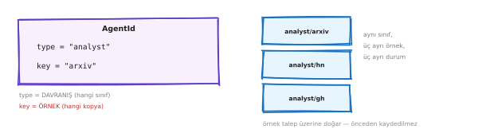
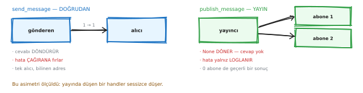
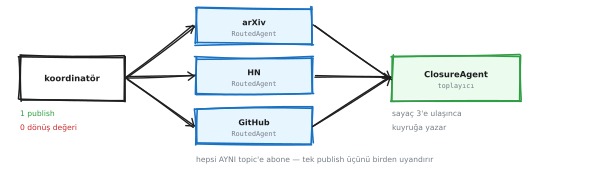
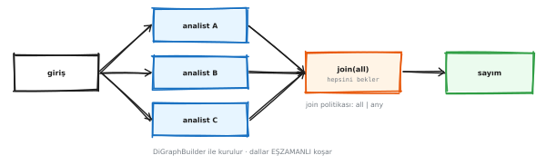
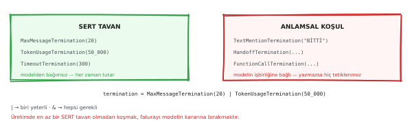
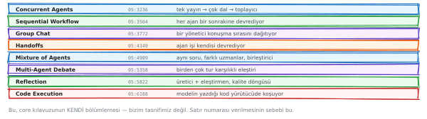
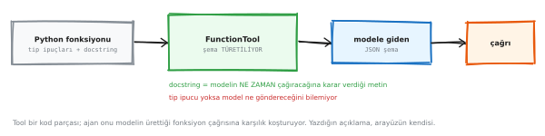
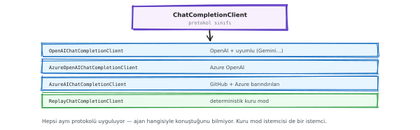
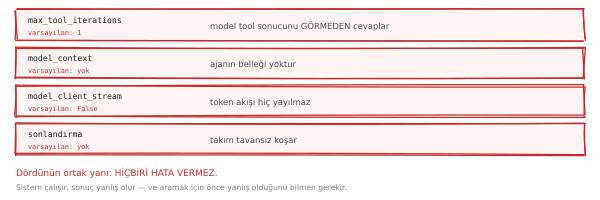
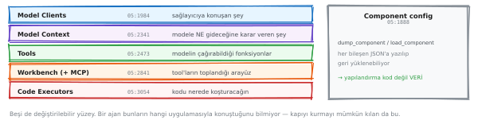

# AutoGen ve MAF — çerçeve wiki'si

> **Bu ne:** AutoGen'i kullanacak ya da MAF'a geçmeyi düşünen bir mühendis için.
> Tek dosya, arayarak okunmak için.
>
> **Sürümler:** `autogen-core` / `agentchat` / `ext` **0.7.5** · `agent-framework`
> **1.14.0** — ikisi de kurulu ve ölçüldü.
>
> **Etiketler:** **[ölçüldü]** koşturuldu · **[kaynak]** birincil metinden ·
> **[teyitsiz]** okundu, koşturulmadı.

---

## İçindekiler

1. [Dört isim, tek karmaşa](#s1)
2. [Üç katman](#s2)
3. [Aktör modeli](#s3)
4. [Kimlik: bir şey değil, iki şey](#s4)
5. [İki iletişim biçimi](#s5)
6. [Tool döngüsü ve tarif](#s6)
7. [Beş takım tipi ve faturaları](#s7)
8. [Durmayı öğretmek](#s8)
9. [Sekiz resmî desen](#s9)
10. [Built-in tool'lar — ve neden yok](#s10)
11. [Kod yürütücüler](#s11)
12. [Ölçülmüş tuzaklar](#s12)
13. [MAF: halef ne getirdi](#s13)
14. [MAF: ne kaybettirdi](#s14)
15. [Geçiş haritası](#s15)

---

<a id="s1"></a>
## 1 · Dört isim

Karıştırılan dört ayrı şey var:

| İsim | Ne | Durum |
|---|---|---|
| **microsoft/autogen v0.4+** | `autogen-core` + `agentchat` + `ext` | Bakım modu, **0.7.5** |
| AutoGen v0.2 | `ConversableAgent`, `initiate_chat` | Terk edilmiş |
| **ag2ai/ag2** | v0.2 kolundan fork, ayrı ekip | Aktif — ama `pip install ag2` artık `import autogen` **sunmuyor** |
| **microsoft/agent-framework** | AutoGen + Semantic Kernel birleşimi | Resmî halef, **1.14.0** |

> **Filtre:** Bir kaynakta `ConversableAgent` ya da `initiate_chat` görüyorsan
> o kaynak v0.2 ya da AG2 anlatıyor — bu sürümle **uyumsuz**.

---

<a id="s2"></a>
## 2 · Üç katman

<p align="center"></p>

<sub>▲ AutoGen'in üç katmanı · düzenlemek için: [`f_layers.excalidraw`](diagrams/wiki/f_layers.excalidraw) → excalidraw.com'a sürükle</sub>


Ayıran şey **`autogen_core`**: ajanlar gerçekten aktör — kendi mailbox'ı olan,
mesajı **tipe göre** yönlendiren, makinelere dağıtılabilen birimler.

LangGraph'ın graf yürütücü + checkpointer'ı **dayanıklılık** sağlıyor,
eşzamanlılık modeli değil. *"AutoGen mı LangGraph mı"* çoğu zaman yanlış
sorulmuş soru — farklı katmanlar.

---

<a id="s3"></a>
## 3 · Aktör modeli

<p align="center"></p>

<sub>▲ Ajan ajanı çağırmıyor · düzenlemek için: [`f_actor.excalidraw`](diagrams/wiki/f_actor.excalidraw) → excalidraw.com'a sürükle</sub>


Bir ajan başka bir ajanın nesnesini tutmuyor; runtime'a mesaj veriyor.

**Bedeli:** *"kim kimi çağırdı"* yığın izinde görünmüyor.
**Karşılığı:** yeni ajan eklemek çağıran kodu değiştirmiyor · bütün mesajlar tek
noktadan geçtiği için müdahale ve ölçüm oraya takılıyor · aynı sınıftan istediğin
kadar örnek bedava.

---

<a id="s4"></a>
## 4 · Kimlik

<p align="center"></p>

<sub>▲ AgentId = tip + anahtar · düzenlemek için: [`f_identity.excalidraw`](diagrams/wiki/f_identity.excalidraw) → excalidraw.com'a sürükle</sub>


`AgentId(type, key)` — **iki parçalı**. Ve en az konuşulan, en çok işe yarayan
mekanizma şu:

> **Topic kaynağı, ajan anahtarına dönüşüyor.**
> `TopicId("tur", "oturum-42")`'ye yayın yapmak `AgentId("session", "oturum-42")`
> ajanını **yaratıyor** — oturum başına izole örnek, elle sözlük tutmadan.

Bu projede gateway oturumları tam olarak böyle çalışıyor. Ölçek gerektiğinde
ilk bakılacak yer burası.

---

<a id="s5"></a>
## 5 · İki iletişim biçimi

<p align="center"></p>

<sub>▲ Doğrudan ve yayın — asimetri hatada · düzenlemek için: [`f_send_vs_publish.excalidraw`](diagrams/wiki/f_send_vs_publish.excalidraw) → excalidraw.com'a sürükle</sub>


| | `send_message` | `publish_message` |
|---|---|---|
| Alıcı | tek `AgentId` | topic'e abone olan herkes |
| Dönüş | **var** | **yok** |
| Handler çökerse | çağırana **fırlatır** | **loglanır, fırlatmaz** |

Son satır bir tasarım kararı: sonucu bekleyeceksen doğrudan, olay duyuracaksan
yayın.

### Ve buradan doğan en pahalı arıza

<p align="center"></p>

<sub>▲ Fan-out / fan-in — ve sessiz kayıp · düzenlemek için: [`f_fanout.excalidraw`](diagrams/wiki/f_fanout.excalidraw) → excalidraw.com'a sürükle</sub>


Çöken bir handler `_process_publish` içindeki `gather`'ı erken döndürüyor,
`stop_when_idle()` bariyeri erken açılıyor, ve **tamamlanmış kardeş sonuçlar
sessizce kayboluyor.**

Aynı arıza enjeksiyonuyla ölçüldü **[ölçüldü]**:

| Motor | Temiz | Sarmalayıcı arkasında | Ham hata |
|---|---:|---:|---:|
| GraphFlow | 3 | 2 | **0–1**, süre sınırı dolar |
| core pub/sub + `ClosureAgent` kuyruğu | 3 | 2 | **2**, ~3 ms |

> Resmî desenler bu konuda **birbiriyle çelişiyor**: *Concurrent Agents* kuyrukla
> topluyor, *Mixture of Agents* `asyncio.gather(...)` ile — sessiz kaybın kaynağı
> olan yapı.

---

<a id="s6"></a>
## 6 · Tool döngüsü

<p align="center"></p>

<sub>▲ Model ister · kapı · çalışır · sonucu görür · döngü · düzenlemek için: [`f_tool_loop.excalidraw`](diagrams/wiki/f_tool_loop.excalidraw) → excalidraw.com'a sürükle</sub>


### Tarif = arayüz

Model fonksiyonu görmüyor; **adını, tarifini ve parametre şemasını** görüyor.
`description` prompt'a giren tek metin, ve modelin o tool'a *ne zaman*
uzanacağına karar verdiği şey o.

### Varsayılan tavan — altı çerçeve, altı cevap

Hepsi kurulu paketten okundu **[ölçüldü]**:

| Çerçeve | Alan | Varsayılan |
|---|---|---:|
| **AutoGen** | `max_tool_iterations` | **1** |
| OpenAI Agents SDK | `Runner.run(max_turns=)` | 10 |
| CrewAI | `Agent.max_iter` | 25 |
| **MAF** | `DEFAULT_MAX_ITERATIONS` | **40** |
| LangGraph | `recursion_limit` | 10007 |
| Google ADK | `LoopAgent.max_iterations` | sınırsız |

AutoGen'de **1**: ajan tool'u çağırır, sonucu görür, **durur** — ve hata vermez.
Microsoft bunu göç kılavuzunda kendisi yazıyor **[kaynak]**.

---

<a id="s7"></a>
## 7 · Beş takım

<p align="center"></p>

<sub>▲ Değişen tek şey: sırayı kim belirliyor · düzenlemek için: [`f_teams.excalidraw`](diagrams/wiki/f_teams.excalidraw) → excalidraw.com'a sürükle</sub>


Aynı görev, aynı ajanlar **[ölçüldü]**:

| Desen | Sırayı kim belirliyor | Mesaj | LLM | Tool | Token |
|---|---|---:|---:|---:|---:|
| **SelectorGroupChat** | model her turda seçiyor | 8 | 5 | 2 | **204** |
| GraphFlow | önceden çizilmiş DAG | 11 | 7 | 3 | 270 |
| RoundRobinGroupChat | sırayla | 9 | 6 | 2 | 274 |
| **Swarm** | ajan devrediyor | 14 | 7 | 4 | **334** |

**%63,7 fark.** Ödenen zekâ değil **yönlendirme özerkliği**.

### GraphFlow — boruyu çizmek

<p align="center"></p>

<sub>▲ DiGraphBuilder ile akış · düzenlemek için: [`f_graphflow.excalidraw`](diagrams/wiki/f_graphflow.excalidraw) → excalidraw.com'a sürükle</sub>


Kenarlar **veri taşımıyor**, yalnız sırayı belirliyor. Join'de
`activation_condition="all"` demezsen ilk gelen dal akışı ilerletiyor.

---

<a id="s8"></a>
## 8 · Durmayı öğretmek

<p align="center"></p>

<sub>▲ On bir sonlandırma koşulu · düzenlemek için: [`f_termination.excalidraw`](diagrams/wiki/f_termination.excalidraw) → excalidraw.com'a sürükle</sub>


Sonlandırma koşulu olmayan takım **sonsuza kadar** konuşuyor, ve fatura gerçek.
On bir koşul var; en çok kullanılan dördü:

* `MaxMessageTermination` — mesaj sayar
* `TokenUsageTermination` — **token sayar**, faturaya en yakın olan
* `TimeoutTermination` — süre
* `TextMentionTermination` — bir kelime geçince

> Koşullar `&` ve `|` ile birleşiyor. Yalnız mesaj sayan bir koşul, uzun
> cevaplarla dolu bir turu ucuz sanıyor.

---

<a id="s9"></a>
## 9 · Sekiz desen

<p align="center"></p>

<sub>▲ Resmî sekiz orkestrasyon deseni · düzenlemek için: [`f_patterns.excalidraw`](diagrams/wiki/f_patterns.excalidraw) → excalidraw.com'a sürükle</sub>


Eşzamanlı · Sıralı · Group Chat · Handoff · Mixture of Agents · Münazara ·
Yansıma · Kod yürütme.

Bunlar **kütüphane değil, tarif**. Hiçbiri `import` edilmiyor; kılavuzda kodla
anlatılan yapılar.

---

<a id="s10"></a>
## 10 · Built-in tool'lar — ve neden yok

<p align="center"></p>

<sub>▲ Tool: fonksiyon + şema · düzenlemek için: [`f_tools_component.excalidraw`](diagrams/wiki/f_tools_component.excalidraw) → excalidraw.com'a sürükle</sub>


En sık yanılınan yer. **AutoGen hazır tool ile gelmiyor.** `autogen_ext.tools`
altında yedi modül var ve altısı **adaptör** — tool değil **[ölçüldü]**:

| Modül | Ne veriyor | Kurulu mu |
|---|---|---|
| `code_execution` | `PythonCodeExecutionTool` — **tek gerçek tool** | ✔ |
| `mcp` | `StdioMcpToolAdapter` · `SseMcpToolAdapter` · `McpWorkbench` | ✔ |
| `langchain` | `LangChainToolAdapter` — LangChain tool'unu sarmalıyor | ✔ |
| `azure` | Azure AI Search adaptörü | ekstra gerekiyor |
| `graphrag` | GraphRAG adaptörü | ekstra gerekiyor |
| `http` | HTTP çağrısı tool'u | ekstra gerekiyor |
| `semantic_kernel` | SK tool adaptörü | ekstra gerekiyor |

`autogen-ext`'in **38 ayrı ekstrası** var (`docker`, `grpc`, `http-tool`,
`file-surfer`, `jupyter-executor`…). Yetenekler paket içinde değil, **kurulum
seçeneklerinde**.

### Tool'u kim veriyor — üç sistem

| | Hazır tool | Nereden |
|---|---:|---|
| **AutoGen** | **~1** | Kendin yazıyorsun |
| **MAF** | 6 hosted sözleşme | `SupportsCodeInterpreterTool` · `SupportsWebSearchTool` · `SupportsFileSearchTool` · `SupportsImageGenerationTool` · `SupportsShellTool` · `SupportsMCPTool` **[ölçüldü]** |
| **OpenClaw** | **51** (44'ü canlı) | Çekirdekte, 11 grupta |

> **Sonuç:** AutoGen bir **motor**, bir asistan değil. Tool yazmak kullanan
> tarafın işi. Bu bir eksiklik değil, bir kapsam tercihi — ama kurulumdan sonra
> hazır yetenek bekleyen bir plan buna göre düzeltilmeli.

### Tool nasıl yazılıyor

Bir fonksiyon + docstring yetiyor; şema **imzadan** çıkarılıyor:

```python
def scan_facts(query: str) -> str:
    "Son taramanın özetini döndürür."      # docstring = tarif = arayüz
    ...

FunctionTool(scan_facts, description=scan_facts.__doc__)
```

Modele giden fonksiyon değil, **şeması**:

```json
{"name": "scan_facts",
 "description": "Son taramanın özetini döndürür.",
 "parameters": {"type": "object",
                "properties": {"query": {"type": "string"}},
                "required": ["query"]}}
```

**Üç kural:**

1. **Docstring arayüzdür** — modelin o tool'a *ne zaman* uzanacağına karar
   verdiği tek metin. Dokümantasyon değil.
2. **Şemalar her turda ödeniyor.** 17 tool = her istekte 17 şema; `docs/06`
   bunun canlı bir zaman aşımına yol açtığını kaydediyor.
3. **Tip ipucu zorunlu.** `query: str` yoksa şema üretilemiyor.

### Workbench — liste değil, **kaynak**

<p align="center"></p>

<sub>▲ Üç kaynak, tek arayüz · düzenlemek için: [`f_workbench_component.excalidraw`](diagrams/wiki/f_workbench_component.excalidraw) → excalidraw.com'a sürükle</sub>


```python
AssistantAgent(tools=[a, b], workbench=wb)
# ValueError: Tools cannot be used with a workbench.
```

İkisi aynı anda olamıyor, çünkü aynı soruyu **farklı zamanda** cevaplıyorlar.
Liste ajan yazılırken donuyor; kaynak her turda sorulabiliyor — MCP sunucusu
tool listesini çalışma zamanında verdiği için tek doğru soyutlama bu.

Kapıyı oraya koymanın sebebi: workbench, yerel bir Python fonksiyonuyla uzak bir
MCP tool'unu **aynı gören tek yer**. Kural, ajan yazılırken **var olmayan**
tool'lar için de geçerli oluyor.

### Model istemcileri

<p align="center"></p>

<sub>▲ İstemci ve model_info · düzenlemek için: [`f_model_clients.excalidraw`](diagrams/wiki/f_model_clients.excalidraw) → excalidraw.com'a sürükle</sub>


**Tuzak:** OpenAI-*uyumlu* bir endpoint kullanıyorsan `model_info` **zorunlu**.
Verilmezse hata net: `model_info is required when model name is not a valid
OpenAI model`. Azure, vLLM, Ollama, OpenRouter — hepsi bu kapsamda.

---

<a id="s11"></a>
## 11 · Kod yürütücüler

<p align="center"></p>

<sub>▲ Yerel · Docker · Jupyter · düzenlemek için: [`f_code_executors.excalidraw`](diagrams/wiki/f_code_executors.excalidraw) → excalidraw.com'a sürükle</sub>


Resmî sekiz desenin sonuncusu **Code Execution**, ve diğer yedisinden farkı şu:
onlar orkestrasyon deseni, bu bir **yetenek**. Modelin yazdığı Python'u
çalıştırıyor.

### Dört yürütücü

`autogen_ext.code_executors` altında **[ölçüldü]**:

| Yürütücü | İzolasyon | Not |
|---|---|---|
| `local` | **yok** | Kod doğrudan sunucu sürecinin yanında koşuyor |
| `docker` | konteyner | Kılavuzun önerdiği |
| `jupyter` | çekirdek | Ekstra gerekiyor · **durum taşıyor** |
| `docker_jupyter` | konteyner + çekirdek | İkisinin birleşimi |
| `azure` | uzak | Azure Container Apps |

Kılavuz yerel yürütücü için açık uyarı veriyor: **modelin ürettiği kodu izolesiz
çalıştırmak risklidir.**

### Docker yürütücünün parametreleri — ve orada olmayanlar

`DockerCommandLineCodeExecutor` **[ölçüldü]**:

```python
DockerCommandLineCodeExecutor(
    image="python:3-slim",      # varsayılan
    timeout=60,                  # saniye
    work_dir=None,               # host'ta bağlanan dizin
    auto_remove=True,            # konteyner çıkışta siliniyor
    stop_container=True,
    extra_volumes=None,
    device_requests=None,        # GPU
    init_command=None,           # konteyner açılışında koşacak komut
)
```

**Ve listede olmayanlar, listede olanlardan daha önemli:**

| Yok | Sonucu |
|---|---|
| `network_mode` | Konteyner varsayılan **bridge** ağında — **interneti var** |
| `user` | İçeride **root** |
| `read_only` | Kök dosya sistemi **yazılabilir** |
| `mem_limit` · `nano_cpus` · `pids_limit` | **Kaynak sınırı yok** |
| `cap_drop` | Hiçbir yetki düşürülmüyor |

Bu bir yapılandırma eksikliği değil, **API'de o parametreler yok** — kaynağında
ağ ile ilgili tek kelime geçmiyor.

> **Sonuç:** *"kod sandbox'ta koşuyor"* cümlesi bu yürütücüyle kurulamaz.
> Kurulabilecek cümle: *"kod izole bir konteynerde koşuyor, ve konteynerin ağ
> erişimi var."*

Sertleştirme mümkün ama bedava değil: `start()` override edilip
`containers.create(..., network_mode="none", user="1000", mem_limit="512m")`
geçilebilir — bu **yukarı akışın iç koduna bağımlılık** yaratıyor ve sürüm
değişince sessizce kırılıyor. Bakım modundaki bir projede risk daha yüksek.

### Konteynerin ömrü: çağrı başına mı, süreç başına mı

Konteyner ayağa kaldırmak **2–3 saniye**, ve bu süre kullanıcının beklediği
zamana ekleniyor. İki seçenek:

| | Çağrı başına | Süreç başına |
|---|---|---|
| Gecikme | her çağrıda 2–3 sn | bir kez, açılışta |
| Turlar arası durum | temiz | **taşınıyor** |
| İzolasyon | konteyner ↔ host, tur ↔ tur | yalnız konteyner ↔ host |

`start()` / `stop()` sunucunun yaşam döngüsüne bağlanırsa süreç başına tek
konteyner olur — hızlı, ama bir turun `/tmp`'ye yazdığını sonraki tur görüyor.

### Tool'a dönüşmesi — ve tarifin önemi

`PythonCodeExecutionTool(executor)` yürütücüyü normal bir tool'a çeviriyor, yani
**aynı döngüden, aynı workbench'ten, aynı kapıdan** geçiyor. Ayrı bir yol yok.

Ama varsayılan tarifi tek cümle: **`"Execute Python code blocks."`** Bu tarifle
model kodu bir *kaçış kapağı* değil, bir *genel çözüm* sanıyor ve her hesabı
yeniden icat ediyor — mevcut tool'lar boşta kalıyor.

Tarif, modelin bu tool'a **ne zaman** uzanacağına karar verdiği tek metin. Rolü
anlatan bir tarif şunu söylemeli: *"önce mevcut tool'lara bak; sorulanı
karşılayan yoksa kod yaz."*

### Kapı için özel bir kanca gerekiyor

Ad bazlı bir kapı **bu tool'u göremiyor.** `"CodeExecutor"` tipik dışarı-yazma
işaretlerinin (`send`, `post`, `write`, `delete`) hiçbirine uymuyor, yani ada
bakan bir filtre onu sessizce geçiriyor.

Çözüm: `before_tool_call` seviyesinde **ada değil türe** bakan bir kanca, ve
onayı `(tool, argümanlar)` imzasına bağlamak — böylece kod değişirse eski onay
tutmuyor.

> **Ve onay tüketildikten sonra:** aynı soruyu modele tekrar sormak **farklı bir
> program** üretiyor **[ölçüldü]**. Onaylananla çalışanın aynı olmasının tek
> yolu, çalıştırılacak olanın **onaylanan metin** olması — yeniden üretilen değil.

### MAF tarafı

MAF'ta karşılığı **hosted tool** olarak geliyor: `SupportsCodeInterpreterTool`
sözleşmesini karşılayan bir istemci, kodu **sağlayıcı tarafında** çalıştırıyor.
Ayrıca `MontyCodeActProvider` ile sandbox'lı, çapraz platform bir yorumlayıcı
seçeneği var **[teyitsiz]**.

Fark: AutoGen'de konteyner **senin makinende**, MAF'ın hosted yolunda
**sağlayıcıda**. İkisi farklı güven kararı — birinde altyapı senin, diğerinde
veri dışarı çıkıyor.

---

<a id="s12"></a>
## 12 · Ölçülmüş tuzaklar

<p align="center"></p>

<sub>▲ Hiçbiri istisna fırlatmıyor · düzenlemek için: [`f_gotchas.excalidraw`](diagrams/wiki/f_gotchas.excalidraw) → excalidraw.com'a sürükle</sub>


| Tuzak | Sonuç |
|---|---|
| `tools=` ve `workbench=` birlikte | `ValueError` — tek net hata |
| `model_context` verilmemiş | Ajanın **belleği yok**, hata da vermiyor |
| OpenAI-*uyumlu* endpoint | `model_info` **zorunlu** |
| `max_tool_iterations` = 1 | Zincirleme davranış sessizce imkânsız |
| Dış runtime, ajan çöküyor | **Fırlatmaz, asar** |
| `description` boş ajan | `SelectorGroupChat` **kör** seçiyor |
| `Handoff` adı küçük harfe düşüyor | Elle yazınca eşleşmiyor |
| `stop_when_idle()` | Handler çökerse bariyer erken açılıyor |

> **Ortak nokta:** bulunan hataların **hiçbiri istisna fırlatmadı.** Sıfır
> döndü, boş kaldı, asılı kaldı, ya da hata metnini cevap diye sundu.
> Core'u öğrenmenin yolu API'sini okumak değil, **arıza davranışını ölçmek**.

---

<a id="s13"></a>
## 13 · MAF ne getirdi

<p align="center"></p>

<sub>▲ MAF'ın eklediği katmanlar · düzenlemek için: [`f_components.excalidraw`](diagrams/wiki/f_components.excalidraw) → excalidraw.com'a sürükle</sub>


AutoGen'de **karşılığı olmayan** beş şey:

| Yetenek | Ne yapıyor |
|---|---|
| **Middleware** | Ajan / sohbet / fonksiyon seviyelerinde ara katman; her biri turu **durdurabiliyor** |
| **Checkpoint** | Workflow durumu diske yazılıp geri yükleniyor |
| **İnsan döngüde** | `ctx.request_info()` + `@response_handler` — çerçevenin **içinde** |
| **Harness** | `create_harness_agent` — todo, plan/execute kipleri, dosya belleği, onay, OTel |
| **FIDES** | Bütünlük + gizlilik etiketleri; politika hassas tool çalışmadan **önce** zorlanıyor |

Kılavuzun kendi cümlesi **[kaynak]**:

> *"AutoGen's `Team` abstraction runs continuously once started and doesn't
> provide built-in mechanisms to pause execution for human input."*

### Mimari fark: kontrol akışından veri akışına

* **GraphFlow** — *control-flow*: kenarlar geçiş, mesajlar **herkese** yayınlanır
* **Workflow** — *data-flow*: mesajlar **belirli kenarlardan**, yürütücü girdisi
  hazır olunca tetikleniyor

Bu, §5'teki sessiz kardeş kaybının kökeni.

---

<a id="s14"></a>
## 14 · MAF ne kaybettirdi

| Yetenek | AutoGen | MAF |
|---|---|---|
| Dağıtık runtime (gRPC) | var (deneysel) | **yok** — "planned" |
| Model yanıtı önbelleği | `ChatCompletionCache` | **yok** — "🚧 Planned" |
| Aktör modeli / topic | `autogen-core` | **yok** |

### Ve hızın faturası

* **1.0 GA'dan sonra iki ayda 15 kırıcı değişiklik** — Microsoft'un kendi
  🔴 işaretlemesiyle **[kaynak]**
* 36 paketin **8'i** kararlı; 22 `beta`, 6 `alpha`
* Harness, FIDES, beceriler → hepsi `experimental` ve gerçekten
  `ExperimentalWarning` fırlatıyor **[ölçüldü]**

### Sürüm hızı — ölçüldü

| Paket | Son sürüm | Kaç gün önce |
|---|---|---:|
| **autogen-agentchat** | 0.7.5 | **323** |
| agent-framework | 1.14.0 | 5 |
| langgraph | 1.2.11 | 8 |
| openai-agents | 0.22.0 | **0** |

---

<a id="s15"></a>
## 15 · Geçiş haritası

Microsoft'un kendi göç kılavuzundan **[kaynak]**:

| AutoGen | MAF |
|---|---|
| `AssistantAgent(model_client=…)` | `Agent(client=…)` |
| `FunctionTool(fn)` | `@tool` — şemayı imzadan çıkarıyor |
| `RoundRobinGroupChat` | `SequentialBuilder` |
| `SelectorGroupChat` | `GroupChatBuilder(selection_func=…)` |
| `Swarm` | `HandoffBuilder` |
| `MagenticOneGroupChat` | `MagenticBuilder` |
| `GraphFlow` | `WorkflowBuilder` |
| `model_context` (ajana ait) | `AgentSession` (çağrıya ait) |

> **Dikkat:** kılavuz Swarm ve Selector'ı *"currently in development"* diyor,
> ama ikisi de 1.14.0'da **var ve `released`** **[ölçüldü]**. Kılavuz kendi
> paketinin gerisinde — paketi aç, `dir()` çek.

---

<sub>Üretim: `python docs/tools/make_wiki.py` · şemalar `docs/diagrams/figures.py`
· kaynak metinler `docs/05` · `docs/08` · `docs/20` · `docs/21` · Türkçe rehberler
`docs/11` · `docs/22`</sub>
