# OpenClaw — harness wiki'si

> **Bu ne:** OpenClaw'ın nasıl çalıştığı, ve bir kurumda **neyinin alınıp
> neyinin alınmayacağı**. Tek dosya, arayarak okunmak için.
>
> **Sürüm:** OpenClaw `@01cc7106` · 22 paket · 51 tool (44'ü canlı kurulumda)
>
> **Ayrım:** OpenClaw bir kütüphane değil, **çalışan bir sistem**. AutoGen'i
> kodunuza gömüyorsunuz; OpenClaw'ı çalıştırıyorsunuz.

---

## İçindekiler

1. [Harness ne demek](#s1)
2. [Mimari kuşbakışı](#s2)
3. [Üç kontrol ekseni](#s3)
4. [Yetki kapsamları](#s4)
5. [Onay: komuta değil, plana](#s5)
6. [Dış içerik veri, talimat değil](#s6)
7. [Bellek katmanları](#s7)
8. [Kademeli açığa çıkarma](#s8)
9. [Bağlam motoru](#s9)
10. [Zamanlama](#s10)
11. [Dayanıklılık](#s11)
12. [İki kayıt hattı](#s12)
13. [Niş yüzeyler](#s13)
14. [Ne alınır, ne alınmaz](#s14)

---

<a id="s1"></a>
## 1 · Harness ne demek

Microsoft'un kendi tanımı — MAF kılavuzundan, ve kelime artık resmî
**[kaynak]**:

> *"An agent harness is the runtime scaffolding that turns a language model into
> an agent that can perform work. It drives model and tool calls, manages
> conversation state and context, applies approval policies, and can keep the
> agent progressing through a multi-step task."*

OpenClaw bunun bugün çalışan, olgun bir örneği.

---

<a id="s2"></a>
## 2 · Mimari

<p align="center">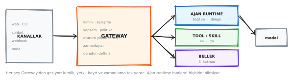</p>

<sub>▲ Gateway, ajan, kanallar, node'lar · düzenlemek için: [`f_oc_arch.excalidraw`](diagrams/wiki/f_oc_arch.excalidraw) → excalidraw.com'a sürükle</sub>


### Paket haritası — kod nasıl bölünmüş

<p align="center">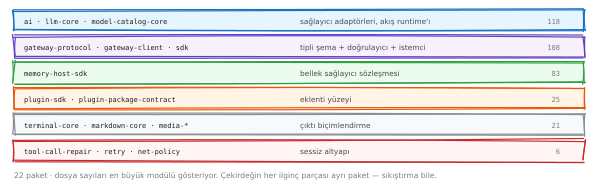</p>

<sub>▲ 22 paket · her ilginç parça ayrı · düzenlemek için: [`f_packages.excalidraw`](diagrams/wiki/f_packages.excalidraw) → excalidraw.com'a sürükle</sub>


Bir sistemin nasıl düşünüldüğünü öğrenmenin en hızlı yolu, kodun nasıl
bölündüğüne bakmaktır. En büyük üçü:

| Paket | Dosya | İşi |
|---|---:|---|
| `ai` | 118 | Model sağlayıcılarıyla konuşuyor |
| `gateway-protocol` | 108 | Kontrol düzleminin **tipli şeması** |
| `memory-host-sdk` | 83 | Bellek sağlayıcılarının uyması gereken **sözleşme** |

Üçünün ayrı olması bir tercih: model erişimi, kontrol düzlemi ve bellek
birbirinden bağımsız değiştirilebilsin diye. Kontrol düzleminin **kendi şema
paketi** olması, protokolün koddan önce geldiğini gösteriyor.

### Sessiz altyapı — görünmeyen yarı

Beş paket hiçbir özellik listesinde yer almıyor, ama biri eksik olduğunda hemen
fark ediliyor:

| Paket | Ne yapıyor |
|---|---|
| `normalization-core` | Farklı kanallardan gelen içeriği **tek biçime** indiriyor |
| `markdown-core` | Modelin yazdığını her kanalın kaldırabileceği biçime çeviriyor — WhatsApp'ın markdown'ı Slack'inki değil |
| `terminal-core` | TUI çıktısı |
| `retry` | Yeniden deneme politikası |
| `net-policy` | Ağ erişim kuralları |

**Tek Gateway süreci.** Oturumlar, onaylar, zamanlama, kanallar hepsi orada.
Kurulu sistemde ölçüldü:

| Ne | Sayı |
|---|---:|
| Sohbet komutu | **89** |
| Denetim olayı (canlı) | **100** + devam imleci |
| Tool | 51 kaynakta · **44** canlı kurulumda |
| Paket | 22 |

---

<a id="s3"></a>
## 3 · Üç kontrol ekseni

<p align="center">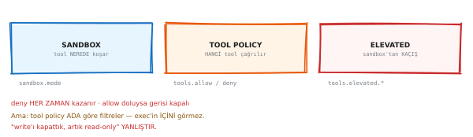</p>

<sub>▲ Sandbox · tool policy · elevated · düzenlemek için: [`f_three_axes.excalidraw`](diagrams/wiki/f_three_axes.excalidraw) → excalidraw.com'a sürükle</sub>


"İzin" tek kavram değil, **üç ayrı soru**:

| Eksen | Soru | Anahtar |
|---|---|---|
| **Sandbox** | Tool **nerede** koşuyor? | `agents.*.sandbox.mode` |
| **Tool policy** | **Hangi** tool çağrılabilir? | `tools.allow` / `tools.deny` |
| **Elevated** | Kutunun **dışına** çıkış var mı? | `tools.elevated.*` — yalnız `exec` |

**Kurallar:** `deny` her zaman kazanır · `allow` doluysa listede olmayan her şey
bloklu · tool policy sert duraktır, `/exec` bile reddedilmiş `exec`'i geri
getiremez.

### Ve OpenClaw'ın kendi belgesindeki uyarı

> *"Tool policy tool'u **adına göre** filtreler; `exec` içindeki yan etkileri
> incelemez. `exec` serbestse, `write`/`edit`/`apply_patch`'i reddetmek shell
> komutlarını salt-okunur yapmaz."*

**"Yazma tool'unu kapattık, artık read-only" cümlesi yanlıştır.** Üç ekseni
karıştırmak en yaygın yapılandırma hatası, ve sonucu güvenlik tiyatrosu.

---

<a id="s4"></a>
## 4 · Yetki kapsamları

<p align="center">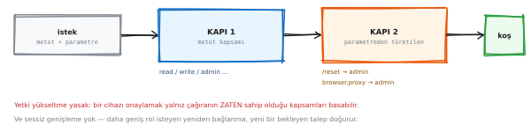</p>

<sub>▲ Kapsam çağrının parametresinden türetiliyor · düzenlemek için: [`f_scopes.excalidraw`](diagrams/wiki/f_scopes.excalidraw) → excalidraw.com'a sürükle</sub>


Sekiz yetki kapsamı var, ama asıl fikir tabloda değil:

> **Aynı metot, farklı parametreyle farklı yetki istiyor.**

`agent` metodu sıradan bir tur için yazma yetkisiyle geçiyor, ama `/reset` için
yönetici istiyor. Yani yetki **metot adına** değil, **çağrının içeriğine**
bakıyor.

### Taşınacak fikir: rol bir tool listesi değil, **grup adı**

13 tool grubu var (`group:fs`, `group:runtime`, `group:web`…). Kurumda bu
`group:musteri-verisi`, `group:kredi-sorgu`, `group:rapor`, `group:dis-erisim`
olur. **Yeni bir tool eklendiğinde 40 rol dosyası güncellenmiyor.**

---

<a id="s5"></a>
## 5 · Onay

<p align="center">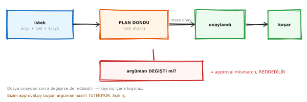</p>

<sub>▲ Onay plana bağlanıyor, komuta değil · düzenlemek için: [`f_frozen_plan.excalidraw`](diagrams/wiki/f_frozen_plan.excalidraw) → excalidraw.com'a sürükle</sub>


**Donmuş plan:** onay bir komuta değil, **plana** bağlanıyor. Onaydan sonra
argümanlar yeniden doğrulanıyor; dosya değiştiyse koşu reddediliyor.

Bizim karşılığımız: imza `(tool, argümanlar)` üstünde ve **bir kez tüketiliyor**.

> Neden önemli: modelden aynı işi ikinci kez istediğinde farklı bir program
> yazıyor **[ölçüldü]** — imzalar `029f4d1f…` ve `107fdfd1…`. Onaylananla
> çalışanın aynı olmasının tek yolu, çalıştırılacak olanın **onaylanan metin**
> olması.

---

<a id="s6"></a>
## 6 · Dış içerik

<p align="center">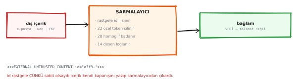</p>

<sub>▲ Veri, talimat değil · düzenlemek için: [`f_external_content.excalidraw`](diagrams/wiki/f_external_content.excalidraw) → excalidraw.com'a sürükle</sub>


Web'den, dosyadan, tool sonucundan gelen içerik **veri** olarak işaretleniyor —
talimat olarak değil. Prompt enjeksiyonuna karşı ilk savunma bu ayrım.

**Dürüst sınır:** bu heuristik bir savunma, deterministik değil. Deterministik
karşılığı MAF'ta var — **FIDES**, bütünlük ve gizlilik etiketleriyle — ve
deneysel.

---

<a id="s7"></a>
## 7 · Bellek

<p align="center">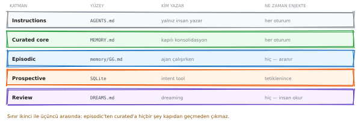</p>

<sub>▲ Beş bellek katmanı · düzenlemek için: [`f_memory_tiers.excalidraw`](diagrams/wiki/f_memory_tiers.excalidraw) → excalidraw.com'a sürükle</sub>


<p align="center">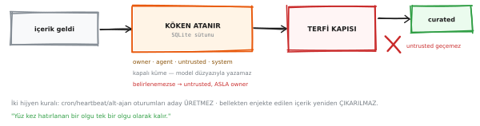</p>

<sub>▲ Güvenlik sınırı YAZMA yolunda · düzenlemek için: [`f_memory_write.excalidraw`](diagrams/wiki/f_memory_write.excalidraw) → excalidraw.com'a sürükle</sub>


Belleğin güvenlik sınırı **okuma** tarafında değil, **yazma** tarafında. Bir
kere yanlış yazılan olgu orada yaşıyor ve her turda geri okunuyor.

Bizim karşılığımız: bellek düz **Markdown** dosyaları, gizli depo yok.
Okunabilen, düzeltilebilen, silinebilen, sürüm kontrolüne konabilen bellek.

---

<a id="s8"></a>
## 8 · Kademeli açığa çıkarma

<p align="center">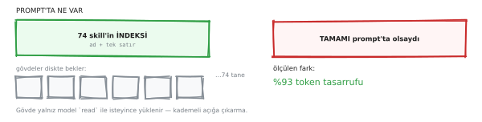</p>

<sub>▲ Bir satır tarif · gövde seçilince · düzenlemek için: [`f_skill_disclosure.excalidraw`](diagrams/wiki/f_skill_disclosure.excalidraw) → excalidraw.com'a sürükle</sub>


Prompt'a giren şey yalnız **frontmatter**: ad + bir satır açıklama. Skill'in
gövdesi girmiyor; ancak seçilince yükleniyor.

Elli skill'in tamamını prompt'a koymak elli skill'lik token demek. Bir satırla
elli tanesi taşınabiliyor.

### Skill arama üç katman **[kaynak]**

* **Yerel keşif** — diskte `SKILL.md` dosyaları, `agent-filter` ile bu ajana
  görünenler süzülüyor
* **Kademeli yükleme** — gövde ancak `/skill <ad>` ile geliyor
* **Uzak arama** — `/clawhub`, bir kayıt defteri; *npm'in skill'ler için hâli*

Ve döngüyü kapatan: **`/learn`** — az önce yaptığın düzeltmeyi yeniden
kullanılabilir bir skill'e çeviriyor.

### Aynı fikrin tool tarafı

<p align="center">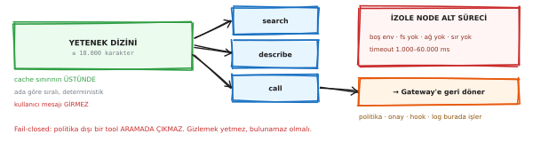</p>

<sub>▲ Büyük katalog, küçük prompt · düzenlemek için: [`f_tool_search.excalidraw`](diagrams/wiki/f_tool_search.excalidraw) → excalidraw.com'a sürükle</sub>


---

<a id="s9"></a>
## 9 · Bağlam motoru

<p align="center">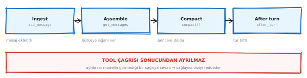</p>

<sub>▲ Dört yaşam döngüsü noktası · düzenlemek için: [`f_ctx_engine.excalidraw`](diagrams/wiki/f_ctx_engine.excalidraw) → excalidraw.com'a sürükle</sub>


**Ingest** (mesaj eklendi) · **Assemble** (bütçeye sığan sıralı küme) ·
**Compact** (pencere doldu) · **After turn**.

### Sıkıştırmayı doğru yapan kural

> Bir tool çağrısı ve sonucu **tek birimdir.** Bölme noktası bir tool bloğunun
> içine düşerse sınır kaydırılıyor.

Aksi hâlde: cevabı görünen ama sorusu özetlenip silinmiş bir tool sonucu kalıyor,
ve sağlayıcılar bu diziyi doğrudan **reddediyor**.

Bizim `context_engine.py` bu kuralı AutoGen'in `ChatCompletionContext`'i üstünde
yeniden kuruyor — çünkü AutoGen'in `BufferedChatCompletionContext`'i **mesaj
sayıyor, token değil**.

---

<a id="s10"></a>
## 10 · Zamanlama

<p align="center">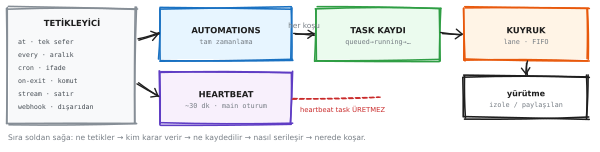</p>

<sub>▲ Zamanlama yığını — altı mekanizma, altı ayrı soru · düzenlemek için: [`f_task_stack.excalidraw`](diagrams/wiki/f_task_stack.excalidraw) → excalidraw.com'a sürükle</sub>


Bu bölüm wiki'nin en uzunu, çünkü **AutoGen'de karşılığı hiç yok** ve bir kurumda
en çok istenen şey bu. Kaynak: `packages/gateway-protocol/src/schema/cron.ts`.

### Beş tür — ve ikisi zamana hiç bakmıyor

Şema **kapalı bir birleşim** (`Type.Union`), yani altıncı bir tür uydurulamıyor
**[kaynak]**:

| Tür | Ne zaman tetikliyor | Alanlar |
|---|---|---|
| `at` | Bir kez, belirli anda | `at` |
| `every` | Her N milisaniyede | `everyMs` · `anchorMs` |
| `cron` | Cron ifadesine göre | `expr` · `tz` · `staggerMs` |
| **`on-exit`** | İzlenen komut **çıkınca** | `command` · `cwd` |
| **`stream`** | Komutun **çıktı satırından** | `command` · `mode` · `match` · `batchMs` |

Son ikisi zamanlayıcı değil, **olay kaynağı**. `on-exit` izlenen bir komut
bittiğinde bir kez tetikliyor; `stream` uzun ömürlü bir komutun stdout/stderr
satırlarından.

> **Ve `on-exit`'in kod yorumu tek başına bir tasarım dersi:** watcher, turun
> süreç ağacında değil **gateway'in `ProcessSupervisor`'ında** koşuyor. Yani turu
> bitirmek watcher'ı öldürmüyor. Sahiplik doğru yere konmuş.

### İki incelik — ikisi de ölçekte fark ediyor

**① Yük dağıtma (`staggerMs`).** Saat başına denk gelen tekrarlı işler
kendiliğinden **5 dakikaya kadar** kaydırılıyor — yüz iş aynı anda uyanıp yük
tepesi yapmasın diye. `--exact` ile kapatılıyor **[kaynak]**.

**② Cron'un OR tuzağı.** Ayın-günü ve haftanın-günü alanlarının ikisi de joker
değilse, `croner` **ya biri ya öteki** eşleştiğinde tetikliyor:

```bash
# Niyet: "ayın 15'i, ama yalnız Pazartesiyse"
0 9 15 * 1
# Gerçek: her ayın 15'inde 9'da, VE her Pazartesi 9'da
# → ayda 0–1 yerine 5–6 kez
```

Standart Vixie cron davranışı, yani hata değil. Ama bir kurumsal asistanda
**"ayda beş kez rapor gönderdi" bir arıza kaydıdır.** Çözüm: croner'ın `+`
değiştiricisi (`0 9 15 * +1`) ya da bir alanı işin içinde kontrol etmek.

### Koşul gözcüsü — zamana değil **duruma** bağlanmak

Zamanlamanın en az konuşulan türü. *"Her sabah 9'da bak"* değil, **"şu koşul
doğru olduğunda haber ver."**

Fark pratik: zamana bağlı bir iş, hiçbir şey değişmediğinde de koşuyor ve her
koşusu para. Duruma bağlı olan yalnız değiştiğinde uyanıyor.

Bizim `gateway/cron.py`'de karşılığı `Threshold` — ve bilerek **aptal**: yıldız
farkı, yeni başvuru, adı geçme. Model çağrısı değil.

> **Neden model değil:** token harcayıp token harcamaya karar veren bir bildirici
> kötü bir takas. Ve *"beni neden uyandırdı"* sorusunun bir insanın okuyabileceği
> cevabı olmalı.

### Task defteri — zamanlayıcı değil, **kayıt**

<p align="center">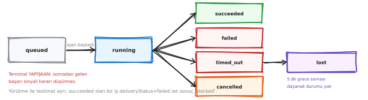</p>

<sub>▲ Bir işin yaşam döngüsü · düzenlemek için: [`f_task_lifecycle.excalidraw`](diagrams/wiki/f_task_lifecycle.excalidraw) → excalidraw.com'a sürükle</sub>


Defter **ne zaman koşacağına karar vermiyor**; ne koştuğunu yazıyor. İkisini
karıştırmak, yeniden başlatmada geçmiş işleri yeniden oynatmaya götürüyor.

Doğru davranış: süreç yeniden başladığında **geçmiş işleri tekrar oynatmıyor,
yeniden zamanlıyor.** Bir gecede kaçırılan üç koşu, sabah üç kez arka arkaya
koşmuyor.

### Üç eksen — ve tip düzeyinde ayrılmış olmaları

<p align="center">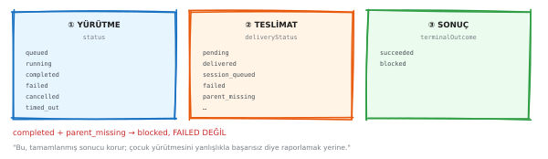</p>

<sub>▲ Ne zaman · nerede · nereye · düzenlemek için: [`f_task_axes.excalidraw`](diagrams/wiki/f_task_axes.excalidraw) → excalidraw.com'a sürükle</sub>


| Eksen | Soru |
|---|---|
| **Zamanlama** | Ne zaman koşacak? |
| **Oturum hedefi** | Hangi bağlamda koşacak? |
| **Teslimat** | Sonuç nereye gidecek? |

Üçü **ayrı alanlar**, ve ayrı olmaları bir kaza değil: bir işi "her sabah koş"
diye kurmakla "sonucu Telegram'a at" demek iki farklı karar, ve ikincisi
**dışarı mesaj gönderiyor** — yani onay kapısının konusu.

### Taze oturum kuralı

**Zamanlanmış koşu kendi oturumunu alıyor.** Tek uzun ömürlü oturum kullanan bir
iş her önceki koşuyu bağlamında biriktiriyor:

* her gün **pahalılaşıyor**
* ve sonunda bu sabahın verisi yerine **geçen haftanın hafızasından** cevap
  veriyor

Hiçbiri hata vermiyor; iş "çalışıyor" görünüyor.

### Yoklama yanlış şekil

<p align="center">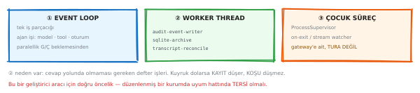</p>

<sub>▲ Yoklama yerine olay · düzenlemek için: [`f_threads.excalidraw`](diagrams/wiki/f_threads.excalidraw) → excalidraw.com'a sürükle</sub>


*"Her 30 saniyede bak, değişti mi"* bir zamanlayıcı deseni değil, bir zamanlayıcı
**eksikliğinin** belirtisi. `on-exit` ve `stream` tam olarak bunun yerine var.

### Bizde bugün

| | Durum |
|---|---|
| Çevirmen (`scheduler.py`) | **bağlı** — Türkçe ifadeyi cron şekline çeviriyor, üç biçim kabul ediyor |
| Yerli zamanlayıcı (`gateway/cron.py`) | **yazıldı, 19 test, bağlanmadı** |
| Koşul gözcüsü (`Threshold`) | `cron.py` içinde, bağlı değil |

**Dürüst sınır:** zamanlama yalnız OpenClaw'ın Gateway'i koşarken çalışıyor. Bu
makinede systemd *kullanıcı* servisi, `Linger=no` → oturum bitince duruyor.
Sessizce ateşlemeyi bırakmış bir iş, bir zamanlayıcının **en kötü arızası** — o
yüzden liste, Gateway'e ulaşılamamasını *boş liste değil, kendi durumu* olarak
raporluyor.

---

<a id="s11"></a>
## 11 · Dayanıklılık

<p align="center">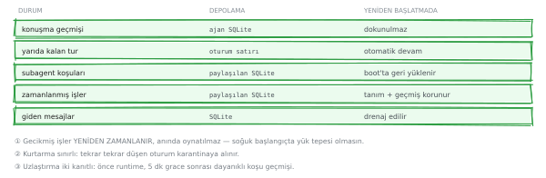</p>

<sub>▲ Dayanıklı durum — ama durable execution değil · düzenlemek için: [`f_durable.excalidraw`](diagrams/wiki/f_durable.excalidraw) → excalidraw.com'a sürükle</sub>


**Önemli ayrım:** OpenClaw dayanıklı **durum** tutuyor; dayanıklı **yürütme**
değil. Süreç ortada ölürse, yarım kalan tur kaldığı yerden devam etmiyor.

`Temporal`/`durable execution` bekleyen biri bunu bilmeli.

<p align="center">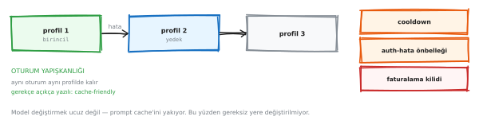</p>

<sub>▲ Model failover · düzenlemek için: [`f_failover.excalidraw`](diagrams/wiki/f_failover.excalidraw) → excalidraw.com'a sürükle</sub>


<p align="center">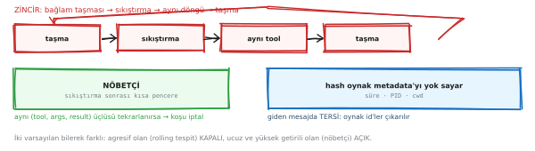</p>

<sub>▲ Döngü kırıcı ve sıkıştırma sonrası nöbetçi · düzenlemek için: [`f_loopguard.excalidraw`](diagrams/wiki/f_loopguard.excalidraw) → excalidraw.com'a sürükle</sub>


---

<a id="s12"></a>
## 12 · İki kayıt hattı

<p align="center">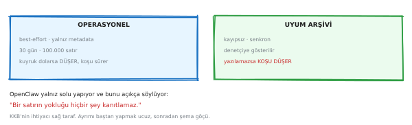</p>

<sub>▲ Uyum kaydı ile hata ayıklama kaydı ayrı · düzenlemek için: [`f_two_ledgers.excalidraw`](diagrams/wiki/f_two_ledgers.excalidraw) → excalidraw.com'a sürükle</sub>


| | Uyum kaydı | Hata ayıklama kaydı |
|---|---|---|
| Değişmez mi | **evet** | hayır |
| Saklama süresi | var | kısa |
| Sır taşır mı | **asla** | taşıyabilir |
| Kim okur | denetçi | mühendis |

Tek hatla ikisini birden yapmak **ikisini de bozar**: ya denetim kaydına sır
sızar, ya hata ayıklama kaydı ömür boyu saklanır.

<p align="center">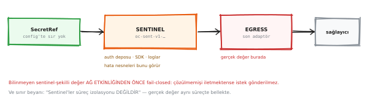</p>

<sub>▲ Sırlar ve telemetri · düzenlemek için: [`f_secrets.excalidraw`](diagrams/wiki/f_secrets.excalidraw) → excalidraw.com'a sürükle</sub>


---

<a id="s13"></a>
## 13 · Niş yüzeyler

Sorulursa açılacak, kendiliğinden anlatılmayacak konular.

<p align="center">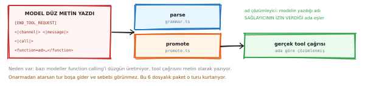</p>

<sub>▲ Tool call repair — bozuk çağrıyı kurtarmak · düzenlemek için: [`f_repair.excalidraw`](diagrams/wiki/f_repair.excalidraw) → excalidraw.com'a sürükle</sub>


Model bozuk JSON ürettiğinde turu çöpe atmak yerine onarmaya çalışıyor.

<p align="center">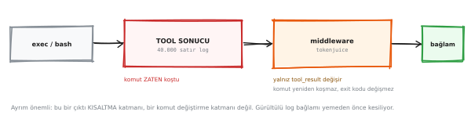</p>

<sub>▲ tokenjuice — komuta değil SONUCA dokunuyor · düzenlemek için: [`f_result_middleware.excalidraw`](diagrams/wiki/f_result_middleware.excalidraw) → excalidraw.com'a sürükle</sub>


Tool **sonucunu** küçültüyor. Tool'un ne yaptığı değişmiyor; **modelin ne kadarını
gördüğü** değişiyor.

<p align="center">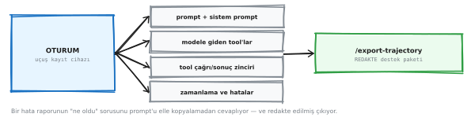</p>

<sub>▲ Trajectory — oturumun uçuş kayıt cihazı · düzenlemek için: [`f_trajectory.excalidraw`](diagrams/wiki/f_trajectory.excalidraw) → excalidraw.com'a sürükle</sub>


`/export-trajectory` redakte edilmiş bir destek paketi çıkarıyor. Kullanıcının
gerçekten rapor göndermesini sağlayan şey bu.

<p align="center">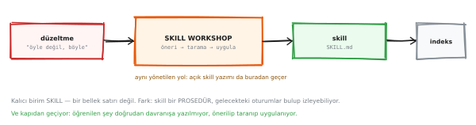</p>

<sub>▲ Düzeltmeyi skill'e çevirmek · düzenlemek için: [`f_self_learning.excalidraw`](diagrams/wiki/f_self_learning.excalidraw) → excalidraw.com'a sürükle</sub>


### Built-in tool kataloğu — ve dağılımın anlattığı

<p align="center">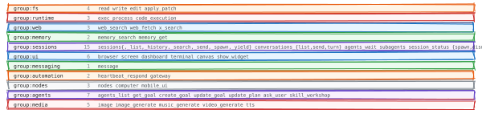</p>

<sub>▲ 51 tool · 11 grup · düzenlemek için: [`f_tool_catalog.excalidraw`](diagrams/wiki/f_tool_catalog.excalidraw) → excalidraw.com'a sürükle</sub>


Bir ajanın ne yapabildiğini elindeki tool listesi belirliyor. Asıl bilgi sayıda
değil **dağılımda**:

| Grup | Tool | Ne anlama geliyor |
|---|---:|---|
| `sessions` | **15** | Alt-ajan başlatmak, iş devretmek, cevabını beklemek, aralarında mesajlaşmak |
| dosya işlemleri | 4 | — |
| komut çalıştırma | 3 | — |

Yatırımın büyük kısmı dosyaya ya da kabuğa değil, **ajanlar arası koordinasyona**
yapılmış. Bir harness'ın ne için tasarlandığını en iyi bu oran anlatıyor.

### "Kaç tool var?" — üç cevap, üçü de doğru

<p align="center">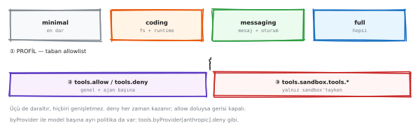</p>

<sub>▲ 51 · 44 · doküman tablosu · düzenlemek için: [`f_profiles.excalidraw`](diagrams/wiki/f_profiles.excalidraw) → excalidraw.com'a sürükle</sub>


| Sayı | Ne sayıyor |
|---:|---|
| **51** | Kaynak kodda tanımlı |
| **44** | Canlı gateway'in gerçekten sunduğu **[ölçüldü]** |
| başka | Dokümandaki tablo — **eskimiş** |

Aradaki fark filtrelerde eriyor, ve daralma **üç aşamada**: profil bir taban
liste veriyor → `allow`/`deny` onu kesiyor → sandbox'tayken sandbox politikası
bir kez daha kesiyor.

> **Üçü de yalnız daraltıyor; hiçbiri listeye tool ekleyemiyor.** Bir yetkilendirme
> katmanının doğru yönü bu — genişleyebilen bir filtre, filtre değildir.

### Koşan bir tura müdahale etmenin dört yolu

<p align="center">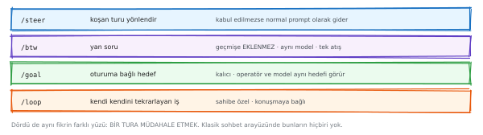</p>

<sub>▲ /steer · /btw · /goal · /loop · düzenlemek için: [`f_session_tools.excalidraw`](diagrams/wiki/f_session_tools.excalidraw) → excalidraw.com'a sürükle</sub>


Sıradan bir sohbet arayüzünde mesajı gönderdikten sonra yapabileceğin tek şey
beklemektir. Bu dört komut aynı soruya farklı cevaplar veriyor: **tur çoktan
başlamışken ne yapabilirsin?**

| Komut | Ne yapıyor |
|---|---|
| `/steer` | Koşan turu **yönlendiriyor**. Runtime müdahaleyi kabul etmezse mesajı çöpe atmıyor, sıradan bir prompt olarak gönderiyor |
| `/btw` | Araya **yan soru** sokuyor ve cevabı konuşma geçmişine eklemiyor — asıl işin bağlamını kirletmiyor |
| `/goal` | Oturuma **kalıcı bir hedef** bağlıyor; hem operatör hem model aynı hedefi görüyor |
| `/loop` | Konuşmaya bağlı, **kendini tekrarlayan** bir iş kuruyor |

Canlı ölçümde `commands.list` **89 komut** döndürüyor; dördü bu grupta
**[ölçüldü]**.

> **Karşılaştırma:** AutoGen'de koşan bir turun içine girmenin **hiçbir yolu
> yok**. Tur başladıktan sonra tek seçenek beklemek ya da iptal etmek.

### Doğrulanmamış olanlar

Aşağıdaki iki başlık **koşturulmadı.** Şema, katalog tarifinin ve resmî
belgelerin okunmasından çiziliyor — ölçümden değil. Ayrımın görünür kalması
için buraya konuldular, önceki bölümlere değil.

#### Lobster — tipli iş akışı runtime'ı · **[teyitsiz]**

<p align="center">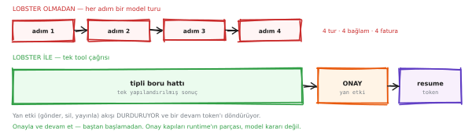</p>

<sub>▲ Tek çağrı · gömülü kapılar · devam token'ı — [teyitsiz] · düzenlemek için: [`f_lobster.excalidraw`](diagrams/wiki/f_lobster.excalidraw) → excalidraw.com'a sürükle</sub>


Katalog kaydı doğrulandı **[kaynak]**: `@openclaw/lobster`, *"Lobster workflow
tool plugin (typed pipelines + resumable approvals)"*, `source: official`,
`minHostVersion >= 2026.4.25`. **Çekirdekte değil, ayrı bir eklenti**, ve bu
kurulumda yüklü değil.

Anlattığı fikir — katalog tarifinden okunuyor:

* Çok adımlı bir işi modele orkestra ettirirsen **her adım ayrı bir tur** olur;
  dört adım dört model çağrısı, ve her turda bütün bağlam yeniden gönderilir.
* Tipli boru hattı orkestrasyonu modelden alıp **runtime'a** veriyor: model bir
  kez konuşuyor, ara sonuçlar prompt'a hiç uğramıyor.
* Yan etkili bir adımda akış **duruyor** ve bir **devam token'ı** dönüyor —
  onaydan sonra baştan değil, kaldığı yerden.

> **Kapıyı runtime tutuyor, model değil.** Model *"bu sefer onay sormayayım"*
> diye karar veremiyor — kapı boru hattının parçası, erişebileceği bir yerde
> değil. Aynı ilke bizim workbench kapımızda da geçerli.

#### Code Mode / Swarm · **[teyitsiz]**

Katalog büyüdükçe bütün tool şemalarını prompt'a koymak imkânsızlaşıyor.
**Code Mode** bunu şöyle çözüyor: model tool şemalarını görmüyor, küçük bir
köprüye `search` · `describe` · `call` yazıyor. **Swarm** aynı köprüden
eşzamanlı alt-ajanlar başlatıyor.

---

<a id="s14"></a>
## 14 · Ne alınır, ne alınmaz

<p align="center">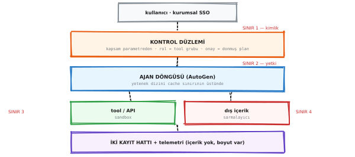</p>

<sub>▲ Üç ayrı ilişki · düzenlemek için: [`f_atlas.excalidraw`](diagrams/wiki/f_atlas.excalidraw) → excalidraw.com'a sürükle</sub>


### Alınacaklar — **karar kuralları**, kod değil

* Üç kontrol ekseninin **ayrı** tutulması
* Rol = grup adı, tool listesi değil
* Onay plana bağlanır, komuta değil
* Dış içerik veri, talimat değil
* Bellek güvenlik sınırı **yazma** yolunda
* İki kayıt hattı
* Kademeli açığa çıkarma
* Zamanlanmış koşu **taze oturum** alır

### Alınmayacak — **güven modeli**

OpenClaw **tek bir güvenilen operatör** varsayıyor. Kurumda o varsayım geçerli
değil.

Ölçülen kanıt, sistemin kendi cümlesi — bir `/openclaw` satırı gönderdiğimizde
kapımız tuttu **[ölçüldü]**:

> *"O ajanın kabuk erişimi var ve şu an onay sormadan çalıştırıyor
> (**exec: mode=full, ask=off**); bizim kapımız içeride ne yapacağını görmez."*

### Sonuç: üç ayrı ilişki

**AutoGen'i gömüyoruz** (motor, ince arayüz arkasında) · **OpenClaw'ı
öğreniyoruz** (karar kuralları) · **OpenClaw'ı mühendislikte kullanmaya devam
ediyoruz**.

> Atlas olarak OpenClaw **kurmuyoruz**.

---

<sub>Üretim: `python docs/tools/make_wiki.py` · kaynak `docs/13` (mimari analiz) ·
`docs/16` (kurumsal okuma) · `docs/18` (zamanlama ve dayanıklılık) · canlı
ölçümler kurulu OpenClaw `@01cc7106`'dan</sub>
